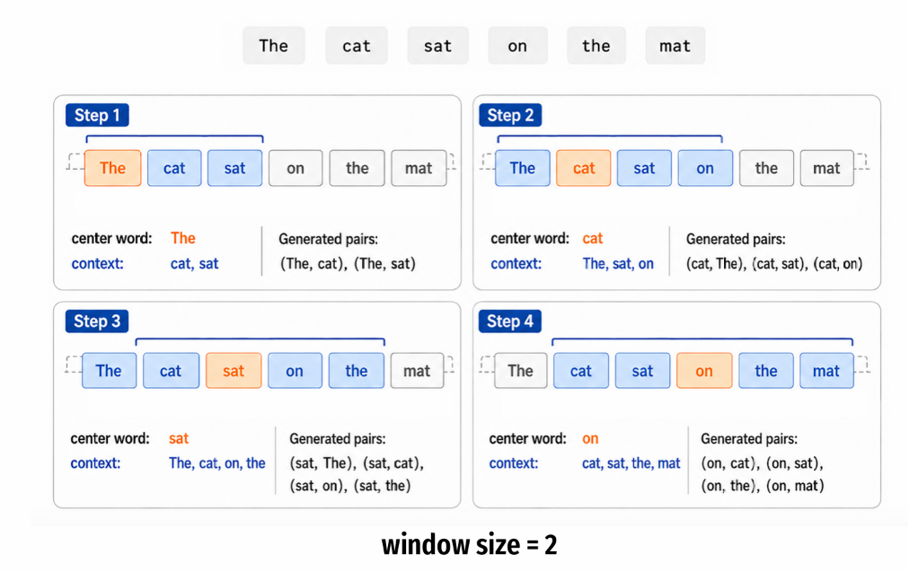
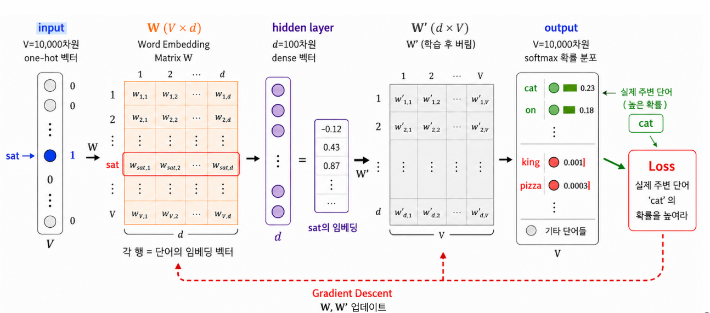
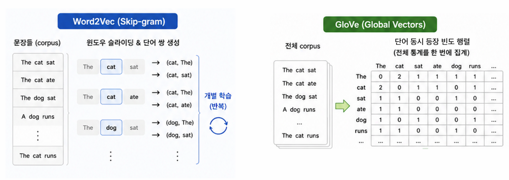
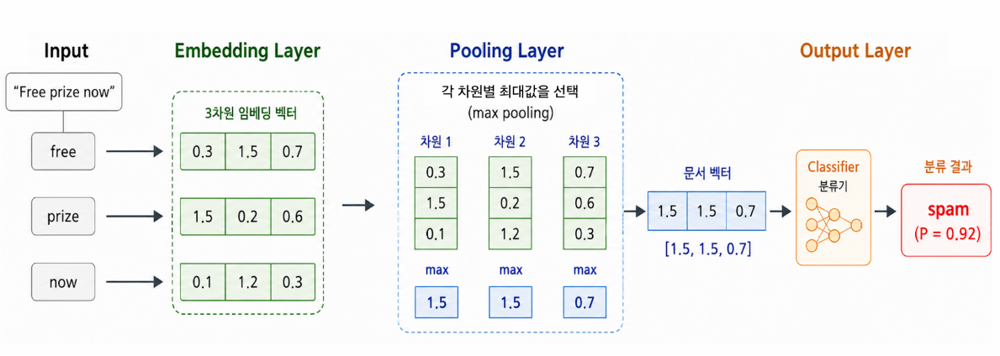

::: {.key-questions}
- **워드 임베딩(word embedding)** 은 무엇이고, BoW/TF-IDF 의 어떤 한계를 푸는가?
- **분포 가설(distributional hypothesis)** — "문맥이 의미를 만든다" 는 어떻게 임베딩 학습으로 이어지는가?
- **Word2Vec(Skip-gram)** 의 네트워크 구조와 학습 방식은?
- **GloVe** 는 동시 등장 행렬을 어떻게 학습하며, 추천 시스템의 행렬 분해와 무엇이 같은가?
- 단어 임베딩으로 **문서 전체**를 표현(풀링)하고 분류에 쓰는 방법은?
:::

> 시험 포인트: BoW 의 one-hot 은 **고차원 희소(sparse)·의미 없음**. **임베딩** = 의미·문맥을 담은 **저차원 dense 벡터**(의미 가까우면 공간상 가깝게). **Word2Vec/Skip-gram**: 중심 단어 → 주변 단어 예측, softmax 분류, 학습된 입력측 가중치 $W$ 가 임베딩. **GloVe**: 동시 등장 행렬 $X$ 에 $\log X_{ij}=w_i\cdot\tilde w_j$ — **추천 시스템 행렬 분해와 동일 원리**(회귀). 둘 다 사전학습 임베딩을 **전이 학습**처럼 가져다 쓸 수 있음. 문서 표현 = 단어 임베딩 **풀링(평균/최대)**. 실습 스팸 분류 F1 **0.865**(BoW TF-IDF 0.82 보다 개선).

## 1. 왜 임베딩인가 — BoW 의 근본 한계

::: {.column-margin}
**one-hot 의 비효율**

보캐뷸러리 1만이면
단어 1개 = 크기 1만 벡터,
딱 한 자리만 1.
→ 고차원·희소·의미 0
:::

지난 강의의 빈도 기반(BoW/TF-IDF) 표현은 단순·빠르지만:

- 단어의 **의미·순서·문맥**을 고려하지 못함.
- 피처 벡터가 **단어 개수만큼** 커짐 → **고차원 희소(sparse) 벡터**. 단어 하나를 표현하려고 크기 1만짜리 벡터에서 한 자리만 1(one-hot) — 차원 낭비, 의미 미반영.

**임베딩(embedding)**: 단어를 **의미·문맥을 반영한 저차원 dense 벡터**(예: 1만 차원 → 100 차원)로 표현. 0이 아닌 값들로 채워져 있고, 거리·방향이 의미를 갖는다.

::: {.callout-note title="이미 본 임베딩 아이디어"}
- **얼굴 인식**(L22): 이미지를 저차원 벡터 공간의 한 점으로 매핑(같은 사람 가깝게).
- **추천 시스템**(L23): 유저·아이템을 저차원 임베딩으로.

→ **단어도 똑같이**: 코퍼스에서 각 단어의 의미를 뽑아 공간의 한 점으로. 같은 발상의 반복.
:::

### 정적(static) 임베딩의 직관 — 3차원 예시

단어 8개를 3차원 공간에 배치하고, 축이 각각 **로열티 / 성별 / 나이** 라고 하자.

- **king**: 로열티↑, 남성, 나이 많음 쪽.
- **girl**: 로열티↓, 여성, 나이 적음 → king 과 정반대, 멀리 위치.

핵심: 의미가 비슷한 단어는 가깝게, 다른 단어는 멀게 배치되도록 **데이터로부터 학습**(미리 지정 아님). 벡터로 표현했으니 **벡터 연산**(king − man + woman ≈ queen 같은)도 의미를 가질 수 있다.

```{mermaid}
graph LR
    BOW["BoW one-hot<br/>(1만 차원, 희소, 의미 X)"] -->|차원 축소 + 의미 반영| EMB["임베딩<br/>(100 차원, dense, 의미 O)"]
```

## 2. Word2Vec (2013) — 분포 가설

::: {.column-margin}
**분포 가설**

"같은 문맥에 자주
등장하는 단어는
비슷한 의미를 가진다"

"나는 ___ 를 탔다"
→ 버스·지하철…
:::

**핵심 아이디어**: *같은 문맥에 자주 등장하는 단어는 비슷한 의미를 가진다.* 단어의 의미를 직접 정의하지 않고, **주변에 어떤 단어가 오는지**로 의미를 학습.

### 학습 데이터 수집 — (중심 단어, 주변 단어) 쌍

**윈도우 사이즈(window size)** = 중심 단어 주변 몇 칸까지 볼지. 윈도우 2면 좌우 각 2칸(총 4개)을 주변 단어로.

예: `the cat sat on the mat`, 중심 단어 `sat`(윈도우 2) → 쌍: (sat, the), (sat, cat), (sat, on), (sat, the). 코퍼스의 **모든 문장·모든 단어**에 대해 이 쌍을 수집한다.



### Skip-gram 구조

3개 레이어의 단순한 신경망:



- **입력**: 중심 단어의 one-hot 벡터(V = 보캐뷸러리 크기, 예 1만).
- **$W$ (V×D)**: 각 단어의 임베딩을 모은 행렬(D = 임베딩 차원, 예 100). one-hot × $W$ = 그 단어 자리의 **임베딩 벡터를 뽑아오는** 연산.
- **$W'$ (D×V)** + **softmax**: 주변 단어로 무엇이 올지 확률 예측(전체 V 단어 합 = 1).
- **목표**: 수집한 쌍에 있는 주변 단어는 확률↑, 없는 단어는 확률↓.
- **학습**: 처음 $W, W'$ 랜덤 초기화 → softmax 예측 → **크로스 엔트로피 loss** → 경사하강으로 갱신 → 반복 수렴.

::: {.callout-tip title="결과물"}
수렴 후 **입력측 $W$ 를 최종 단어 임베딩**으로 사용. $W'$(주변 단어 예측용)은 학습이 끝나면 버린다. → 1만 차원 one-hot 이 100 차원 dense 벡터로.
:::

## 3. GloVe — Global Vectors (2014)

Skip-gram 은 문장마다 쌍을 **개별적으로(local)** 보기 때문에, 코퍼스 **전체에서 얼마나 자주** 함께 나오는지(전역 통계)를 놓친다. GloVe 는 그 **동시 등장 빈도**까지 반영.



### 동시 등장 행렬(co-occurrence matrix) $X$

$X_{ij}$ = 중심 단어 $i$ 주변(윈도우 내)에 단어 $j$ 가 등장한 **총 횟수**(전체 코퍼스 기준).

- **대칭 행렬**: $X_{ij} = X_{ji}$ (cat 주변의 sat 횟수 = sat 주변의 cat 횟수).

### 학습 — 행렬 분해와 동일

$$ \log X_{ij} \;\approx\; w_i \cdot \tilde{w}_j $$

- $w_i$ = 단어 $i$ 가 **중심 단어** 역할일 때 의미 벡터(word vector).
- $\tilde{w}_j$ = 단어 $j$ 가 **주변 단어** 역할일 때 의미 벡터(context vector).
- **로그**: 동시 등장 횟수의 변동성이 매우 커서(0 ~ 수천) 안정화.
- 같이 등장한 적 없는 단어 쌍은 학습에서 제외
- 값이 클 수록 자주 등장, 0에 가까울수록 거의 안 나옴

::: {.callout-note title="추천 시스템과 같은 원리"}
추천 시스템의 평점 행렬 $R_{ij}\approx u_i\cdot v_j$ (유저 임베딩 · 아이템 임베딩)와 **완전히 같은 행렬 분해**. 여기선 $X_{ij}$(동시 등장 횟수)가 평점 자리. $w, \tilde w$ 랜덤 초기화 → $\log X_{ij}$ 예측 → 차이의 제곱을 loss → 경사하강 반복. **최종 임베딩 = $w + \tilde{w}$**(중심·주변 의미 벡터의 합).
:::

| | Word2Vec (Skip-gram) | GloVe |
|---|---|---|
| 입력 | 중심 단어 1개 | 단어 쌍 $(i,j)$ |
| 출력 | 주변 단어 확률(softmax) | $\log X_{ij}$ 예측값 |
| 문제 유형 | 분류(클래스 V개) | 회귀(예측) |
| 통계 | local(쌍 단위) | global(전체 동시 등장) |

### 사전학습(pretrained) GloVe

공식 사이트에 이미 학습된 임베딩 제공: **Wikipedia 2014 + Gigaword(뉴스 기사), 60억(6B) 토큰** 학습 → **40만(400K) 단어** 임베딩, 차원 50/100/200/300 선택. (2024년 더 큰 버전도 있음.)

→ 내 작은 코퍼스(스팸 5559개) 로 직접 학습할 수도 있지만, **훨씬 큰 데이터로 학습된 것을 가져다 쓰는 게 전이 학습**. CNN 이미지의 transfer learning(L22)과 동일 — 그대로 쓰거나 **초기값**으로 두고 내 코퍼스로 미세 조정.

## 4. 단어 임베딩 → 문서 표현 → 분류

단어 임베딩은 단어 단위인데, 분류 대상은 **문서(메시지) 전체**다. 문서를 구성하는 단어 임베딩들을 하나로 합쳐야 한다.

::: {.column-margin}
**풀링(pooling)**

이미지 CNN 의 풀링과
같은 발상 — 정보 압축.
평균/최대로 단어 벡터들
→ 문서 벡터 1개
:::

- **합/평균 풀링(mean pooling)**: 문서 내 단어 임베딩들의 평균 → 단어들의 **평균적 의미** 반영. (BoW 에서 one-hot 을 더하던 것의 일반화 — one-hot 합도 결국 같은 발상.)
- **최대 풀링(max pooling)**: 차원별 최댓값 → 가장 **두드러진 특징** 반영.

이렇게 얻은 **문서 임베딩(예 100차원)** 을 피처로, 로지스틱 회귀·SVM·신경망 등 어떤 분류기든 적용.



## 5. 실습 — Word2Vec 으로 SMS 스팸 분류

지난 강의(BoW/TF-IDF)와 같은 데이터에 임베딩 적용. (코드보다 흐름이 핵심.)

1. 텍스트 로드 → 코퍼스 생성 → **전처리**(소문자·숫자·불용어·구두점 제거 + 스테밍).
2. **train/test 분할 후**, 트레이닝셋 텍스트로 Word2Vec(Skip-gram, **D=100**) 학습 → 트레이닝셋에 포함된 **5635개 단어**의 100차원 임베딩 생성.
3. **풀링(평균)** 으로 각 메시지를 100차원 문서 벡터로. (테스트셋에만 있어 임베딩이 없는 단어는 평균에서 제외.)
4. 로지스틱 회귀로 분류 → **F1 ≈ 0.865** (지난 BoW/TF-IDF **0.82** 대비 개선).

::: {.callout-warning title="학습 순서 주의"}
임베딩은 **트레이닝셋만으로** 학습해야 데이터 누수가 없다. 전체 6559 단어가 아니라 트레이닝셋 단어(5635개)로 임베딩을 만든 이유.
:::

## 개념 연결

- **표현 학습(representation learning)** 의 같은 흐름: 이미지(L22 임베딩·전이학습) → 추천(L23 행렬 분해) → 텍스트(L26). 입력/출력만 다르게 세팅하고 **loss 를 줄이는 방향으로 가중치 학습**하는 동일 패턴.
- GloVe ≡ 추천 시스템 **행렬 분해**($R\approx U\cdot V$).
- 풀링 ≡ 이미지 **CNN 풀링**, 사전학습 임베딩 사용 ≡ **전이 학습**.
- 다음 단계(문맥 반영·가변 길이 임베딩, Transformer)로 이어지는 "딥러닝의 역사적 흐름".

::: {.lecture-summary}
- **임베딩** = 단어를 의미·문맥 담은 저차원 dense 벡터로(고차원 희소 one-hot 의 한계 극복). 의미 가까우면 공간상 가깝게.
- **Word2Vec/Skip-gram**: 분포 가설(문맥이 의미). 중심→주변 단어 예측(softmax 분류), 입력측 $W$ 가 최종 임베딩.
- **GloVe**: 동시 등장 행렬 $X$ 에 $\log X_{ij}=w_i\cdot\tilde w_j$ — 추천 시스템 **행렬 분해와 동일**(회귀), local 대신 **전역 통계** 반영, 최종 = $w+\tilde w$.
- **사전학습 임베딩**(GloVe 6B 토큰→400K 단어)을 **전이 학습**처럼 사용.
- **문서 표현**: 단어 임베딩 **풀링**(평균/최대) → 분류기. 스팸 분류 **F1 0.865**(> BoW 0.82).
:::
