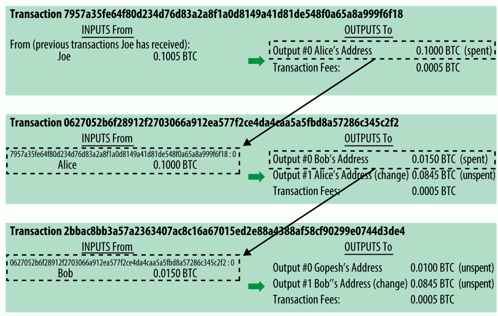
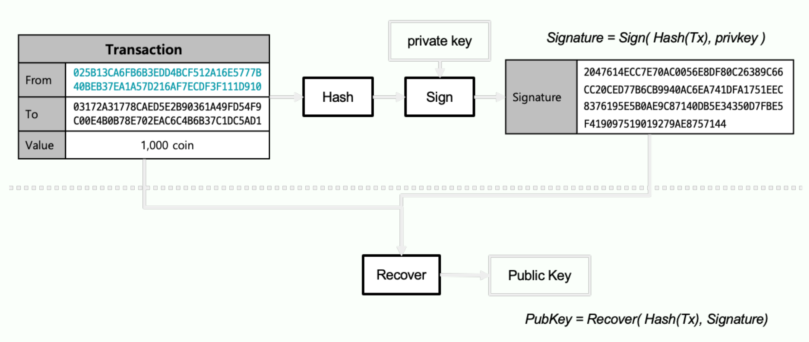
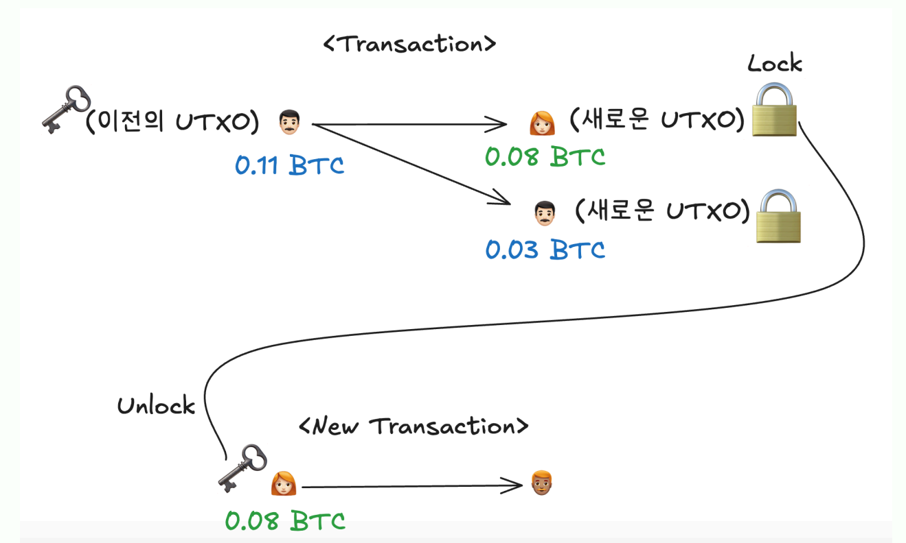

{.post-thumbnail}

## 첫 등장

- 서브프라임 모기지로 금융 시스템에 대한 불신이 커짐
- Oct 31, 2008: Cryptography mailing list에서 사토시 나카모토가 비트코인 백서 업로드
    - 신뢰 주체 x, 탈중앙화: 중개자 없이
    - 발행량 고정
    - 공개 원장, 개방형 금융 시스템: 투명성
        - 누구나 `bitcoin client`(bitcoin core가 75% 점유중)를 다운 받아 네트워크에 참여할 수 있다.
- Feb 3, 2009: 비트코인 네트워크 시작, 첫 블록 생성

## `Transaction`

- state를 바꾸는 모든 action
- 비트코인에서는 송금의 의미
- 복수의 input -> 복수의 output
- 입력값의 총합 = 출력값의 총합 + 거래 수수료
    - 거래 수수료는 채굴자에게 지급 (`coinbase transaction`: 채굴자에게 보상으로 지급되는 트랜잭션)

- transaction의 output이 다른 transaction의 input으로 사용됨.
- 남은 돈은 송급자(혹은 다른 계좌)에게 반환
- `UTXO (Unspent Transaction Output)`: 아직 사용되지 않은 transaction output
    - UTXO의 집합이 현재 네트워크의 상태를 나타냄
        - 현재 10GB를 넘는 정도의 양
    - 딱 한번 사용 가능: `이중지불 공격` 방지
    - 지갑의 잔액은 UTXO의 총합
    - input으로 사용하는 트랜잭션이 매번 바뀌면서 서명도 매번 바뀜

### 네트워크 전파 과정

1. 트랜잭션을 비트코인 p2p 네트워크에 전파
    - 트랜잭션을 mempool에 저장
    - 노드마다 mempool이 다를 수 있음
2. 채굴자들이 블록에 담을 트랜잭션 선택(갯수 제한 o)
    - 일반적으로 수수료가 높은 트랜잭션이 우선적으로 선택됨
3. 블록이 생성되면 네트워크에 전파

## Key, Address

- `해시 함수`: `임의의 길이`의 데이터를 `고정된 길이`의 값으로 바꾸어 주는 함수
    1. H(x)가 주어졌을 때, x를 찾는 것이 어려움
    2. H(x) == H(y)인 x, y를 찾는 것이 어려움
    3. 입력값의 작은 변화가 출력값에 큰 변화를 일으킴(`Avalanche effect`)
- 사용자의 개인 키와 공개키를 이용해 해시함수로 서명하여 거래에 대한 소유권을 증명

- `script` 언어를 통해 로직 구현
    - `turing incompleteness`: 반복문 지원 x. 기본적인 기능만 제공(ex: 서명 확인, `time lock`)

- 트랜잭션의 input에서 이전 UTXO를 자신의 private key로 해제. 이전의 UTXO가 자신의 것임을 증명(unlock)
- 트랜잭션의 output에서 UTXO를 생성하여 현재 자신이 보내는 수취자의 public key로 잠금(lock)

## Node

- `Full Node`: 블록체인 전체를 저장, 검증, 네트워크 참여
    - 이중 일부가 Mining Node
- `SPV Node(Light Node)`: 블록체인 전체를 저장하지 않고, 필요한 정보(블록 헤더, 머클 트리)만 이용하여 거래 검증(Full Node에 의존)

## Block

- header
    - 타임스탬프
    - 이전 블록의 해시값
    - Merkle root: 블록에 포함된 트랜잭션들의 해시값을 트리 구조로 결합하여 만든 값
    - Difficulty, nonce: 채굴자가 찾는 값, 블록 해시값이 특정 조건을 만족하도록 조정하는 값
- body: 블록에 포함된 트랜잭션 리스트

## Concensus

### Nakamoto Consensus

- 누가 새로운 블록을 만들게 할까?(`Decentralization`): proof-of-work
    - 채굴자가 블록 헤더의 nonce 값을 조정하여 블록 해시값이 target 이하를 만족하도록 하는 작업
        - target: `평균 10분마다` 블록이 생성되도록 조정되는 값. 2016개 블록(10분 기준 2주)마다 재설정
            - $\text{newTarget} = \text{oldTarget} \times \frac{\txt{actual time of last 2015 blocks}}{\text{20160 miniutes}}$
            - 값이 작으면 문제가 어려워지고, 값이 크면 문제가 쉬워짐
            - 10분 유지: fork 가능성을 줄이기 위해
            - incentive: 50BTC부터 시작하여 210000개 블록마다(4년) 절반으로 감소. 대략 2140년이 되면 모두 발행.
- 딱 하나의 장부만 존재하도록 어떻게 보장할까?(`security`): longest chain rule
    - 특정 노드가 hashrate 51% 이상 차지하면 공격 가능(`51% attack`)
