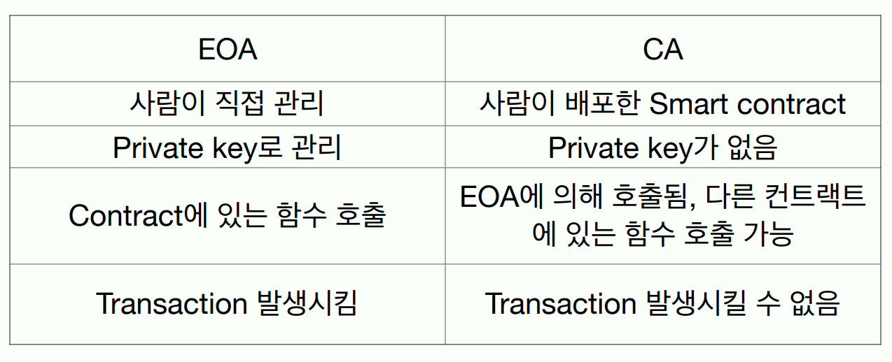
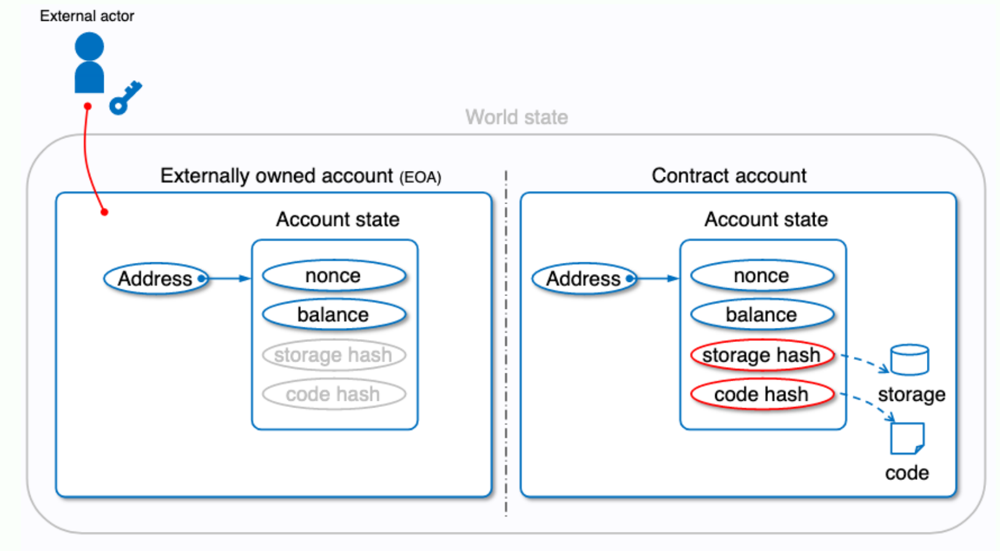
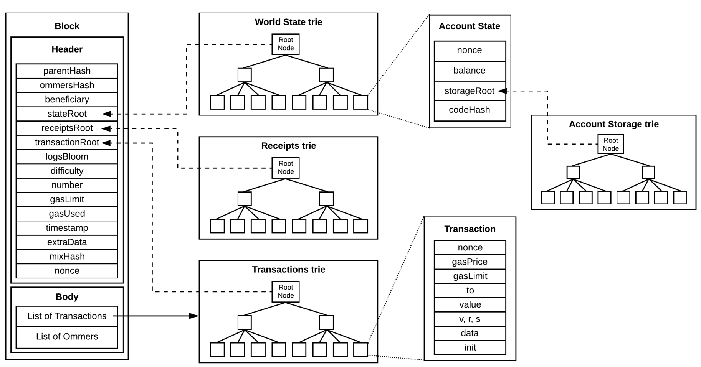
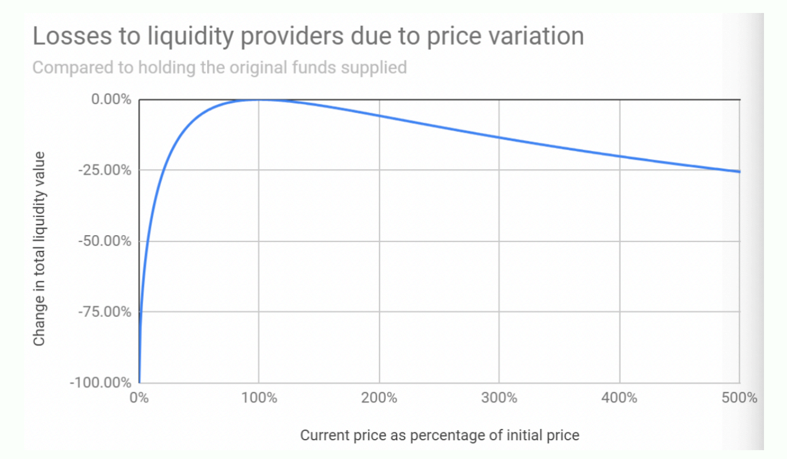

{.post-thumbnail}

## 이더리움의 등장

- 2013: 비탈릭 부테린이 이더리움 백서 발표
    - 비트코인에서 제공하는 기능이 제한적이라는 문제의식에서 출발(turing incompleteness)
    - 탈중앙화된 애플리케이션 플랫폼으로서의 블록체인 제안
    - 스마트 계약: 계약 조건이 충족되면 자동으로 실행되는 프로그램

## Smart Contract

- 주로 solidity, vyper 등의 객체지향 언어로 작성
- bytecode로 컴파일 되서 올라감. EVM에서 실행됨
- 장점:
    1. Trust: 중개자를 신뢰할 필요가 없음
    2. Efficiency & Automation: 자동화돼서 바로 실행됨
    3. Accuracy: 구현된대로 실행되기 때문에 중개자의 실수가 발생하지 않음
    4. Cost savings: 중개비용 없음
- 단점:
    1. Immutability: 코드를 한번 올리면 수정하기 어려움
    2. Code vulnerabilities: 스마트 계약 코드에 취약점이 있을 수 있음.
        (2016 DAO Hack, 2021 Poly Network Hack, 2022 Ronnin Bridge, Wormhole Bridge)

## 구조

1. `Account-based model`
2. `Gas fee mechanism`
    - 무한 반복 방지
    - gas price(소비자 지정) * gas used = transaction fee
    - gas limit: 트랜잭션이 소비할 수 있는 최대 gas 양. 넘어가면 실패, 남으면 반환
3. `Transaction에서의 nonce`

## Address

- EOA가 contract를 사용할 경우, 트랜잭션의 수취자 주소를 contract 주소로 설정

## state

- nonce: 트랜잭션이 발생한 순서를 나타내는 숫자. 계정마다 별도로 관리. `replay attack` 방지
    - EOA: 계정에서 발생한 트랜잭션 수
    - CA: 호출당한 횟수

## Block

- 12초 마다 새로운 블록 생성(pow -> pos 전환 이후)
- 모든 노드들이 전파한 블록을 싱행
- hash는 현재 블록 전체에 대한 hash. parentHash는 이전 블록의 hash

## Tokens

- `Global`, 'Trustless`, `Transparency`한 디지털 자산
- Fungible token: 서로 대체 가능한 토큰. ex) `ERC-20`
- Non-fungible token(NFT): 고유한 토큰. 소유권 증명 용이. ex) `ERC-721`
- `RWA`: 현실에 존재하는 자산들을 FT, NFT 형태로 올린 것
    - 효과: 유동성 공급, 거래 효율성 및 비용 절감, 접근성 및 투명성
    - 미국 국채와 사모펀드의 토큰 시장이 현재 주류

## DAPP

- `DeFi`: DEX, Lending, Derivatives market(Perpetual DEX), Prediction market(Polymarket)
- Decentralized SNS: Farcaster
- NFT Marketplaces: OpenSea, Blur
- Games
- Bridges

### TheDAO

- 벤처자금을 모아서 분산된 방식으로 투자.
- DAO 토큰을 통한 투표 시스템과 자금 분배 자동화. 투자자들이 이더리움 네트워크 내에서 자금을 어디에 투자할지 결정.
- 코드 취약점으로 $150M 중 $60M 해킹. 하드포크 진행(ethereum과 ethereum classic으로 분리)

### EIP-1559

- DAPP의 인기로 트랜잭션 수수료 급등하고, 변동성이 커짐
    - 가스비 상성 -> 확장성 증진을 위한 솔루션: Rollup, sidechain, ...
    - 가스비 변동성 -> EIP-1559: 트랜잭션 수수료 모델 개선. London 하드포크에서 도입
- EIP-1559의 주요 변경점:
    - Base fee: 네트워크 혼잡도에 따라 자동으로 조정되는 기본 수수료. 소각되어 네트워크에서 제거됨
        - $\text{Basefee}_{t+1} = \text{Basefee}_t(1 + \frac{\text{GasUsed}_t - \text{TargetGas}}{8\text{TargetGas}})$
    - Max Priority fee: 트랜잭션을 우선적으로 처리하기 위해 사용자가 추가로 지불하는 수수료. 채굴자에게 지급됨
        - MaxFee를 넘지 않으면 최대로 지불. MaxFee를 넘기는 경우, MaxFee - BaseFee 만큼 지불. BaseFee가 MaxFee보다 높으면 거래가 담기지 않음.
    - Block 당 reword 2ETH
    - 효과: 블록 간 가스가격 변동성 감소, 사용자 대기시간 감소, Eth 발행량 감소, 블록 생성자들도 네트워크에 가스비 지불하게 됨

### Uniswap

- 중앙 거래소에서의 orderbook model:
    - Spread: 가장 낮은 매도 호가와 가장 높은 매수 호가 사이의 간격.
    - 거래가 이루어지기 위해선 매수자가 더 높은 가격에 매수하거나, 매도자가 더 낮은 가격에 매도해야 함
    - Market Maker가 매수와 매도를 동시에 제공하여 거래가 원활하게 이루어지도록 함
- 블록체인에서는 마켓메이커가 활동하기 어렵다.
    1. 자산의 가격 변화: 빠르게 유동성을 조정해야 함
    2. 12초의 block time: 자산 가격을 추종하기 어려움
    3. 거래소와의 모든 interaction: gas fee 부담
- Before AMM: orderbook model을 블록체인에 적용하려는 시도들
    - Etherdelta, IDEX, Mercatox 등등.
    - 낮은 유동성, 느린 거래속도, 해킹 등으로 사라짐
- AMM: Automated Market Market Maker
    - Liquidity Pool: 유동성 공급자들이 자산을 예치하여 유동성 풀을 형성. 거래자들은 이 풀에서 자산을 교환
    - 유동성 공급자들은 LP token을 지급받고, 거래 수수료와 가격 변동으로 인한 손실을 보상받음
    - 구현 방식: CPMM(Constant Product Market Maker)
        - $x \cdot y = k$ (x, y는 각각의 자산의 양, k는 상수)
        - 거래가 이루어질 때마다 x와 y의 양이 조정되어 k가 유지됨
        - 가격은 x와 y의 비율에 따라 결정됨
        - 한쪽 가격이 0이 되지 않음.
        - 유동성 풀이 커지거나, 거래 사이즈가 작을수록 가격 변동이 적어짐
        - slippage: 현재 pool 상태와 거래가 블록에 담길 때 pool 상태의 차이로 인해 발생하는 가격 변동. Max slippage 설정 가능. 크게 잡을수록 공격적

- 가격이 많이 변동할 수록, 유동성 공급자들이 겪는 손실이 커짐.

- CSMM(Constant Sum Market Maker): $x + y = k$. 가격이 일정하게 유지됨. 한쪽 자산이 바닥날 가능성이 있음.
- Stableswap(Hybrid CFMM): CSMM과 CPMM의 조합. 가격이 일정하게 유지되면서도 한쪽 자산이 바닥나는 것을 방지. Curve Finance에서 사용

### Sushiswap

- Uniswap의 포크 프로젝트. 커뮤니티 거버넌스 기반 AMM을 만들고, 유동성 공급자에게 SUSHI 토큰 보상. Stacking된 LP token도 거래 가능하게 함.
- Vampire Attack: Uniswap에서 유동성 공급자들이 Sushiswap으로 이동하도록 유도하는 공격. 
    - 유동성 공급자들이 Sushiswap으로 이동하면서 Uniswap의 유동성이 감소하고, 거래가 어려워짐
    - Uniwap도 UNI 토큰을 발행. 사용한 적이 있는 주소는 400 UNI 에어드랍, 유동성 크기에 따라 토큰 일정 부분 할당
- 창시자가 SUSHI 토큰 전부 매도. 이후 사과하고 관리권을 커뮤니티에 이전.

