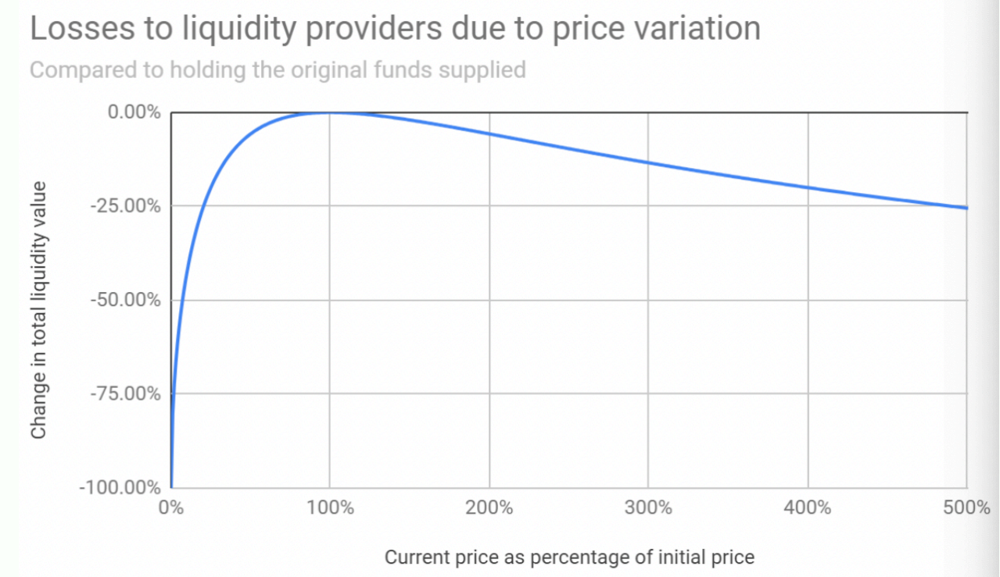
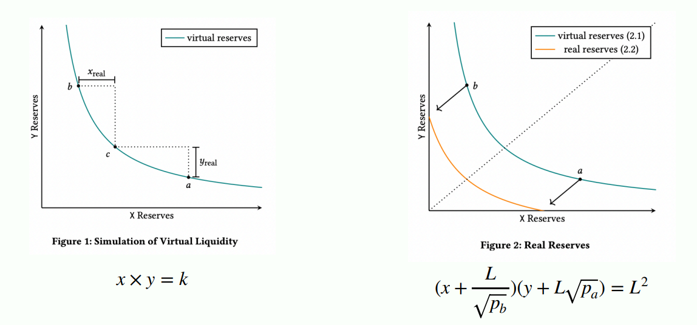

::: {.key-questions}
- **CPMM ($x \cdot y = k$)** 에서 유동성 $k$와 거래 규모는 가격에 어떤 영향을 주는가?
- **유동성 공급자 (LP, Liquidity Provider)** 는 왜 **비영구적 손실 (Impermanent Loss)** 을 겪는가?
- Uniswap V2의 자본 비효율 문제를 V3의 **집중 유동성 (Concentrated Liquidity)** 이 어떻게 해결하는가?
:::

## 1. CPMM 복습과 슬리피지

::: {.column-margin}
**CPMM**

$x \cdot y = k$
유동성 $k$가 핵심
:::

**CPMM (Constant Product Market Maker)** 는 두 토큰 수량의 곱 $x \cdot y = k$ 를 일정하게 유지하는 자동 시장 조성 방식이다. (지금 실제로 쓰이는 모델은 더 복잡하지만 이건 초창기 버전)

- 유동성 $k$가 **작을수록**, 거래량이 **클수록** 가격 효과(price impact)가 커진다 → 유저가 받는 **슬리피지 (slippage)** 가 커진다. 작은 거래는 괜찮지만 어느 정도 규모를 스왑하면 가격이 크게 밀린다.
- 곡선 특성상 **어느 한쪽 토큰 수량이 0이 될 수 없다** → 풀이 완전히 고갈되지 않는다 (장점이자 단점).


::: {.column-margin}
**슬리피지(slippage)**

기대 체결가(판매 수량 * 토큰 비율) vs
실제 체결가의 차이(거래 전 y - 거래 후 y).
거래량 클수록 ↑
:::

::: {.callout-tip title="PDF 자료 연결"}
슬라이드: "유동성($k$)이 작을수록, 거래량이 클수록 가격 효과(Price impact)가 큼 · 유동성이 작을수록 유저 입장에서 손해가 큰 구조".
:::

## 2. LP 입장과 비영구적 손실 (Impermanent Loss)

::: {.column-margin}
**Impermanent Loss**

가격이 변하면
생기는 기회비용
:::

**LP (Liquidity Provider)** 가 유동성을 공급할 때:

1. 유동성 제공 시점의 **토큰 비율 그대로** 넣어야 한다 (예: 4:1 풀이면 4:1로). *최근 거래소들은 한쪽만 넣는 것도 허용하지만 초창기 모델 기준.*
2. 유동성을 제공하는 동안 풀에 쌓인 **수수료(swap fee)** 를 가져갈 수 있다 — LP의 거의 유일한 인센티브.
3. 유동성 **회수 시점의 가격이 제공 시점과 다르면** 가져가는 토큰 수량이 달라진다.

**Impermanent Loss (IL)**: LP가 유동성을 공급한 뒤 발생할 수 있는 **기회비용**. "Pool에 넣었을 때 자산 가치" vs "안 넣고 그냥 홀딩했을 때 가치"를 비교한 손실.

- 가격이 **올라도 내려도** IL이 발생한다. 변화폭이 클수록 IL이 커진다 → "안 넣느니만 못한" 상황.
- 제공 시점과 회수 시점의 가격이 **비슷할수록** IL이 작다 → 스테이블코인 풀은 IL 걱정이 적다.
- 거래가 많이 일어나 swap fee가 충분히 쌓여야 LP의 **순이익(net profit)** 이 양수가 된다. 초기에는 수수료가 덜 쌓여 손해 구간이 길 수 있고, 언제 진입했느냐(운)에 따라 손익이 크게 갈린다.



::: {.callout-note title="부연 설명 — 좁은 범위일수록 IL 위험 ↑"}
집중 유동성(V3)에서는 가격 범위를 좁게 설정해 자본 효율을 높이는 만큼 **IL 위험도 증폭**된다. 가격이 설정 범위를 벗어나면 그 포지션의 유동성은 비활성화되어 더 이상 수수료를 벌지 못한다. 출처: [Concentrated Liquidity & Capital Efficiency — Cyfrin](https://www.cyfrin.io/blog/uniswap-v3-concentrated-liquidity-capital-efficiency)
:::

## 3. 다른 AMM 방식: CSMM과 Stableswap

::: {.column-margin}
**CSMM / Stableswap**

$x + y = k$
스테이블코인용
:::

- **CSMM (Constant Sum Market Maker)**: $x + y = k$. 두 토큰 수량의 합이 일정 → 가격이 항상 **1:1 고정**. 단, 한쪽 자산이 바닥날 수 있다(유동성 고갈).
- **Stableswap (Hybrid CFMM)**: CPMM과 CSMM의 장점을 혼합.
  - 자산 비율이 비슷할 때는 그래프가 **직선(CSMM)** 에 가까움 → 슬리피지 최소.
  - 한쪽이 급감해 위험해지면 **CPMM** 에 가까워짐 → 고갈 방지.
  - 변동이 거의 없는 스테이블코인 간 교환(USDT:USDC, DAI:USDT)에 적합. 주로 **Curve Finance** 에서 사용. 패깅이 깨지면(예: USDT가 1달러 가치를 잃으면) 사람들이 패닉 매도해 곡선 한쪽 끝으로 쏠린다.

## 4. Uniswap V3: 집중 유동성 (Concentrated Liquidity)

::: {.column-margin}
**Concentrated Liquidity**

특정 가격 범위에만
유동성 집중
:::

2021년 5월 출시. 핵심 목표는 **자본 효율성의 극대화**. V2와의 가장 큰 차이가 **집중 유동성**이다.

**V2의 문제 (자본 비효율)**: 유동성이 $0$부터 $\infty$까지 **모든 가격대에 동일하게 얇게** 펴져 있다. 호가창(order book)으로 비유하면, 이더리움이 2,000달러인데 10,000달러·20,000달러에도 똑같은 매도 물량이 깔린 셈. DAI/USDC 풀은 가격이 주로 \$0.99~\$1.01에 머무는데도 **자본의 0.5%만 실제로 사용**되고 99.5%가 놀고 있다.

**V3의 해법**: LP가 유동성을 공급할 **가격 범위(range)** 를 직접 선택한다.

- 거래가 활발한 구간에만 유동성을 집중 → 놀던 자본을 끌어와 깊은 유동성 제공.
- LP마다 **개인화된 가격 곡선** 생성 가능 (예: 절반은 1.0~1.01, 절반은 1.1~1.2처럼 여러 구간 중첩 → 전략 다양화).
- (DAI, USDC) 풀에서 범위를 0.99~1.01로 좁히면 V2 대비 **2,000~4,000배 깊은 유동성**.



```{mermaid}
graph TD
    subgraph V2["Uniswap V2"]
        A["0 ~ ∞ 전 구간<br/>얇게 균일 분포"] --> B["자본의 0.5%만 사용<br/>99.5% 유휴"]
    end
    subgraph V3["Uniswap V3"]
        C["LP가 가격 범위 선택<br/>예: 0.99~1.01"] --> D["거래 활발 구간에<br/>유동성 집중"]
        D --> E["수수료↑ · 자본효율 최대 4000x"]
    end
```

::: {.callout-note title="부연 설명 — tick으로 구현"}
V3는 연속적인 가격 공간을 **tick(틱)** 단위로 분할해 집중 유동성을 구현한다. 1 tick은 어느 지점에서나 0.01%의 가격 변화에 해당한다. 자본 효율은 최대 4,000배까지 오르지만, 가격이 설정 범위를 벗어나면 수수료 수익이 멈추는 트레이드오프가 있다. 출처: [Uniswap V3 Whitepaper](https://app.uniswap.org/whitepaper-v3.pdf), [Concentrated Liquidity — Uniswap Docs](https://developers.uniswap.org/docs/get-started/concepts/liquidity-providers/concentrated-liquidity)
:::

**범위를 벗어나면? — 한쪽 토큰이 0이 될 수 있다**

V3에서 LP는 $[a, b]$ 가격 구간에만 유동성을 넣는다. 현재 가격이 이 구간을 **벗어나면** 포지션은 한쪽 토큰으로 100% 전환된다(예: 가격이 $b$를 넘으면 전부 한 토큰만 남음). 즉 V2/CPMM과 달리 **한쪽 토큰 수량이 0이 될 수 있고**, 구간 밖에서는 유동성이 비활성화되어 수수료를 못 번다.

**LP 전략의 트레이드오프**: 좁은 구간에 유동성을 크게 몰면 단기적으로 **수수료를 훨씬 많이** 먹지만(2,000~4,000배) **IL이 더 심해진다**. LP마다 리스크 선호에 따라 구간 폭·위치를 다르게 설정 → 전략이 다양해진다.

::: {.callout-tip title="실제 사례 (강의 데모)"}
실제 Uniswap V3의 ETH/USDC 풀을 보면 유동성이 **현재 가격 근처에 촘촘**하고, 현재가의 +60%·+462% 같은 먼 가격대에는 유동성이 거의 없다(호가창과 유사한 분포). USDC/USDT 같은 스테이블 풀은 거의 **0.1% 폭** 안에만 유동성이 몰린다(이를 벗어나면 차익거래자가 외부에서 사와 팔기 때문). V3는 Curve의 Stableswap이 유동성을 끌어가자 이에 대응한 측면도 있다.
:::

> 참고: 현재 Uniswap은 V4까지 나왔지만 V3의 집중 유동성 구조 자체가 바뀐 것은 아니다. V2→V3 전환이 가장 큰 변화였다.

## 개념 연결

- 이전 강의의 **CPMM ($x \cdot y = k$)** 곡선이 이번 V3 집중 유동성의 출발점. V3는 같은 곡선을 특정 구간에만 적용한 것으로 볼 수 있다.
- **슬리피지·가격 효과** 는 유동성 깊이의 함수 → V3가 유동성을 집중해 슬리피지를 줄이려는 동기와 직결.
- **Impermanent Loss** 는 V3에서 범위를 좁힐수록 커지므로, 자본 효율과 IL 위험 사이의 **트레이드오프**를 이해하는 것이 LP 전략의 핵심.

::: {.lecture-summary}
- **CPMM($x\cdot y=k$)** 은 유동성 $k$가 작거나 거래량이 클수록 슬리피지가 커지고, 토큰이 완전히 고갈되지 않는다.
- **LP** 는 수수료를 인센티브로 받지만, 가격 변동에서 오는 **Impermanent Loss(기회비용)** 를 감수한다 — 변동폭이 클수록 손실이 크다.
- **CSMM($x+y=k$)** 은 1:1 고정, **Stableswap** 은 CPMM·CSMM 혼합으로 스테이블코인 교환에 최적(Curve).
- **Uniswap V3 집중 유동성** 은 LP가 가격 범위를 선택해 자본 효율을 최대 4,000배까지 높이지만, 범위를 벗어나면 수수료가 끊기고 IL 위험이 커진다.
:::
