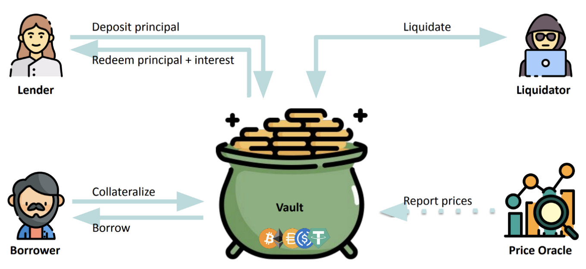
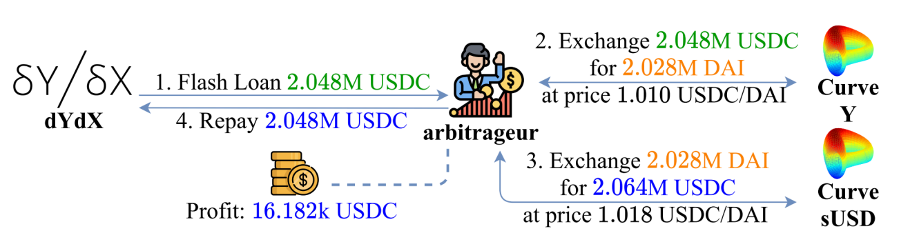

::: {.key-questions}
- **은행이라는 주체가 없는** 대출 플랫폼은 어떻게 떼이지 않고 돈을 빌려줄 수 있는가?
- **청산 임계값 (Liquidation Threshold)** 과 **헬스팩터 (Health Factor)** 는 무엇이고, 언제 **청산 (Liquidation)** 이 일어나는가?
- 청산이 **실패**하는 상황(담보 급락·가스비 폭등)은 왜 위험하며, 프로토콜은 어떻게 대비하는가?
- 담보 없이 빌리는 **플래시론 (Flash Loan)** 은 어떻게 가능한가?
:::

## 1. 대출 프로토콜이란 — "주인 없는 은행"

::: {.column-margin}
**Lending Protocol**

예금·대출이 되는
"주인 없는 자판기"
대표적 DeFi
:::

**대출 프로토콜 (Lending Protocol)** 은 돈을 맡기고(예금) 빌릴 수 있는 플랫폼인데, **은행이라는 중앙 주체가 없다**. 교수님 표현으로는 *"주인 없는 은행 / 주인 없는 자판기"*. Uniswap과 비슷하게 2017년 말에 등장해 2019~2020년을 지나며 크게 주목받았고, 지금도 가장 대표적인 **DeFi (Decentralized Finance)** 프로토콜이다.

핵심 참여자는 4명 + 1개의 금고다.

| 참여자 | 하는 일 |
|---|---|
| **예치자 (Lender)** | 금고(Vault)에 돈을 예치 → 원금 + **이자(interest)** 를 돌려받음 |
| **대출자 (Borrower)** | **담보(collateral, 보통 암호화폐)** 를 맡기고 다른 자산(예: USD 스테이블코인)을 빌림 |
| **청산자 (Liquidator)** | 담보 가치가 떨어지면 위험한 포지션을 **청산**시킴 |
| **가격 오라클 (Price Oracle)** | 담보의 **현재 시장가**를 외부에서 가져와 프로토콜에 제공 |

::: {.column-margin}
**청산**

아무나 청산 가능 상태일 때 청산 프로토콜 실행 가능하다.
:::

::: {.callout-tip title="PDF 자료 연결 — 동작 구조"}
슬라이드 "Lending Protocol — How it works" 다이어그램:



대표 프로토콜: **Compound, MakerDAO(Maker), Aave**. (타임라인상 Uniswap·MakerDAO가 2018년경 등장 → 2020~2021 DeFi 붐)
:::

```{mermaid}
graph LR
    L["예치자<br/>Lender"] -- "예치 (원금)" --> V[("금고<br/>Vault")]
    V -- "원금 + 이자" --> L
    B["대출자<br/>Borrower"] -- "담보 예치<br/>Collateralize" --> V
    V -- "대출 Borrow" --> B
    O["가격 오라클<br/>Price Oracle"] -. "시세 보고" .-> V
    V -- "위험 포지션 청산" --> Q["청산자<br/>Liquidator"]
```

## 2. 왜 과담보(Over-collateralization)인가

::: {.column-margin}
**Over-collateralization**

신원을 모르니
담보 > 대출
필수 (보통 1.5배)
:::

블록체인 위에서는 빌려주는 쪽도 빌리는 쪽도 **누가 누군지 모른다**. **KYC (Know Your Customer)** 도, 법의 보호도 없는 "무법지대"에서 돈을 돌려받으려면 방법은 하나뿐 — **담보가 대출보다 무조건 커야 한다**.

- **과담보 (Over-collateralization)**: `담보 가치 > 대출 가치`. 보통 빌리려는 가치의 **1.5배**, 변동성이 작은 안전한 자산은 **1.3배** 정도를 예치해야 빌릴 수 있다.
- **그럼 왜 더 큰 가치를 맡기고 더 작은 걸 빌리지?** → 부동산 담보대출과 같은 논리다. *"이더리움·비트코인은 팔기 싫은데 급전(월세·보증금)이 필요하다"* 는 경우, 자산을 팔지 않고 담보로 맡긴 채 현금을 융통한다.

::: {.callout-note title="부연 설명 — Lender의 이자는 어디서?"}
예치자(Lender)가 받는 이자는 대출자(Borrower)가 내는 대출 이자에서 나온다. 이자율은 보통 풀의 **이용률(utilization rate)** 에 따라 알고리즘으로 자동 결정된다(빌려간 비율이 높을수록 금리 상승). 출처: [Aave — Borrow Interest Rate](https://aave.com/docs/concepts/interest-rates)
:::

**예시 (PDF):** 200\$어치 **ETH를 담보(collateral)** 로 잡고 100\$어치 **USDC를 대출** → 담보가 대출의 2배. 담보 가치가 급락해 `collateral < loan`이 되면 떼일 위험이 생기므로, 이를 막기 위한 **청산(Liquidation)** 장치가 존재한다.

## 3. 청산 임계값 (Liquidation Threshold) 과 헬스팩터 (Health Factor)

::: {.column-margin}
**LT vs HF**

LT = 프로토콜이 정한
파라미터 (참는 한계)

HF = 지금 얼마나
건강한지 지표
:::

담보가 어디까지 떨어졌을 때 청산할지 그 **기준**이 필요하다. 담보 가치가 대출과 같아질 때(1배)까지 기다리면 이미 늦다 — 암호화폐 가격이 떨어지는 속도가 더 빠를 수 있기 때문이다.

**청산 임계값 (Liquidation Threshold, LT)**: 프로토콜이 정하는 **파라미터**. "담보 가치가 대출 대비 얼마까지 떨어지는 걸 참아줄 것인가."

$$\text{담보 가치} \times \text{LT} < \text{대출(부채)} \quad\Rightarrow\quad \textbf{청산 가능}$$

- LT가 **낮을수록 보수적이고 안전**하지만 **자본 비효율**적이다. 예를 들어 LT = 0.1이면 담보가 대출의 **10배** 이상이어야 유지된다 (1억 넣고 1천만 원도 못 빌리는 셈). 보통은 **0.4~0.5** 수준.
- **자산마다 LT가 다르다**: 변동성이 작은 BTC·ETH는 덜 보수적으로, 시가총액이 작아 가격 변동이 심한 코인은 더 보수적으로(LT를 낮게) 잡는다. 프로토콜이 합의로 정하며 중간에 바뀔 수 있다.

**헬스팩터 (Health Factor, HF)**: 지금 포지션이 **얼마나 건강한지(위험한지)** 나타내는 지표.

$$HF = \frac{\text{담보 가치} \times \text{LT}}{\text{대출(부채)}}, \qquad HF < 1 \;\Rightarrow\; \textbf{청산}$$

::: {.callout-note title="부연 설명 — 실제 Aave의 정의와 동일"}
Aave 공식 문서도 동일하게 정의한다: 헬스팩터는 *"청산 임계값으로 가중된 담보 가치 ÷ 총 부채"* 이며, **HF가 1 미만**으로 떨어지면(담보 가치 하락 또는 부채 가치 상승) 청산이 트리거된다. 출처: [Health Factor & Liquidations — Aave](https://aave.com/help/borrowing/liquidations)
:::

### 청산 과정 예시

담보 ETH가 200\$ → **150\$** 로 하락, 대출 100\$, LT = 0.5인 상황:

$$HF = \frac{150 \times 0.5}{100} = 0.75 < 1 \;\Rightarrow\; \text{청산 가능}$$

이때 **청산자(Liquidator)** 가 개입한다 (유인이 있어야 하므로 **담보를 할인된 가격에** 가져감):

1. 대출자의 빚 100 중 **60을 대신 갚아준다**.
2. 그 대가로 60보다 **큰 가치인 70어치 담보를 가져간다** (차액 10이 청산자의 보상 = liquidation bonus).
3. 결과: 담보 `150 - 70 = 80`, 부채 `100 - 60 = 40` 남음.

$$HF_{\text{청산 후}} = \frac{80 \times 0.5}{40} = 1.0 \;\Rightarrow\; \text{다시 안전 구간으로 복귀}$$

청산자는 **담보를 싸게 사서** 수수료 이득을 챙기고, 프로토콜은 **담보 > 부채** 상태를 유지할 수 있어 윈윈이다.

```{mermaid}
graph TD
    A["담보 200$ / 대출 100$<br/>HF = 1.0 (안전)"] -->|"담보 급락 200→150"| B["HF = 150×0.5/100 = 0.75<br/>⚠️ HF < 1"]
    B -->|"청산자: 60 상환(70을 싼 가격에 구매) +<br/>담보 70 회수"| C["담보 80 / 부채 40<br/>HF = 80×0.5/40 = 1.0 복귀"]
```

## 4. 청산이 실패하는 위험 — 그리고 프로토콜의 대비

청산은 만능이 아니다. 두 가지 상황에서 **청산이 제때 일어나지 못해** `담보 < 부채`가 된다.

1. **담보가 너무 빨리 폭락** — 블록 타임이 12초인데 그 사이 담보가 반토막 나거나, 해킹으로 담보 토큰이 폭락하면 청산할 새가 없다. 이렇게 되면 빌린 사람은 **신원이 노출되지도, 법의 제재를 받지도 않으므로 그냥 대출금을 들고 튀면 된다**(담보가 어차피 쓰레기가 됐으니 갚을 유인 0).
2. **청산 이득 < 네트워크 수수료(gas)** — 가격 급락 시 네트워크가 혼잡해져 가스비가 폭등하면, 청산해도 남는 게 없어 아무도 청산하지 않는다.

::: {.column-margin}
**데스 스파이럴**

청산 → 담보 매도
→ 추가 하락 → 추가 청산
하락에 가속이 붙음
:::

::: {.callout-note title="부연 설명 — 루나 사태 & Black Thursday"}
- **루나(Terra) 붕괴 (2022.5)**: 루나를 담보로 달러를 빌렸는데 루나가 사실상 0원이 되자, 굳이 휴지가 된 담보를 되찾으려 대출금을 갚을 이유가 사라졌다.
- **Black Thursday (2020.3.12)**: 코로나 폭락으로 ETH가 급락하고 네트워크가 혼잡해져 가스비가 폭등하자, MakerDAO 청산 경매에서 경쟁자가 없어 한 봇이 **0 DAI 입찰**로 담보를 가져가 약 **\$832만(8.32M)** 규모가 0에 청산됐다. 이후 모든 DeFi 청산 시스템의 리스크 설계가 이 사건을 기준으로 바뀌었다. 출처: [Black Thursday for MakerDAO — Whiterabbit](https://medium.com/@whiterabbit_hq/black-thursday-for-makerdao-8-32-million-was-liquidated-for-0-dai-36b83cac56b6)
:::

**대비책**: MakerDAO 등 프로토콜은 예치·대출 양쪽에서 **수수료 일부를 떼어 금고(safety module)에 적립**해, 이런 비상 상황에서 손실을 메울 수 있게 한다. 주인은 없지만 **커뮤니티**가 이런 파라미터와 비상책을 운영한다.

### 청산 규모와 "데스 스파이럴"

- 누적 청산 규모는 막대하다 — **Aave 약 \$4.6B**, **MakerDAO/Sky는 6조 원 이상**, 그보다 큰 곳도 있다.
- 평소엔 청산이 거의 없다가 **가격 급락 시 폭증**한다(최근 국제 정치 이슈로 코인 급락 시 역대 최대치 기록).
- **데스 스파이럴 (death spiral)**: 청산자는 가져간 담보를 **즉시 시장에 매도**한다 → 가격이 더 떨어짐 → 더 많은 포지션이 청산됨 → 담보가 또 시장에 쏟아짐 → 하락에 **가속**이 붙는다.
- 모든 게 **온체인(on-chain)** 이라 누가 얼마를 청산했는지/당했는지 다 보인다. 그래서 트레이더들은 *"가격이 여기까지 떨어지면 얼마가 청산되겠다"* 를 미리 계산하며 청산 레벨을 주시한다 — 중앙화 시스템과 구별되는 특징이다.

## 5. 플래시론 (Flash Loan) — 담보 없는 대출

::: {.column-margin}
**Flash Loan**

한 트랜잭션 안에서
빌리고 갚으면
담보가 필요 없다
(atomic)
:::

**플래시론 (Flash Loan)** 은 **무담보 대출**이다. 어떻게 담보 없이 가능할까?

> **하나의 트랜잭션 안에서 빌리고 → 무언가를 하고 → 갚는 것**이 전부 끝나기 때문이다.

이더리움 트랜잭션은 그 안에서 컨트랙트의 함수를 호출하고, 그 함수가 다시 여러 함수를 연쇄 호출하며 **사고·팔고·예치하고·상환하는** 여러 동작을 한 번에 수행할 수 있다(원자적 실행, atomic). 빌린 돈을 같은 트랜잭션 끝에 갚지 못하면 **트랜잭션 전체가 되돌려지므로(revert)** 대주(貸主)는 떼일 일이 없다.

**주 용도 — 차익거래(arbitrage)**: DEX 간 가격 차이가 크면, 플래시론으로 거금을 빌려 싼 곳에서 사서 비싼 곳에 팔고, 수수료를 갚고 차익을 챙긴다.

- 예: **dYdX**에서 200만 달러를 빌려 → **Curve의 Y풀과 sBTC풀** 사이 차익거래로 이득 → 원금 상환(repay).
- 초기엔 경쟁이 적어 할 만했지만, 지금은 이것만 노리는 봇들이 많고, 트랜잭션을 블록에 넣으려면 **블록 생성자에게 높은 수수료(로비)** 를 줘야 할 정도다(MEV 경쟁).



::: {.callout-note title="부연 설명 — 플래시론과 해킹"}
플래시론은 *순간적으로* 막대한 자금을 동원할 수 있어 **DeFi 해킹에 악용**되는 경우가 많다. 예치 담보 없이도 거금을 빌려 **DEX 풀의 비율을 일시적으로 왜곡**시키고(가격 조작), 그 왜곡된 가격을 참조하는 다른 프로토콜을 공격하는 식이다. 그래서 "플래시론" 하면 이미지가 좋지 않지만, 기술 자체는 중립적인 차익거래 도구다. 출처: [Flash Loans — Aave Docs](https://aave.com/docs/concepts/flash-loans)
:::

## 개념 연결

- 12강의 **DEX/AMM·유동성 풀**이 "자산을 교환"하는 인프라였다면, 13강의 **대출 프로토콜**은 그 위에서 "자산을 빌리고 빌려주는" 금융 레이어다. 플래시론 차익거래가 바로 **DEX 풀**을 활용한다는 점에서 둘은 직접 연결된다.
- **가격 오라클(Price Oracle)** 은 청산의 전제 조건 — 담보의 실시간 시세를 알아야 HF를 계산할 수 있다. (오라클 자체는 곧 다룰 주제)
- **데스 스파이럴**은 12강의 **슬리피지**와 연결된다 — 청산자가 담보를 대량 매도할 때 유동성이 얕으면 가격이 더 크게 밀린다.

::: {.lecture-summary}
- **대출 프로토콜**은 은행 없는(주인 없는) 예금·대출 플랫폼. 참여자는 Lender·Borrower·Liquidator·Price Oracle, 자산은 Vault에 모인다.
- 신원·법적 보호가 없으므로 **과담보(Over-collateralization)** 가 필수 — 담보가 대출의 보통 1.5배 이상.
- **청산 임계값(LT)** 은 프로토콜이 정한 파라미터, **헬스팩터(HF = 담보×LT / 부채)** 가 **1 미만**이면 청산. 청산자는 담보를 할인가에 가져가 차익을 얻고 포지션을 안전 구간으로 되돌린다.
- 담보 급락·가스비 폭등 시 **청산 실패**가 발생(루나 사태, Black Thursday) → 프로토콜은 수수료를 적립한 **안전 금고**로 대비. 청산 매도가 추가 하락을 부르는 **데스 스파이럴**에 유의.
- **플래시론**은 한 트랜잭션 안에서 빌리고 갚는 **무담보 대출**로, 차익거래에 쓰이지만 가격 조작 해킹에도 악용된다.
:::
