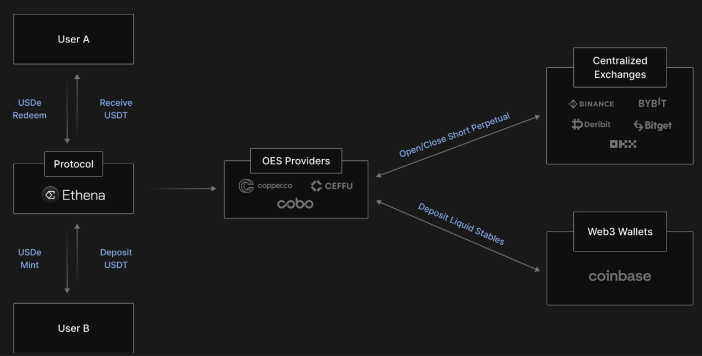

::: {.key-questions}
- **DAI** 는 어떻게 1달러 페깅을 유지하는가? (PSM·Stability Fee·DSR)
- **USDS (Sky Protocol)** 은 DAI와 무엇이 다르며, 어떤 수익 구조를 갖는가?
- **이자 지급형 스테이블코인** (USDS·USDE·PYUSD) 의 수익 원천과 리스크는 각각 무엇인가?
- **Terra/LUNA 붕괴** 는 어떻게 일어났고, 알고리즘 스테이블코인의 어떤 구조적 문제를 드러냈는가?
:::

## 1. 스테이블코인과 RWA의 관계

::: {.column-margin}
**스테이블코인 ⊂ RWA**

달러도 실물 자산.
스테이블코인은
RWA의 기축통화
:::

**RWA (Real World Asset)**: 미술품·금·국채·회사채·부동산 같은 실물 자산을 블록체인 위에 토큰화한 것. **스테이블코인은 RWA의 한 종류**다 — 달러도 실존하는 자산이므로.

실용적으로 구분하면:

- **스테이블코인**: USD 가치에 페깅된 자산 (USDT, USDC, DAI, USDS)
- **RWA (협의)**: 국채·금·회사채 등 투자성 자산 토큰

이 둘은 긴밀하게 연결된다:

- 스테이블코인 발행사가 **RWA(국채 등)에 투자**해 수익을 올린다 (USDT·USDC 모두 국채에 60%+ 투자 중, 테더는 BTC까지).
- RWA를 온체인에서 사고팔기 위한 **기축통화**가 스테이블코인 → 한쪽이 커야 나머지도 크는 구조.

::: {.callout-note title="부연 설명 — STO (Security Token Offering)"}
STO는 RWA를 나타내는 다른 명칭. 실물 자산(미술품·금 등)을 블록체인 위에 올려 거래 가능하게 하는 사업. 한국에서도 2026년 초 관련 법안이 통과되어 증권사들이 진출 준비 중. 출처: [금융위원회 토큰 증권 가이드라인](https://www.fsc.go.kr)
:::

## 2. DAI의 1달러 페깅 메커니즘

::: {.column-margin}
**DAI 특징**

검열저항성 · 투명성
블랙리스트 불가
담보 구성 실시간 공개
:::

**DAI** 는 MakerDAO(현 Sky Protocol)가 2014년 출시한 **담보 기반 탈중화 스테이블코인**. USDT/USDC와 달리:

- **검열저항성**: 블랙리스트 기능 없음 → 특정 주소 동결 불가능.
- **투명성**: 스마트 컨트랙트 위에서 모든 담보 이동이 실시간 공개.

**발행 구조**: 과담보대출 방식. ETH/BTC 등을 Vault(금고)에 담보로 맡기고, 그 가치보다 낮은 DAI를 발행 (예: 150달러 ETH → 최대 100 DAI).

### DAI 1달러 페깅 3가지 장치

```{mermaid}
graph TD
    P["DAI 가격 이탈"]

    P -->|"DAI > $1\n공급 늘려서 가격 낮추기"| HIGH["DAI 초과 시"]
    P -->|"DAI < $1\n공급 줄여서 가격 높이기"| LOW["DAI 미만 시"]

    HIGH --> H1["① PSM\nUSDC → DAI 1:1 교환\n아비트라저 차익거래\n→ DAI 공급 ↑ (즉각)"]
    HIGH --> H2["② Stability Fee ↓\n대출이자 인하\n→ 볼트 개설 증가\n→ DAI 공급 ↑"]
    HIGH --> H3["③ DSR ↓\n예치이자 인하\n→ 예치 유인 감소\n→ DAI 시장 유통 ↑"]

    LOW --> L1["② Stability Fee ↑\n대출이자 인상\n→ 조기 상환 압력\n→ DAI 공급 ↓"]
    LOW --> L2["③ DSR ↑\n예치이자 인상\n→ DAI 예치 유인 ↑\n→ DAI 시장 유통 ↓"]

    H1 --> R["$1 회복"]
    H2 --> R
    H3 --> R
    L1 --> R
    L2 --> R
```

> **PSM은 $1 초과 시에만 즉각 작동** (아비트라저 자동). Stability Fee·DSR은 $1 초과·미만 양방향으로 작동하지만 **거버넌스 투표 필요 → 느림**.


**① PSM (Peg Stability Module, 페그 안정화 모듈, 2020 추가)**
USDC 같은 다른 스테이블코인과 DAI를 **1대1 무지성 교환**. DAI가 1달러보다 높아지는 순간 아비트라저가 즉시 차익거래 → 빠르게 수렴. 단, USDC 의존도가 높아져 중앙화 경향이 커지는 단점.

**② Stability Fee (안정화 수수료) — 대출 이자율**
DAI 빌린 사람에게 부과하는 이자율. 높이면 상환 압력 증가(공급↓), 낮추면 대출 유인 증가(공급↑). **거버넌스 투표**로 조절 → 속도가 느림.

**③ DSR (DAI Savings Rate) — 예치 이자율**
DAI를 스테이킹하면 받는 이자율. 높이면 시장에서 유통되는 DAI 감소(공급↓), 낮추면 증가. 역시 거버넌스로 조절.

::: {.callout-note title="부연 설명 — 전통 금융의 중앙은행 금리와 동일한 원리"}
DSR/Stability Fee 조절은 중앙은행이 기준금리를 올려 대출을 억제하고 예금을 늘리는 원리와 동일하다. 차이는 중앙은행은 일방적으로 결정하지만 MakerDAO는 **거버넌스 투표**를 거쳐야 한다는 점 — 더 느리지만 더 탈중화된 방식. 출처: [MakerDAO — DAI Stability](https://docs.makerdao.com)
:::

## 3. USDS (Sky Protocol) — DAI의 업그레이드

::: {.column-margin}
**DAI → USDS**

2024.9 리브랜딩
RWA 수익 추가
3.65% 이자 제공
DAI와 1:1 교환
:::

2024년 9월 MakerDAO가 **Sky Protocol**로 리브랜딩하고 DAI를 **USDS**로 업그레이드. 배경(Endgame 전략):

- DAI의 수익 원천이 **랜딩 수수료**뿐 → 자본 효율성이 낮아 타 스테이블코인 대비 경쟁력 약화.
- RWA 투자 수익을 추가해 **홀더에게 더 많은 이자를 돌려주자**.
- UI/UX 개선

**DAI와 USDS의 차이**:

| | DAI | USDS |
|---|---|---|
| 출시 | 2014년 | 2024.9 |
| 검열저항성 | ✓ (블랙리스트 불가) | ✗ (동결 가능) |
| 수익 원천 | 랜딩 수수료만 | 랜딩 + **RWA 수익** + **SKY 토큰 보상** |
| 이자율 (Sky Savings Rate) | 낮음 | **≈ 3.65%** |
| 규제 친화성 | 낮음 | 높음 |

- **DAI와 1:1 교환**: DAI 홀더는 USDS로 무제한 교환 가능 → 기존 DAI 공급은 그대로 유지하면서 USDS로 업그레이드.
- **USDS 콜레터럴 구성**: 스테이블코인(USDC 등) + 단기 국채 21% + 랜딩 16% + AA 회사채.
- **스테이킹 방식**: USDS를 Sky Protocol에 공급하면 `sUSDS` (스테이킹 증표 토큰)를 받고, 1년 뒤 원금보다 많은 USDS를 돌려받는다 (3.65% APY 복리). SKY 거버넌스 토큰도 추가로 받음.

## 4. 이자 지급형 스테이블코인 경쟁

### USDE (Ethena Protocol) — 델타 중립 전략

::: {.column-margin}
**Delta Neutral**

ETH 스테이킹 수익
+ CEX 숏 포지션
펀딩비 수취
→ 가격 방향 무관
:::

**Ethena Protocol** 이 발행하는 스테이블코인. 평균 APY 11.6%를 표방했으나 변동성이 크다.

**수익 구조 — 델타 중립 전략 (Delta Neutral Strategy)**:

1. 사용자가 ETH를 담보로 예치 → ETH **스테이킹**으로 ≈3% 수익 발생.
2. **중앙 거래소(CEX)** 에서 같은 금액만큼 **ETH 숏(short) 포지션** 보유 → ETH 가격 등락에 무관(헤징).
3. 숏 포지션은 롱이 많을 때 **펀딩비(funding rate)** 를 받는다 — 특히 불장에서 롱>숏이면 숏이 돈을 받아 수익률↑↑.



**리스크**: 펀딩비는 **보장되지 않는다**. 베어마켓에서 숏이 더 많으면 숏이 롱에게 펀딩비를 지불 → 수익률 **음수** 가능. 실제로 최근 베어마켓 구간에서 펀딩비가 음수였고, ETH 스테이킹 이자(≈2%)로도 상쇄 안 될 때가 있었다.

### PYUSD (PayPal USD)

페이팔이 직접 발행한 중앙화 스테이블코인. 전 세계 페이팔 가맹점에서 결제 가능 → 강력한 접근성. 보유만 해도 ≈3.7% 지급 (USDS와 유사). 완전 중앙화 모델 → 페이팔에 대한 신뢰가 전제.

**스테이블코인 수익률 비교**:

| 종류 | APY | 수익 원천 | 리스크 |
|---|---|---|---|
| USDS | ≈3.65% | RWA(국채 등) + 랜딩 | 스마트컨트랙트, 낮음 |
| USDE | ≈3.7~20% | ETH 스테이킹 + 펀딩비 | 펀딩비 음수 가능, 높음 |
| PYUSD | ≈3.7% | 페이팔 운용 수익 | 카운터파티(페이팔) |

## 5. Terra/LUNA 붕괴 — 알고리즘 스테이블코인의 교훈

::: {.column-margin}
**Terra/LUNA 붕괴**

2022.5
UST + LUNA 합산
$30B+ → 5일 만에 소멸
:::

**UST (TerraUSD)** 는 담보 없이 **알고리즘**으로 1달러를 유지하는 스테이블코인. 자매 토큰 **LUNA** 와 연동돼 있었다.

**구조적 문제**:

- DAI는 담보 1.5배 이상을 보유. UST는 담보가 약 **0.7배** 수준 — 충분하지 않았다.
- 1달러 유지를 알고리즘과 LUNA 가격에 대한 **믿음**으로만 지탱.
- UST가 1달러 아래로 떨어지면 LUNA를 불태워 UST를 사는 구조 → LUNA 시장에 과도하게 쏟아지면 LUNA 가격도 폭락.

**붕괴 과정 (2022.5)**:

1. 하락장 + 외부 공격(대규모 UST 매도)으로 UST가 1달러 이탈.
2. 페깅 복구를 위해 LUNA를 대량 발행 → LUNA 가격 폭락.
3. LUNA 가격 폭락 → UST 추가 이탈 → 더 많은 LUNA 발행 → **죽음의 소용돌이(Death Spiral)**.
4. UST + LUNA 합산 시총 **$30B+ → 5일 만에 사실상 0**.

::: {.callout-note title="부연 설명 — 의도적 공격설"}
2022년 3월 Do Kwon이 트위터에서 MakerDAO를 직접 저격("내 손으로 DAI를 죽이겠다")하는 등 공개적 대립이 있었다. 붕괴 직전 대규모 UST 매도가 조직적 공격이었다는 견해가 있으며, 구조적 취약성을 아는 세력이 의도적으로 촉발했을 가능성이 있다. 출처: [Terra Collapse Timeline — Coindesk](https://www.coindesk.com/learn/the-fall-of-terra-a-timeline-of-the-meteoric-rise-and-crash-of-ust-and-luna/)
:::

**교훈**: 담보 없는 순수 알고리즘 스테이블코인은 신뢰가 무너지는 순간 구조적으로 복구가 불가능하다. 이 사건 이후 **완전히 탈중화되고 담보가 투명하게 백킹된 DeFi 프로토콜의 필요성**이 다시 부각됐다.

## 개념 연결

- 14강 **거버넌스 토큰/DAO** 의 한계가 DAI 운용에서도 그대로 나타난다 — PSM이 없을 때 거버넌스 투표로 파라미터를 바꾸는 속도가 너무 느려 페깅 유지가 어렵다.
- **Lending Protocol (13강)** 이 DAI 발행의 기반 — Vault에서 과담보대출로 DAI를 발행하는 것이 사실상 랜딩 프로토콜이다.
- **RWA** 는 다음 강의 주제이자 USDS 성장의 핵심 드라이버.

::: {.lecture-summary}
- **DAI 페깅 3장치**: ①PSM(USDC 1:1 스왑, 빠름) ②Stability Fee(대출이자율, 거버넌스 조절) ③DSR(예치이자율, 거버넌스 조절).
- **USDS (Sky Protocol)**: DAI 리브랜딩(2024.9). RWA 수익 추가로 ≈3.65% APY 제공. 규제 친화·검열 가능(DAI와 차이). DAI와 1:1 교환 가능하며 공존 중.
- **이자형 스테이블코인 경쟁**: USDS(국채·랜딩 수익), USDE/Ethena(ETH 스테이킹+CEX 숏 펀딩비, 고수익·고변동), PYUSD(페이팔 발행, 접근성 강점).
- **Terra/LUNA 붕괴 (2022.5)**: 담보 0.7배 미만의 알고리즘 스테이블코인. 신뢰 붕괴 → 데스 스파이럴 → $30B+ 5일 만에 소멸. 투명한 담보 백킹의 필요성을 각인.
:::
