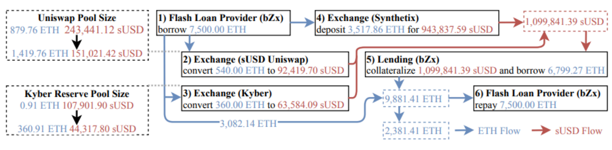

::: {.key-questions}
- **오라클 (Oracle)** 이란 무엇이고, 왜 블록체인에서 필요한가?
- 블록체인이 **외부 데이터에 직접 접근하지 못하는 이유**는 무엇인가?
- **단일 소스 오라클**의 위험성은 어떤 공격으로 나타났는가?
- **Chainlink** 는 어떻게 오라클 문제를 해결하며, 최근 어떤 방향으로 진화하고 있는가?
:::

## 1. 오라클이란 — 왜 필요한가

::: {.column-margin}
**Oracle**

블록체인이 외부
세계 데이터를
읽어오는 연결자
:::

랜딩 프로토콜에서 담보 가치가 떨어지면 청산을 해야 한다고 배웠다. 그런데 **"담보 가치가 얼마인지"** 는 어떻게 알까? 블록체인 안에 있는 컨트랙트가 실시간 시장가를 스스로 가져올 수 없다.

**오라클 (Oracle)**: 블록체인 외부의 실세계 데이터를 블록체인 위에 올려주는 시스템. 이름의 유래는 "외부 세계와 접촉하는 신 (oracle)" 에서.

**오라클이 필요한 대표 사례들**:

- **랜딩 프로토콜**: 담보(BTC·ETH)의 현재 시장가 → 헬스팩터 계산·청산 판단
- **예측 시장(Polymarket 등)**: 선거 결과, 스포츠 우승자 등 실세계 이벤트 결과 입력
- **RWA/스테이블코인**: 주식·펀드·금·채권의 현재 가치
- **보험 컨트랙트**: "비행기 연착 시 100달러 보상" → 실제 연착 여부 확인

## 2. 왜 블록체인은 외부 데이터에 직접 접근할 수 없는가

::: {.column-margin}
**결정성(Determinism)**

같은 입력 →
반드시 같은 출력
외부 API는 이를
보장할 수 없다
:::

블록체인의 핵심 특성: **모든 노드가 같은 입력을 처리하면 반드시 같은 결과를 내야 한다** (결정성, Determinism). 이게 없으면 합의가 불가능하다.

외부 웹사이트(HTTPS API)에 접속하면?

- 어떤 노드는 접속이 안 될 수 있다 (네트워크 장애).
- 시점에 따라 결과가 다를 수 있다 (가격은 매 순간 변한다).
- → 노드마다 다른 결과 → **합의 불가** → 블록체인 파괴.

따라서 스마트 컨트랙트는 **블록체인 네트워크 안에 있는 데이터**만 참조할 수 있다 (현재 블록 번호, 다른 컨트랙트 상태 등).

## 3. 오라클 작동 방식 — 다중 노드·다중 소스

외부 데이터를 블록체인에 올리는 올바른 방법:

```{mermaid}
graph LR
    S1["데이터 소스 A\n(거래소 A)"] & S2["데이터 소스 B\n(거래소 B)"] & S3["데이터 소스 C\n(거래소 C)"] --> N1["오라클 노드 1"]
    S1 & S2 & S3 --> N2["오라클 노드 2"]
    S1 & S2 & S3 --> N3["오라클 노드 3"]
    N1 & N2 & N3 -->|"각자 서명 후\n하나가 집계"| BC["블록체인\n(중앙값 또는 평균)"]
```

**핵심 원칙**:

1. **다중 노드**: 단일 노드가 악의적으로 잘못된 데이터를 올리는 것을 방지. 여러 노드가 서명해야 유효.
2. **다중 소스**: 하나의 소스가 다운되거나 해킹되어도 다른 소스로 보완.
3. **집계**: 여러 값을 수집해 **중앙값(median)** 이나 평균으로 최종값 결정.

비용 절약을 위해 일반적으로 1번 노드가 나머지 노드들의 서명을 모아서 한 번에 온체인에 올린다.

## 4. 단일 소스 오라클의 위험 — 실제 해킹 사례

### BZX 해킹 — DEX 가격 조작 (오라클 공격)

::: {.column-margin}
**Oracle Attack**

오라클 조작 →
잘못된 담보 가치 →
프로토콜 자금 탈취
DeFi 최대 공격면
:::

**BZX 랜딩 프로토콜**이 담보 가치를 **Kyber DEX 한 곳에서만** 가져오는 단일 소스 오라클을 사용했다. 해커의 공격 순서:



1. **플래시론**으로 막대한 ETH를 순간 차입.
2. Kyber 거래소에서 ETH 가격을 떨어뜨리기 위해 대량의 ETH를 매도
3. bZx로부터 값싼 담보로 비정상적으로 많은 양의 ETH를 빌림
4. dYdX에 flash loan으로 빌린 ETH 상환
5. 모든 것이 **한 트랜잭션** 안에서 완료.

> **핵심**: 이더리움 네트워크를 공격하려면 51% 공격(수백 조 원 필요)이 필요하지만, 단일 소스 오라클은 **훨씬 적은 비용**으로 조작 가능. 오라클이 DeFi의 최대 공격면(attack vector)인 이유.

### Polymarket 파리 날씨 사건 (2026.4)

"4월 6일 파리 최고기온 21도 초과 여부"에 베팅하는 컨트랙트. 단일 온도계 소스를 사용한다는 것을 파악한 공격자가 **헤어드라이기를 온도계에 가져다 대** 온도를 인위적으로 올려 반대 베팅으로 약 **$34,000** 이득. Polymarket은 이후 다중 소스 사용 결정.

## 5. 해결책

::: {.column-margin}
**Chainlink**

이더리움 오라클
시장 70%+ 점유
다중 노드·소스
가격 집계 제공
:::

- **다중 오라클 집계**
- **TWAP(시간가중평균가격)**: 순간 가격 대신 일정 시간 평균 가격 사용. 갑작스러운 시장 변동이나 플래시론 공격으로부터 보호.
- **가격 상한/하한 설정**: 비정상적 가격 변동을 자동으로 거부
- **Chainlink**: 오라클 시장의 압도적 지배자 (이더리움 오라클 데이터 공급의 70%+ 점유). 다양한 독립 노드 운영자들이 복수의 거래소·소스에서 데이터를 수집하고 집계해 온체인에 공급한다.

**Chainlink가 공급하는 데이터 종류**:

- 암호화폐 가격 페어 (BTC/USD, ETH/USD 등)
- 주식 가격, 환율
- 스테이블코인 리저브 정보
- 이자율, 상품 가격 등

## 6. 최근 트렌드 — 오라클의 확장

**① 전통 금융 데이터의 온체인化**:

- **SIX Exchange (스위스 증권거래소, 세계 10위)**: 2025년 **약 2,800조 원** 규모 주식 데이터를 Chainlink를 통해 블록체인에 공급.
- **Amundi (유럽 최대 자산운용사)**: Chainlink 기반으로 뮤추얼 펀드를 이더리움에 출시. 실시간 **NAV (Net Asset Value, 순자산가치)** 를 온체인에 제공.

**② AI Oracle — 비정형 데이터 처리**:

::: {.column-margin}
**AI Oracle**

PDF·계약서 등
비정형 데이터를
AI 합의로 온체인화
:::

기존 오라클은 숫자(가격, 온도) 같은 정형 데이터만 처리. 하지만 실제 금융 세계에는 **기업 합병 발표, 계약서, 규정 준수 문서** 같은 **비정형 데이터**가 넘친다.

**AI Oracle 방식**: 여러 LLM(Claude, Gemini, GPT 등)이 PDF를 각각 분석 → 모든 AI 에이전트가 **합의한 정보**만 블록체인에 기록. 단일 AI의 오류 위험을 줄인다.

**전 세계 24개 대형 은행 "온체인 골든 레코드 (On-chain Golden Record)" 프로젝트 (2025.4 시작)**: 기업 행위(corporate actions) — 배당, 합병, 권리 행사 등 — 를 AI 기반 오라클로 블록체인에 공식 기록. 금융기관들이 블록체인 위의 데이터를 공식 데이터로 신뢰하는 첫 걸음.

::: {.callout-note title="부연 설명 — 오라클 문제 (Oracle Problem)"}
'외부 데이터를 블록체인에 얼마나 신뢰할 수 있게 올릴 수 있는가'는 블록체인의 오랜 난제다. 탈중화 오라클(Chainlink 등)이 주류이지만, 오라클 노드 운영자들도 결국 중앙화될 수 있다는 한계가 있다. AI 오라클 도입은 '비정형 데이터의 탈중화 해석'이라는 새로운 차원을 추가한다. 출처: [Chainlink — What is a Blockchain Oracle?](https://chain.link/education/blockchain-oracles)
:::

## 개념 연결

- 13강 **Lending Protocol의 청산**이 오라클 없이 작동 불가 — 담보 가치를 실시간으로 알아야 HF를 계산할 수 있다.
- 14강 **플래시론**이 오라클 공격(BZX 사례)에 다시 등장 — 플래시론으로 거금을 빌려 DEX 가격을 일시 조작하는 것이 전형적인 공격 패턴.
- 15강 **RWA (스테이블코인 담보)**: Chainlink가 주식·채권 가격을 온체인에 공급 → RWA 담보로 사용하기 위한 기반 인프라.

::: {.lecture-summary}
- **오라클**: 블록체인의 결정성(Determinism) 제약 때문에 외부 데이터를 직접 읽지 못 → 오라클 노드들이 대신 수집해 올려주는 시스템.
- **안전한 오라클**: 다중 노드 + 다중 소스 + 중앙값/평균 집계. 단일 소스는 조작 위험.
- **오라클 공격 사례**: BZX — DEX 가격 조작 + 플래시론. Polymarket — 온도계 헤어드라이기 조작. DeFi 최대 공격면.
- **Chainlink**: 오라클 시장 70%+ 점유. 가격·주식·환율·리저브 등 다양한 데이터 공급.
- **최근 트렌드**: 전통 금융 데이터 온체인化(SIX, Amundi), AI Oracle(PDF·계약서 비정형 데이터 합의 처리), 24개 은행 온체인 골든 레코드 프로젝트.
:::
