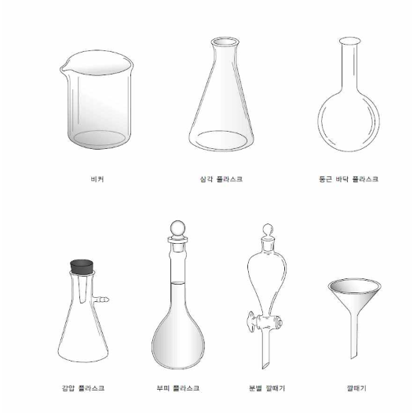
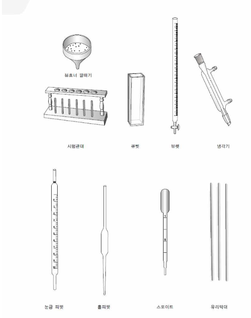
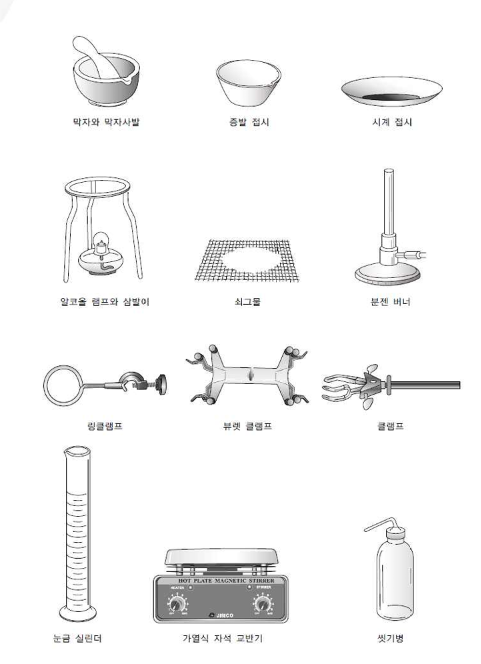

{.post-thumbnail}

## 실험 기구

## 실험 이론

### 1. 질량 측정(저울의 사용)

- 저울의 전원을 키고, 시약지를 올려 영점을 맞춘다.
- 약수저를 이용하여 시약지 위에 고체 시료를 옮겨 무게를 측정한다.
- 잉여 시약은 시약통에 다시 넣지 말고 폐 시약통에 버린다.

### 2. 부피 측정

- 눈금 피펫, 눈금 실린더, 부피 플라스크, 뷰렛 사용 가능
- 피펫, 눈금 실린더, 비커 순으로 정확도가 높음

