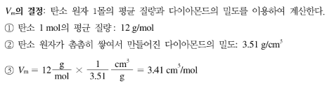
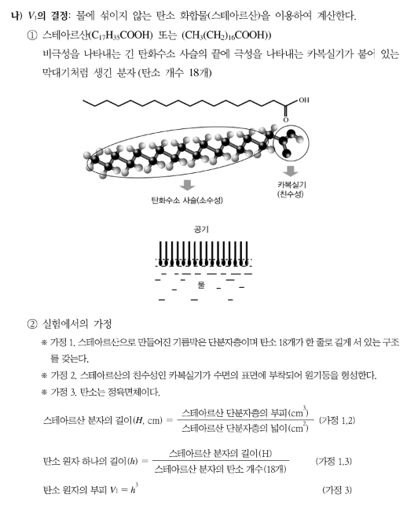

{.post-thumbnail}

## 실험 목적

물 위에 생기는 기름 막을 이용해서 몰을 정의하는 데 필요한 아보가드로수를 결정한다.

## 실험 이론

### 아보가드로수

- 물질의 양을 나타내는 단위
- 질량수가 12인 탄소 12g에 들어 있는 탄소 원자의 수($N_A = 6.022×10^{23}mol^{－1}$)를 말한다

### 아보가드로수 결정

- $N_A = \frac{V_m}{V_1}$
- $V_m$: 탄소 원자 1몰의 부피

- $V_1$: 탄소 원자 1개의 부피

