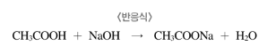
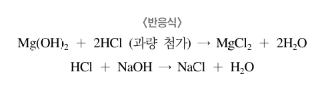

{.post-thumbnail}

## 실험 목적

산과 염기의 중화 반응을 이용하여 산이나 염기의 농도를 알아낸다.

## 실험 이론

### 적정법

- 분석물과 완전히 반응하는 데 필요한 표준 용액의 부피를 측정하는 방법
- 직접적정: 뷰렛을 사용하여 분석물이 표준 용액과 완전히 반응할 때까지 표준 용액[^1]을 분석물 용액에 가하는 과정
- 역적정: 과량의 표준 용액을 가한 후, 반응하고 남은 표준 용액을 또 다른 표준 적정 용액으로 적정하는 것
    - 분석물과 표준 용액 사이의 반응 속도가 느릴 때
    - 과량으로 넣어준 표준 용액과 분석물과의 반응을 완결시켜야 할 필요가 있을 때
    - 표준 용액이 불안정할 때
    - 역적정의 종말점[^2]이 직접 적정의 종말점보다 선명할 때

[^1]: 정확하게 농도가 알려진 용액으로, 적정 시 산·염기 중 하나는 정확한 농도여야 함
[^2]: 적정 과정 중 당량점[^3]의 신호가 나타나는 실험적인 지점
[^3]: 분석물과 표준 용액이 화학량적으로 반응하는 이론적인 지점

### 중화반응

- 중화 반응: 산과 염기가 반응하여 염과 물이 생성되는 반응
- 중화 반응의 알짜 반응: 수소 이온과 수산화 이온이 만나서 물이 생성되는 반응

### 페놀프탈레인 지시약

- 화학식은 $C_{20}H_{14}O_4$이며, pH 0 ∼ 8.3 에서는 무색을 띠며 pH 8.3 ∼ 10.0에서는 분홍색을, 그 이상에서는 붉은색을 띤다.

## 실험

### 식초(아세트산) 분석 - 직접 적정

### 제산제(수산화 마그네슘) 분석 - 역적정

