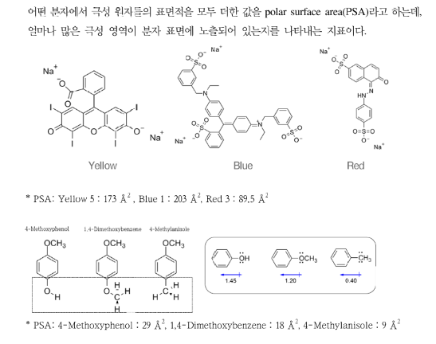
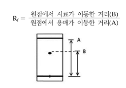

{.post-thumbnail}

## 실험 목적

크로마토그래피로 색소 및 혼합물을 분리하는 실험을 하고, 이를 통하여 크로마토그래피 작동 원리와 분자의 극성을 이해한다

## 실험 이론

### 크로마토그래피

- 혼합물이 용매(이동상)를 따라 이동할 때, 서로 다른 분자가 각기 다른 세기로 흡착제(정지상)와 상호 작용하고, 따라서 이동 속도에도 차이를 보이는 현상을 이용한 혼합물 분리 방법
- 정지상: 관 속에 또는 고체 판 위에 고정되어 있고 용해되지 않아 시료 성분을 머무르게 하는 성질을 가지고 있는 것(셀룰로스, 실리카젤)
- 이동상: 시료 성분을 이동시키는 용매

### 크로마토그래피의 종류

- 판 크로마토그래피
    - 판 크로마토그래피(PC, TLC)
    - 분리관 크로마토그래피(LC, GC, GPC)

### 종이 크로마토그래피(PC)

- 흡착제 거름 종이(셀룰로스 $C_6H_{10}O_5$): -OH 작용기를 많이 가지고 있어 무극성 용매일 경우, 극성 화합물과 강하게 상호 작용하여 낮은 Rf 값을 보임.

### 얇은막 크로마토그래피(TLC)

- 흡착제 실리카젤($SiO_2⋅H_2O$ ): 극성 작용기를 많이 가지고 있어 무극성 용매일 경우, 극성 화합물과 강하게 상호 작용하여 낮은 Rf 값을 보임.

### 크로파토그래피의 장점

1. 조작이 간단하고, 짧은 시간에 혼합물을 분리할 수 있다.
2. 시료의 양이 적어도 여러 가지 성분 물질들을 한번에 분리할 수 있다

