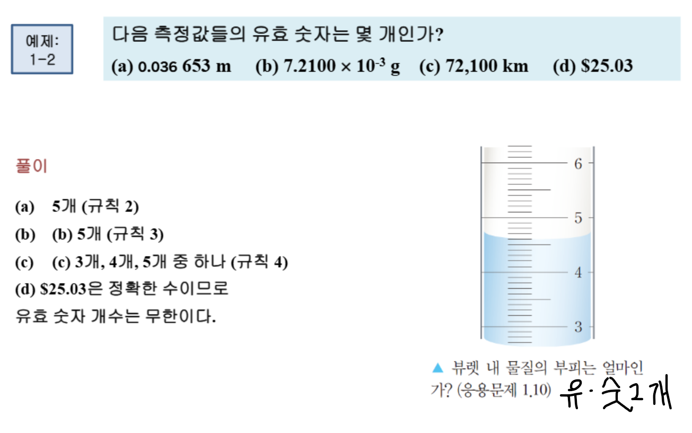
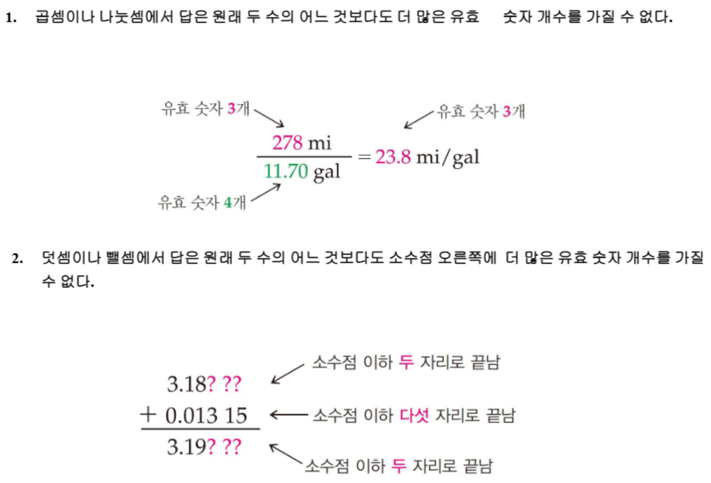

{.post-thumbnail}

- 과학적 방법
    1. 관찰
    1. 가설
    1. 실험
    4.
- SI 단위
- 과학적 표기법: 5.5 x 10^3
    - `1 mL = 1 cm^3`
- 유효숫자: 측정한 값
- 12p의 실린더 유효숫자 소숫점 2자리까지
- 유효숫자 계산에서 부족한건 0으로, 맨 마지막만 최소 유효숫자로 반올림

