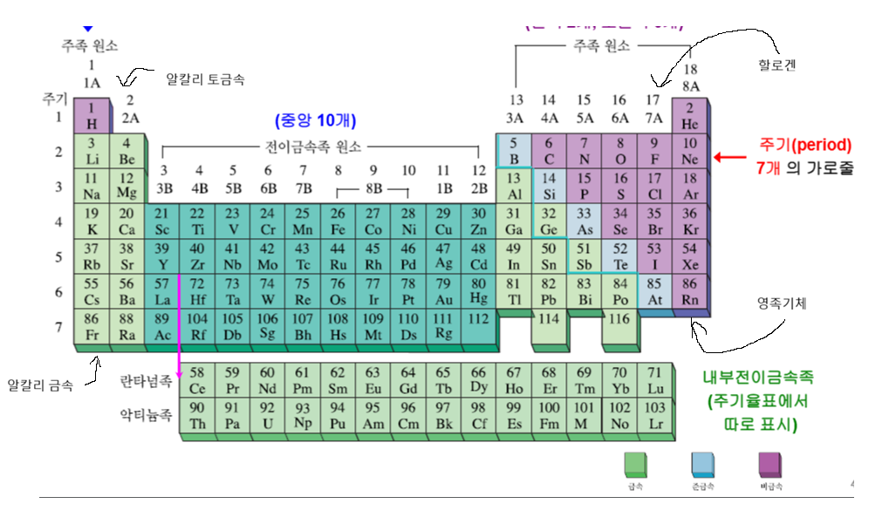
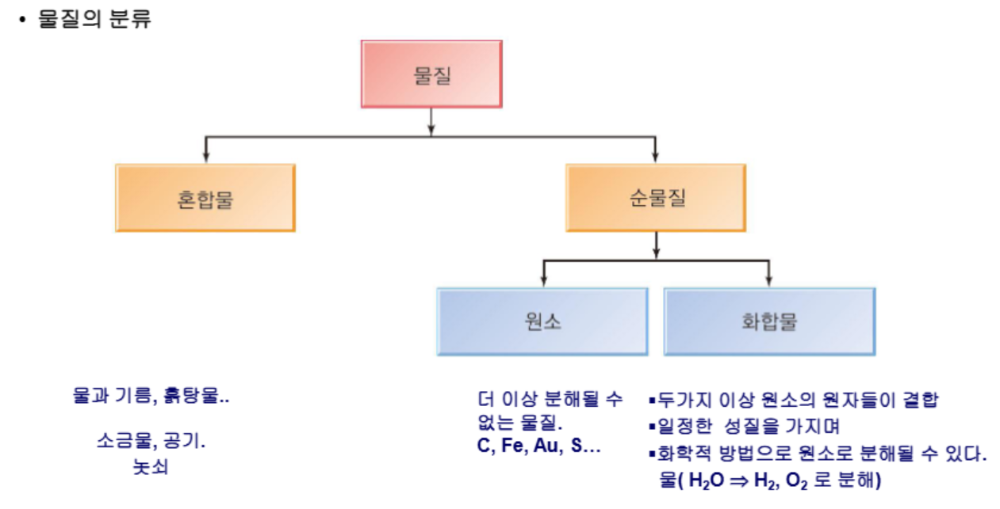
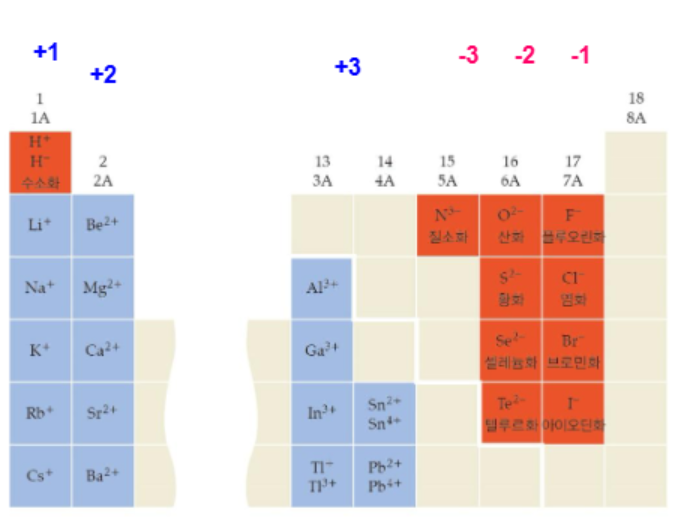
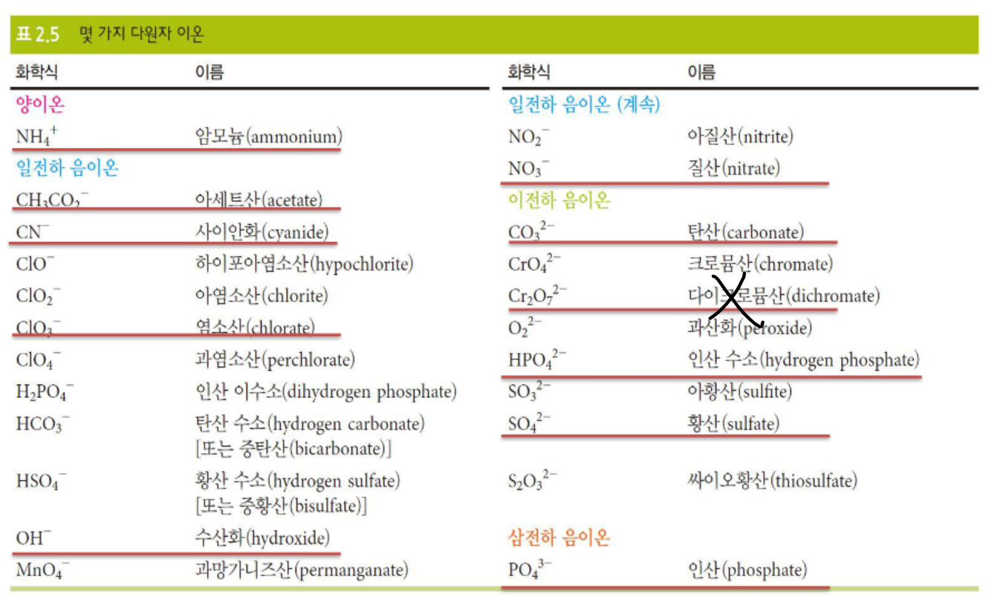

{.post-thumbnail}

## 화학과 원소

- `원소`: 화학적으로 변화시키거나 더 간단한 것으로 분해할 수 없는 기본적 물질
- 성질:
    - `크기 성질`: 길이, 부피, 질량, ...
    - `세기 성질`: 온도, 압력, 용해도, 밀도, ...
    - `물리적 성질`: 색, 냄새, 녹는점
    - `화학적 성질`: 다른 물질과의 반응성

- `알칼리 금속ㅎ`: 은빛 금속, 물과 빠르게 반응하여 다른 원소(기름)와 결합해서 존재
- `알칼리 토금속`: 광택이 있는 은빛 금속. 여전히 순수한 상태로 존재하지 않지만 알칼리 금속보다 덜 반응적
- `할로겐`: 색이 있고, 부식성인 비금속. 역시 다른 원소와 결합해서 존재
- `영족 기체`: 무색의 반응성이 매우 작은 기체.

- `금속`: 수은 제외 모두 실온에서 고체. `전도체`
- `준금속`: 실온에서 고체이지만 부서지기 쉽고 가공이 어려움. `반도체`
- `비금속`: 11가지가 기체, 1개(브로민) 액체, 5개 고체(탄소, 인, 황, 셀레늄, 아이오딘). 고체는 역시 가공이 어려우며, `낮은 전도성`

## 질량 보존 법칙

1. 보일: 원소를 더 이상 분해할 수 없는 물질로 정의
2. 라부아지에: `질량보존의 법칙을 발견`
    - 화학 반응에서 생성물의 총 질량은 반응물의 총 질량과 같다
    - `화학 반응에서 원자는 생성되거나 파괴되지 않는다`
3. 프루스트: `일정성분비 법칙`
    - 화합물은 항상 일정한 질량비로 구성되어 있다
4. 돌턴: `배수비례 법칙`
    - 두 원소가 여러 화합물을 형성할 때, 한 원소의 일정 질량에 대한 다른 원소의 질량비는 간단한 정수비로 표현된다
    - `원자론`:
        1. 원소는 원자라는 작은 입자로 구성되어 있다
        2. 같은 원소의 원자는 같은 질량을 갖지만, 다른 원소의 원자는 다른 질량을 갖는다
        3. 원자들이 일정한 정수비로 결합할 때 원소들의 화학적 조합은 다른 물질을 만든다. (일정성분비 법칙과 배수비례 법칙 설명)
        4. 화학반응은 원자들이 결합하는 방법을 다시 배열하는 것이다. 원자 자체는 생성되거나 파괴되지 않는다. (질량보존의 법칙 설명)
5. 톰슨: 원자에는 -전하를 띤 `전자`가 있다. (톰슨의 건포도 푸딩 모델)
6. 러더퍼드: 원자에는 양성자와 중성자로 구성되어 있는 `원자핵`이 있다.
    - 양성자 수와 같은 수의 전자가 핵의 주위를 돌고 있다.
    - 중성자는 양성자 질량과 거의 동일. 수는 양성자, 전자의 수와 직접 관련 없다.

- `동위 원소`: 양성자 수는 같지만 중성자 수가 다른 원자. 화학적 성질은 거의 동일하지만 질량이 다르다.

## 원자 질량

- 1u = $^{12}$C 원자 질량의 $1/12 = 1.66054 x 10^-24 g$
- 자연에 존재하는 동위원소들의 가중평균치로 결정됨

## 몰

- 1몰(아보가드로수): 정확히 12g의 순수한 $^{12}$C 원자에 들어있는 탄소 원자의 수 = 6.022 x 10^23 
- 몰질량(g/mol): u를 g으로 바꾼거

## 혼합물과 화합물

- `공유 결합`: `화학 결합`을 형성해 `분자`가 됨. 두 원자가 몇 개의 전자를 나눠 공유하면서 결합. 비금속 원자들 사이 존재
- `이온 결합`: 하나 이상의 전자가 한 원자에서 다른 원자로 완전히 이동하면서 형성되는 화학 결합. 금속(`전자를 줌, 양이온`)과 비금속(`받음, 음이온`) 원자들 사이 존재
    - `규칙적`이고 `결정된`구조로 배열됨

- 명명법: 뒤화(-소로 끝나는건 생략, 단일 원소인 경우만 화 붙음) 앞 원소
- 공유 결합의 경우 접두사 사용 (예: 이산화 탄소, 일산화 탄소)

