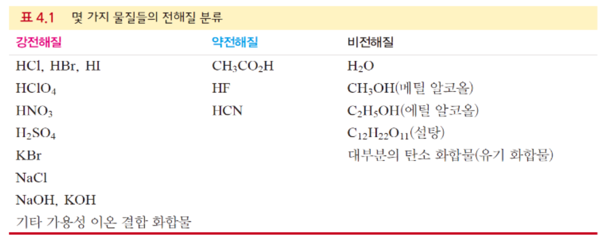
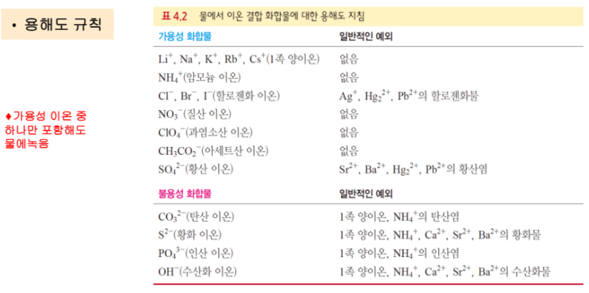
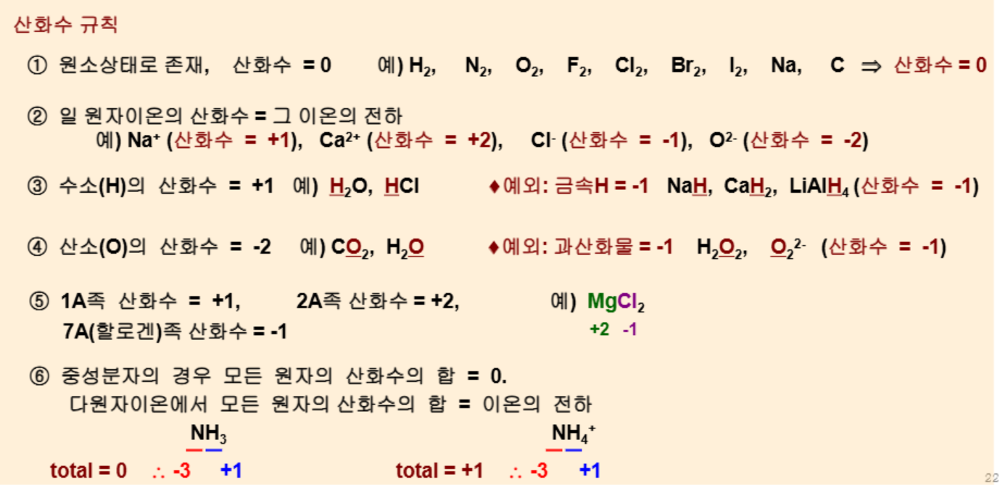

{.post-thumbnail}

## 용액의 농도: 몰농도

- 용질: 다른 물질에 녹아 들어가는 물질 
- 용매: 용질을 녹이는 물질
- 용액: 용질이 용매에 녹아 있는 균일한 혼합물
- 화학반응이 일어나려면 반응하는 분자나 이온이 서로 접촉해야 함
    - 대부분 화학반응이 고체상태보다 액체 또는 용액 상태에서 이루어진다.
- 용액 속에서 화학반응을 했을 때 반응물의 정확한 양은 몰농도로 표현
- $M = \frac{\text{mol}}{V}$
    - $M$: 몰농도 (mol/L)
    - mol: 용질의 몰 수
    - $V$: 용액의 부피 (L)
- $MV = \text{mol}$
- 전체 이온 농도 = 용액의 몰농도 × 해리된 이온의 수

## 용액의 희석

- 편의상 화학 물질은 진한 용액을 구매하여 저장하였다가 희삭해서 사용한다.
- 희석을 해도 용질의 양(mol)은 변하지 않는다.
- $M_1V_1 = M_2V_2$
    - $M_1$: 진한 용액의 몰농도
    - $V_1$: 진한 용액의 부피
    - $M_2$: 희석된 용액의 몰농도
    - $V_2$: 희석된 용액의 부피

## 수용액에서의 전해질

- 이온성 물질은 물에 녹으면 수화가 일어난다.
    - 물은 극성 분자이므로 물 분자의 산소 부분이 양이온을 둘러싸고, 수소 부분이 음이온을 둘러싼다.
    - 이 과정에서 용질 입자 사이의 인력을 끊고 물 속에 고르게 분산시킨다.
- 전해질: 물에 녹아서 이온으로 해리되어 전류를 흐르게 하는 물질
    - 전류가 흐르는 정도는 존재하는 이온수에 비례한다.
    - 강 전해질: 물에 녹였을 때 거의 대부분(70~100%) 이온으로 해리되는 화합물
    - 약 전해질: 물에 녹였을 때 일부(~5%)만 이온으로 해리되는 화합물
    - 비전해질: 물에 녹아도 이온으로 해리되지 않는 화합물
    - 해리가 되는 정도는 끊어내는 힘, 버티는 힘, 재결합 하는 힘의 균형에 의해 결정된다.

## 수용액에서 화학반응의 유형

1. 침전 반응: 반응 용액을 섞었을 때, 용액 속에서 녹지 않는 생성물이 생성되는 반응
2. 산-염기 중화반응: 산이 염기와 반응하여 물과 염을 생성하는 반응
3. 산화-환원 반응: 전자가 이동하는 반응

