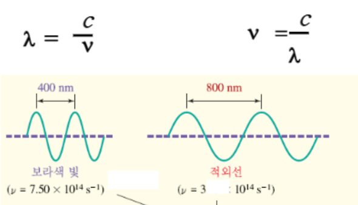
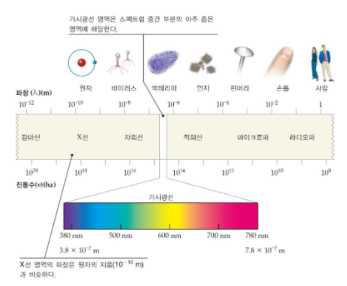
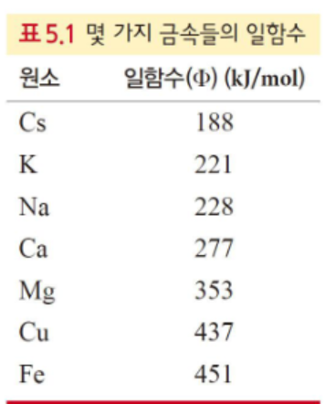
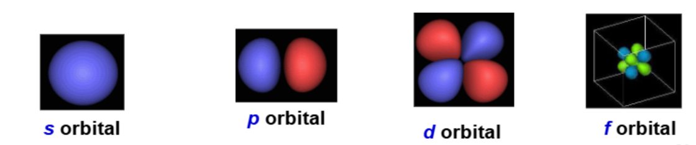
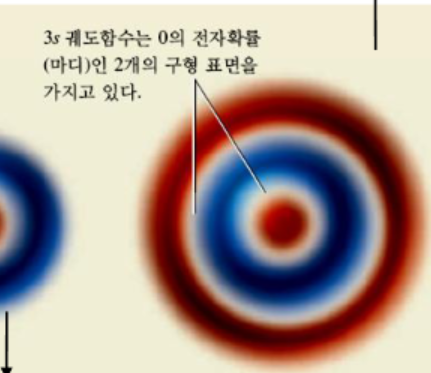
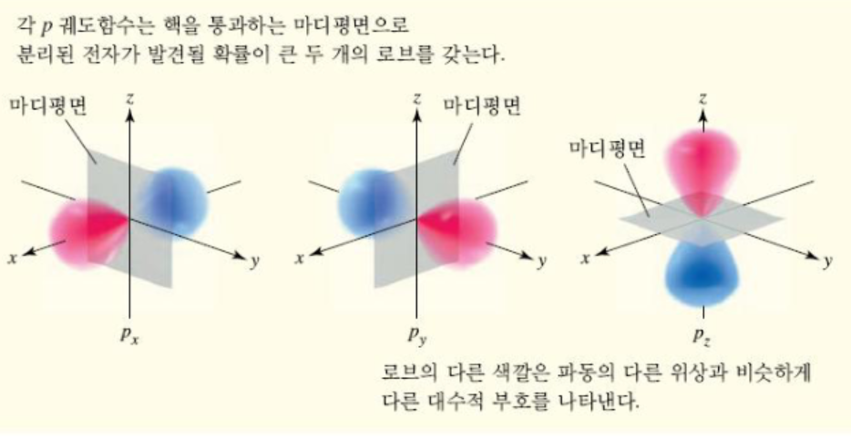
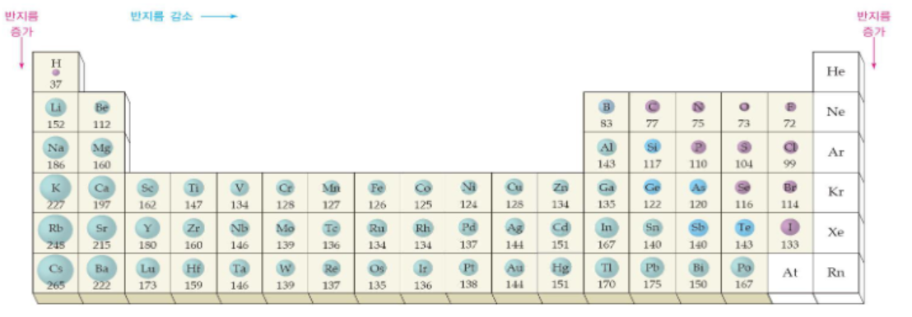

::: {.key-questions}
- 왜 원자 구조를 알아내는 데 **빛(복사 에너지)** 을 이용하는가?
- 원자가 **선 스펙트럼 (line spectrum)** 을 내놓는 이유는 무엇인가?
- 전자의 위치를 **4가지 양자수 (quantum numbers)** 로 어떻게 표현하는가?
- 다전자 원자에서 같은 껍질인데도 오비탈 에너지가 갈리는 이유는?
- 원자 반지름은 주기율표에서 어떻게 변하는가?
:::

> 시험 비중: 5장에서 약 10점. **전자배치(electron configuration)** 와 **원자 반지름 비교** 가 핵심이고, 5장 전자배치를 알아야 6·7장으로 갈 수 있다. 앞부분(양자 도입)은 흐름 위주로 이해.

## 1. 빛의 파동성과 전자기 스펙트럼

::: {.column-margin}
**파장 / 진동수**

$c = \lambda \nu$
:::

금속 원소를 태우면 원소마다 **고유한 불꽃 색**이 나온다(불꽃놀이의 원리). 이는 빛이 원자 구조의 단서를 준다는 뜻 → **분광학 (spectroscopy)** 의 출발점.

빛(전자기파, electromagnetic wave)은 **파동(wave)** 으로 전달된다.



- **파장 (wavelength) $\lambda$**: 마루에서 마루까지 거리. 가시광선은 약 380~780 nm.
- **진동수 (frequency) $\nu$**: 1초당 사이클 수(Hz).
- 관계식: $c = \lambda \nu$ ($c$ = 빛의 속도).

::: {.callout-tip title="PDF / 실험 연결"}
실험에서 사용한 UV(자외선)는 **254 nm** 로 가시광선(380~780 nm)보다 짧다. 유기물질이 UV를 흡수해 색을 띠므로 TLC 판 등에서 **눈에 보이게** 하는 데 쓴다 (실험 시험 포인트).


:::

## 2. 빛의 입자성: 광전 효과와 플랑크 가설

::: {.column-margin}
**광전 효과**

$E = h\nu = \dfrac{hc}{\lambda}$
:::

**광전 효과 (photoelectric effect)**: 금속판에 빛을 쪼이면 전자가 튀어나온다. 단, 빛의 진동수가 금속별 **일함수 (work function)** 에 해당하는 한계값 이상이어야 한다.



아인슈타인의 설명 — 파동성만으로는 안 되고 **빛의 입자성** 이 필요하다. 빛은 **광자 (photon)** 라는 작은 에너지 덩어리의 흐름.

**플랑크 가설**: $E = h\nu = \dfrac{hc}{\lambda}$ ($h$ = 플랑크 상수 $6.626\times10^{-34}\,\text{J·s}$)

- 에너지와 파장은 **반비례**: 파장이 짧으면(진동수 큼) 고에너지, 파장이 길면 저에너지.

::: {.callout-tip title="PDF 예제 5.3"}
리튬의 일함수 $\Phi = 283\,\text{kJ/mol}$ 일 때 전자 방출에 필요한 진동수: 

1. 광자 1개당 에너지($E$)로 환산
    - $Φ * (\frac{1\text{mol}}{6.022 \times 10^{23}})$ (J, KJ 단위 환산 주의)
2. $\nu = E/h$ 로 계산.
:::

## 3. 선 스펙트럼과 보어 원자 모형

::: {.column-margin}
**line spectrum**

에너지 준위 = 양자화
:::

- 백색광이 프리즘을 지나면 무지개색의 **연속 스펙트럼 (continuous spectrum)**.
- 그러나 수소 기체를 가열·방전시켜 나온 빛은 **선 스펙트럼 (line spectrum)** — 몇 개의 특정 파장만 나타남. 원소마다 달라 **"원자 지문"**(지문보다 확실한 홍채에 비유) 역할.

**보어 (Bohr) 모형**: 전자가 핵 주위의 특정 **에너지 준위(껍질, shell)** 를 돈다(태양계 비유). 에너지가 **양자화 (quantized)** 되어 있다.

- 원자에 에너지를 주면 전자가 낮은 준위 → 높은 준위로 **들뜬다(excited)**. 중간값은 불가, 정해진 준위로만 점프.
- 불안정한 들뜬 전자는 두 준위의 **에너지 차 $\Delta E = h\nu$** 를 빛으로 방출하며 내려온다 → 특정 파장만 방출 → 선 스펙트럼.

::: {.callout-note title="부연 설명 — 양자화의 직관"}
양자화는 "연속처럼 들리지만 실제로는 불연속" 인 개념. 비탈길을 굴러내리는 공(연속)과 달리, **계단을 단계별로 내려가는 공**에 비유된다. 피아노가 "양자화된 음"을 내는 악기 — 듣기엔 끊김 없이 들려도 연주자는 정해진 건반(불연속)만 누른다.
:::

```{mermaid}
graph LR
    G["바닥 상태<br/>(ground state)"] -->|"에너지 흡수"| E["들뜬 상태<br/>(excited state)"]
    E -->|"ΔE = hν 방출"| G
    E -.->|"n→1 라이만(자외선)"| UV
    E -.->|"n→2 발머(가시광선)"| VIS
    E -.->|"n→3 파셴(적외선)"| IR
```

**방출 스펙트럼 계열 (라이만 · 발머 · 파셴)**: 수소 전자가 **어느 준위로 떨어지느냐(도착 준위)** 에 따라 방출되는 빛의 파장이 갈리며, 이를 묶어 부르는 이름이다.

- **라이만(Lyman)** — 도착 $n=1$, **자외선(UV)**. 에너지 차 큼 → 파장 짧음
- **발머(Balmer)** — 도착 $n=2$, **가시광선(VIS)**. 눈에 보이는 수소 스펙트럼선
- **파셴(Paschen)** — 도착 $n=3$, **적외선(IR)**. 에너지 차 작음 → 파장 김
- 전자는 어느 준위로든 오르거나 내릴 수 있고, 도착 준위가 낮을수록 에너지 차가 커지고 파장은 짧아진다.

::: {.callout-note title="자주 헷갈리는 점"}
- **수소 전용**: 이 이름·공식(리드베리 식)은 전자가 1개인 수소(및 He⁺·Li²⁺ 같은 수소꼴 이온)에만 깔끔히 적용된다.
- **n=2, 3은 종착지가 아니라 중간 기착지**: 전자는 한 번에 $n=1$로 안 떨어져도 된다. 예) $n=4 \to n=2$(발머 방출) $\to n=1$(라이만 방출)처럼 계단식으로 내려오며 매 단계 빛을 낸다. "발머 계열"은 *이번 점프의 도착지가 $n=2$* 라는 뜻일 뿐.
- **출발점은 고정이 아님**: 올라간 높이는 흡수한 에너지로 정해지고(정해진 준위 중 하나), 떨어지는 경로도 확률적으로 여러 갈래다. 그래서 수많은 원자의 모든 점프가 합쳐져 여러 선이 한꺼번에 관찰된다.
:::

## 4. 물질파와 양자역학 모형

::: {.column-margin}
**de Broglie / 불확정성**

전자도 파동성을 가짐
:::

- **드브로이 (de Broglie) 물질파**: 빛이 물질처럼 행동한다면 물질도 빛처럼 **파동성**을 가진다. 질량이 큰 물체는 못 느끼지만, 질량이 극히 작은 **전자**는 파동으로 잘 설명된다(야구공도 미세하게 파동이나 감지 불가).
- **하이젠베르크 (Heisenberg) 불확정성 원리**: 전자의 **위치와 운동량을 동시에 정확히 아는 것은 불가능**하다. 즉 전자는 보어 모형처럼 궤도를 "도는" 게 아니다.
- **슈뢰딩거 (Schrödinger) 양자역학 모형(1926)**: 전자를 파동으로 보고 **파동방정식 (wave equation)** 을 세움.
  - 해(解) = **파동함수 / 궤도함수 (orbital) $\psi$**.
  - $\psi^2$ = 핵 주위 특정 공간에서 **전자를 발견할 확률**. 전자는 "도는" 게 아니라 어떤 공간에 **확률적으로 존재**한다.


## 5. 4가지 양자수 (Quantum Numbers)와 오비탈

::: {.column-margin}
**양자수 세트**

$(n, l, m_l, m_s)$
= 전자 1개 표현
:::

파동함수의 해는 4가지 양자수로 특징지어지며, **양자수 세트 $(n, l, m_l, m_s)$ 하나가 전자 1개**를 표현한다. (원자번호 50번 → 전자 50개 → 양자수 세트 50개)

| 양자수 | 의미 | 값 |
|---|---|---|
| 주양자수 $n$ | 껍질(shell), 크기·에너지 준위 | $1, 2, 3, \dots$ ($n$=1 K, 2 L, 3 M, 4 N…) |
| 각운동량 $l$ | 부껍질(subshell), 오비탈 **모양** | $0 \sim n-1$ |
| 자기양자수 $m_l$ | 공간 **방향(배향)** | $-l \sim +l$ ($2l+1$개) |
| 스핀양자수 $m_s$ | 전자 회전 방향 | $+\tfrac12(\uparrow),\ -\tfrac12(\downarrow)$ |



- **각 오비탈(공간 1개)에는 전자가 최대 2개** → s: 2개, p: 6개, d: 10개.
- $m_s$는 다른 세 양자수와 **독립적**. 한 오비탈에 전자 2개가 들어가면 반드시 **반대 스핀**($\uparrow\downarrow$) — 같은 방향이면 자기적으로 반발.

예) **4p** = $n=4,\ l=1,\ m_l \in \{-1,0,+1\}$ → 부껍질 속 오비탈 수 3개, 껍질 속 오비탈 수 (1 + 3)개, 전자 최대 6개.

::: {.callout-tip title="PDF 자료 연결 (5.7 오비탈 모양)"}





- s는 방향성 없는 구형(껍질이 커지면 구형마디 증가: 2s에 1개, 3s에 2개의 구형 마디).
- p는 핵을 지나는 마디 평면으로 갈린 아령형으로 $n=2$부터, d는 $n=3$부터 존재.
:::

## 6. 다전자 원자: 유효 핵전하와 에너지 준위

::: {.column-margin}
**유효 핵전하 $Z_{eff}$**

가림 효과로 갈리는
오비탈 에너지
:::

- **수소**: 같은 껍질의 모든 오비탈 에너지가 동일.
- **다전자 원자**: 같은 껍질이라도 s, p, d 에너지가 **갈리고**, 심지어 껍질을 넘나들며 교차한다 (예: **3d > 4s**).

원인은 **유효 핵전하 (effective nuclear charge, $Z_{eff}$)**. 바깥 전자는 안쪽 전자에 의해 핵전하가 **가려져(shielding)** 실제 $Z$보다 작은 전하를 느낀다.

- 비유: 교실에서 강사(핵, +50)가 보내는 전하를 앞줄(안쪽 전자)은 강하게, 뒷줄(바깥 전자)은 앞사람에 가려 약하게 느낀다.
- **2s는 구형이라 핵 근처 확률밀도(침투, penetration)가 커서 $Z_{eff}$가 큼** → 2p보다 안정(낮은 에너지).
- 안쪽 껍질에 있는 전자일수록 안정(낮은 에너지 상태)

::: {.callout-note title="부연 설명 — 왜 4s < 3d 인가"}
4s 오비탈은 핵 가까이 더 깊이 **침투(penetration)** 하여 안쪽 전자의 가림을 덜 받고 더 큰 $Z_{eff}$를 느낀다. 그래서 바닥 상태에서 4s가 3d보다 에너지가 낮아 먼저 채워진다. 단, 3d가 채워지기 시작하면 전자–전자 반발 등으로 순서 효과가 바뀌어 전이금속에서는 4s 전자가 먼저 이온화된다. 출처: [The Order of Filling 3d and 4s — Chemistry LibreTexts](https://chem.libretexts.org/Bookshelves/Physical_and_Theoretical_Chemistry_Textbook_Maps/Supplemental_Modules_(Physical_and_Theoretical_Chemistry)/Electronic_Structure_of_Atoms_and_Molecules/Electronic_Configurations/The_Order_of_Filling_3d_and_4s_Orbitals)
:::

## 7. 전자 배치 (Electron Configuration)

::: {.column-margin}
**세 가지 규칙**

쌓음 · 파울리 · 훈트
:::

세 규칙으로 전자를 채운다:

1. **쌓음 원리 (Aufbau)**: 낮은 에너지 오비탈부터. 순서:
   $$1s \to 2s \to 2p \to 3s \to 3p \to 4s \to 3d \to 4p \to 5s \to 4d \to \cdots$$
2. **파울리 배타 원리 (Pauli exclusion)**: 한 원자에서 두 전자가 4가지 양자수를 모두 같게 가질 수 없다 → 한 오비탈의 두 전자는 반드시 반대 스핀($\uparrow\downarrow$).
3. **훈트 규칙 (Hund's rule)**: 같은 에너지(축퇴, degenerate) 오비탈이 여러 개면, 먼저 **하나씩** 같은 스핀으로 채운 뒤 쌍을 이룬다.

::: {.callout-note title="부연 설명 — 훈트 규칙의 직관"}
지하철·버스 빈자리에 사람들이 붙어 앉지 않고 **하나씩 떨어져** 앉는 것과 같다. 전자 간 반발 때문에 따로 차지하는 편이 더 안정하다.
:::

- 표기법: $n$ + 오비탈 종류 + 전자 수(위 첨자). 예) $5d^3$ = 주양자수 5의 d 오비탈에 전자 3개.
- 예: $\text{Li}: 1s^2 2s^1$, $\text{O}: 1s^2 2s^2 2p^4$, $\text{Na}: 1s^2 2s^2 2p^6 3s^1$.
    - 약식 전자 배치: [He] 2s¹, [Ne] 3s¹ 처럼, 이전 주기까지의 전자배치를 괄호로 줄여 쓸 수 있다.
    - **원자가전자**: 가장 바깥 껍질의 전자. 예) O는 2s² 2p⁴ → 원자가전자 6개.
- **홀전자 (unpaired electron)** 가 하나라도 있으면 **상자기성 (paramagnetic, 자석에 끌림)**, 없으면 **반자기성 (diamagnetic)**. (예: F는 홀전자 1개 → 상자기성, Mg는 0개 → 반자기성)
- 전이금속(Cr, Cu 등)은 예외적 배치가 많다 — 외울 필요는 없고 예외가 있다는 것만 알면 됨.
- **주기 번호 = 채워지는 껍질 수**. → 20번까지 전자배치를 쓸 수 있어야 함.

## 8. 주기적 성질: 원자 반지름

::: {.column-margin}
**원자 반지름**

핵~최외각 전자 거리
:::

**원자 반지름 (atomic radius)**: 핵에서 가장 바깥 껍질 전자까지의 거리 (공유 결합에서는 핵간 거리의 $\tfrac12$).

- **족(세로, 위→아래)**: 내려갈수록 껍질 수가 늘어 반지름 **증가**.
- **주기(가로, 왼쪽→오른쪽)**: 껍질 수는 그대로지만 양성자·전자 수가 늘어 핵의 인력이 강해짐 → 반지름 **감소**. (예: H는 +1↔−1, Cl은 +17↔−17로 더 강하게 당겨 작아짐)



연습: Mg vs Ba(→ Ba가 큼), 같은 성질끼리 s, p, f 크기 비교 등은 **주기율표만 있으면** 판단 가능.

## 개념 연결

- **빛(양자화)→보어→양자역학** 의 역사 흐름이 결국 **4가지 양자수와 전자배치** 로 수렴한다. 앞부분은 전자배치를 위한 서론.
- **전자배치 → 주기적 성질(원자 반지름, 6·7장의 이온화 에너지·결합)** 로 직결. 5장 전자배치가 이후 단원의 토대.
- **유효 핵전하** 개념은 원자 반지름의 주기 경향(왼→오 감소)과 오비탈 에너지 순서(4s<3d)를 모두 설명하는 공통 열쇠.

::: {.lecture-summary}
- 빛은 **파동성**(광전 효과 전까지)과 **입자성**(광자, $E=h\nu$)을 모두 가지며, 원자 구조 탐구의 도구다.
- 원자의 에너지 준위는 **양자화**되어 있어, 들뜬 전자가 $\Delta E=h\nu$를 방출하며 **선 스펙트럼**을 만든다(원자 지문).
- 슈뢰딩거 모형에서 전자는 확률적으로 존재($\psi^2$)하며, **4가지 양자수 $(n,l,m_l,m_s)$ 세트 하나가 전자 1개**를 나타낸다.
- 다전자 원자의 오비탈 에너지는 **유효 핵전하($Z_{eff}$)와 침투**로 갈리며(4s<3d), 전자배치는 **쌓음·파울리·훈트** 규칙으로 채운다.
- 홀전자 유무로 **상자기성/반자기성**이 갈리고, 원자 반지름은 **족 아래로 증가·주기 오른쪽으로 감소**한다.
:::
