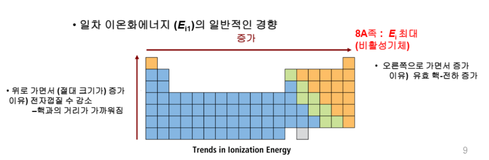

::: {.key-questions}
- 원자는 왜 이온이 되려 하는가? — **안정한 상태(옥텟)** 와의 관계
- **이온 반지름**은 중성 원자와 비교해 어떻게 달라지는가?
- **이온화 에너지(Ei)** 의 주기적 경향과 **예외**는 왜 생기는가?
- **고차 이온화 에너지**의 급증을 보고 그 원소가 몇 족인지 어떻게 아는가?
- 이온 결합 화합물의 생성 에너지를 **5단계(Born–Haber)** 로 어떻게 계산하는가?
- **격자 에너지**는 무엇으로 결정되는가?
:::

> 시험 비중: 교수님이 직접 점수를 못박은 지점이 많다. **이온화 에너지 비교/예외**(2~3점), **고차 이온화 에너지로 족 판별**, **Born–Haber 5단계 에너지 계산(10점)**, **격자 에너지 비교**(2~3점). 5장 전자배치를 알아야 6장 전체가 풀린다.

## 0. 들머리 — 산·염기 복습 (이전 강의 마무리)

본격적인 6장 전에 산도 측정을 짧게 정리했다.

- **pH**: 용액 속 수소 이온 농도에 음의 로그를 취한 값. $\text{pH} = -\log[\text{H}^+]$. 1~14 범위에서 7 미만이면 산성, 7 초과면 염기성.
- 산도 측정 방법: pH 종이, 천연 지시약(양배추), **pH 미터기**. 정확도는 pH 미터기가 가장 높고, 산의 세기(강·약)까지 정량적으로 구분 가능.
- **아레니우스 산(Arrhenius acid)** 정의: 화합물 형태로 모아서 **수소 이온($\text{H}^+$)을 내놓을 수 있으면 산**.

## 1. 이온의 전자 배치 (6.1)

::: {.column-margin}
**옥텟 규칙**

양이온·음이온 모두 가장 가까운 **비활성 기체** 전자배치(원자가 8개)를 향한다.
:::

5장에서 전자배치를 익혔으니, 6장은 그 전자들이 **빠지거나 들어와** 이온이 되고 이온 화합물을 이루는 과정이다.

- **금속(1A·2A족)**: 최외각 전자를 **잃어** 양이온. 예) $\text{Na}: [\text{Ne}]3s^1 \xrightarrow{-1e^-} \text{Na}^+ : [\text{Ne}]$, $\text{Mg} \xrightarrow{-2e^-} \text{Mg}^{2+} : [\text{Ne}]$
- **비금속(6A·7A족)**: 전자를 **얻어** 음이온. 예) $\text{O} \xrightarrow{+2e^-} \text{O}^{2-}:[\text{Ne}]$, $\text{F} \xrightarrow{+1e^-} \text{F}^- : [\text{Ne}]$
- 핵심 동기: **모든 것은 안정한 상태를 원한다.** 단독 원자보다 결합한 화합물이, 불안정한 전자배치보다 옥텟이 더 안정하다.

::: {.callout-note title="전이금속의 예외"}
전이금속은 채워질 때 $4s$ 가 $3d$ 보다 먼저 채워지지만, **빠져나갈 때는 에너지 준위가 가장 높은 $4s$ 전자가 먼저** 제거된다.
$\text{Fe}:[\text{Ar}]4s^2 3d^6 \xrightarrow{-2e^-} \text{Fe}^{2+}:[\text{Ar}]3d^6$,
$\xrightarrow{-3e^-} \text{Fe}^{3+}:[\text{Ar}]3d^5$.
교수님: "전이금속은 예외가 많다는 것만 기억하라."
:::

::: {.callout-tip title="PDF 자료 연결 (예제 6.1)"}
바닥 상태 이온 전자배치 예측: $\text{Se}^{2-}$, $\text{Cs}^+$, $\text{Cr}^{3+}$. 교재 예제 A번에 **$4s$ 다음 $3d^{10}$ 누락 오타**가 있으니 직접 채워 확인할 것.
:::

### 등전자 (isoelectronic)

서로 다른 원자·이온이 **전자 수가 똑같아진** 상태. 예) $\text{K}^+(19)$, $\text{Ca}^{2+}(20)$, $\text{Cl}^-(17)$ 은 모두 전자 18개로 등전자 → 비교가 쉬워진다(아래 반지름 참고).

## 2. 이온 반지름 (6.2)

::: {.column-margin}
**반지름 정리**

양이온 → 작아짐
음이온 → 커짐
등전자 → 핵전하 ↑ 일수록 작아짐
:::

- **양이온**: 중성 원자보다 **반지름 감소**. ① 바깥 껍질 전자가 통째로 제거되고 ② 유효 핵전하가 증가하기 때문. 1A·2A족에서 특히 크게 줄어든다.
- **음이온**: 중성 원자보다 **반지름 증가**. 유효 핵전하 감소 + 전자 간 반발 증가. 예) $\text{Cl}\ 99\,\text{pm} \rightarrow \text{Cl}^-\ 184\,\text{pm}$.
- **등전자 비교**: 전자 수가 같으므로 **양성자(원자 번호)가 많을수록 더 강하게 당겨 반지름 감소**. 예) 등전자 18개에서 $\text{Ca}^{2+} < \text{K}^+ < \text{Cl}^-$.

::: {.callout-tip title="PDF 자료 연결 (예제 6.2)"}
더 큰 쪽 고르기: (a) $\text{S}$ vs $\text{S}^{2-}$ → $\text{S}^{2-}$, (b) $\text{Cl}^-$ vs $\text{I}^-$ → $\text{I}^-$, (c) $\text{Ni}$ vs $\text{Ni}^{2+}$ → $\text{Ni}$.
:::

## 3. 이온화 에너지 (6.3)

::: {.column-margin}
**$E_i$ ∝ 1/반지름**

크기 작을수록
떼기 어렵다 → $E_i$ ↑
:::

**이온화 에너지(ionization energy, $E_i$)**: 기체 상태 원자에서 전자 하나를 떼어 +1가 양이온으로 만드는 데 필요한 에너지. 떼어내는 데 에너지를 **줘야** 하므로 항상 **양(+)의 값**.

**경향성** — 원자 반지름과 **반비례**:



- 족에서 **아래로** ↓: 반지름 ↑ → $E_i$ **감소**
- 주기에서 **오른쪽으로** →: 반지름 ↓ → $E_i$ **증가**
- 비교는 기본적으로 **크기(반지름)로** 한다.

```{mermaid}
graph LR
    A[원자 반지름 작다] --> B[전자가 핵에 강하게 묶임]
    B --> C[떼어내기 어렵다]
    C --> D[이온화 에너지 크다]
```

### 예외 — 전자배치로 판단 {#sec-ie-exception}

경향만 따르면 안 되는 두 지점이 있다. **반드시 시험에 나온다.**

- **2A족(Be) > 3A족(B)**: $\text{B}$ 가 더 작아 $E_i$ 가 커야 할 것 같지만, $\text{Be}(2s^2)$ 는 $s$ 오비탈이 꽉 차 안정 → $\text{B}(2s^2 2p^1)$ 의 $2p$ 전자 하나가 오히려 떼기 쉬워 **B에서 감소**.
- **5A족(N) > 6A족(O)**: $\text{N}(2p^3)$ 은 각 오비탈에 1개씩 들어찬 반쯤 찬 안정 상태. $\text{O}(2p^4)$ 는 짝지은 전자의 반발 때문에 하나를 떼기 쉬워 **O에서 감소**.
- 같은 패턴이 3주기(Mg–Al, P–S)에서도 $3p$ 에서 반복된다.

### 고차 이온화 에너지 (6.4)

전자를 1개, 2개, 3개… 순차적으로 떼는 에너지를 $E_{i1}, E_{i2}, E_{i3}, \dots$ 로 표기. 안쪽 전자일수록 떼기 어려워 점점 커진다.

- **껍질이 바뀌는 순간 값이 급증**한다. 예) $\text{Na}$ 는 $E_{i1}\approx 450$, $E_{i2}\approx 4500$ — 1차는 최외각 1개($3s^1$)라 쉽지만, 2차는 안쪽 껍질($[\text{Ne}]$)을 깨야 하므로 급증.
- **활용**: 급증이 **몇 번째에서** 일어나는지를 보면 원자가 전자 수 = **족**을 알 수 있다. 두 번 떼고 세 번째에서 급증 → 원자가 전자 2개 → **2족 원소**.

::: {.callout-note title="고차 $E_i$ 비교 예"}
$\text{C}$(14족, 원자가 4)와 $\text{N}$(15족, 원자가 5)의 5차 이온화 에너지 비교 — $\text{N}$ 은 5개까지는 원자가 전자라 상대적으로 덜 들지만, $\text{C}$ 는 5번째에서 안쪽 껍질을 깨야 하므로 **$E_{i5}(\text{C}) > E_{i5}(\text{N})$**.
:::

## 4. 전자 친화도 (6.5)

**전자 친화도(electron affinity, $E_{ea}$)**: 기체 원자가 전자를 **얻어** 음이온이 될 때의 에너지. 전자가 들어오며 에너지 준위가 낮아져(안정화) 에너지를 **방출**하므로 보통 **음(−)의 값**.

- 주기율표에서 **비금속 쪽(오른쪽 위)으로 갈수록** 음이온이 잘 되어 값이 크다(절댓값). **17족(F, Cl, Br)** 이 가장 잘 된다.
- **18족(He, Ne) 등 꽉 찬 배치**는 전자를 받을 이유가 없어 거의 일어나지 않는다.

## 5. 팔전자 규칙과 이온 결합 형성 (6.6–6.7)

**금속 + 비금속 → 이온 결합 화합물.** 금속이 전자를 내주고 비금속이 받아, **양이온–음이온 사이의 정전기적 인력**으로 결합한다. 둘 다 옥텟을 만족해 안정해진다.

- 생성물은 $\text{NaCl}$ 처럼 **규칙적으로 배열된 결정형 고체(이온성 고체)**.

::: {.callout-note title="$E_i$ 종합 비교 예제 (강의 중 풀이)"}
$\text{Li}, \text{K}, \text{Ba}$ 중 **1차 $E_i$ 가 가장 작은 것** = 반지름이 가장 큰 것. 단, $\text{Li}\cdot\text{K}$ 는 1족, $\text{Ba}$ 는 2족이라 함정. 1족이 같은 주기에서 가장 작은 $E_i$ → **$\text{K}$ 가 가장 작고, $\text{Li}$ 가 가장 크다**(사이즈 가장 작음).
:::

## 6. Born–Haber 순환 — 생성 에너지 5단계 (6.7) {#sec-born-haber}

$\text{NaCl}$ 은 고체 Na와 염소 기체를 섞으면 금방 생기지만, **생성 엔탈피를 계산**하려면 다음 5단계 **반응 메커니즘**으로 쪼개 각 단계 에너지를 더한다(헤스의 법칙).

```{mermaid}
graph TD
    A["Na(s)"] -->|"① 승화열 +107.3"| B["Na(g)"]
    B -->|"② 이온화 에너지 Ei"| C["Na+(g)"]
    D["½ Cl₂(g)"] -->|"③ 결합 해리 에너지 ½·244"| E["Cl(g)"]
    E -->|"④ 전자 친화도 Eea"| F["Cl⁻(g)"]
    C --> G["NaCl(s)"]
    F --> G
    G -.->|"⑤ 격자 에너지의 역"| G
```

1. **승화(sublimation)**: $\text{Na(s)} \rightarrow \text{Na(g)}$, 승화열 $+107.3\ \text{kJ/mol}$
2. **이온화**: $\text{Na(g)} \rightarrow \text{Na}^+(g) + e^-$, $E_i$
3. **결합 해리**: $\tfrac{1}{2}\text{Cl}_2(g) \rightarrow \text{Cl}(g)$, 결합 에너지 $244\ \text{kJ/mol}$ 의 **½**
4. **전자 친화도**: $\text{Cl}(g) + e^- \rightarrow \text{Cl}^-(g)$, $E_{ea}$
5. **격자 형성**: $\text{Na}^+(g) + \text{Cl}^-(g) \rightarrow \text{NaCl(s)}$

::: {.callout-important title="계산 시 핵심 (10점)"}
- 모든 에너지 항은 **크기 성질(extensive property)** → 어떤 식에 **½(또는 ×2)을 곱하면 그 항의 에너지도 똑같이 ½(×2)** 해야 한다. 예) $\text{Cl}_2$ 결합 에너지 244에 ½ → $122\ \text{kJ/mol}$.
- 식들을 더할 때 **상태(s, g)가 같아야** 소거된다. 다르면 못 지운다.
- 5단계를 모두 더하면 중간 항이 소거되고 전체 반응 $\text{Na(s)} + \tfrac12\text{Cl}_2(g) \rightarrow \text{NaCl(s)}$ 의 에너지 변화가 남는다 → **헤스의 법칙**. (KF 등으로 직접 계산 연습)
:::

## 7. 격자 에너지 (6.8)

**격자 에너지(lattice energy)**: 기체 상태 양이온·음이온이 모여 이온성 고체가 될 때(또는 그 역으로 고체를 기체 이온으로 쪼갤 때) 관여하는 에너지. 쪼개는 방향으로 정의하면 **양(+)의 값**.

쿨롱 법칙 형태의 의존성:

$$ U \propto \frac{Z_1 Z_2}{r^2} $$

- **전하량($Z$)이 클수록** 격자 에너지 ↑. 예) $\text{Li}^+\text{F}^-(+1,-1)$ 보다 $\text{Li}_2\text{O}(+1,-2)$ 가 훨씬 큼.
- **이온 간 거리($r$)가 작을수록** ↑. 같은 양이온이면 음이온이 작을수록 큼: $\text{LiF} > \text{LiCl} > \text{LiBr} > \text{LiI}$.

::: {.callout-important title="안정도 비교 (2~3점)"}
이온 화합물의 안정도는 **격자 에너지가 큰 쪽이 더 안정**. 예) $\text{NaCl}$ vs $\text{CsI}$ (둘 다 +1/−1) → 이온이 더 **작은 $\text{NaCl}$ 의 격자 에너지가 더 크다** → 더 안정.
:::

## 개념 연결

- **5장 → 6장**: 5장의 전자배치·원자 반지름 경향이 6장 이온 반지름·이온화 에너지의 토대. 반지름이 작을수록 $E_i$ 가 크다는 반비례가 핵심 연결고리.
- **정전기적 인력 ↔ 격자 에너지**: 같은 현상의 양방향. 화합물 생성(정전기적 인력) ↔ 고체를 기체 이온으로 분해(격자 에너지), 부호만 반대.
- **6장 → 7장**: 6장은 금속+비금속의 **이온 결합**. 다음 7장은 비금속끼리의 **공유 결합과 분자 구조**(점 찍기, 루이스 구조)로 이어진다.

::: {.lecture-summary}
- 이온화의 동기는 **안정한 옥텟**. 금속은 잃고(양이온), 비금속은 얻는다(음이온).
- 양이온은 작아지고 음이온은 커진다. 등전자는 **핵전하 클수록 작다**.
- **이온화 에너지 ∝ 1/반지름**. 단, Be–B, N–O(및 3주기 대응)의 **예외는 전자배치로** 판단.
- **고차 $E_i$ 의 급증 위치 = 족 수** 판별의 열쇠.
- **Born–Haber 5단계 + 헤스의 법칙**으로 생성 엔탈피 계산(10점). 에너지는 크기 성질이라 계수에 비례.
- **격자 에너지 ∝ $Z_1Z_2/r^2$**. 클수록 안정. 전하 크고 이온 작을수록 크다.
:::
