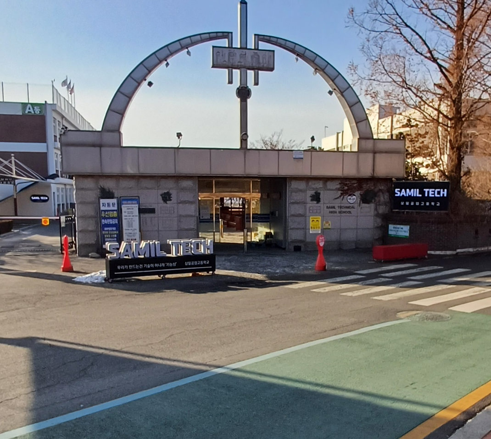

{width="70%" fig-align="center"}

## 서론

정보처리기사 필기 시험을 보고 왔습니다.
수원 삼일 공고에서 시험을 봤는데 고등학교가 시설이 이렇게 좋을 수가 있구나 라는 생각이 들었다가 변기가 푸세식인걸 보고 기묘한 느낌이 들었습니다.
오전 9시로 기사 시험 중 제일 빠른 시간으로 예약해서 왔는데 시험 전 날 출근 시간이었다는 점이 생각나서 아차 싶었지만 수원 방향으로 가는 버스는 사람이 별로 없었습니다.
어쩌면 20살의 김형훈이 경기권 대학을 다니는 선택을 했다면 죽음의 출근열차를 경험하지 않았을지도 모르겠다는 생각이 들었습니다.

## 공부

참고서를 한 권 사서 2주 정도 공부했습니다.
보통 기출문제만 풀고 시험을 보는 경우가 많은 것 같은데, 저는 NCS도 대비할 겸 꼼꼼하게 공부하는게 좋다고 판단했습니다.
근데 생각보다 당연한 내용들이 많아서 굳이 이렇게 공부할 필요는 없었던것 같습니다.

그리고 오늘 시험을 보니 확실히 기출문제 그대로 나오는 경향이 있는 것 같아서 빠르게 취득하는게 목표라면 개념 공부는 생략해도 괜찮을 것 같습니다.
참고로 필기 결과는 당일 바로 나옵니다. 저는 무난하게 합격했습니다.

## 결론

방학동안 참 많이 늘어지는 것 같습니다. 정보처리기사 자격증 시험이 저를 각성시켜주는 계기가 될줄 알았는데 so easy 했네요.
뉴런의 30%도 활성화되지 않은 기분입니다.
시험날 가장 큰 고난은 시험 문제도 아니고 수원의 살인적인 칼바람 뿐이었던것 같습니다.
실기는 합격률이 꽤 낮다고 하던데 저를 성장시켜주는 시련이 되어줄 수 있을까요?
근데 왜 후기글을 이렇게 건방지게 쓰고 있는거죠? 하하 필기 시험이 제 자존감은 채워줬군요!
어쨌든 저는 실기 준비로 돌아오겠습니다.
