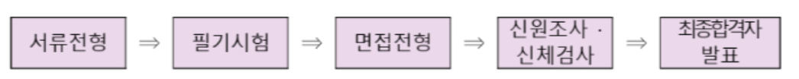
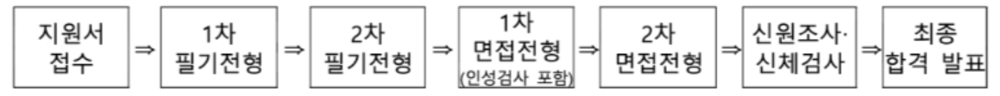
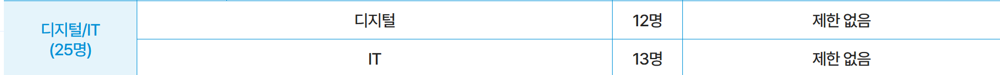
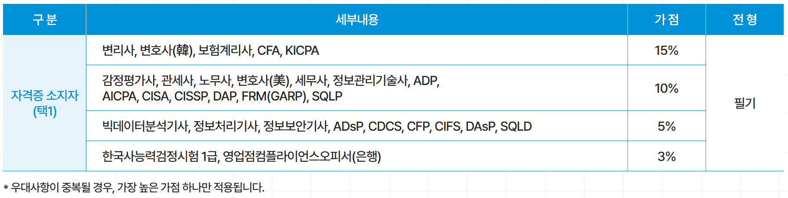
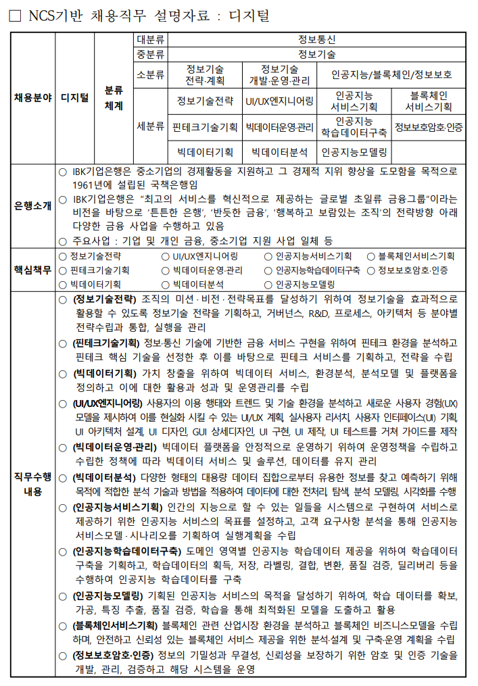
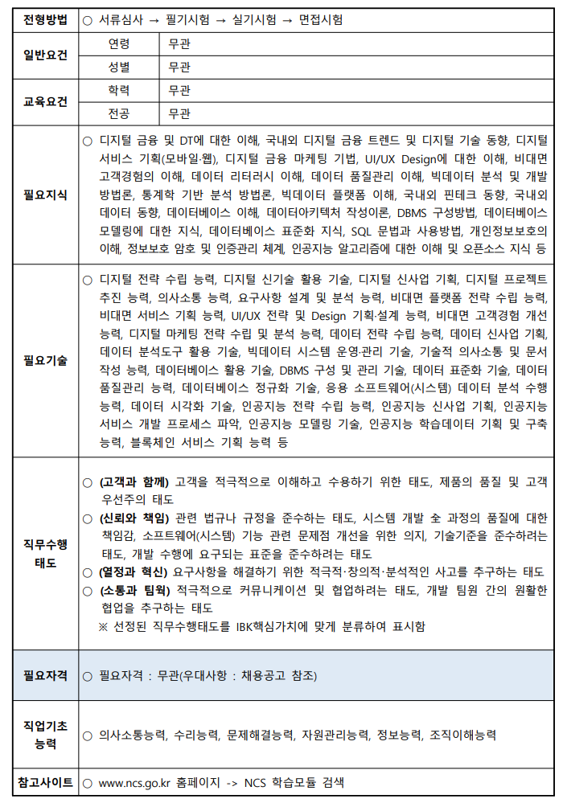
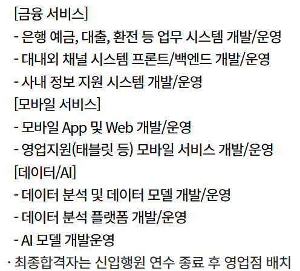
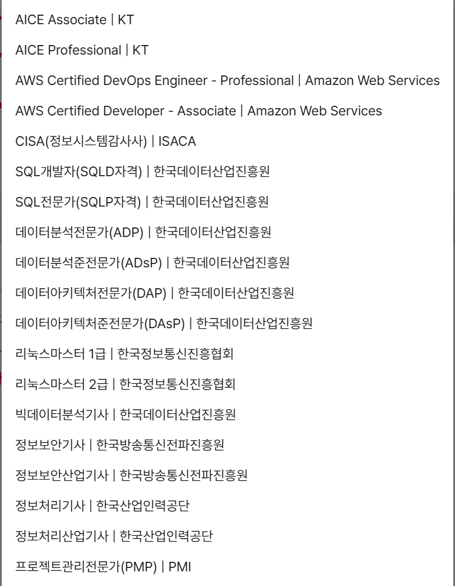
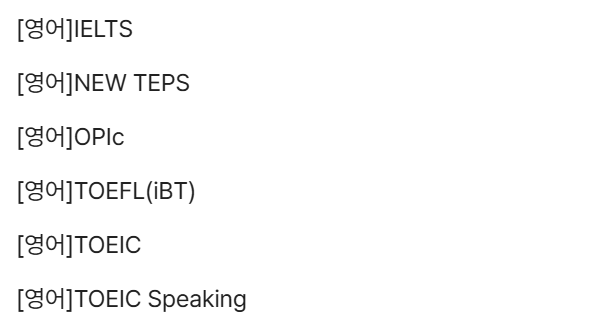
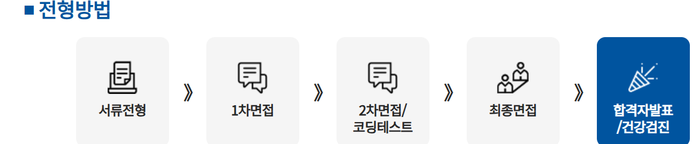

{.post-thumbnail}

## 한국은행

- 채용 인원: 컴퓨터공학 15명 이내
- 어학 성적 우대: `TOEIC`, TOEFL(iBT), TEPS 중
- 필기 출제: 
    - 전공 학술: 소프트웨어공학, 데이터베이스, 컴퓨터구조, 데이터통신, 정보보호, 운영체제, 자료구조, 인공지능, 기계학습
    - 논술: 주요 경제 / 금융 이슈, 인문학 등
    - [기출](https://apply.bok.or.kr/board/recruitLibraryList.do)
- 면접 전형:
    - 1차 실무 면접: 집단 토론, 심층 면접
    - 2차 집행 간부 면접

## 한국 투자증권

### 자기소개서 문항

1. 성장과정:가족사항, 학창시절, 교우관계, 생활습관, 자신에게 크게 영향을 미친 사건 등을 포함하여 구체적으로 작성 (최대 500자)
2. 실패 혹은 좌절을 극복한 사례와 이를 통해 얻은 교훈은? (최대 300자)
3. 증권업을 선택하게된 이유와 증권사 중 당사를 선택한 이유 (최대 300자)
4. 지원한 분야는 어떤 일을 한다고 생각하는가? (최대 200자)
5. 지원분야에 본인이 적합한 이유를 증명하시오. (최대 500자)
6. 당신의 인생계획(Life Plan)에서 꿈은 무엇이고, 그 꿈을 이루기 위해 회사가 어떻게 도움을 줄 수 있는지 서술하시오. (최대 500자)

## 금융 감독원

- 채용 인원: IT 7명

- 어학 성적 우대: `TOEIC 730`, TOEFL(iBT) 79, TEPS 368 만점
- 1차 필기 시험: `NCS 직업 기초 시험`
- 2차 필기 시험
    - 전공 시험
    - 논술
- 1차 면접 전형
    - 실무진, 외부위원 개별 면접, 집단 토론
- 2차 면접 전형
    - 임원, 외부위원 개별 면접

## IBK 기업은행

- ADP를 꼭 따자
- 산업공학 석사 우대
- `금융권 공동채용 박람회 우수면접자` 우대

- 필기 시험
    - 직업 기초(객관식 40문항): 의사소통, 문제 해결, 자원관리, 조직 이해, 수리, 정보
    - 직무 수행(객관식 30문항, 주관식 5문항): `데이터베이스`, `데이터분석`, `인공지능 모델링`, `블록체인`, `시사` 등
- 실기 시험
    - 실기시험 전, AI역량검사 및 인성검사(온라인) 실시 예정
    - (공통) 개인발표, 토론, 인터뷰
    - (디지털, IT) `코딩테스트`
- 면접 시험
    - 多대多 질의응답을 통해 인성, 윤리의식, 직무·조직적합도 등의 평가항목을 기준으로 종합평가(평가위원 점수합계)

### 자기소개 문항

1. IBK와 미래를 함께해 나갈 지원자님을 환영합니다! 다양한 회사들 중에서 IBK를 선택하신 이유가 궁금한데요, 지원동기에 대해 편안하게 이야기해 주세요. (1500자 이내)
2. 지원자님의 여러 장점 중 “팀웍”에 대해 듣고 싶어요. 최선의 결과를 이끌어내기 위해 팀원으로서 했던 역할에 대해 구체적인 경험을 들어 말씀해 주세요. (1500자 이내)
3. 지원자님이 생각하는 본인의 단점에 대해 알고 싶어요. 그리고 그것을 극복하기 위해 기울이셨던 노력에 대해서도 자유롭게 전달해 주세요. (1500자 이내)
4. 은행원이라는 직업이 지원자님께 왜 어울리는지 궁금합니다. 지원자님만이 갖고 있는 차별화된 스토리를 저희에게 들려 주세요. (1500자 이내)

## 우리 은행

- 신입 행원 연수: 약 1년 이내 영업점 근무 후, 유관 부서 및 본부 부서 배치. 인력 운영 및 업무상 필요에 따라 변동될 수 있음
    - (이거 잘못하면 내 커리어 개같이 멸망할 수도 있겠는데)
- TECH 직무 관련 전공 우대 (구체적으로 무슨 전공인지 모르겠음)
- `2025 금융권 공동채용 박람회 우수면접자` 우대

- 서류 전형: 입행 지원서 심사 및 AI 역량검사
    - AI 역량검사: 자기보고, 전략게임, 영상 면접
- 1차 면접: 기본 역량 면접
- 2차 면접:
    - 인사이트 면접(PT, `포트폴리오`), 참여형 팀워크 프로그램, 직무 / 인성 면접
    - 코딩테스트: `알고리즘` 및 `SQL`
- 최종 면접: 심화 역량 면접 (blind 면접. 그럼 어떻게 본다는거지?)

### 자기소개 문항

1. 우리은행 및 해당 부문에 지원한 동기와 입행 후 이루고 싶은 목표를 구체적으로 서술해 주세요. (800자 이내)
2. 본인 성격 중 은행원 업무와 가장 맞지 않는 부분이 무엇이라고 생각하며, 그 이유를 구체적으로 설명해 주세요. (800자 이내)
3. 과거에 했던 선택이나 행동 중, 후회하는 사례를 구체적으로 작성해 주세요.(800자 이내)
4. 본인이 IT 직무에서 다른 지원자와 차별화된 경쟁력을 갖추었다고 생각하는 부분을 구체적인 사례를 근거로 설명해 주세요. (800자 이내)

