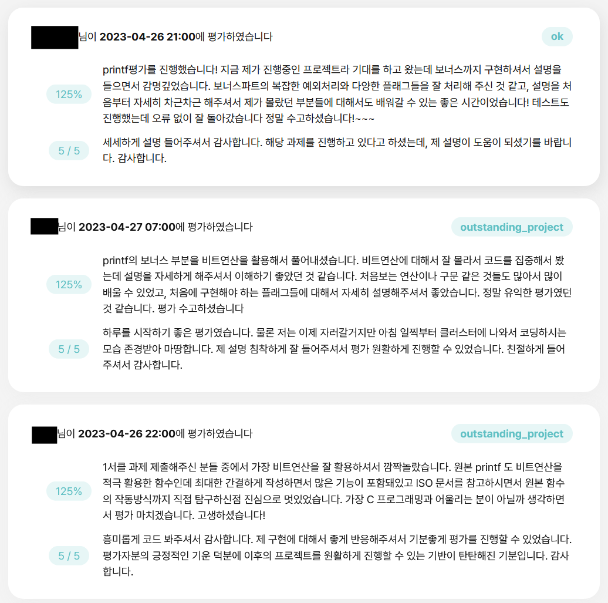

{.post-thumbnail}

::: {.callout-note appearance="simple"}
아직 작성중인 노트입니다.
:::

## Intro


ft_printf는 42 Seoul 공통과정 초반에 수행했던 과제입니다.
2년이라는 시간이 지나 코드의 세부 내용은 많이 희미해졌지만,
C언어에 대한 기억을 되살려가며 코드를 하나씩 설명해보도록 하겠습니다.

## 프로젝트 설명

### 개요

[과제 명세서](https://cdn.intra.42.fr/pdf/pdf/143719/en.subject.pdf)

이 프로젝트는 C언어의 printf 함수를 직접 구현하는 과제입니다.
얼핏 단순해 보이지만, printf의 작동 원리를 깊이 이해해야 하는 복잡한 과제입니다.
(사실 어느정도 타협을 해서 구현을 해도 된다고 생각하지만, 이 부분을 납득하지 못하는 평가자를 만나면 곤란해질 수 있습니다.)

구현 시 반드시 [norminette 규칙](https://github.com/taeng42/norminette/blob/master/pdf/ko.norm.pdf)을 준수해야 하는데, 이는 코드의 가독성을 위한 것이고, 대표적인 예시는 다음과 같습니다.

- 파일당 함수 5개 이하
- 함수당 코드 25줄 이하
- 한 줄당 80자 이하

구현의 정확성을 위해 [ISO C99 표준 문서](https://www.dii.uchile.cl/~daespino/files/Iso_C_1999_definition.pdf)의 285페이지를 참고했습니다.
자세한 내용은 [코드와 함께 설명](#코드-설명)드리겠습니다.

::: {.callout-note appearance="simple"}
이 포스팅에서 makefile과 ar 명령어에 대한 설명은 생략하겠습니다.
:::

### Mandatory


허용 함수부터 보겠습니다.

- malloc
- free
- write
- va_start, va_arg, va_copy, va_end

buffer는 따로 구현하지 않을 예정이기 때문에 malloc과 free 함수는 사용하지 않았습니다.

이중 눈여겨볼 함수는 va_ ... 함수들인데, 각각의 설명은 [이 문서](https://linux.die.net/man/3/va_start)를 참조했습니다.
간단히 설명하자면 이런겁니다. (c언어 프로그램의 메모리 구조, buffer 설명)

### Bonus


flag에 대한 내용이 나옵니다.
이제 여기서부터 과제가 애매해지기 시작하는데, 구현 범위를 확실하게 정해야합니다.
그래야 undefined behavior가 발생시, 적절한 답변을 할 수 있습니다.
저는 ISO c99 문서를 기준으로 구현했습니다.

과제에서 제시한 flag들에 대한 설명이 나오는 부분을 한번 보겠습니다.

## 코드 설명

::: {.callout-note appearance="simple"}
전체 코드는 [github repo](https://github.com/cryscham123/my_printf)에서 확인 가능합니다.
:::

header 먼저 살펴보도록 하겠습니다.  
변수명이 마음에 안들지만, 협업 경험이 전혀 없던 시기에 작성한 코드임을 감안해주시길 바랍니다.

```c
#ifndef FT_PRINTF_H
# define FT_PRINTF_H

/*printf에서 사용할 함수들을 macro로 설정해주었습니다. */
/*이 당시엔 enum을 몰라서 이렇게 구현을 했습니다..*/

# define F_WDTH 64
# define F_PREC 32
# define F_ZERO 16
# define F_LEFT 8
# define F_PLUS 4
# define F_SHAP 2
# define F_SPACE 1

# include <stdarg.h>
# include <unistd.h>

/*specifier 문자를 만났을 때, 어떻게 출력을 해야되는지에 대한 정보를 저장할 구조체입니다.*/

typedef struct s_info
{
	unsigned int	flag; /*이 변수에 flag 정보를 비트연산으로 저장합니다.*/
	int				field[2]; # 이건 뭐였지
	int				cnt; /*specifier 문자를 처리할 때, 출력하는 문자의 갯수를 저장합니다.*/
	char			cmd; /*어떤 specifier를 처리하는지 저장합니다.*/
}	t_info;

int	ft_printf(const char *s, ...);
int	ft_putchr(char c, t_info *i);
int	ft_printstr(char *s, t_info *i);
int	ft_putnum(long long num, t_info *i, int cur);
int	ft_puthex(unsigned long long n, t_info *i, int cur);
int	ft_max(int a, int b);
int	ft_padding(t_info *i, int n);
int	ft_precision(t_info *i, int num, int n, int target);

#endif
```

다음으로, ft_printf.c 파일의 함수들을 살펴보겠습니다.

```c
int	ft_printf(const char *s, ...)
{
	va_list	ap;
	int		cnt;
	int		tmp;

	va_start(ap, s); # 변수 초기화
	cnt = 0;
	while (*s != '\0')
	{
		if (*s == '%') # format 문자를 만날 경우
		{
			s++;
			tmp = ft_convert(&ap, &s); # format 문자를 ft_convert 함수에서 처리해줍니다.
		}
		else
			tmp = write(1, s, 1); # format 문자가 아닐 경우 그대로 출력합니다.
		if (tmp < 0)
			return (-1); # 출력에 실패하면 -1을 반환합니다. 동적할당을 하지 않았기때문에 다른 조치는 취하지 않습니다.
		cnt += tmp; # 출력한 문자 갯수만큼 계속 저장해줍니다.
		s++;
	}
	va_end(ap);
	return (cnt); # 최종적으로 출력에 성공한 문자의 갯수를 반환합니다.
}
```

```c
/*flag에 대한 정보를 먼저 처리해줍니다.*/
/*코드가 조금 특이하죠. 사실 norminette 때문에 이렇게 구현했습니다.*/
static int	ft_convert(va_list *ap, const char **s)
{
	t_info	i;
	int		tmp;

	i.flag = 0; # 변수들을 초기화 해줍니다.
	i.cnt = 0;
	i.field[0] = 0;
	i.field[1] = 0;
	while (**s == '#' || **s == ' ' || **s == '0' || **s == '-' || **s == '+')
	{
		tmp = "!!!!!!!!!!!!!!!!!!!!!!!!!!!!!!!!0!!1!!!!!!!2!3!!4"[(int)**s];
		i.flag |= (1 << (tmp - '0'));
		(*s)++;
	}
	while (**s == '.' || (**s >= '1' && **s <= '9'))
	{
		tmp = (**s == '.');
		(*s) += tmp;
		i.flag |= (F_WDTH >> tmp);
		while (**s >= '0' && **s <= '9')
		{
			i.field[tmp] = i.field[tmp] * 10 + (**s - '0');
			(*s)++;
		}
	}
	return (ft_parse(ap, **s, i));
}
```

```c
static void	ft_flag_validate(t_info *i)
{
	if ((i->flag & F_ZERO) && (i->flag & F_LEFT))
		i->flag &= ~F_ZERO;
	if ((i->flag & F_ZERO) && (i->flag & F_PREC))
		i->flag &= ~F_ZERO;
	if ((i->flag & F_SPACE) && (i->flag & F_PLUS))
		i->flag &= ~F_SPACE;
}

/*본격적으로 specifier를 처리해주는 로직입니다.*/
static int	ft_parse(va_list *ap, char c, t_info i)
{
	int	status;

	i.cmd = c;
	ft_flag_validate(&i);
	if (c == 'c')
		status = ft_putchr((char)(va_arg(*ap, size_t)), &i);
	else if (c == '%')
		status = ft_putchr('%', &i);
	else if (c == 's')
		status = ft_printstr(va_arg(*ap, char *), &i);
	else if (c == 'd' || c == 'i')
		status = ft_putnum(va_arg(*ap, int), &i, 0);
	else if (c == 'u')
		status = ft_putnum(va_arg(*ap, unsigned int), &i, 0);
	else if (c == 'p')
		status = ft_puthex((unsigned long long)va_arg(*ap, void *), &i, 0);
	else
		status = ft_puthex(va_arg(*ap, unsigned int), &i, 0);
	if (status < 0 || ft_padding(&i, i.cnt) < 0)
		return (-1);
	return (i.cnt);
}
```

다음으로, parse.c 파일의 함수들을 입니다.

```c
int	ft_putchr(char c, t_info *i)
{
  /*이 로직은 아래에서 사용됩니다.*/
	if (c == '!' && i->cmd != 'c' && i->cmd != 's')
		return (0);
	if ((i->cmd == 'c' || i->cmd == '%') && !(i->flag & F_LEFT))
		if (ft_padding(i, 1) < 0)
			return (-1);
	i->cnt++;
	return (write(1, &c, 1));
}

int	ft_printstr(char *s, t_info *i)
{
	int	len;

	len = 0;
  /*printf에서는 null이 오면 (null)을 출력한다는 점을 바탕으로 작성했습니다.*/
	if (s == NULL)
		return (ft_printstr("(null)", i));
	while (s[len] && !((i->flag & F_PREC) && len >= i->field[1]))
		len++;
	if (!(i->flag & F_LEFT))
		if (ft_padding(i, len) < 0)
			return (-1);
	len = 0;
	while (s[len] && !((i->flag & F_PREC) && len >= i->field[1]))
	{
		if (ft_putchr(s[len], i) < 0)
			return (-1);
		len++;
	}
	return (0);
}

int	ft_putnum(long long num, t_info *i, int cur)
{
	int	is_sign;
	int	is_put;

	if (num < 0)
		i->flag |= (F_PLUS + F_SPACE);
  /*norminette 때문에 삼항연산자를 쓸 수 없어서 아래와 같이 작성했습니다.*/
	num *= 1 * (num >= 0) + -1 * (num < 0); 
	is_sign = (i->flag & (F_PLUS + F_SPACE)) != 0;
	is_put = !(num == 0 && cur == 0 && i->field[1] == 0 && (i->flag & F_PREC));
	if (num < 10)
	{
		if ((i->flag & F_ZERO) && ft_putchr("! !!+-"[i->flag & 5], i) < 0)
			return (-1);
		if (!(i->flag & F_LEFT))
			if (ft_padding(i, ft_max(cur + is_put, i->field[1]) + is_sign) < 0)
				return (-1);
		if (!(i->flag & F_ZERO) && ft_putchr("! !!+-"[i->flag & 5], i) < 0)
			return (-1);
		if ((i->flag & F_PREC))
			return (ft_precision(i, num, cur, num % 10 + '0'));
		return (ft_putchr(num % 10 + '0', i));
	}
	if (ft_putnum(num / 10, i, cur + 1) < 0 || ft_putchr(num % 10 + '0', i) < 0)
		return (-1);
	return (0);
}

int	ft_puthex(unsigned long long num, t_info *i, int cur)
{
	char	s;
	int		is_sign;

  /* %x나 %p specifier의 경우 소문자로 출력 */
	s = "0123456789ABCDEF"[num % 16] | 32 * (i->cmd == 'x' || i->cmd == 'p');
	is_sign = (i->cmd == 'p' || (!(cur == 0 && num == 0) && (i->flag & 2))) * 2;
	if (num < 16)
	{
		if ((i->flag & F_ZERO) && is_sign != 0)
			if (ft_putchr('0', i) < 0 || ft_putchr("xX"[i->cmd == 'X'], i) < 0)
				return (-1);
		if (!(i->flag & F_LEFT))
			if (ft_padding(i, ft_max(cur + 1, i->field[1]) + is_sign) < 0)
				return (-1);
		if (!(i->flag & F_ZERO) && is_sign != 0)
			if (ft_putchr('0', i) < 0 || ft_putchr("xX"[i->cmd == 'X'], i) < 0)
				return (-1);
		if ((i->flag & F_PREC))
			return (ft_precision(i, num, cur, s));
		return (ft_putchr(s, i));
	}
	if (ft_puthex(num / 16, i, cur + 1) < 0 || ft_putchr(s, i) < 0)
		return (-1);
	return (0);
}
```

마지막으로 flag_utils.c 함수입니다.

```c
#include "ft_printf.h"

int	ft_max(int a, int b)
{
	if (a >= b)
		return (a);
	return (b);
}

int	ft_padding(t_info *i, int n)
{
	char	padding;

	padding = ' ';
	if (i->flag & F_ZERO)
		padding = '0';
	while ((i->flag & F_WDTH) && n < i->field[0])
	{
		if (write(1, &padding, 1) < 0)
			return (-1);
		i->cnt++;
		n++;
	}
	return (0);
}

int	ft_precision(t_info *i, int num, int n, int target)
{
	if (num == 0 && n == 0 && i->field[1] == 0)
		return (0);
	while ((i->flag & F_PREC) && n < i->field[1] - 1)
	{
		if (ft_putchr('0', i) < 0)
			return (-1);
		n++;
	}
	return (ft_putchr(target, i));
}
```

## 결과




## Outro

C언어의 깊이 있는 매력을 경험할 수 있었던 과제라고 생각합니다.
특히 프로그램의 메모리 구조를 이해하는 과정에서 많은 것을 배울 수 있었습니다.
과제 구현의 범위가 난해하고, norminette을 지키는 것 때문에 어려움이 조금 있었지만, 그래도 흥미롭게 했던걸로 기억합니다.

사실 솔직히 말하면 제가 제출한 코드는 norminette을 아주 완벽하게 위반하고 있습니다.
norminette에서는 한 줄에 여러 동작을 하는 코드를 작성하지 말라고 나와있는데, 뭐..네 그렇습니다.
그래도 소설로 비유하면 가끔은 비유법과 은유법이 들어가줘야 재미가 있는것 아니겠습니까?
남들이 조금 못 알아보면 어떻습니까? 가끔은 이런 재미있는 코드도 존재해야 발전이라는게 있는거죠.

..농담이고 협업할때는 절대 이렇게 코드를 작성하지 않습니다.
어쨌든 긴 글 읽어주셔서 감사합니다!
