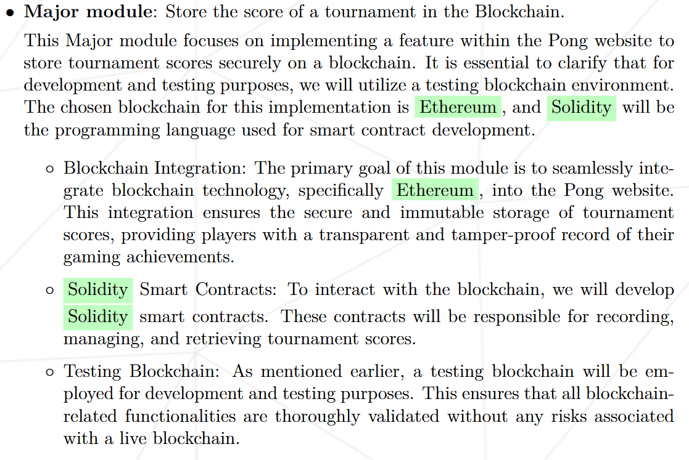
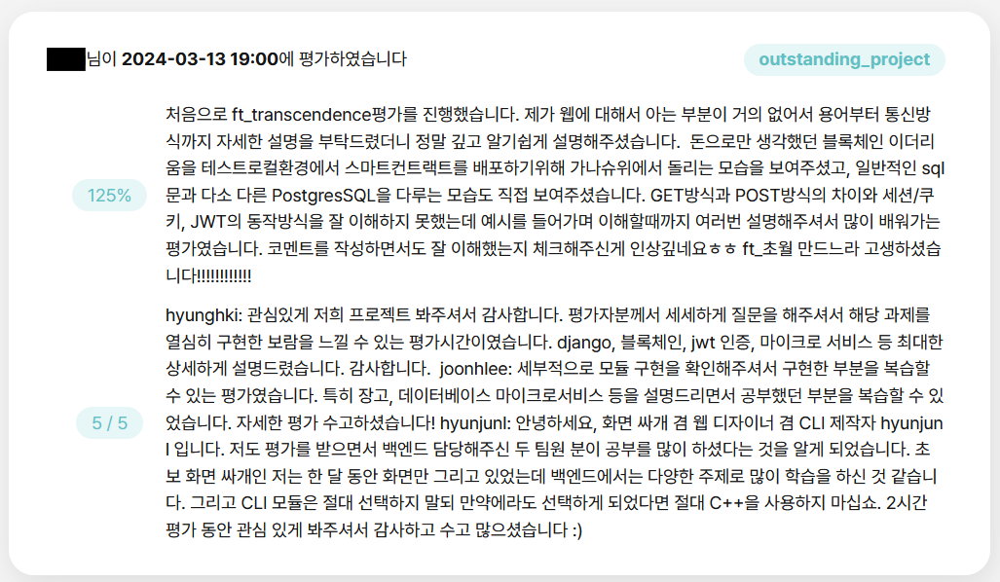
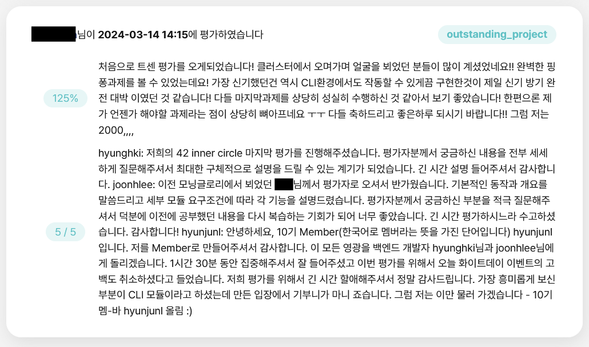

{.post-thumbnail}

::: {.callout-note appearance="simple"}
아직 작성중인 노트입니다.
:::

## intro


[1편 github action](./01.md)과 [2편 JWT](./02.md)에 이어서 block chain 파트에 대해 설명하겠습니다.

## 프로젝트 및 구현 설명

### Block Chain

::: {.callout-note appearance="simple"}
블록 체인의 개념적인 자세한 설명은 생략하겠습니다.  
:::




**이더리움**은 비트코인과 함께 가장 잘 알려진 블록체인 플랫폼 중 하나입니다. 하지만 비트코인이 단순히 디지털 화폐에 중점을 둔 반면, 이더리움은 **스마트 컨트랙트 기능**을 통해 **더 다양한 응용 프로그램**(Decentralized Applications, DApps)을 지원합니다.

**스마트 컨트랙트**는 블록체인 상에서 동작하는 자동화된 계약입니다. 이는 코드로 작성된 계약 조건을 블록체인에 저장하고, **특정 조건이 충족되면 자동으로 실행되는 프로그램**입니다. 스마트 컨트랙트의 주요 특징은 다음과 같습니다:

- **자동 실행**: 계약 조건이 충족되면 코드가 자동으로 실행됩니다. 중간에 인간의 개입이 필요하지 않습니다.

- **투명성**: 블록체인에 저장되기 때문에 모든 거래 내역이 공개되고 검증 가능합니다.

- **불변성**: 한 번 배포된 스마트 컨트랙트는 수정이 불가능합니다. 이는 신뢰성을 보장합니다.

- **분산화**: 중앙 집중형 서버가 필요 없이 블록체인 네트워크 상에서 실행됩니다.

명세서에 따르면, 스마트 컨트랙트를 테스트하기 위한 로컬 개발 환경이 필요합니다.
이를 위해 **가나슈(Ganache)**를 사용했습니다. 가나슈는 이더리움 블록체인의 로컬 테스트넷을 제공하는 도구로, 개발자가 스마트 컨트랙트를 배포하고 테스트할 수 있는 가상 환경을 만들어 줍니다.
스마트 컨트랙트 작성 후, solidity로 컴파일해서 가나슈 블록체인 환경에 저장을 해주겠습니다.

먼저 가나슈 테스팅 환경 세팅입니다.

```dockerfile
FROM node:alpine

WORKDIR /app

RUN npm install -g ganache

CMD ganache \
	-h 0.0.0.0 \
	--wallet.accounts ${BLOCK_CHAIN_PRIVATE_KEY},0x1000000000000000000 \
	--miner.coinbase ${BLOCK_CHAIN_ACCOUNT} \
	--database.dbPath ${BLOCK_CHAIN_DB_PATH} \
	--chain.networkId ${BLOCK_CHAIN_NETWORK_ID} \
	--chain.asyncRequestProcessing
```

docker container로 실행되도록 설정했습니다.

```solidity
// SPDX-License-Identifier: GPL-3.0
pragma solidity >=0.4.22 <0.9.0;
contract TournamentHistory {
	struct Tournament {
		uint	tournament_id;
		uint	datetime;
		string	winner;
		Game[3]	games;
	}
	struct Game {
		uint	datetime;
		uint[2]	players;
		string	winner;
		string 	rally;
	}
    address public	chairperson;
	uint private tournament_total;
	mapping(uint => uint) private user_log_total;

	event TournamentDetail(
		uint indexed	tournament_id,
		uint			datetime,
		string			winner,
		Game[3]			games
	);

	event TournamentDetailForUser(
		uint 			tournament_id,
		uint indexed	user_id,
		uint indexed	user_log_key,
		uint			datetime,
		string			winner,
		Game[3]			games
	);

    constructor() {
		chairperson = msg.sender;
    }

	function addTournament(
		uint			datetime,
		string	memory	winner,
		uint[4]	memory	user_id,
		Game[3] memory	games
	) 
		external
	{
		require(msg.sender == chairperson, "You dont have permission to add a tournament.");
		emit TournamentDetail(++tournament_total, datetime, winner, games);
		for (uint i = 0; i < 4; i++) {
			emit TournamentDetailForUser(
				tournament_total,
				user_id[i], 
				user_log_total[user_id[i]]++,
				datetime, 
				winner, 
				games
			);
		}
	}
}
```

Pong Game의 Tournament 경기 정보를 저장하는 smart contract 입니다.

```python
import json, os
from web3 import Web3
from solcx import compile_standard, install_solc, set_solc_version

with open("/etc/block_chain/contracts/TournamentHistory.sol", "r") as file:
	contract_file = file.read()

install_solc("0.8.20")
set_solc_version("0.8.20")
compiled_sol = compile_standard(
	{
    	"language": "Solidity",
    	"sources": {"TournamentHistory.sol": {"content": contract_file}},
        "settings":{
        	"outputSelection": {
            	"*": {
                	"*": ["abi", "metadata", "evm.bytecode", "evm.sourceMap"]}
			}
        }, 
    }
)

with open("/etc/block_chain/contracts/compiled_code.json", "w") as file:
	json.dump(compiled_sol, file)

bytecode = compiled_sol["contracts"]["TournamentHistory.sol"]["TournamentHistory"]["evm"]["bytecode"]["object"]
abi = json.loads(compiled_sol["contracts"]["TournamentHistory.sol"]["TournamentHistory"]["metadata"])["output"]["abi"]
w3 = Web3(Web3.HTTPProvider("http://block_chain:8545"))
chain_id = os.environ.get("BLOCK_CHAIN_NETWORK_ID", "")
account_address = os.environ.get("BLOCK_CHAIN_ACCOUNT", "")
private_key = os.environ.get("BLOCK_CHAIN_PRIVATE_KEY", "")

TournamentHistory = w3.eth.contract(abi=abi, bytecode=bytecode)
nonce = w3.eth.get_transaction_count(account_address)
transaction = TournamentHistory.constructor().build_transaction(
    {
        "chainId": int(chain_id),
        "gasPrice": w3.eth.gas_price,
        "from": account_address,
        "nonce": nonce,
    }
)
signed_txn = w3.eth.account.sign_transaction(transaction, private_key=private_key)
tx_hash = w3.eth.send_raw_transaction(signed_txn.rawTransaction)
tx_receipt = w3.eth.wait_for_transaction_receipt(tx_hash)

compiled_sol['contracts']['TournamentHistory.sol']['TournamentHistory']['contract_address'] = tx_receipt.contractAddress
compiled_sol['contracts']['TournamentHistory.sol']['TournamentHistory']['nonce'] = str(nonce)
with open("/etc/block_chain/contracts/compiled_code.json", "w") as file:
    json.dump(compiled_sol, file)
```

위 로직으로 compile 후, 가나슈에 베포되도록 했습니다.

```python
"""
This module is for storing and retrieving tournament data from the blockchain.
"""
import json, os
from web3 import Web3
from django.conf import settings

class Tournament:
	"""
	Store and retrieve tournament data from the blockchain.
	"""
	chain_id = int(os.environ.get("BLOCK_CHAIN_NETWORK_ID"))
	account_address = os.environ.get("BLOCK_CHAIN_ACCOUNT")
	private_key = os.environ.get("BLOCK_CHAIN_PRIVATE_KEY")
	
	def __init__(self):
		self.w3 = Web3(Web3.HTTPProvider("http://block_chain:8545"))
		with open("/etc/block_chain/contracts/compiled_code.json", "r") as file:
			self.config_file = json.load(file)
		abi = json.loads(self.config_file["contracts"]["TournamentHistory.sol"]["TournamentHistory"]["metadata"])["output"]["abi"]
		contract_address = self.config_file["contracts"]["TournamentHistory.sol"]["TournamentHistory"]["contract_address"]
		self.contract = self.w3.eth.contract(address=contract_address, abi=abi)
		self.tournament_detail_event = self.contract.events.TournamentDetail
		self.tournament_detail_for_user_event = self.contract.events.TournamentDetailForUser

	def store_tournament(self, tournament_date, winner, players, games):
		"""
		Store tournament data in the blockchain.

		argument means:
		1. tournament date 2. winner:string 3. players:uint[4] 4. games:tuple[3]

		The games what is tuple means:
		(game start time, players:uint[2], winner:string, rally:string)
		"""
		nonce = self.w3.eth.get_transaction_count(self.account_address)
		transaction = self.contract.functions.addTournament(
			tournament_date,
			winner,
			players,
			games
		).build_transaction({
				"chainId": self.chain_id,
				"gasPrice": self.w3.eth.gas_price,
				"from": self.account_address,
				"nonce": nonce,
		})
		signed_txn = self.w3.eth.account.sign_transaction(transaction, private_key=self.private_key)
		tx_hash = self.w3.eth.send_raw_transaction(signed_txn.rawTransaction)
		self.w3.eth.wait_for_transaction_receipt(tx_hash)
		
	def get_tournament_for_user(self, user_id, page, total):
		"""
		Retrieve tournament data from the blockchain for a specific user.
		Please give page argument directly from the request.
		You will get max 10 logs per page if exist.
		If no data in given page, empty array will return
		Also, if argeuments are invalid (not unsigned int), empty array will return.
		"""
		if user_id < 0 or page < 1 or total < 0:
			return []
		page -= 1
		target = [max(0, total - 1 - (page * settings.PAGE_SIZE + i)) for i in range(settings.PAGE_SIZE)]
		logs = self.tournament_detail_for_user_event.create_filter(
			fromBlock=0, 
			toBlock='latest', 
			argument_filters={'user_id': user_id, 'user_log_key': target})
		ret = []
		for log in logs.get_all_entries():
			ret.insert(0, log.args)
		return ret

	def get_tournament(self, tournament_id):
		"""
		Retrieve tournament data from the blockchain with id.
		If tournament_id is not exist, None will return.
		"""
		if tournament_id < 0:
			return None
		logs = self.tournament_detail_event.create_filter(
			fromBlock=0, 
			toBlock='latest', 
			argument_filters={'tournament_id': tournament_id})
		target = [log.args for log in logs.get_all_entries()]
		return target[0] if target else None
```

web3.0을 이용해 모듈화 해줬습니다.

## 결과







## outro

ft_transcendence 과제는 통상 5인 팀이 2-3개월에 걸쳐 완성하는 대형 과제입니다.
이런 과제를 고작 3인이 한 달 만에 완료한것은 보통 일이 아니라고 생각합니다.

처음 계획했던 것보다 빠른 진행이 가능했던 건 팀원들의 기술적 역량이 높았던 것도 있지만, 팀원 전원이 지속적인 몰입과 집중력을 유지했던 것과, 매일 아침 미팅을 진행하며 지속적으로 팀원간 의사소통을 했던 것이 크게 작용했던 것 같습니다.
앞으로 이 과제를 수행하실 분들도 협업 능력을 키우는 용도로 해당 과제를 수행해 나가시면 큰 도움이 될거라 생각합니다.
