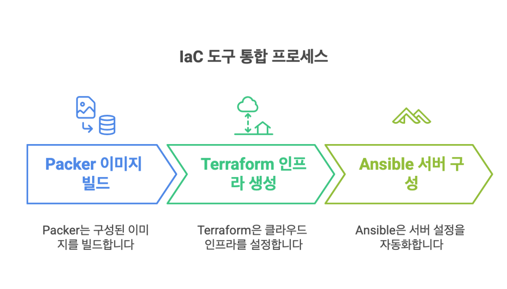
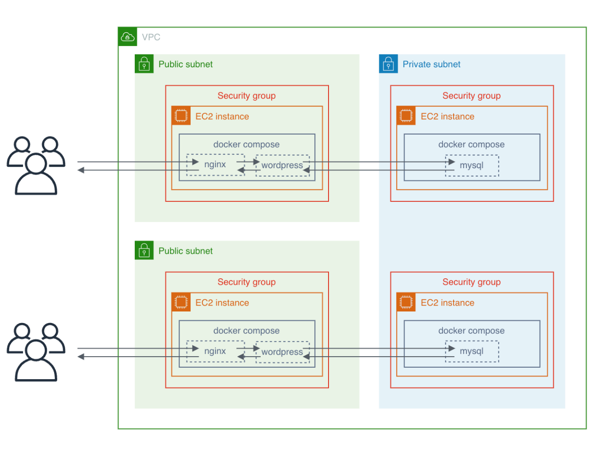
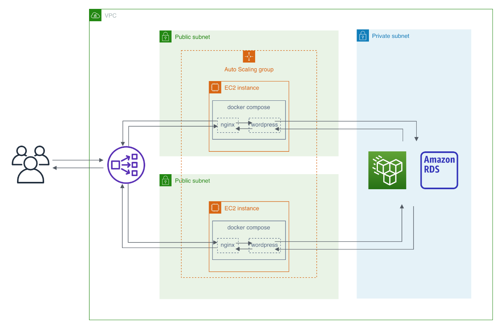
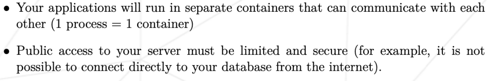

{.post-thumbnail}

## intro

다음 학기 시작 전까지 개념공부만 하면서 시간을 보내려고 하니까 프로젝트가 하고 싶어졌습니다.
원래는 python 과제를 하려고 했는데, 이전에 cloud 과제를 진행하다가 말았던게 기억나서 이어서 해보면 괜찮겠다 생각했습니다.

## 프로젝트 및 구현 설명

### 개요

[과제 명세서](https://cdn.intra.42.fr/pdf/pdf/147805/en.subject.pdf)

참고한 자료는 다음과 같습니다:

- [AWS SAA Udemy 강의](https://www.udemy.com/course/aws-certified-solutions-architect-associate-saa-c03/)
- [ansible terraform Udemy 강의](https://www.udemy.com/course/terraform-and-ansible/?utm_campaign=2025-01-21&utm_content=promo&utm_medium=4897172&utm_source=email-sendgrid&utm_term=38475056)

이 강의들도 본 지 1년이 다되어가긴 하지만..과제할 때 사용한 제 배경지식이 여기서 나온거니까요.
과제를 진행하실 분들은 한번 수강해보시면 도움이 될 것 같습니다.

::: {.callout-note appearance="simple"}
이 포스팅에서 docker와 nginx, wordpress, mysql 구조에 대한 설명은 생략하겠습니다.  
전체 코드는 [github repo](https://github.com/cryscham123/cloud-1)에서 확인하실 수 있습니다.
:::

### What is IaC?

이 프로젝트의 목표는 `IaC(Infrastructure as Code) tool`을 이용하여 wordpress 사이트를 cloud에 자동으로 배포하는 것입니다.

IaC는 `인프라 구성을 코드로 관리하는 방식`으로, 수동으로 리소스를 생성하고 설정하는 방식에 비해 `버전 관리가 간편`하고, `동일한 환경을 쉽게 재현`하거나, `코드 리뷰 등의 방식으로 휴먼 에러를 줄이는 데 용이`하게 사용할 수 있습니다.

이번 프로젝트에서는 `Packer, Terraform, Ansible` 세 가지 IaC tool을 조합해 사용했습니다

1. **Packer**: `인프라 생성 전, 상세 설정`이 되어있는 image를 build할 수 있는 tool 입니다.

2. **Terraform**: `cloud 인프라를 생성`하는 tool입니다. `packer에서 생성한 ami를 사용`할 수 있습니다.

3. **Ansible**: 서버 내부의 `상세 설정을 자동화`합니다. 일반적인 bash script와는 다르게 `멱등성 있는 설정`이 가능하다는 점이 큰 장점입니다. 이때, 서버는 `python이 설치되어 있어야 하고, ssh로 접근 가능`해야 합니다.

위의 이미지 처럼, packer로 `필요한 설정이 완료된 image를 생성`한 뒤, 그 이미지를 기반으로 `cloud infra`를 terraform으로 생성하고, `생성된 infra의 상세 설정`을 ansible을 이용해서 구현해줄 것입니다.

Packer와 Ansible은 서버 설정 자동화라는 `동일한 기능`을 수행하는 도구입니다.
두 도구는 각각 다양한 특징과 장단점이 있지만, 이 과제에서 알아야 하는 차이점은 아래와 같습니다.

Packer는 `임시 EC2 인스턴스`를 생성하여 그 위에서 필요한 설정을 완료한 후, 해당 인스턴스를 AMI로 변환하는 방식으로 동작합니다.
이렇게 생성된 AMI는 이후 실제 인프라 구축 시 그대로 사용할 수 있습니다.
따라서 최종 목적지 서버가 `SSH 접근이 제한되는 환경`이더라도, 미리 필요한 `모든 설정이 완료된 이미지를 사용`할 수 있다는 장점이 있습니다.

반면에 Ansible은 `SSH 접근이 가능한 서버에서만 동작`하지만, Packer와 달리 `인프라 구축 후에 얻을 수 있는 정보`(예: EC2의 IP)를 활용할 수 있습니다.

이러한 특성을 고려하여 이 프로젝트에서는 두 도구를 상황에 맞게 조합하여 사용했습니다.

### 전체적인 구조

`Public subnet의 EC2`들에 대한 `ssh 접근`은 `관리용 컴퓨터에서만`(terraform, ansible 코드가 실행되는 컴퓨터) 접근이 가능하도록 제한했고, MySQL의 데이터는 `Private subnet의 EC2`에 저장한 뒤 `Public subnet의 EC2만 접근`할 수 있도록 설정했습니다.
`Public subnet의 EC2`는 `사용자가 원하는 갯수를 설정`할 수 있고, `그 갯수에 맞춰서` private subnet의 `dbms EC2`가 생성되도록 설계했습니다.

실제 프로덕션 환경이라면 위와 같은 구조로는 설계하지 않습니다.
일단 EC2 머신들을 Auto Scaling Group으로 묶고, 그 앞에 Network Load Balancer를 두어 단일 엔드포인트로 관리하는 것이 좋습니다.
또한 Database는 AWS RDS를 이용하고, WordPress의 파일 시스템은 EFS나 S3를 활용해 Stateless하게 구현하는게 좋습니다.

제 구현에서는 `각 서버가 독립적인 상태와 엔드포인트`를 가지고 있습니다.

그렇게 한 이유는 일단 `aws free tier` 서비스만으로 과제를 구현하려고 했던게 제일 크고요..(NLB는 사용할 수 없었습니다.)
나머지는 과제 제약사항 때문인데,

모든 프로세스는 컨테이너 안에서 동작해야 한다는 제약때문에, `aws RDS`는 `사용할 수 없었습니다`.
그리고 database는 public internet에서 접근할 수 없다고 해서, `db`는 `private subnet`의 ec2에서 돌아가게 설계했습니다.

## outro

여기서 구현된 infra 구조는 사실 별로 근본있는 구조는 아니니까, 이것보다는 IaC 툴을 얼마나 편리하게 사용할 수 있는지에 초점을 맞춰서 봐주시길 바라고 있습니다.

이어서 코드에 대한 설명은 다음 게시글에 포스팅하겠습니다.
