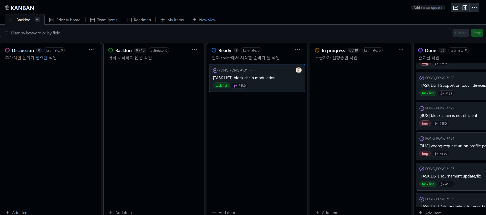
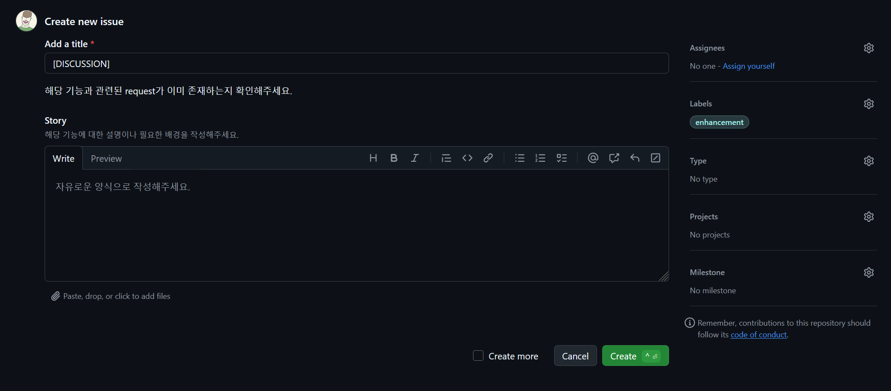
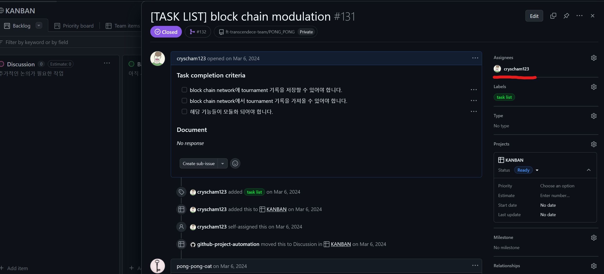
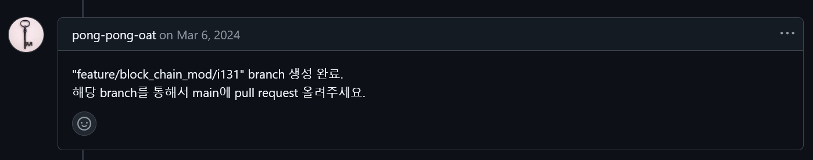
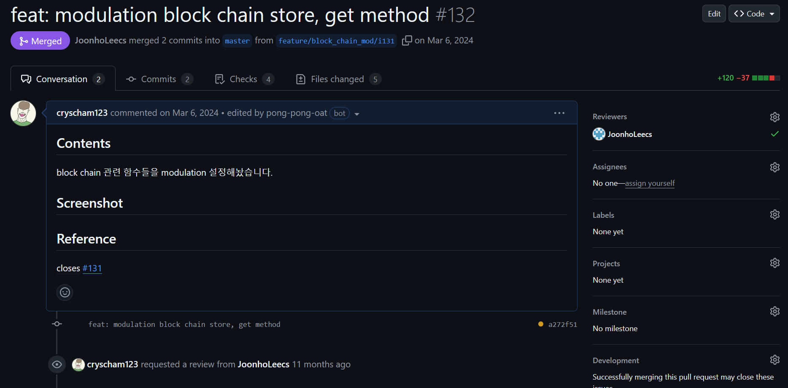
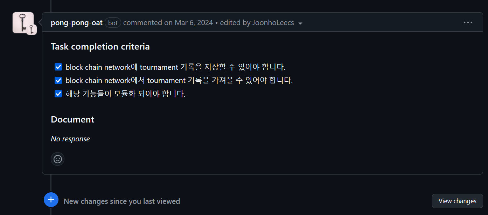
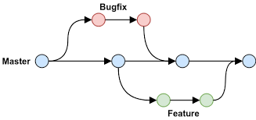

{.post-thumbnail}

## intro


42 Seoul 공통과정의 마지막 과제입니다.
이 프로젝트는 개발자가 선호하는 라이브러리와 프레임워크를 자유롭게 선택하여 구현할 수 있다는 점이 특징입니다.

대형 협업 과제인 만큼, 과제에 명시되어있지 않지만 협업을 위한 툴도 공부해서 다양하게 적용해볼 수 있는 좋은 과제인것 같습니다.
저같은 경우에는 coursera, udemy 강의를 통해 **agile** 협업 방식과 **github에서의 적용 방법**에 대해 공부를 했고, 프로젝트 진행에 있어서 꽤 도움이 됐던걸로 기억합니다.
사실 프로젝트를 진행하다보니, agile 방식을 온전히 다 적용하기엔 적합하지 않다고 판단했지만, **Kanban Board**로 프로젝트를 관리하는 것 같은 부분은 꽤 유용하게 활용할 수 있었습니다.

## 프로젝트 및 구현 설명

### 개요

[과제 명세서](https://cdn.intra.42.fr/pdf/pdf/140713/en.subject.pdf)

해당 과제는 실시간 [Pong 게임](https://www.ponggame.org/) 매칭 웹사이트를 만드는게 목표입니다. 저는 이번 프로젝트에서 **github action 설정, User Management Backend 설계와 42 API를 이용한 OAuth 인증, JWT 구현, Game History를 Block Chain으로 저장**하는 파트를 담당했습니다.

참고한 자료는 다음과 같습니다:

- [Google Agile Project 관리](https://www.coursera.org/learn/agile-project-management)
- [Github Action Docs](https://docs.github.com/ko/actions)
- [Github CLI Docs](https://cli.github.com/manual/)
- [Django udemy 강좌](https://www.udemy.com/course/python-django-the-practical-guide/?couponCode=KRLETSLEARNNOW)
- [Django Rest Framework Docs](https://www.django-rest-framework.org/)
- [Django Simple JWT](https://django-rest-framework-simplejwt.readthedocs.io/en/latest/index.html)
- [JWT Token 탈취 대응 시나리오](https://mgyo.tistory.com/832)
- [micro service에서 JWT 활용 방법](https://medium.com/@jose-luis-navarro/securing-our-microservices-through-authentication-and-authorization-with-jwt-refresh-tokens-and-f4439810fce7)
- [Refresh Token을 사용해야 하는 이유](https://puleugo.tistory.com/154)
- [Cookie에서의 same site 옵션](https://www.hahwul.com/2020/01/18/samesite-lax/)
- [Bitcoin 백서](https://bitcoin.org/files/bitcoin-paper/bitcoin_ko.pdf)
- [Solidity Udemy 강의](https://www.udemy.com/course/ethereum-and-solidity-the-complete-developers-guide/?couponCode=KRLETSLEARNNOW)
- [Solidity Docs](https://docs.soliditylang.org/en/latest/)
- [nomad coder 블록체인 시리즈](https://youtube.com/playlist?list=PL7jH19IHhOLOJfXeVqjtiawzNQLxOgTdq&si=k5TMs5VUF0Z1xIA2)

::: {.callout-note appearance="simple"}
이 포스팅에서는 **github action setting, jwt, block chain** 부분만 다루겠습니다.  
전체 코드는 비공개 되어있는 상태입니다.
:::

### Github Action Setting

github를 이용해서 agile 방법론을 적용할 수 있도록 의도했고, **자동화**와 **template**을 이용해 통일성 있는 구조를 유지하려고 했습니다.

**1. 회의를 통해 진행해야 하는 작업을 Kanban board에 정리한다.**



각각의 column에는 다음과 같은 내용이 들어갑니다.

1. **Discussion**: 논의가 필요한 작업. 개개인이 자유롭게 올릴 수 있습니다
1. **Backlog**: Discussion에 있는 내용 중 구현하기로 회의에서 정한 작업
1. **Ready**: Back log에 있는 작업 중 이번 Sprint에서 구현할 작업들
1. **In Progress**: Ready에 있는 작업 중 누군가가 작업중인 것
1. **Done**: master branch에 merge가 완료된 작업

자세한 내용은 [meeting](#meeting) 부분을 참고해 주세요.

참고로 **Disccusion**에 작업을 올리는 방법은 **template에 맞게 issue를 올리**면 됩니다.



아래와 같이 설정 파일을 만들어서 '.github/ISSUE_TEMPLATE/' 폴더 안에 저장하면 issue create 시 자동으로 template이 뜨게 할 수 있습니다.

```bash
name: New discussion
description: new discussion
title: "[DISCUSSION]"
labels: ["enhancement"]
projects: ["org_name/5"]
body:
  - type: markdown
    attributes:
      value: |
        해당 기능과 관련된 request가 이미 존재하는지 확인해주세요.
  - type: textarea
    id: story
    attributes:
      label: Story
      description: 해당 기능에 대한 설명이나 필요한 배경을 작성해주세요.
      placeholder: 자유로운 양식으로 작성해주세요.
    validations:
      required: true
```

**2. Kanban board를 보고 개인이 능동적으로 고유 브랜치에 작업을 진행한다.**



Kanban board의 Ready section에 있는 작업을 클릭해서 들어간 후, **assignees를 본인으로 선택해서 작업**하면 됩니다.
**task completion criteria**라는 내용이 보이는데, 이는 **회의를 통해 결정**하는 것으로, 나중에 작업이 완료되고 **pull request 시, 평가자가 작업에 완성도에 대해 판단할 수 있는 기준**으로 제공됩니다.

자동화 코드는 아래와 같이 구현했습니다.

```bash
name: Create branch
on:
  issues:
    types: [ assigned ]
  pull_request:
    types: [ opened, closed ]
jobs:
  create_issue_branch_job:
    runs-on: ubuntu-latest
    steps:
      - name: Generate token
        id: generate_token
        uses: tibdex/github-app-token@v2
        with:
          app_id: ${{ secrets.APP_ID }}
          private_key: ${{ secrets.PRIVATE_KEY }}

      # gh 명령어를 이용해 project의 상태를 In progress로 수정해줍니다.
      - name: Project in-progress
        if: github.event.action == 'assigned'
        run: |
          PROJECT_ID=$(gh project view 5 --owner organization-for-practice --format=json --jq '.id')
          ITEM_ID=$(gh project item-list 5 --owner organization-for-practice --format=json --jq ".items[] | select(.content.number == ${NUMBER}) | .id")
          FIELD_ID=$(gh project field-list 5 --owner organization-for-practice --format=json --jq '.fields[2].id')
          SINGLE_ID=$(gh project field-list 5 --owner organization-for-practice --format=json --jq '.fields[2].options[] | select(.name == "In progress") | .id')
          gh project item-edit --id ${ITEM_ID} --field-id ${FIELD_ID} --single-select-option-id ${SINGLE_ID} --project-id ${PROJECT_ID}
        env:
          GH_TOKEN: ${{ steps.generate_token.outputs.token }}
          NUMBER: ${{ github.event.issue.number }}

      # assign한 작업에 대한 branch를 새로 만들어줍니다.
      - name: Create Issue Branch
        uses: robvanderleek/create-issue-branch@main
        env:
          GITHUB_TOKEN: ${{ steps.generate_token.outputs.token }}
```

위의 코드는 assign한 작업을 Ready column에서 In progress column으로 옮겨주고, 자동으로 작업할 branch를 만들어줍니다.

branch 자동 생성은 [이 workflow](https://github.com/robvanderleek/create-issue-branch)를 사용하였고, 적용 시 아래와 같이 브랜치가 생성됩니다.

```yaml
autoLinkIssue: true
autoCloseIssue: true
branchName: tiny
commentMessage: |
  \"${branchName}\" branch 생성 완료.
  해당 branch를 통해서 main에 pull request 올려주세요.
branches:
  - label: 'task list'
    prefix: feature/${issue.title[12,27],}/
    copyIssueAssigneeToPR: true
  - label: 'bug'
    prefix: hot_fix/${issue.title[6,21],}/
    copyIssueAssigneeToPR: true
  - label: '*'
    skip: true
```

위의 config 파일을 작성해주면 아래와 같이 브랜치가 생성됩니다.



이름도 자동으로 생성되게 해서 **convention을 지켜야 한다는 부담을 줄여**줬습니다.

**3. 작업이 완료되면, 모든 조건을 충족하는지 확인한 후, master에 merge 한다.**



작업이 완료됬다고 판단되면 위 화면과 같이 **pull request를 생성**하고, **Reviewer를 설정**해주면 됩니다.



그러면 이전에 설정했던 기준들이 자동으로 불러와지고, **모든 항목에 체크가 완료**되어야 **merge를 할 수 있게 설정**했습니다.
구현 코드는 아래와 같습니다.

```bash
name: Master merge rutine
on:
  pull_request_target:
    types: [ opened, synchronize ]
    branches:
      - master
env:
  PR_NUM: ${{ github.event.pull_request.number }}
  GH_REPO: ${{ github.repository }}
jobs:
  get_checklist:
    runs-on: ubuntu-latest
    if: github.event.action == 'opened'
    steps:
      - name: Generate token
        id: generate_token
        uses: tibdex/github-app-token@v2
        with:
          app_id: ${{ secrets.APP_ID }}
          private_key: ${{ secrets.PRIVATE_KEY }}
      - name: Get issue
        id: issue_num
        env:
          BRANCH: ${{ github.event.pull_request.head.ref }}
        run: |
          echo $BRANCH | grep -o 'feature\/.*\/i[0-9]\+' || echo $BRANCH | grep -o 'hot_fix\/.*\/i[0-9]\+'
          TMP=$(echo $BRANCH | grep -o 'i[0-9]\+')
          echo "NUMBER=${TMP#i}" >> $GITHUB_OUTPUT
      - name: Get issue body
        id: issue_body
        env:
          GH_TOKEN: ${{ steps.generate_token.outputs.token }}
          NUM: ${{ steps.issue_num.outputs.number }}
        run: |
          echo "CONTENTS<<EOF" >> $GITHUB_OUTPUT
          gh issue view ${NUM} --json body --jq '.body' >> $GITHUB_OUTPUT
          echo "EOF" >> $GITHUB_OUTPUT
      - name: Update checklist
        run: |
          gh pr comment $PR_NUM --body "${BODY}"
        env:
          GH_TOKEN: ${{ steps.generate_token.outputs.token }}
          BODY: "${{ steps.issue_body.outputs.contents }}"
```

**merge가 완료된 branch**는 **자동으로 삭제**가 되도록 설정을 해주었습니다.

이제 아래는 실제 **프로젝트를 진행할 때 만들었던 rule**들입니다.

#### **1. work flow**

**github flow**로 진행됩니다.



1. 매 작업은 master branch의 HEAD를 기반으로 이루어집니다.  
   pr을 올리지 않는 개인 작업용 **local branch는 자유롭게 생성**해주세요.
1. master에 직접적인 push는 관리자를 제외하고는 불가능합니다.
1. master에 대한 merge는 squash merge로 진행됩니다.
1. 그 외의 merge는 rebase로 진행해주세요.

#### **2. work**

1. kanban board의 \'Ready\' 섹션에서 하나를 정해서 새로운 기능에 대한 작업을 진행해주세요.  
   선택한 작업은 assignees에 자신의 팀원을 등록 후, Start Date를 해당 날짜로 설정해주세요.  
   assignees 등록이 완료되면 자동으로 target branch가 생성됩니다.  
   해당 branch에 팀원들이 필요한 기능들을 자유로운 방식으로 구현한 후, master branch에 merge 해주세요.  
   단, 해당 branch에 대한 merge는 rebase로 진행해주세요.
1. hot_fix issue나, new feature request issue는 discussion의 필요성이 있을 경우에 등록해주세요.
1. 작업 중, 현재 작업하는 범위 외에서 추가적인 기능이 필요할 경우 관련 issue에 comment를 남기거나, reopen 해주세요.

#### **3. commit message convention**

아래의 명령어를 입력해주세요

```bash
git config commit.template .github/COMMIT_MESSAGE_TEMPLATE
```
이후, -m 옵션 없이 'git commit'으로 message를 입력해주세요.  

```{.python filename="COMMIT_MESSAGE_TEMPLATE"}
# commit message template
# ▼ <Title> 작성

# ▼ <빈 줄>

# ▼ <body> 작성

# ▼ <빈 줄>

# ▼ <footer> 작성


# About Convention
#	<Title>
#		- 필수로 입력해주세요
#		- 형식: <type>: <short summary>
#
#		<type>
#			- config: 설정 관련 파일 작성 또는 변경
#			- docs: 문서 변경사항
#			- feat: 새로운 기능
#			- fix: 버그 수정
#			- refactor: 기능 추가나 버그 수정이 아닌 변경 사항
#			- remove: 코드나 파일 제거
#			- style: 스타일 작성 또는 수정
#			- test: 누락된 테스트 추가 또는 기존 테스트 수정
#			- core: 기능 구현 외 시스템 관련 작업
#
#		<short summary>
#			- 변경 사항에 대한 간단한 설명
#			- 첫글자 소문자, 현재 시제, 명령문으로 마지막에 .(마침표) 없이 작성
#
#	<body>
#		- 선택적으로 입력 해주세요
#		- 현재 시제, 명령문으로 작성
#		- 변경 사항의 동기(왜)를 설명
#		- 변경 효과를 설명하기 위해 이전 동작과 현재 동작의 비교를 포함할 수 있음
#
#	<footer>
#		- 선택적으로 입력 해주세요
#		- 해당 commit과 관련된 task의 issue 번호들을 적어주세요
#		- 'bug'나 'task list' label이 붙은 issue는 제외해주세요
#		- ex) closes #<issue 번호> closes #<issue 번호> ...
```

::: {.callout-note appearance="simple"}
commit message template은 [이 사이트](https://www.conventionalcommits.org/en/v1.0.0/)를 참고해서 만들었습니다.
:::

#### **4. pull request**

1. pull request는 **500줄의 코드**를 넘어가지 않게 작성 바랍니다.
1. 모든 check list를 통과한 request만 master에 merge 가능합니다.
1. reviewers에는 해당 작업과 관련된 domain의 팀원을 선택해주세요.
   최소 1명 이상의 동료에게 평가를 받은 request만 merge 가능합니다.

#### **5. meeting**

- daily meeting
   
   - 매일 정해진 시간에 팀원들은 각각 다음과 같은 사안에 대해 논의합니다.

       1. 개인이 어제 작업한 내용
       2. 개인이 오늘 작업할 내용
       3. 개인이 현재 도움이 필요한 내용

   - 이후, 새로운 내용이 추가된 (\'Disccusion\' 섹션에 있는) issue 중 다음과 같은 내용에 대해 논의합니다.

       1. 해당 issue가 유효한가
       2. 추가적으로 필요하거나 필요 없는 내용
       3. 해당 issue의 priority (매우 급함 / 급함 / 안 급함)
       4. 해당 issue의 estimate (작업하는데 필요한 노력의 정량적인 수치)  
   
   - 추가적으로, project의 \'Back log\' 항목에서 \'Ready\' 항목으로 추가해야 할 작업에 대해 논의하거나 \'Ready\' 항목에서 \'Back log\' 항목으로 제외할 작업에 대해 논의할 수 있습니다.

- sprint planning / retrospective
   
   - 2주에 한번 진행.
   - 이전 sprint에 대한 평가와 이후 sprint를 위한 계획을 세웁니다.  
   - planning  
      - Project의 \'Back log\' 항목 중 본격적으로 작업을 진행할 항목을 정합니다.
      - daily meeting 시간을 조정할 수 있습니다.
   - retrospective  
      - 이전 sprint의 문제점에 대해 서로 의논해봅니다.

::: {.callout-note appearance="simple"}
프로젝트를 하다보니, 생각보다 진행 속도가 빨라서 2주에 한번 진행하는 sprint는 유명무실해져버렸습니다.
실제로는 daily meeting만 진행을 했습니다.
:::

## outro

내용이 너무 길어져서 2편에 계속 포스팅 하겠습니다.
