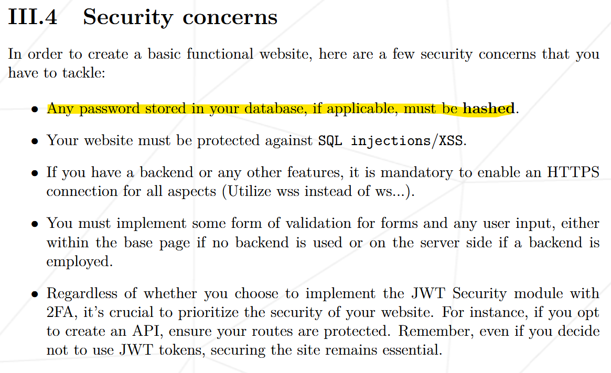
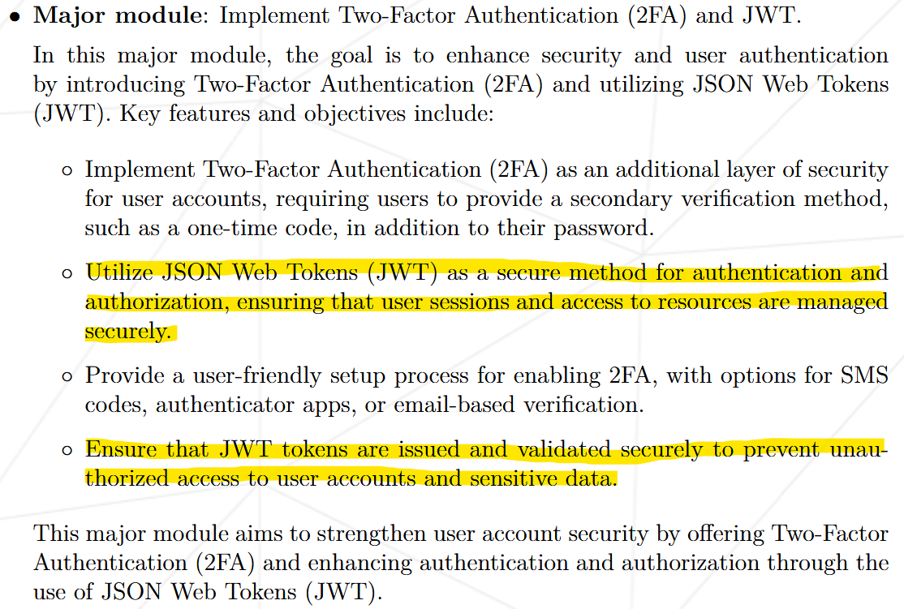

{.post-thumbnail}

::: {.callout-note appearance="simple"}
아직 작성중인 노트입니다.
:::

## intro


[1편 github action](./0.md)에 이어서 JWT 파트에 대해 설명하겠습니다.

## 프로젝트 및 구현 설명

### JWT





비밀번호를 저장할 때는 암호화를 해야 한다는 요구사항이 있습니다. 이번 포스팅에서는 다루지 않지만, 우리의 구현에서는 비밀번호 없이 OAuth만으로 로그인이 가능하도록 설계했습니다. 따라서 사용자가 직접 비밀번호를 설정하지는 않습니다.

다만, JWT 구현 과정에서 비밀번호로 간주될 수 있는 부분이 있다고 판단하여 해시 처리를 추가했습니다. 이는 명세서의 해당 요구사항을 반영한 것입니다.

#### 개념

구현에 대해 설명하기 전에, 먼저 **JWT(JSON Web Token)가 무엇인지 이해**해야 합니다. JWT는 **토큰 기반 암호화 방식의 표준화된 형식**으로, 다음과 같은 형태를 가지고 있습니다.

1. **Header**: 토큰의 유형(예: JWT)과 사용된 암호화 알고리즘(예: HMAC SHA256)을 지정합니다.
1. **Payload**: 토큰에 담을 정보를 포함합니다. 여기에는 클레임(Claim)이라고 불리는 키-값 쌍이 포함됩니다.
1. **Signature**: 헤더와 페이로드를 합친 후, 지정된 알고리즘과 비밀 키를 사용해 서명한 값입니다. 이 서명은 토큰의 무결성을 보장합니다.

각 부분은 점(.)으로 구분되며, Base64Url로 인코딩되어 있습니다.

토큰 암호화 방식은 왜 등장했을까요? 우리가 일반적으로 알고 있는 **세션-쿠키 방식과는 어떤 차이**가 있을까요?

- **세션-쿠키 방식**: 사용자가 로그인하면 서버는 세션 ID를 생성하고 이를 사용자의 정보와 함께 **데이터베이스나 메모리에 저장**합니다. **이후 클라이언트는 쿠키에 세션 ID를 저장**하고, 요청마다 이를 서버로 전송합니다. 서버는 세션 ID를 검증하여 사용자를 인증합니다. 이 방식은 **사용자가 증가할수록 서버의 메모리나 데이터베이스에 부담이 커집니다.**

- **토큰 암호화 방식**: 인증에 필요한 정보와 사용자의 정보(클레임)가 **토큰 자체에 포함**되어 있습니다. 서버는 토큰의 서명만 검증하면 되기 때문에 별도의 **저장 공간이 필요하지 않습니다.** 따라서 서버의 부하를 줄일 수 있습니다.

즉, 기존의 세션-쿠키에서는 서버에 저장하던 정보를 토큰에 담아서 사용자한테 전달하는게 토큰 인증방식입니다.
언뜻 보기에는 토큰 암호화 방식이 세션-쿠키 방식의 상위호환처럼 보이지만, 토큰 방식에는 몇 가지 **보안상의 위협**이 존재합니다. 주요 위협과 그에 대한 대응 방법은 다음과 같습니다.

- **토큰 탈취**: 토큰이 노출되면 공격자가 이를 악용할 수 있습니다.

   대응 방법: **HTTPS**를 사용하여 통신을 암호화하고, 토큰의 **유효 기간을 짧게** 설정합니다. 또한, **Refresh Token을 사용**하여 Access Token의 유효 기간을 더욱 단축할 수 있습니다.

- **XSS(Cross-Site Scripting) 공격**: 악성 스크립트를 통해 토큰을 탈취할 수 있습니다.

   대응 방법: **HttpOnly와 Secure 플래그를 사용해 쿠키에 토큰을 저장**합니다.

- **CSRF(Cross-Site Request Forgery) 공격**: 사용자의 권한을 도용해 악의적인 요청을 보낼 수 있습니다.

   대응 방법: **CSRF 토큰을 사용**하거나, **SameSite 속성을 설정**해 쿠키를 보호합니다.

- 토큰 재생 공격: 탈취한 토큰을 재사용하는 공격입니다.

   대응 방법: **토큰에 일회용 nonce 값을 포함**시키거나, **토큰 블랙리스트를 관리**합니다.

::: {.callout-note appearance="simple"}
토큰 탈취의 대응방법이 조금 허술하다고 느껴질 수 있습니다.  
더 많은 정보는 [이 포스팅](https://mgyo.tistory.com/832)이 도움이 될것 같습니다.
:::

인증 방식은 상황에 맞게 알맞은 선택을 하는게 중요합니다.
서버 확장성이나 경량화 측면에서는 토큰 인증 방식이 매력적인 이점을 가져다 줍니다.
하지만, **보안이 중요한 서비스의 경우 session-cookie 방식이 더 유리**할 수 있습니다.

#### 구현

그럼 이제 구현 내용을 보도록 하겠습니다.


```{.python filename=middleware.py}
class JWTMiddleware:
	def __init__(self, get_response):
		self.get_response = get_response

	def __call__(self, request):
		access = request.COOKIES.get('access')
		if access and request.path != '/auth/ft' and request.path != '/auth/refresh':
			request.META['HTTP_AUTHORIZATION'] = f'Bearer {access}'
		response = self.get_response(request)
		return responseclass JWTMiddleware:
	def __init__(self, get_response):
		self.get_response = get_response

	def __call__(self, request):
		access = request.COOKIES.get('access')
		if access and request.path != '/auth/ft' and request.path != '/auth/refresh':
			request.META['HTTP_AUTHORIZATION'] = f'Bearer {access}'
		response = self.get_response(request)
		return response
```

```{.python filename=settings.py}
SIMPLE_JWT = {
    "AUTH_HEADER_TYPES": ("Bearer",),
    
    ...
}
```

```{.python filename=아_정리하기_귀찮아}
def get_info_from_token(token, key):
	try:
		payload = jwt.decode(
			token,
			settings.SECRET_KEY,
			algorithms=[settings.SIMPLE_JWT['ALGORITHM']],
			options={"verify_signature": False, "verify_exp": False}
		)
	except jwt.InvalidTokenError:
		pass
	ret = payload.get(key)
	return ret

class CustomTokenRefresh(APIView):
	permission_classes = []

	def post(self, request):
		try:
			refresh_token = request.COOKIES.get('refresh')
			access_token = request.COOKIES.get('access')
			if refresh_token is None:
				raise TokenError
			user_id = get_info_from_token(refresh_token, 'user_id')
			if user_id is None:
				raise TokenError
			user = User.objects.get(id=user_id)
			if access_token is not None:
				ret = get_info_from_token(access_token, '2FA')
				is_weak = ret is not None and ret == 'F'
			else:
				is_weak = user.two_factor == True
			if user.refresh_token is None or not check_password(refresh_token, user.refresh_token):
				raise TokenError
			validate_token = RefreshToken(refresh_token)
			validate_token.check_exp()
		except (TokenError, User.DoesNotExist) as e:
			if isinstance(e, TokenError):
				user.refresh_token = None
				user.save()
			res = Response({'detail': 'Given token not valid for any token type'}, status=401)
			res.delete_cookie('access')
			res.delete_cookie('refresh')
			return res
		refresh = RefreshToken.for_user(user)
		user.last_login = timezone.now()
		user.refresh_token = make_password(str(refresh), None, 'md5')
		user.save()
		access = refresh.access_token
		if is_weak:
			access['2FA'] = 'F'
		response = Response(status=204)
		response.set_cookie(
			'access', 
			str(access), 
			httponly=True, 
			secure=True,
			samesite='Lax')
		response.set_cookie(
			'refresh', 
			str(refresh), 
			httponly=True, 
			path=f"/auth/refresh;",
			secure=True,
			samesite='Strict')
		return response

class AuthProvider(APIView):
	permission_classes = []

	def get(self, request, auth_name):
		if auth_name == 'ft':
			ret = get_ft_user(request)
		else:
			raise Http404
		if isinstance(ret, HttpResponse) or isinstance(ret, Response):
			return ret
		try:
			user = User.objects.get(oauth__id=ret["id"], oauth__provider=ret["provider"])
		except User.DoesNotExist:
			user_list = User.objects.all()
			for num in range(1, 100):
				if num == 1:
					username = ret['default_username']
				else:
					username = ret["default_username"] + '-' + f"{num:03d}"
				if not user_list.filter(username=username).exists():
					break
			random_str = ''.join(random.choices(string.ascii_letters, k=10)) 
			user = User(
				username = username, 
				email = ret["email"],
				oauth = {
					"id": ret["id"],
					"provider": ret["provider"],
				},
				password = make_password(random_str, None, 'md5'),
			)
			user.save()
			user = User.objects.get(username=username)
			sync_user_to_game_db(user.id, user.username)
		user.last_login = timezone.now()
		refresh = RefreshToken.for_user(user)
		user.refresh_token = make_password(str(refresh), None, 'md5')
		user.save()
		if user.two_factor:
			res = HttpResponseRedirect(f'{settings.BASE_URL}/two-factor')
			access = refresh.access_token
			access['2FA'] = 'F'
		else:
			res = HttpResponseRedirect(f'{settings.BASE_URL}/home')
			access = refresh.access_token
		res.status_code = 303
		res.set_cookie(
			'access', 
			str(access), 
			httponly=True, 
			secure=True,
			samesite='Lax')
		res.set_cookie(
			'refresh', 
			str(refresh), 
			httponly=True, 
			path=f"/auth/refresh;",
			secure=True,
			samesite='Strict')
		return res

def get_ft_user(request):
	code = request.GET.get('code', '')
	if code == '':
		response = HttpResponseRedirect(getattr(settings, 'AUTH_42_CLIENT_URL', ''))
		response.status_code = 303
		return response
	try:
		response = requests.post(f'https://api.intra.42.fr/oauth/token?{urlencode({
			'grant_type': 'authorization_code',
			'client_id': getattr(settings, 'AUTH_42_CLIENT_ID', ''),
			'client_secret': getattr(settings, 'AUTH_42_CLIENT_SECRET', ''),
			'code': code,
			'redirect_uri': f'{settings.BASE_URL}/auth/ft',
			'scope': 'public',
		})}')
		response.raise_for_status()
		response = requests.get('https://api.intra.42.fr/v2/me', headers={
			'Authorization': f'Bearer {response.json()['access_token']}'
		})
		response.raise_for_status()
		user = response.json()
		return {
			"default_username": user["login"],
			"provider": "42",
			"id": user["id"],
			"email": user["email"],
		}
	except (requests.exceptions.RequestException, JSONDecodeError, KeyError) as e:
		if response.status_code == 401:
			return Response({"detail": "잘못된 권한입니다"}, status=401)
		logger.error(f'{e}: response code: {response.status_code} and response body: {response.text}')
		return Response({"detail": "Internal Server Error"}, status=500)

@api_view(['POST'])
@permission_classes([IsAuthenticated])
def logOut(request):
	user = request.user
	user.last_logout=timezone.now()
	user.refresh_token = None
	user.save()
	res = Response(status=204)
	res.delete_cookie('access')
	res.delete_cookie('refresh')
	return res
```

## outro

3편에 block chain 관련 설명으로 이어서 진행하겠습니다.
