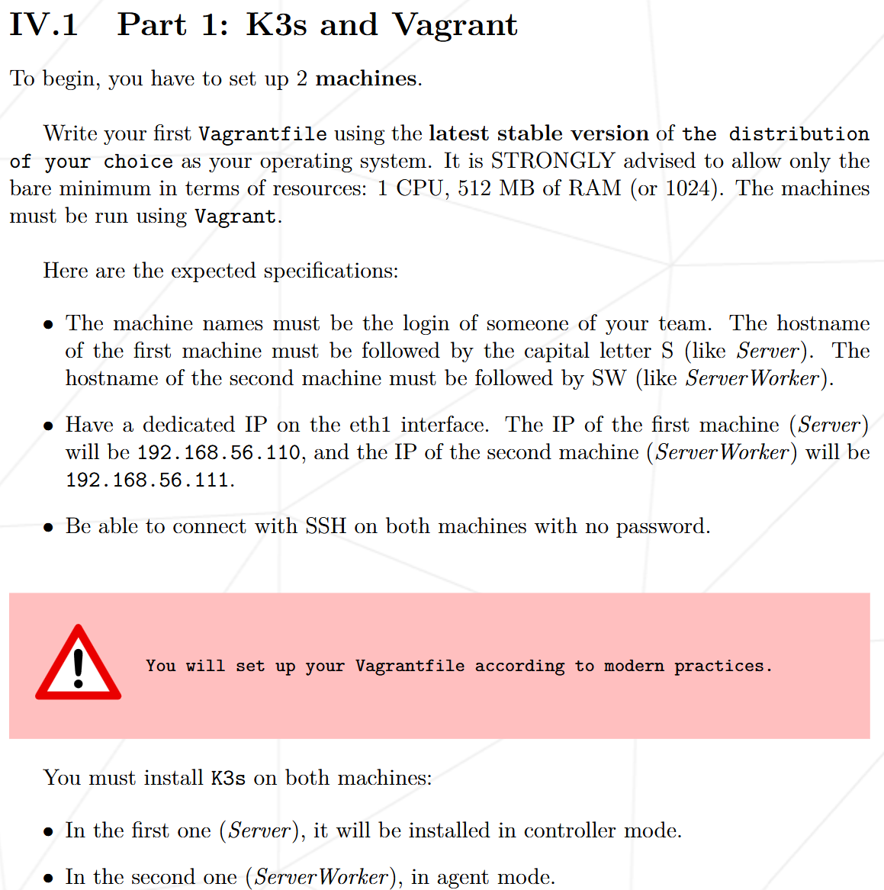
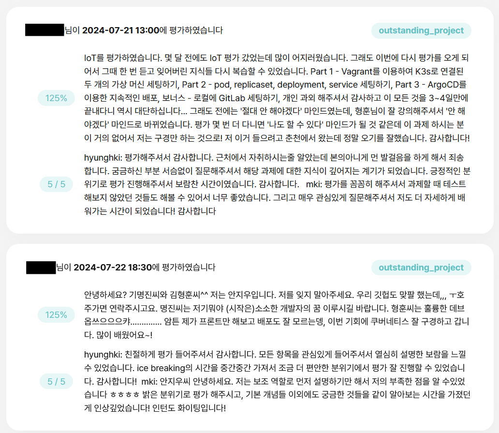

{.post-thumbnail}

::: {.callout-note appearance="simple"}
아직 작성중인 노트입니다.
:::

## intro


42 Seoul의 공통 과정을 마무리하면, 원하는 분야를 선택하여 심화 과제를 수행할 수 있습니다. 그중에서도 'Inception-of-Things'는 인프라 관련 심화 과제로, 가장 많은 경험치를 얻을 수 있는 과제입니다.

얼핏 보면 매우 어려운 과제처럼 느껴질 수 있지만, 개념을 확실히 이해하고 공부한다면 누구나 빠르게 완료할 수 있다고 생각합니다. 저의 경우, CKA 자격증 취득을 목표로 k8s를 공부하던 중 우연히 팀원을 구하게 되어 이 과제를 수행하게 되었습니다. 배경지식이 어느 정도 있는 상태에서 진행하다 보니, 크게 어렵지 않게 잘 마무리할 수 있었던 것 같습니다.

## 프로젝트 및 구현 설명

### 개요

[과제 명세서](https://cdn.intra.42.fr/pdf/pdf/143948/en.subject.pdf)

참고한 자료는 다음과 같습니다:

- [CKA Udemy 강의](https://www.udemy.com/course/certified-kubernetes-administrator-with-practice-tests/)
- [ArgoCD Udemy 강의](https://www.udemy.com/course/argo-cd-essential-guide-for-end-users-with-practice/)
- [gitlab helm 베포 Docs](https://docs.gitlab.com/charts/)
- [Vagrant Docs](https://developer.hashicorp.com/vagrant/docs)

참고로 저는 보통 새로운 개념을 공부할 때, 영상 강의로 시작을 하지만, 공식 docs도 반드시 확인합니다.
강의가 오래되거나 혹은 강사가 생략해서 모든 개념을 다루지 않는 경우도 많기 때문입니다.

::: {.callout-note appearance="simple"}
전체 코드는 비공개 되어있는 상태입니다
:::

### Part 1



1. cluster가 뭔지
1. provision이 뭔지
1. k8s는 clusting 해주는 tool, provision은 vagrant로 진행
1. 진행 과정

```hcl
Vagrant.configure("2") do |config|
  config.vm.box = "bento/ubuntu-24.04"
  config.vm.box_version = "202404.26.0"

  config.vm.define "hyunghkiS" do |control|
    control.vm.hostname = "hyunghkiS"
    control.vm.network "private_network", ip: "192.168.56.110"
    control.vm.provider "virtualbox" do |v|
      v.customize ["modifyvm", :id, "--name", "hyunghkiS"]
      v.memory = "1024"
      v.cpus = "1"
    end
    # just for evaluation
    control.vm.provision "shell", inline: <<-SHELL
      sudo apt-get update
      sudo apt-get install -y net-tools
    SHELL
    control.vm.provision "shell", path: "scripts/server.sh"
  end
  config.vm.define "hyunghkiSW" do |control|
    control.vm.hostname = "hyunghkiSW"
    control.vm.network "private_network", ip: "192.168.56.111"
    control.vm.provider "virtualbox" do |v|
      v.customize ["modifyvm", :id, "--name", "hyunghkiSW"]
      v.memory = "1024"
      v.cpus = "1"
    end
    # just for evaluation
    control.vm.provision "shell", inline: <<-SHELL
      sudo apt-get update
      sudo apt-get install -y net-tools
    SHELL
    control.vm.provision "shell", path: "scripts/agent.sh"
  end
end
```

vagrant file

```bash
#!/bin/bash

echo 'alias k=kubectl' >> /home/vagrant/.bashrc
source /home/vagrant/.bashrc

curl -sfL https://get.k3s.io | K3S_KUBECONFIG_MODE="644" sh -s - server --node-ip 192.168.56.110
K3S_TOKEN=$(sudo cat /var/lib/rancher/k3s/server/node-token)
echo $K3S_TOKEN > /vagrant/k3s_token
```

server script

```bash
#!/bin/bash

echo 'alias k=kubectl' >> /home/vagrant/.bashrc
source /home/vagrant/.bashrc

K3S_TOKEN=$(cat /vagrant/k3s_token)
curl -sfL https://get.k3s.io | K3S_URL=https://192.168.56.110:6443 K3S_TOKEN=$K3S_TOKEN sh -s - --node-ip 192.168.56.111
```

agent script

### Part 2


1. 본격적으로 cluster 구조에 대해 설명
1. pod, replicaset, 또 뭐 있었는데 어쨌든 설명
1. 진행 과정

```hcl
Vagrant.configure("2") do |config|
  config.vm.box = "bento/ubuntu-24.04"
  config.vm.box_version = "202404.26.0"

  config.vm.define "hyunghkiS" do |control|
    control.vm.hostname = "hyunghkiS"
    control.vm.network "private_network", ip: "192.168.56.110"
    control.vm.provider "virtualbox" do |v|
      v.customize ["modifyvm", :id, "--name", "hyunghkiS"]
      v.memory = "8192"
      v.cpus = "5"
    end
    config.vm.synced_folder "confs", "/etc/vagrant/confs"
    control.vm.provision "shell", path: "scripts/server.sh"
  end
end
```

vagrant file

```bash
#!/bin/bash

echo 'alias k=kubectl' >> /home/vagrant/.bashrc
source /home/vagrant/.bashrc
curl -sfL https://get.k3s.io | K3S_KUBECONFIG_MODE="644" sh -s - server
until kubectl get crd | grep -q 'ingressroutes.traefik.containo.us'; do
	echo 'waiting for CRD...'
	sleep 1
done
kubectl apply -f /etc/vagrant/confs

until [ ! -z "$(kubectl get pods -o jsonpath='{.items[*].metadata.name}')" ]; do
	sleep 1
done
for pod in $(kubectl get pods -o jsonpath='{.items[*].metadata.name}'); do
    until kubectl get pods $pod | grep -q 'Running'; do
        sleep 1
    done
	app_name=$(kubectl get pods $pod -o jsonpath='{.metadata.labels.app}')
    HTML=$(cat <<EOF
<!DOCTYPE html>
<html> 
<head> 
    <title>Hello Kubernetes!</title>
</head>
<body>

    <div class="main">
        <div class="content">
            <div id="message"> 
    Hello from ${app_name}.
</div>
<div id="info">
    <table> 
        <tr>
            <th>pod:</th> 
            <td>${pod}</td>
        </tr>
        <tr>
            <th>node:</th> 
            <td>$(uname -s) ($(uname -r))</td> 
        </tr> 
    </table>

</div> 
    </div> 
</div>
</body>
</html>
EOF
)
    echo $"${HTML}" > /home/vagrant/index.html
	kubectl cp /home/vagrant/index.html $pod:/usr/share/nginx/html/index.html > /dev/null
done
```

server script

```{.python filename=deploy.yml}
apiVersion: apps/v1
kind: Deployment
metadata:
  name: app-one
  labels:
    app: app1
spec:
  replicas: 1
  selector:
    matchLabels:
      app: app1
  template:
    metadata:
      labels:
        app: app1
    spec:
      containers:
      - name: nginx
        image: nginx
        ports:
        - containerPort: 80
---
apiVersion: apps/v1
kind: Deployment
metadata:
  name: app-two
  labels:
    app: app2
spec:
  replicas: 3
  selector:
    matchLabels:
      app: app2
  template:
    metadata:
      labels:
        app: app2
    spec:
      containers:
      - name: nginx
        image: nginx
        ports:
        - containerPort: 80
---
apiVersion: apps/v1
kind: Deployment
metadata:
  name: app-three
  labels:
    app: app3
spec:
  replicas: 1
  selector:
    matchLabels:
      app: app3
  template:
    metadata:
      labels:
        app: app3
    spec:
      containers:
      - name: nginx
        image: nginx
        ports:
        - containerPort: 80
```

```{.python filename=ing.yml}
apiVersion: networking.k8s.io/v1
kind: Ingress
metadata:
  name: ingress
spec:
  ingressClassName: traefik
  rules:
  - host: "app1.com"
    http:
      paths:
      - pathType: Prefix
        path: "/"
        backend:
          service:
            name: app-one
            port:
              number: 80
  - host: "app2.com"
    http:
      paths:
      - pathType: Prefix
        path: "/"
        backend:
          service:
            name: app-two
            port:
              number: 80
```

```{.python filename=route.yml}
apiVersion: traefik.containo.us/v1alpha1
kind: IngressRoute
metadata:
  name: default-backend
spec:
  routes:
    - match: PathPrefix(`/`)
      kind: Rule
      services:
        - name: app-three
          port: 80
```

```{.python filename=svc.yml}
apiVersion: v1
kind: Service
metadata:
  name: app-one
spec:
  selector:
    app: app1
  ports:
    - protocol: TCP
      port: 80
      targetPort: 80
---
apiVersion: v1
kind: Service
metadata:
  name: app-two
spec:
  selector:
    app: app2
  ports:
    - protocol: TCP
      port: 80
      targetPort: 80
---
apiVersion: v1
kind: Service
metadata:
  name: app-three
spec:
  selector:
    app: app3
  ports:
    - protocol: TCP
      port: 80
      targetPort: 80
```

### Part 3


1. ArgoCD에 대해 설명
1. 진행 과정

```bash
#!/bin/bash

if ! type kubectl 2> /dev/null; then
    brew install kubectl
fi
if ! type k3d 2> /dev/null; then
	brew install k3d
fi

k3d cluster create argocd -p "9999:9999@loadbalancer" -p "8888:8888@loadbalancer" -p "80:80@loadbalancer"
kubectl create ns argocd
kubectl create ns dev
kubectl create ns gitlab

kubectl apply -n argocd -f https://raw.githubusercontent.com/argoproj/argo-cd/stable/manifests/install.yaml
kubectl patch deploy argocd-server -n argocd --type='json' -p='[{"op": "add", "path": "/spec/template/spec/containers/0/args/-", "value": "--insecure"}]'

kubectl get cm argocd-cm -n argocd -o yaml > tmp.yml
echo $'data:\n  timeout.reconciliation: 10s' >> tmp.yml
kubectl apply -f tmp.yml && rm tmp.yml
kubectl rollout restart deploy argocd-repo-server -n argocd
until kubectl get svc -n kube-system | grep -q traefik; do
	sleep 1
done
kubectl patch svc traefik -n kube-system -p '{"spec":{"ports":[{"name":"wil","port":8888,"targetPort":"wil"},{"name":"glab","port":9999,"targetPort":"glab"}]}}'

kubectl patch deploy traefik -n kube-system --type='json' -p='[
    {"op": "add", "path": "/spec/template/spec/containers/0/ports/-", "value": {"containerPort": 8888, "name": "wil", "protocol": "TCP"}},
    {"op": "add", "path": "/spec/template/spec/containers/0/ports/-", "value": {"containerPort": 9999, "name": "glab", "protocol": "TCP"}},
    {"op": "add", "path": "/spec/template/spec/containers/0/args/-", "value": "--entrypoints.wil.address=:8888/tcp"},
    {"op": "add", "path": "/spec/template/spec/containers/0/args/-", "value": "--entrypoints.glab.address=:9999/tcp"}
]'

until kubectl get crd | grep -q 'ingressroutes.traefik.containo.us'; do
	echo 'waiting for CRD...'
	sleep 1
done
kubectl apply -f ../confs/mand

until [ $(kubectl get deploy -n argocd argocd-server -ojsonpath='{.status.availableReplicas}') -ne 0 ] 2> /dev/null; do
	sleep 1
	echo 'waiting for argocd ready...'
done
echo $'\e[92mSetting done!\e[0m\nYou can start with admin password:' $(kubectl get secret argocd-initial-admin-secret -n argocd -o json | grep password | awk '{gsub(/"/, "", $2); print $2}'| base64 --decode)
```

```{.python filename=application.yml}
apiVersion: argoproj.io/v1alpha1
kind: Application
metadata:
  name: myapp
  namespace: argocd
spec:
  destination:
    namespace: dev
    server: "https://kubernetes.default.svc"
  project: development
  source:
    path: manifests
    repoURL: "https://github.com/42-iot/hyunghki_source.git"
    targetRevision: HEAD
  syncPolicy:
    automated:
      prune: true
```

```{.python filename=dev_route.yml}
apiVersion: argoproj.io/v1alpha1
kind: Application
metadata:
  name: myapp
  namespace: argocd
spec:
  destination:
    namespace: dev
    server: "https://kubernetes.default.svc"
  project: development
  source:
    path: manifests
    repoURL: "https://github.com/42-iot/hyunghki_source.git"
    targetRevision: HEAD
  syncPolicy:
    automated:
      prune: true
```

```{.python filename=ing.yml}
apiVersion: traefik.containo.us/v1alpha1
kind: IngressRoute
metadata:
  name: route
  namespace: dev
spec:
  entryPoints:
    - wil
  routes:
    - match: PathPrefix(`/`)
      kind: Rule
      services:
        - name: wil-playground
          port: 8888
```

```{.python filename=project.yml}
apiVersion: networking.k8s.io/v1
kind: Ingress
metadata:
  name: argocd-server-http
  namespace: argocd
  annotations:
    traefik.ingress.kubernetes.io/router.entrypoints: web
spec:
  ingressClassName: traefik
  rules:
  - http:
      paths:
      - path: /
        pathType: Prefix
        backend:
          service:
            name: argocd-server
            port:
              name: http
```

```{.python filename=bonus_application.yml}
apiVersion: argoproj.io/v1alpha1
kind: Application
metadata:
  name: gitlab-app
  namespace: argocd
spec:
  destination:
    namespace: gitlab
    server: "https://kubernetes.default.svc"
  project: default
  source:
    path: manifests
    repoURL: "http://gitlab.192.168.56.110.nip.io/root/hyunghki.git"
    targetRevision: master
  syncPolicy:
    automated:
      prune: true
```

```{.python filename=bonus_route.yml}
apiVersion: argoproj.io/v1alpha1
kind: Application
metadata:
  name: gitlab-app
  namespace: argocd
spec:
  destination:
    namespace: gitlab
    server: "https://kubernetes.default.svc"
  project: default
  source:
    path: manifests
    repoURL: "http://gitlab.192.168.56.110.nip.io/root/hyunghki.git"
    targetRevision: master
  syncPolicy:
    automated:
      prune: true
```

### Bonus Part


1. helm chart가 뭔지
1. gitlab cluster가 왜 필요한지
1. 진행 과정

```hcl
Vagrant.configure("2") do |config|
  config.vm.box = "bento/ubuntu-24.04"
  config.vm.box_version = "202404.26.0"

  config.vm.define "hyunghkiS" do |control|
    control.vm.hostname = "hyunghkiS"
    control.vm.network "private_network", ip: "192.168.56.110"
    control.vm.provider "virtualbox" do |v|
      v.customize ["modifyvm", :id, "--name", "hyunghkiS"]
      v.memory = "16384"
      v.cpus = "5"
    end
    config.vm.synced_folder "confs", "/etc/vagrant/confs"
    control.vm.provision "shell", path: "scripts/setting.sh"
  end
end
```

vagrant file

```bash
echo 'alias k=kubectl' >> /home/vagrant/.bashrc
source /home/vagrant/.bashrc

# install kubectl
curl -sfL https://get.k3s.io | K3S_KUBECONFIG_MODE="644" sh -s - server --disable=traefik

# install helm
curl https://baltocdn.com/helm/signing.asc | gpg --dearmor | sudo tee /usr/share/keyrings/helm.gpg > /dev/null
sudo apt-get install -y apt-transport-https
echo "deb [arch=$(dpkg --print-architecture) signed-by=/usr/share/keyrings/helm.gpg] https://baltocdn.com/helm/stable/debian/ all main" | sudo tee /etc/apt/sources.list.d/helm-stable-debian.list
sudo apt-get update
sudo apt-get install -y helm

# setting gitlab
kubectl create ns gitlab
export KUBECONFIG=/etc/rancher/k3s/k3s.yaml

helm repo add gitlab https://charts.gitlab.io/
helm repo update
helm upgrade --namespace gitlab \
	--install gitlab gitlab/gitlab \
	--set global.hosts.domain=192.168.56.110.nip.io \
	--set global.hosts.externalIP=192.168.56.110 \
	--set global.ingress.tls.enabled=false \
	--set global.hosts.https=false \
	--set global.ingress.configureCertmanager=false \
	--set global.edition=ce \
	--set global.shell.port=4242

until [ $(kubectl get deploy -n gitlab gitlab-webservice-default -ojsonpath='{.status.availableReplicas}') -ne 0 ] 2> /dev/null; do
	sleep 1
	echo 'waiting for gitlab ready...'
done

echo $'\e[92mAll done!\e[0m\nYou can start with root password:' $(kubectl get secret gitlab-gitlab-initial-root-password -n gitlab -ojsonpath='{.data.password}' | base64 --decode)
```

## 결과





## outro

k8s의 개략적인 개념을 적용해보기 좋은 과제였던것 같습니다.
왠지 이 과제를 발판으로 삼아 더 응용할만한 과제가 있을법 한데, 의외로 후속 과제가 없는것이 조금 아쉬웠습니다.
개인적으로 조금 더 깊이 있는 infra 분야의 심화 과제가 많이 나왔으면 좋겠네요.
