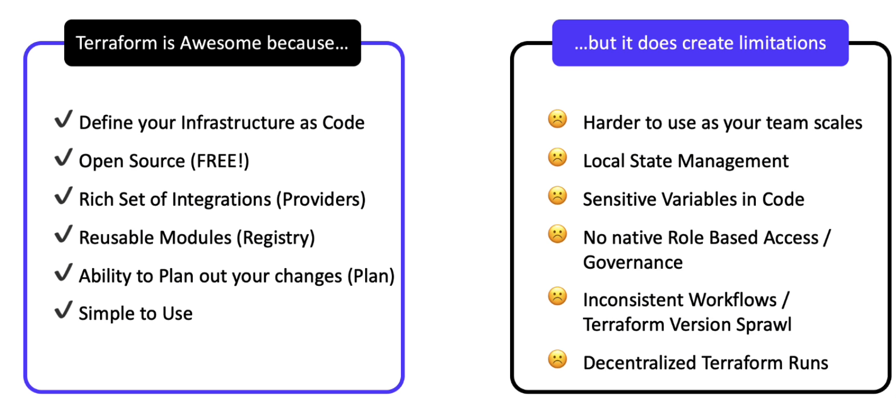
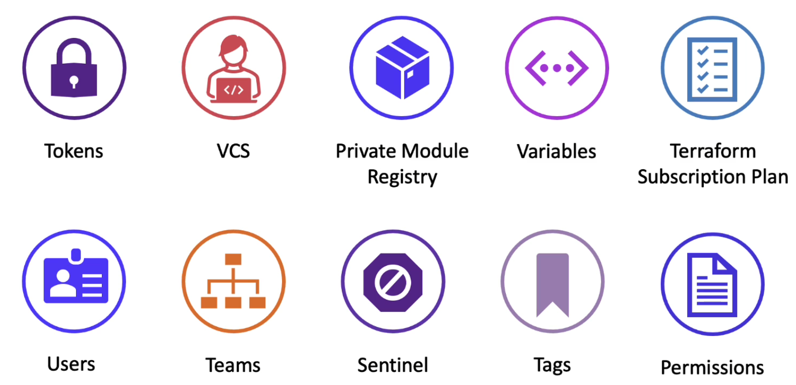

{.post-thumbnail}

## What is Terraform Cloud?

- Terraform Open-Source를 확장해주는 서비스

- 기존의 terraform을 대규모 팀 단위에서 사용하기엔 무리가 있음 → TFC
- on-premise 환경을 위한 Terraform Enterpise 서비스도 존재함.

- TACOS: Terraform Automation & Collaboration Software

## What is Organization?

- workspaces, policies, terraform modules를 공유하는 공간

- 하나의 조직을 운용하는 것이 일반적이나, 조직 구조에 따라 여러 조직을 생성해서 운용할 수 있다.

## Authenticating to TFC

1. web interface
1. CLI

### Token

- User Tokens
- Team Tokens: CI/CD pipeline에 주로 사용됨
- Organization Tokens

