{.post-thumbnail}

## Intro


ft_printf는 42 Seoul 공통과정 초반에 수행했던 과제입니다.
개인적으로는 지금처럼 ai가 코드를 짜주는 시대 이전에 한 줄 한 줄 공들여가며 짰던 코드라서 정감이 가는 프로젝트입니다.
투박하고 난잡하지만 그 시절 저만의 문법이 많이 담겨 있습니다.
3년이라는 시간이 지나 코드의 세부 내용은 많이 희미해졌지만, C언어에 대한 기억을 되살려가며 코드를 하나씩 설명해보도록 하겠습니다.

## 프로젝트 설명

### 개요

[과제 명세서](pdf/ft_printf.pdf)

이 프로젝트는 C언어의 printf 함수를 직접 구현하는 과제입니다.
얼핏 단순해 보이지만, printf의 작동 원리를 깊이 이해해야 하는 복잡한 과제입니다.
구현 시 반드시 [norminette 규칙](https://github.com/taeng42/norminette/blob/master/pdf/ko.norm.pdf)을 준수해야 하는데, 이는 코드의 가독성을 위한 것이고, 대표적인 예시는 다음과 같습니다.

- 파일당 함수 5개 이하
- 함수당 코드 25줄 이하
- 한 줄당 80자 이하

재가 작성한 코드 중에서 이 규칙을 피하기 위해 온 몸 비틀기를 한 흔적이 남아있습니다. (이 부분이 ai로는 절대 짤 수 없는 재미 포인트죠. 지저분하지만 말입니다. 하하)
구현의 정확성을 위해 [ISO C99 표준 문서](pdf/Iso_C_1999_definition.pdf)의 285페이지를 참고했습니다.
자세한 내용은 코드와 함께 설명드리겠습니다.

::: {.callout-note appearance="simple"}
이 포스팅에서 makefile과 ar 명령어에 대한 설명은 생략하겠습니다.
:::

### Mandatory


허용 함수부터 보겠습니다.

- malloc
- free
- write
- va_start, va_arg, va_copy, va_end

buffer는 따로 구현하지 않을 예정이기 때문에 malloc과 free 함수는 사용하지 않았습니다.
일반적인 printf는 출력을 버퍼에 모았다가 한 번에 내보내지만 저는 구현의 편의를 위해 `write(1, ...)`로 한 글자씩 바로 출력했습니다. (memmory 관리는 이후 작성할 minishell에서 질리도록 해줍니다.)

이중 눈여겨볼 함수는 va_ ... 함수들인데, 각각의 설명은 [이 문서](https://linux.die.net/man/3/va_start)를 참조했습니다.
간단히 설명하자면 이렇습니다. printf처럼 인자의 개수와 타입이 고정되지 않은 함수를 가변 인자(variadic) 함수라고 합니다. C에서는 `<stdarg.h>`의 매크로로 이 인자들을 다루는데, `va_start(ap, s)`로 마지막 고정 인자(`s`) 다음부터 읽을 준비를 하고, `va_arg(ap, 타입)`을 호출할 때마다 지정한 타입 크기만큼 스택을 따라가며 인자를 하나씩 꺼냅니다. 그래서 format 문자열에서 만난 specifier에 맞춰 타입을 직접 지정해줘야 합니다(`%d`면 `int`, `%p`면 `void *` 처럼요). 다 쓰고 나면 `va_end(ap)`로 정리합니다.


### Bonus


flag에 대한 내용이 나옵니다.
이제 여기서부터 과제가 애매해지기 시작하는데, 구현 범위를 확실하게 정해야합니다.
그래야 undefined behavior가 발생시, 적절한 답변을 할 수 있습니다.

과제에서 제시한 flag들에 대한 설명이 나오는 부분을 한번 보겠습니다.
과제와 ISO C99 §7.19.6.1 para 6을 기준으로 정리하면 flag의 의미는 다음과 같습니다.

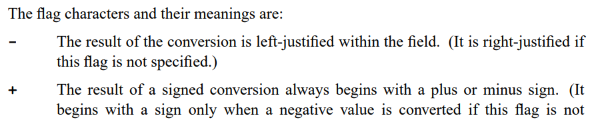

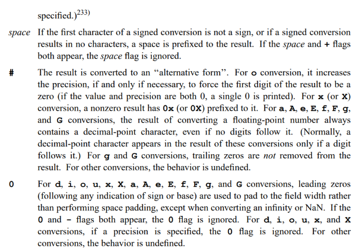

- `-` : 필드 안에서 왼쪽 정렬 (기본은 오른쪽 정렬)
- `+` : 부호 있는 변환의 결과 앞에 항상 부호(`+`/`-`)를 붙임
- 공백 : 부호가 없을 때 그 자리에 공백 하나를 붙임
- `#` : `x`/`X` 변환에서 0이 아닌 값에 `0x`/`0X` 접두사를 붙임
- `0` : 남는 자리를 공백 대신 `0`으로 채움

width는 최소 출력 너비, precision은 (정수에서는) 최소 자릿수를 뜻합니다. 각 flag가 코드에서 실제로 어떻게 처리되는지는 아래 코드 설명으로 다루겠습니다.

## 코드 설명

::: {.callout-note appearance="simple"}
전체 코드는 [github repo](https://github.com/cryscham123/my_printf)에서 확인 가능합니다.
:::

header 먼저 살펴보도록 하겠습니다.  
변수명이 마음에 안들지만, 협업 경험이 전혀 없던 시기에 작성한 코드임을 감안해주시길 바랍니다.

```c
#ifndef FT_PRINTF_H
# define FT_PRINTF_H

/*printf에서 사용할 함수들을 macro로 설정해주었습니다. */
/*이 당시엔 enum을 몰라서 이렇게 구현을 했습니다..*/

# define F_WDTH 64
# define F_PREC 32
# define F_ZERO 16
# define F_LEFT 8
# define F_PLUS 4
# define F_SHAP 2
# define F_SPACE 1

# include <stdarg.h>
# include <unistd.h>

/*specifier 문자를 만났을 때, 어떻게 출력을 해야되는지에 대한 정보를 저장할 구조체입니다.*/

typedef struct s_info
{
	unsigned int	flag; /*이 변수에 flag 정보를 비트연산으로 저장합니다.*/
	int				field[2]; # width/precision 값 저장 (field[0]=width, field[1]=precision)
	int				cnt; /*specifier 문자를 처리할 때, 출력하는 문자의 갯수를 저장합니다.*/
	char			cmd; /*어떤 specifier를 처리하는지 저장합니다.*/
}	t_info;

int	ft_printf(const char *s, ...);
int	ft_putchr(char c, t_info *i);
int	ft_printstr(char *s, t_info *i);
int	ft_putnum(long long num, t_info *i, int cur);
int	ft_puthex(unsigned long long n, t_info *i, int cur);
int	ft_max(int a, int b);
int	ft_padding(t_info *i, int n);
int	ft_precision(t_info *i, int num, int n, int target);

#endif
```

다음으로, ft_printf.c 파일의 함수들을 살펴보겠습니다.

```c
int	ft_printf(const char *s, ...)
{
	va_list	ap;
	int		cnt;
	int		tmp;

	va_start(ap, s); # 변수 초기화
	cnt = 0;
	while (*s != '\0')
	{
		if (*s == '%') # format 문자를 만날 경우
		{
			s++;
			tmp = ft_convert(&ap, &s); # format 문자를 ft_convert 함수에서 처리해줍니다.
		}
		else
			tmp = write(1, s, 1); # format 문자가 아닐 경우 그대로 출력합니다.
		if (tmp < 0)
			return (-1); # 출력에 실패하면 -1을 반환합니다. 동적할당을 하지 않았기때문에 다른 조치는 취하지 않습니다.
		cnt += tmp; # 출력한 문자 갯수만큼 계속 저장해줍니다.
		s++;
	}
	va_end(ap);
	return (cnt); # 최종적으로 출력에 성공한 문자의 갯수를 반환합니다.
}
```

```c
/*flag에 대한 정보를 먼저 처리해줍니다.*/
static int	ft_convert(va_list *ap, const char **s)
{
	t_info	i;
	int		tmp;

	i.flag = 0; # 변수들을 초기화 해줍니다.
	i.cnt = 0;
	i.field[0] = 0;
	i.field[1] = 0;
	while (**s == '#' || **s == ' ' || **s == '0' || **s == '-' || **s == '+')
	{
		tmp = "!!!!!!!!!!!!!!!!!!!!!!!!!!!!!!!!0!!1!!!!!!!2!3!!4"[(int)**s];
		i.flag |= (1 << (tmp - '0'));
		(*s)++;
	}
	while (**s == '.' || (**s >= '1' && **s <= '9'))
	{
		tmp = (**s == '.');
		(*s) += tmp;
		i.flag |= (F_WDTH >> tmp);
		while (**s >= '0' && **s <= '9')
		{
			i.field[tmp] = i.field[tmp] * 10 + (**s - '0');
			(*s)++;
		}
	}
	return (ft_parse(ap, **s, i));
}
```

앞서 말씀드렸던 norminette 온 몸 비틀기가 등장하는 순간입니다.
특이한 부분이 두 곳 보이는데, 이 부분들 먼저 짚고 넘어가겠습니다.

먼저 flag를 읽는 부분입니다.

```c
tmp = "...0!!1!!!!!!!2!3!!4"[(int)**s];
i.flag |= (1 << (tmp - '0'));
```

flag 문자를 if-else로 일일이 비교하는 대신, 문자의 ASCII 값으로 문자열을 인덱싱했습니다. 공백(32)·`#`(35)·`+`(43)·`-`(45)·`0`(48) 위치에 각각 `'0'`부터 `'4'`까지를 박아 두고 나머지 자리는 `!`로 채운 룩업 테이블입니다. 꺼낸 숫자 `d`로 `1 << d`를 만들면 바로 해당 flag 비트가 됩니다. 분기 없이 두 줄로 끝나서 norminette의 함수 길이 제한에도 유리했습니다.

width와 precision을 읽는 부분도 한 루프로 합쳤습니다.

```c
while (**s == '.' || (**s >= '1' && **s <= '9'))
{
    tmp = (**s == '.');
    (*s) += tmp;
    i.flag |= (F_WDTH >> tmp);

    ...
```

`.`이면 `tmp`가 1, 아니면 0입니다. `F_WDTH`(64)를 `tmp`만큼 오른쪽으로 밀면 width일 때는 64(`F_WDTH`), precision일 때는 32(`F_PREC`)가 되고, 저장 위치도 `field[0]`/`field[1]`로 갈립니다. 같은 코드로 둘 다 처리하는 셈입니다.

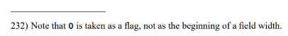

참고로 바깥 조건이 `**s >= '1'`로 시작하는 이유는, ISO C99에 `0`을 width의 시작이 아니라 flag로 취급하라고 되어있기 때문입니다(§7.19.6.1, 각주 232).
만약 precision만 있고, 숫자가 없는 경우 0으로 처리됩니다.

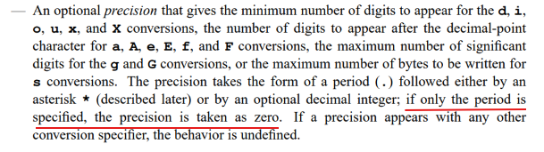

- precision이 `.`만 있고 숫자가 없으면 0으로 취급합니다.

```c
static void	ft_flag_validate(t_info *i)
{
	if ((i->flag & F_ZERO) && (i->flag & F_LEFT))
		i->flag &= ~F_ZERO;
	if ((i->flag & F_ZERO) && (i->flag & F_PREC))
		i->flag &= ~F_ZERO;
	if ((i->flag & F_SPACE) && (i->flag & F_PLUS))
		i->flag &= ~F_SPACE;
}

/*본격적으로 specifier를 처리해주는 로직입니다.*/
static int	ft_parse(va_list *ap, char c, t_info i)
{
	int	status;

	i.cmd = c;
	ft_flag_validate(&i);
	if (c == 'c')
		status = ft_putchr((char)(va_arg(*ap, size_t)), &i);
	else if (c == '%')
		status = ft_putchr('%', &i);
	else if (c == 's')
		status = ft_printstr(va_arg(*ap, char *), &i);
	else if (c == 'd' || c == 'i')
		status = ft_putnum(va_arg(*ap, int), &i, 0);
	else if (c == 'u')
		status = ft_putnum(va_arg(*ap, unsigned int), &i, 0);
	else if (c == 'p')
		status = ft_puthex((unsigned long long)va_arg(*ap, void *), &i, 0);
	else
		status = ft_puthex(va_arg(*ap, unsigned int), &i, 0);
    /* 왼쪽 정렬일 경우, 남는 공간을 padding으로 채워줍니다. */
	if (status < 0 || ft_padding(&i, i.cnt) < 0)
		return (-1);
	return (i.cnt);
}
```

```c
static void	ft_flag_validate(t_info *i)
{
	if ((i->flag & F_ZERO) && (i->flag & F_LEFT))
		i->flag &= ~F_ZERO;
	if ((i->flag & F_ZERO) && (i->flag & F_PREC))
		i->flag &= ~F_ZERO;
	if ((i->flag & F_SPACE) && (i->flag & F_PLUS))
		i->flag &= ~F_SPACE;
}
```

여기서 `ft_flag_validate` 함수가 특이합니다. 각각의 if문의 구현 근거는 ISO C99에서 비롯됩니다.

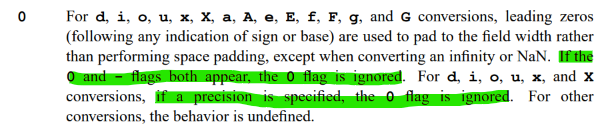

- precision에서 c s p % 연산자에서 precision이 지정된 경우는 undefiend bahavior이기 때문에 딱히 edge case로 처리하지 않습니다.


```c
else
    status = ft_puthex(va_arg(*ap, unsigned int), &i, 0);
```


정의되지 않은 specifier는 16진수처럼 처리됩니다. 어차피 ISO C99에서도 정의되지 않은 specifier에 대해서는 undefined behavior로 명시되어 있습니다.

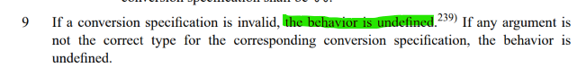

다음으로, parse.c 파일의 함수들입니다.

```c
int	ft_putchr(char c, t_info *i)
{
    /*이 로직은 putnum, puthex에서 사용됩니다.*/
	if (c == '!' && i->cmd != 'c' && i->cmd != 's')
		return (0);
    /* c와 %가 아닌경우 아래의 함수들에서 padding을 처리해 주고 있습니다. */
	if ((i->cmd == 'c' || i->cmd == '%') && !(i->flag & F_LEFT))
		if (ft_padding(i, 1) < 0)
			return (-1);
	i->cnt++;
	return (write(1, &c, 1));
}

int	ft_printstr(char *s, t_info *i)
{
	int	len;

	len = 0;
  /*mac 기준 printf에서는 null이 오면 (null)을 출력합니다. (다른 os는 동작이 다를 수 있습니다.)*/
	if (s == NULL)
		return (ft_printstr("(null)", i));
    /* precision이 지정된 경우, precision만큼만 출력합니다. 예) %7.3s는 "abcde"를 "    abc"로 출력합니다. */
	while (s[len] && !((i->flag & F_PREC) && len >= i->field[1]))
		len++;
	if (!(i->flag & F_LEFT))
		if (ft_padding(i, len) < 0)
			return (-1);
    /* 앞 부분 까지는 오른쪽 정렬의 경우에 padding부터 채웁니다. 이후 코드에서는 precision이 지정된 만큼만 str을 출력해 주고 있습니다.*/
	len = 0;
	while (s[len] && !((i->flag & F_PREC) && len >= i->field[1]))
	{
		if (ft_putchr(s[len], i) < 0)
			return (-1);
		len++;
	}
	return (0);
}

int	ft_putnum(long long num, t_info *i, int cur)
{
	int	is_sign;
	int	is_put;

	if (num < 0)
		i->flag |= (F_PLUS + F_SPACE);
  /*norminette 때문에 삼항연산자를 쓸 수 없어서 아래와 같이 작성했습니다.*/
	num *= 1 * (num >= 0) + -1 * (num < 0); 
	is_sign = (i->flag & (F_PLUS + F_SPACE)) != 0;
    /* %.0d, 0은 출력하지 않는 edge case 처리 */
	is_put = !(num == 0 && cur == 0 && i->field[1] == 0 && (i->flag & F_PREC));
	if (num < 10)
	{
        /* 0 패딩의 경우, 부호를 먼저 찍어 줍니다. */
		if ((i->flag & F_ZERO) && ft_putchr("! !!+-"[i->flag & 5], i) < 0)
			return (-1);
        /* 왼쪽 정렬이 아닌 경우, padding을 먼저 채워줍니다. 예) %.4d, 42 = "  42" */
		if (!(i->flag & F_LEFT))
			if (ft_padding(i, ft_max(cur + is_put, i->field[1]) + is_sign) < 0)
				return (-1);
        /* 0 패딩이 아닌경우, 부호를 나중에 찍어 줍니다. */
		if (!(i->flag & F_ZERO) && ft_putchr("! !!+-"[i->flag & 5], i) < 0)
			return (-1);
		if ((i->flag & F_PREC))
			return (ft_precision(i, num, cur, num % 10 + '0'));
		return (ft_putchr(num % 10 + '0', i));
	}
	if (ft_putnum(num / 10, i, cur + 1) < 0 || ft_putchr(num % 10 + '0', i) < 0)
		return (-1);
	return (0);
}

int	ft_puthex(unsigned long long num, t_info *i, int cur)
{
	char	s;
	int		is_sign;

  /* %x나 %p specifier의 경우 소문자로 출력 */
	s = "0123456789ABCDEF"[num % 16] | 32 * (i->cmd == 'x' || i->cmd == 'p');
	is_sign = (i->cmd == 'p' || (!(cur == 0 && num == 0) && (i->flag & 2))) * 2;
	if (num < 16)
	{
        /* putnum과 동일합니다 */
		if ((i->flag & F_ZERO) && is_sign != 0)
			if (ft_putchr('0', i) < 0 || ft_putchr("xX"[i->cmd == 'X'], i) < 0)
				return (-1);
		if (!(i->flag & F_LEFT))
			if (ft_padding(i, ft_max(cur + 1, i->field[1]) + is_sign) < 0)
				return (-1);
		if (!(i->flag & F_ZERO) && is_sign != 0)
			if (ft_putchr('0', i) < 0 || ft_putchr("xX"[i->cmd == 'X'], i) < 0)
				return (-1);
		if ((i->flag & F_PREC))
			return (ft_precision(i, num, cur, s));
		return (ft_putchr(s, i));
	}
	if (ft_puthex(num / 16, i, cur + 1) < 0 || ft_putchr(s, i) < 0)
		return (-1);
	return (0);
}
```

```c
#include "ft_printf.h"

int	ft_max(int a, int b)
{
	if (a >= b)
		return (a);
	return (b);
}

int	ft_padding(t_info *i, int n)
{
	char	padding;

	padding = ' ';
	if (i->flag & F_ZERO)
		padding = '0';
	while ((i->flag & F_WDTH) && n < i->field[0])
	{
		if (write(1, &padding, 1) < 0)
			return (-1);
		i->cnt++;
		n++;
	}
	return (0);
}

int	ft_precision(t_info *i, int num, int n, int target)
{
	if (num == 0 && n == 0 && i->field[1] == 0)
		return (0);
	while ((i->flag & F_PREC) && n < i->field[1] - 1)
	{
		if (ft_putchr('0', i) < 0)
			return (-1);
		n++;
	}
	return (ft_putchr(target, i));
}
```

```c
/* precision이 지정된 경우, precision만큼만 출력합니다. 예) %7.3s는 "abcde"를 "    abc"로 출력합니다. */
while (s[len] && !((i->flag & F_PREC) && len >= i->field[1]))
    len++;
```

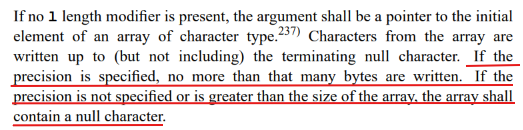

ft_printstr은 이 부분만 살펴보겠습니다. precision이 지정된 경우 precision만큼만 출력합니다. 즉 초과하는 자리에 대해서는 출력을 하지 않습니다.
하지만 남는 자리에 대해서는 딱히 무언가로 채워진다는 표준은 정의되어 있지 않습니다. (mac의 동작으로 처리해주었습니다.)

`ft_putnum`은 부호 있는 정수를 다룹니다. 음수가 들어오면 절댓값을 구해야 하는데, `INT_MIN`(-2147483648)은 `int`로 부호를 뒤집는 순간 오버플로우가 납니다. 그래서 인자를 처음부터 `long long`으로 받고,

```c
if (num < 0)
    i->flag |= (F_PLUS + F_SPACE);
num *= 1 * (num >= 0) + -1 * (num < 0);
is_sign = (i->flag & (F_PLUS + F_SPACE)) != 0;
```

음수값은 flag에 기록만 하고 전부 양수로 처리합니다.

출력 부호 문자를 고르는 부분도 특이합니다.

```c
ft_putchr("! !!+-"[i->flag & 5], i)
```

`& 5`는 `F_PLUS`(4)와 `F_SPACE`(1) 비트만 남기므로 인덱스는 0·1·4·5만 나오고, 각각 `!`·공백·`+`·`-`에 대응됩니다.

- 음수일 때는 위에서 `flag |= F_PLUS + F_SPACE`(=5)를 줬기 때문에 자연스럽게 `-`가 선택됩니다.
- 부호가 없어야 하는 경우의 `!`는 "아무것도 출력하지 않는다"는 (저만의)약속입니다. `ft_putchr` 맨 위에서 숫자 변환일 때 `!`가 들어오면 0을 반환하도록 해 둬서(앞서 "이 로직은 아래에서 사용됩니다"라고 적어 둔 그 줄입니다), 부호가 없을 때 별도 분기 없이 출력만 건너뜁니다.


```c
is_put = !(num == 0 && cur == 0 && i->field[1] == 0 && (i->flag & F_PREC));
if (num < 10)
{
    /* 0 패딩의 경우, 부호를 먼저 찍어 줍니다. */
    if ((i->flag & F_ZERO) && ft_putchr("! !!+-"[i->flag & 5], i) < 0)
        return (-1);
    /* 왼쪽 정렬이 아닌 경우, padding을 먼저 채워줍니다. */
    if (!(i->flag & F_LEFT))
        if (ft_padding(i, ft_max(cur + is_put, i->field[1]) + is_sign) < 0)
            return (-1);
    /* 0 패딩이 아닌경우, 부호를 나중에 찍어 줍니다. */
    if (!(i->flag & F_ZERO) && ft_putchr("! !!+-"[i->flag & 5], i) < 0)
        return (-1);
    if ((i->flag & F_PREC))
        return (ft_precision(i, num, cur, num % 10 + '0'));
    return (ft_putchr(num % 10 + '0', i));
}
```

아 이 부분이 제일 어렵습니다. 간단하게 설명드리자면, 본격적으로 숫자를 출력하기 전에 부호와 padding을 먼저 처리하는 로직입니다.

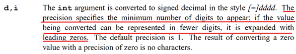

%d가 precision과 같이 오는 경우에 대해서 ISO C99에 정의가 되어 있습니다.

먼저 precision은 출력 digit의 최소 자리 갯수를 지정해주고, 남은 자리는 0으로 채워집니다. (참고로 flag의 padding과 precision의 남은 자리 0 채우기는 다르게 계산됩니다. 예) %8.5d, 42 = "  00042")
precision을 초과하는 경우에 대해서는 str과 다르게 출력이 정상적으로 이루어 집니다.
여기서 `%.0d`에 0을 넣으면 아무것도 출력하지 않습니다. (별의 별 edge case가 다 있죠?). 그 역할을 하는게 첫 번째 줄의 `is_put`입니다.

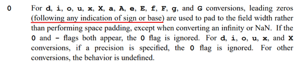

부호 출력 순서는 zero padding과 만나면 조금 다르게 구현됩니다.
표준에도 나와 있듯이, zero padding은 부호나 base(`0x` 같은 접두사)보다 먼저 나와야 합니다.

`ft_puthex`의 처리도 같은 결입니다. 겹치는 부분에 대해서는 설명을 생략하겠습니다.

%p의 처리부터 조금 살펴본다면,

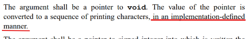

표준에서 `%p`의 출력 형식은 정하지 않습니다. NULL을 `0x0`으로 찍는 것, 소문자 16진수, `0x` 접두사 모두 표준 의무는 아니고, mac 출력 기준으로 구현되어 있습니다.

```c
is_sign = (i->cmd == 'p' || (!(cur == 0 && num == 0) && (i->flag & 2))) * 2;
```

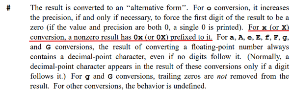

`%p`에서는 mac 기준으로 `0x0`으로 출력하도록 해주었습니다만, `%#x`에서는 표준에 따라 `0`으로 출력됩니다. (mac 역시 동일하게 동작합니다.)

## 결과


## Outro

C언어의 깊이 있는 매력을 경험할 수 있었던 과제라고 생각합니다.
과제 구현의 범위가 난해하고, norminette을 지키는 것 때문에 어려움이 조금 있었지만, 그래도 퍼즐 푸는 마음으로 흥미롭게 구현했던걸로 기억합니다.

사실 솔직히 말하면 제가 제출한 코드는 norminette을 아주 완벽하게 위반하고 있습니다.
norminette에서는 한 줄에 여러 동작을 하는 코드를 작성하지 말라고 나와있는데, 뭐..네 그렇습니다.
그래도 소설로 비유하면 가끔은 비유법과 은유법이 들어가줘야 재미가 있는것 아니겠습니까?
남들이 조금 못 알아보면 어떻습니까? 가끔은 이런 재미있는 코드도 존재해야 발전이라는게 있는거죠.

..농담이고 협업할때는 절대 이렇게 코드를 작성하지 않습니다. 사실 이 글을 작성하는 시점에서도 제 코드가 이해가 안되서 ai한테 물어보면서 작성했습니다.
어쨌든 긴 글 읽어주셔서 감사합니다!
