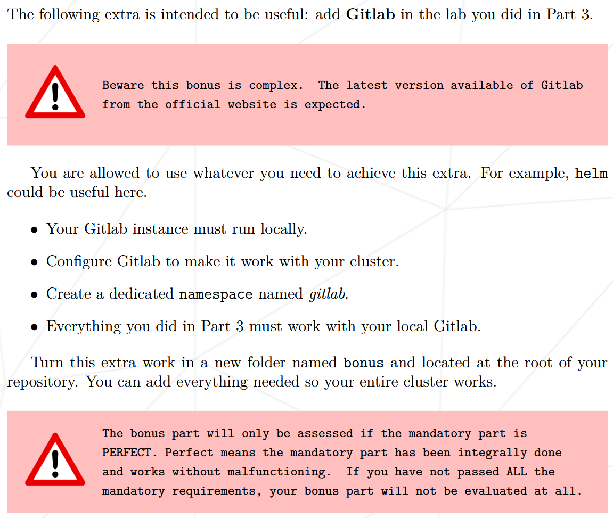

{.post-thumbnail}

### Part 3


1. ArgoCD에 대해 설명
1. 진행 과정

```bash
#!/bin/bash

if ! type kubectl 2> /dev/null; then
    brew install kubectl
fi
if ! type k3d 2> /dev/null; then
	brew install k3d
fi

k3d cluster create argocd -p "9999:9999@loadbalancer" -p "8888:8888@loadbalancer" -p "80:80@loadbalancer"
kubectl create ns argocd
kubectl create ns dev
kubectl create ns gitlab

kubectl apply -n argocd -f https://raw.githubusercontent.com/argoproj/argo-cd/stable/manifests/install.yaml
kubectl patch deploy argocd-server -n argocd --type='json' -p='[{"op": "add", "path": "/spec/template/spec/containers/0/args/-", "value": "--insecure"}]'

kubectl get cm argocd-cm -n argocd -o yaml > tmp.yml
echo $'data:\n  timeout.reconciliation: 10s' >> tmp.yml
kubectl apply -f tmp.yml && rm tmp.yml
kubectl rollout restart deploy argocd-repo-server -n argocd
until kubectl get svc -n kube-system | grep -q traefik; do
	sleep 1
done
kubectl patch svc traefik -n kube-system -p '{"spec":{"ports":[{"name":"wil","port":8888,"targetPort":"wil"},{"name":"glab","port":9999,"targetPort":"glab"}]}}'

kubectl patch deploy traefik -n kube-system --type='json' -p='[
    {"op": "add", "path": "/spec/template/spec/containers/0/ports/-", "value": {"containerPort": 8888, "name": "wil", "protocol": "TCP"}},
    {"op": "add", "path": "/spec/template/spec/containers/0/ports/-", "value": {"containerPort": 9999, "name": "glab", "protocol": "TCP"}},
    {"op": "add", "path": "/spec/template/spec/containers/0/args/-", "value": "--entrypoints.wil.address=:8888/tcp"},
    {"op": "add", "path": "/spec/template/spec/containers/0/args/-", "value": "--entrypoints.glab.address=:9999/tcp"}
]'

until kubectl get crd | grep -q 'ingressroutes.traefik.containo.us'; do
	echo 'waiting for CRD...'
	sleep 1
done
kubectl apply -f ../confs/mand

until [ $(kubectl get deploy -n argocd argocd-server -ojsonpath='{.status.availableReplicas}') -ne 0 ] 2> /dev/null; do
	sleep 1
	echo 'waiting for argocd ready...'
done
echo $'\e[92mSetting done!\e[0m\nYou can start with admin password:' $(kubectl get secret argocd-initial-admin-secret -n argocd -o json | grep password | awk '{gsub(/"/, "", $2); print $2}'| base64 --decode)
```

```{.python filename=application.yml}
apiVersion: argoproj.io/v1alpha1
kind: Application
metadata:
  name: myapp
  namespace: argocd
spec:
  destination:
    namespace: dev
    server: "https://kubernetes.default.svc"
  project: development
  source:
    path: manifests
    repoURL: "https://github.com/42-iot/hyunghki_source.git"
    targetRevision: HEAD
  syncPolicy:
    automated:
      prune: true
```

```{.python filename=dev_route.yml}
apiVersion: argoproj.io/v1alpha1
kind: Application
metadata:
  name: myapp
  namespace: argocd
spec:
  destination:
    namespace: dev
    server: "https://kubernetes.default.svc"
  project: development
  source:
    path: manifests
    repoURL: "https://github.com/42-iot/hyunghki_source.git"
    targetRevision: HEAD
  syncPolicy:
    automated:
      prune: true
```

```{.python filename=ing.yml}
apiVersion: traefik.containo.us/v1alpha1
kind: IngressRoute
metadata:
  name: route
  namespace: dev
spec:
  entryPoints:
    - wil
  routes:
    - match: PathPrefix(`/`)
      kind: Rule
      services:
        - name: wil-playground
          port: 8888
```

```{.python filename=project.yml}
apiVersion: networking.k8s.io/v1
kind: Ingress
metadata:
  name: argocd-server-http
  namespace: argocd
  annotations:
    traefik.ingress.kubernetes.io/router.entrypoints: web
spec:
  ingressClassName: traefik
  rules:
  - http:
      paths:
      - path: /
        pathType: Prefix
        backend:
          service:
            name: argocd-server
            port:
              name: http
```

```{.python filename=bonus_application.yml}
apiVersion: argoproj.io/v1alpha1
kind: Application
metadata:
  name: gitlab-app
  namespace: argocd
spec:
  destination:
    namespace: gitlab
    server: "https://kubernetes.default.svc"
  project: default
  source:
    path: manifests
    repoURL: "http://gitlab.192.168.56.110.nip.io/root/hyunghki.git"
    targetRevision: master
  syncPolicy:
    automated:
      prune: true
```

```{.python filename=bonus_route.yml}
apiVersion: argoproj.io/v1alpha1
kind: Application
metadata:
  name: gitlab-app
  namespace: argocd
spec:
  destination:
    namespace: gitlab
    server: "https://kubernetes.default.svc"
  project: default
  source:
    path: manifests
    repoURL: "http://gitlab.192.168.56.110.nip.io/root/hyunghki.git"
    targetRevision: master
  syncPolicy:
    automated:
      prune: true
```

### Bonus Part



1. helm chart가 뭔지
1. gitlab cluster가 왜 필요한지
1. 진행 과정

```hcl
Vagrant.configure("2") do |config|
  config.vm.box = "bento/ubuntu-24.04"
  config.vm.box_version = "202404.26.0"

  config.vm.define "hyunghkiS" do |control|
    control.vm.hostname = "hyunghkiS"
    control.vm.network "private_network", ip: "192.168.56.110"
    control.vm.provider "virtualbox" do |v|
      v.customize ["modifyvm", :id, "--name", "hyunghkiS"]
      v.memory = "16384"
      v.cpus = "5"
    end
    config.vm.synced_folder "confs", "/etc/vagrant/confs"
    control.vm.provision "shell", path: "scripts/setting.sh"
  end
end
```

vagrant file

```bash
echo 'alias k=kubectl' >> /home/vagrant/.bashrc
source /home/vagrant/.bashrc

# install kubectl
curl -sfL https://get.k3s.io | K3S_KUBECONFIG_MODE="644" sh -s - server --disable=traefik

# install helm
curl https://baltocdn.com/helm/signing.asc | gpg --dearmor | sudo tee /usr/share/keyrings/helm.gpg > /dev/null
sudo apt-get install -y apt-transport-https
echo "deb [arch=$(dpkg --print-architecture) signed-by=/usr/share/keyrings/helm.gpg] https://baltocdn.com/helm/stable/debian/ all main" | sudo tee /etc/apt/sources.list.d/helm-stable-debian.list
sudo apt-get update
sudo apt-get install -y helm

# setting gitlab
kubectl create ns gitlab
export KUBECONFIG=/etc/rancher/k3s/k3s.yaml

helm repo add gitlab https://charts.gitlab.io/
helm repo update
helm upgrade --namespace gitlab \
	--install gitlab gitlab/gitlab \
	--set global.hosts.domain=192.168.56.110.nip.io \
	--set global.hosts.externalIP=192.168.56.110 \
	--set global.ingress.tls.enabled=false \
	--set global.hosts.https=false \
	--set global.ingress.configureCertmanager=false \
	--set global.edition=ce \
	--set global.shell.port=4242

until [ $(kubectl get deploy -n gitlab gitlab-webservice-default -ojsonpath='{.status.availableReplicas}') -ne 0 ] 2> /dev/null; do
	sleep 1
	echo 'waiting for gitlab ready...'
done

echo $'\e[92mAll done!\e[0m\nYou can start with root password:' $(kubectl get secret gitlab-gitlab-initial-root-password -n gitlab -ojsonpath='{.data.password}' | base64 --decode)
```

## 결과


## outro

k8s의 개략적인 개념을 적용해보기 좋은 과제였던것 같습니다.
왠지 이 과제를 발판으로 삼아 더 응용할만한 과제가 있을법 한데, 의외로 후속 과제가 없는것이 조금 아쉬웠습니다.
개인적으로 조금 더 깊이 있는 infra 분야의 심화 과제가 많이 나왔으면 좋겠네요.
