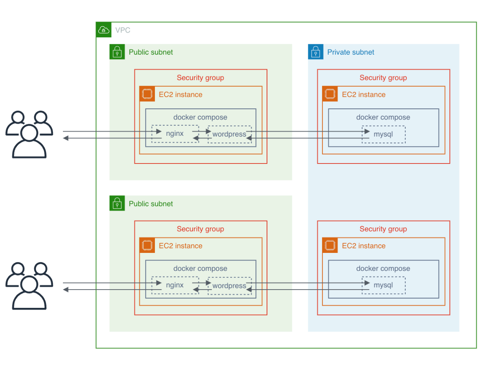
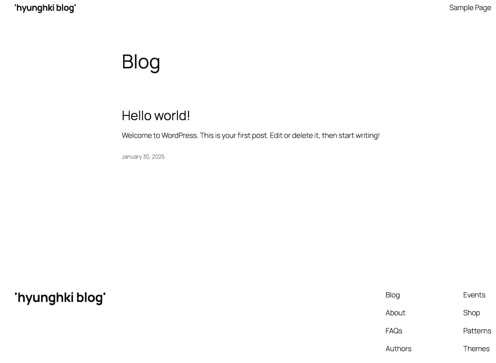

{.post-thumbnail}

## intro


[개념 설명](./08.md)에 이어서 진행하도록 하겠습니다.

::: {.callout-note appearance="simple"}
전체 코드는 [github repo](https://github.com/cryscham123/cloud-1)에서 확인하실 수 있습니다.
:::

## 프로젝트 및 구현 설명

### pre requirements

이 프로젝트를 진행하기 위해 필요한 것들은 다음과 같습니다.

- AWS IAM 계정
- Packer
- Terraform
- Ansible
- jq
- boto3

### build

최종 build는 (42 seoul 사람에게 익숙한) `makefile`을 사용했습니다.

::: {.callout-note appearance="simple"}
제가 아직 로컬에서 돌려볼만한 다른 build 툴을 배우지 않아서 makefile을 사용하긴 했지만, 사실 c언어도 아니고..이 과제 구현에서 이 tool이 그렇게 어울리진 않은거 같긴 합니다.
:::

```{.python filename=.env}
# only 1 line variable is allowed

AWS_REGION=
AWS_ACCESS_KEY_ID=
AWS_SECRET_ACCESS_KEY=
SERVER_INSTANCE_COUNT=

# public subnet에 접근할 수 있는 ip address를 지정해줍니다.
SSH_IP=

# public subnet에 접근할 때 사용할 ssh key path를 지정해줍니다.
SSH_PUBLIC_KEY_PATH=
SSH_PRIVATE_KEY_PATH=

# docker compose setting
MYSQL_USER=
MYSQL_PASSWORD=
MYSQL_ROOT_PASSWORD=
DATABASE_NAME=
SITE_TITLE=
ADMIN_NAME=
ADMIN_PASSWORD=
ADMIN_EMAIL=
USER_NAME=
USER_PASSWORD=
USER_EMAIL=
```

```{.python filename=Makefile}
# .env의 내용들을 makefile의 변수로 load 해줍니다.

include .env
export
```

먼저 `필요한 변수들`을 모두 `.env`에 저장해 `한번에 관리`할 수 있게 구현했습니다.
저장된 .env 내용은 makefile에서 위의 명령어로 불러와 build 명령어 실행시 사용할 수 있게 했습니다.

makefile이 .env 파일을 읽을 때 한 줄씩 읽기 때문에, 위의 방식으로 구현하면 여러 줄에 걸친 환경변수는 사용하기 어려울 수 있습니다.
(그럴땐 그냥 makefile 말고 다른 tool을 쓰면 됩니다)

```{.python filename=Makefile}
.PHONY: provision deploy all destroy re build_ami

all: build_ami provision deploy

build_ami: packer
	packer init $(PACKER_PATH)/database.pkr.hcl
	@PKR_VAR_AWS_REGION=$(AWS_REGION) \
	PKR_VAR_MYSQL_USER=$(MYSQL_USER) \
	PKR_VAR_MYSQL_PASSWORD=$(MYSQL_PASSWORD) \
	PKR_VAR_DATABASE_NAME=$(DATABASE_NAME) \
	PKR_VAR_MYSQL_ROOT_PASSWORD=$(MYSQL_ROOT_PASSWORD) \
	packer build $(PACKER_PATH)/database.pkr.hcl

provision: build_ami terraform
	terraform -chdir=$(PROVISION_PATH) init
	@TF_VAR_AWS_REGION=$(AWS_REGION) \
	TF_VAR_SERVER_INSTANCE_COUNT=$(SERVER_INSTANCE_COUNT) \
	TF_VAR_SSH_IP=$(SSH_IP) \
	TF_VAR_SSH_PUBLIC_KEY_PATH=$(SSH_PUBLIC_KEY_PATH) \
	terraform -chdir=$(PROVISION_PATH) apply -auto-approve

deploy: ansible
	@DB_PRIVATE_IP="$(shell terraform -chdir=$(PROVISION_PATH) output -json db_private_ip | jq -r '.[]' | tr '\n' ' ')" \
	ANSIBLE_HOST_KEY_CHECKING=False \
	ANSIBLE_REMOTE_USER=ubuntu \
	AWS_DEFAULT_REGION=$(AWS_REGION) \
	ANSIBLE_PYTHON_INTERPRETER=auto_silent \
	ansible-playbook \
	-i $(DEPLOY_PATH)/inventories \
	--private-key=$(SSH_PRIVATE_KEY_PATH) \
	$(DEPLOY_PATH)/server.yml 
```

build 과정은 `ami 생성`, `provision`, `ansible deploy` 순서로 진행됩니다.

각 과정에 필요한 변수들은 `명령어 수행 시 환경변수로 제공`해줍니다.
대표적으로 ansible의 경우, provision 이후 생성된 database ec2의 private ip를 전달하고 있습니다.

### Packer 코드

이 프로젝트에서는 데이터베이스 서버를 Private subnet에 위치시키고, Public subnet의 EC2만 이 데이터베이스에 접근할 수 있도록 설계했습니다. `Private subnet에 있는 서버`는 SSH 접근이 제한되기 때문에 `Ansible로 직접 설정하기는 어렵습니다.` 이런 경우 `Packer로 미리 설정된 AMI를 생성`하는 방법을 생각해볼 수 있습니다.

구현한 Packer 파일 구조는 아래와 같습니다.

```bash
packer/
├── database.pkr.hcl
└── ansible/
    ├── _requirements/                      # docker compose setting files
    ├── roles/setting_docker/tasks
    │   └── main.yml
    └── database.yml                        # playbook
```

먼저 `기본 이미지로 Ubuntu 20.04`를 사용하도록 작성했습니다.

```{.python filename=database.pkr.hcl}
source "amazon-ebs" "database" {
  region  = var.AWS_REGION
  profile = "default"

  ami_name      = "hyunghki-database-${formatdate("YYYYMMDDhhmmss", timestamp())}"
  instance_type = "t2.micro"
  source_ami_filter {
    filters = {
      name                = "ubuntu/images/hvm-ssd/ubuntu-focal-20.04-amd64-server-*"
      root-device-type    = "ebs"
      virtualization-type = "hvm"
    }
    most_recent = true
    owners      = ["099720109477"]
  }
  ssh_username = "ubuntu"
}
```

Packer는 기본적으로 이미지 생성을 위한 최소한의 기능만 제공하지만, 다양한 플러그인을 지원합니다.
여기서는 `Ansible 플러그인을 사용`하여 데이터베이스 서버 설정을 자동화했습니다.

```{.python filename=database.pkr.hcl}
build {
  sources = ["source.amazon-ebs.database"]

  provisioner "ansible" {
    playbook_file = "${path.root}/ansible/database.yml"
    user = "ubuntu"
    ansible_env_vars = [
      "ANSIBLE_HOST_KEY_CHECKING=False",
      "MYSQL_USER=${var.MYSQL_USER}",
      "MYSQL_PASSWORD=${var.MYSQL_PASSWORD}",
      "DATABASE_NAME=${var.DATABASE_NAME}",
      "MYSQL_ROOT_PASSWORD=${var.MYSQL_ROOT_PASSWORD}",
      "ANSIBLE_PYTHON_INTERPRETER=auto_silent"
    ]
  }
}
```

```{.python filename=ansible/database.yml}
- hosts: all
  gather_facts: false
  become: true
  roles:
    # docker compose를 machine에 설치해줍니다.
    - role: setting_docker

  tasks:
    # docker compose에 필요한 파일들을 옮겨줍니다.
    - name: copy_requirements
      copy:
        src: "./_requirements/"
        dest: "/home/{{ ansible_user }}/app/"
        mode: '0755'
        directory_mode: '0755'

    # 적절한 환경변수와 함께 docker compose 명령어를 실행합니다.
    - name: execute docker compose
      shell:
        cmd: docker-compose up -d
        chdir: "/home/{{ ansible_user }}/app/"
      environment:
        MYSQL_USER: "{{ lookup('env', 'MYSQL_USER') }}"
        MYSQL_PASSWORD: "{{ lookup('env', 'MYSQL_PASSWORD') }}"
        DATABASE_NAME: "{{ lookup('env', 'DATABASE_NAME') }}"
        MYSQL_ROOT_PASSWORD: "{{ lookup('env', 'MYSQL_ROOT_PASSWORD') }}"
```

이렇게 Ansible과 Packer를 조합하면 `멱등성이 보장되는 안정적인 서버 이미지를 생성`할 수 있습니다.

참고로 packer에서 ansible plugin을 사용할 때 `taget host를 ami가 build되는 임시 EC2로 간주`하기 때문에, `inventory는 사용하지 않습니다.`
자세한 내용은 [ansible part](#ansible-코드)를 참고해주세요.

### Terraform 코드

이제 본격적으로 provision을 해보겠습니다.
잠시 전체적인 구조를 다시 한번 보겠습니다.



필요한 리소스는 VPC, subnet, security group, ec2 입니다.

`server ec2`와 `database ec2`는 환경변수 SERVER_INSTANCE_COUNT에 지정된 갯수 만큼 생성됩니다.
database ec2는 이전 단계에서 생성한 ami를 사용해줍니다.

public, private subnet의 갯수는 임의로 생성했습니다.

파일 구조는 아래와 같습니다.

```bash
terraform/
├── main/
│   ├── main.tf
│   ├── data.tf
│   ├── output.tf
│   └── variables.tf
└── modules/network/
    ├── main.tf
    ├── output.tf
    └── variables.tf
```

main.tf에서는 `aws_instance`를 생성하고, 그 외 VPC, subnet과 같은 리소스는 `network module`로 분리해서 생성했습니다.

```{.python filename=modules/network/main.tf}
resource "aws_vpc" "main_vpc" {
  cidr_block           = "10.0.0.0/16"
  instance_tenancy     = "default"
  enable_dns_hostnames = "true"
}

resource "aws_subnet" "public-1" {
  vpc_id                  = aws_vpc.main_vpc.id
  cidr_block              = "10.0.1.0/24"
  map_public_ip_on_launch = "true"
  availability_zone       = "${var.AWS_REGION}a"
}

resource "aws_subnet" "public-2" {
  vpc_id                  = aws_vpc.main_vpc.id
  cidr_block              = "10.0.2.0/24"
  map_public_ip_on_launch = "true"
  availability_zone       = "${var.AWS_REGION}c"
}

resource "aws_subnet" "private" {
  vpc_id                  = aws_vpc.main_vpc.id
  cidr_block              = "10.0.3.0/24"
  map_public_ip_on_launch = "false"
  availability_zone       = "${var.AWS_REGION}a"
}
```

먼저 VPC와 subnet을 생성합니다.

cidr_block은 private ip 중에서 겹치지 않는 범위로 지정해줍니다.

::: {.callout-note appearance="simple"}
# Private IP ranges

- Class A: 10.0.0.0–10.255.255.255
- Class B: 172.16.0.0–172.31.255.255
- Class C: 192.168.0.0–192.168.255.255
:::

Public subnet이 인터넷과 통신하기 위해서는 `Internet Gateway`와 `Route Table`이 필요합니다.

```{.python filename=modules/network/main.tf}
resource "aws_internet_gateway" "gate_way" {
  vpc_id = aws_vpc.main_vpc.id
}

resource "aws_route_table" "public_route_table" {
  vpc_id = aws_vpc.main_vpc.id

  route {
    cidr_block = "0.0.0.0/0"
    gateway_id = aws_internet_gateway.gate_way.id
  }
}

resource "aws_route_table_association" "public-1" {
  subnet_id      = aws_subnet.public-1.id
  route_table_id = aws_route_table.public_route_table.id
}

resource "aws_route_table_association" "public-2" {
  subnet_id      = aws_subnet.public-2.id
  route_table_id = aws_route_table.public_route_table.id
}
```

모든 외부 트래픽을 Internet Gateway로 보내도록 Route Table을 설정하고, 이를 두 개의 Public subnet에 연결했습니다.

참고로 VPC 내부 통신은 자동으로 라우팅됩니다. 같은 VPC 안에 있는 리소스들은 VPC의 기본 라우팅 테이블을 통해 서로 통신할 수 있기 때문에 내부 통신을 위한 route table은 따로 생성하지 않았습니다.

```{.python filename=modules/network/main.tf}
resource "aws_security_group" "server_sg" {
  vpc_id = aws_vpc.main_vpc.id
  name   = "server_sg"

  ingress {
    from_port   = 22
    to_port     = 22
    protocol    = "tcp"
    cidr_blocks = var.SSH_CIDR_BLOCKS
  }

  ingress {
    from_port   = 80
    to_port     = 80
    protocol    = "tcp"
    cidr_blocks = ["0.0.0.0/0"]
  }

  ingress {
    from_port   = 443
    to_port     = 443
    protocol    = "tcp"
    cidr_blocks = ["0.0.0.0/0"]
  }

  egress {
    from_port   = 0
    to_port     = 0
    protocol    = "-1"
    cidr_blocks = ["0.0.0.0/0"]
  }
}

resource "aws_security_group" "database_sg" {
  vpc_id = aws_vpc.main_vpc.id
  name   = "efs_sg"

  ingress {
    from_port       = 3306
    to_port         = 3306
    protocol        = "tcp"
    security_groups = [aws_security_group.server_sg.id]
  }

  egress {
    from_port   = 0
    to_port     = 0
    protocol    = "-1"
    cidr_blocks = ["0.0.0.0/0"]
  }
}
```

마지막으로 security group입니다.

server ec2의 ssh 접근은 환경변수를 통해 ansible을 실행하는 머신의 ip에서만 접근 가능하도록 설정해줬습니다.

database ec2는 server ec2만 접근할 수 있도록 설정했습니다.

```{.python filename=main/main.tf}
# 사용자가 지정한 경로의 ssh key를 사용해 ec2에 접근 가능하도록 설정했습니다.
resource "aws_key_pair" "my_labtop" {
  key_name   = "my_labtop"
  public_key = file(var.SSH_PUBLIC_KEY_PATH)
}

module "network" {
  source = "../modules/network"

  AWS_REGION           = var.AWS_REGION
  SSH_CIDR_BLOCKS      = ["${var.SSH_IP}/32"]
}

resource "aws_instance" "server" {
  count         = var.SERVER_INSTANCE_COUNT
  ami           = data.aws_ami.latest_ubuntu.id
  instance_type = "t2.micro"

  vpc_security_group_ids = [module.network.server_sg_id]
  # subnet은 2개를 번걸아가면서 사용하도록 설정했습니다.
  subnet_id              = module.network.public_subnets[count.index % 2]

  key_name = aws_key_pair.my_labtop.key_name
  tags = {
    Name = "serverNode"
  }
}

resource "aws_instance" "database" {
  count         = var.SERVER_INSTANCE_COUNT
  ami           = data.aws_ami.database_ami.id
  instance_type = "t2.micro"

  vpc_security_group_ids = [module.network.database_sg_id]
  subnet_id              = module.network.private_subnets

  key_name = aws_key_pair.my_labtop.key_name
  tags = {
    Name = "dbNode"
  }
}
```

최종적으로 main.tf에서 network module을 불러와서 필요한 리소스를 생성한 후, server와 database ec2를 생성했습니다.

```{.python filename=main/data.tf}
data "aws_ami" "latest_ubuntu" {
  most_recent = true

  filter {
    name   = "name"
    values = ["ubuntu/images/hvm-ssd/ubuntu-focal-20.04-amd64-server-*"]
  }

  filter {
    name   = "virtualization-type"
    values = ["hvm"]
  }

  owners = ["099720109477"]
}

data "aws_ami" "database_ami" {
  most_recent = true
  owners = ["self"]
  filter {
    name = "name"
    values = ["hyunghki-database-*"]
  }
  filter {
    name = "root-device-type"
    values = ["ebs"]
  }
  filter {
    name = "virtualization-type"
    values = ["hvm"]
  }
}
```

server ec2는 기본 ubuntu 20.04 이미지를 사용하고, database ec2는 [이전에 생성한 ami](#packer-코드)를 사용했습니다.

### ansible 코드

이제 필요한 설정을 진행하겠습니다.

파일 구조는 아래와 같습니다.

```bash
terraform/
├── _requirements/                      # docker compose setting files
├── inventories/
│   └── aws_ec2.yml
├── roles/setting_docker/tasks
│   └── main.yml
└── server.yml
```

먼저 용어를 알아야 합니다.

1. Inventory (인벤토리)

   인벤토리는 Ansible이 관리할 호스트(서버)의 목록입니다. 호스트를 그룹으로 묶어 관리할 수 있습니다.
1. Playbook (플레이북)

   플레이북은 Ansible에서 작업을 정의하는 YAML 파일입니다. 플레이북은 하나 이상의 `플레이`로 구성되며, 각 플레이는 특정 호스트 그룹에 대해 수행할 작업(task)을 정의합니다.
1. Role (롤)

   롤은 Ansible에서 재사용 가능한 구성 단위입니다. 플레이북을 모듈화하고 구조화하여 재사용성을 높이는 데 사용됩니다.

Inventory에서 server 그룹을 정의한 후, playbook으로 docker compose 환경을 설정하겠습니다.

```{.python filename=aws_ec2.yml}
plugin: aws_ec2
keyed_groups:
  - key: tags
compose:
  ansible_host: public_ip_address
leading_separator: False
filters:
  instance-state-name: running
```

AWS EC2 동적 인벤토리 설정입니다.
Terraform으로 생성한 EC2 인스턴스들을 자동으로 관리할 수 있습니다.

```{.python filename=server.yml}
- hosts: "Name_serverNode"
  gather_facts: false
  become: true
  roles:
    - role: setting_docker
  tasks:
    - name: copy_requirements
      copy:
        src: "./_requirements/"
        dest: "/home/{{ ansible_user }}/app/"
        mode: '0755'
        directory_mode: '0755'

    - name: Split array values from DB_PRIVATE_IP
      set_fact:
        target: "{{ lookup('env', 'DB_PRIVATE_IP') | split(' ') }}"

    - name: execute docker compose
      shell:
        cmd: docker-compose up -d
        chdir: "/home/{{ ansible_user }}/app/"
      environment:
        DOMAIN_NAME: "{{ ansible_host }}"
        MYSQL_USER: "{{ lookup('env', 'MYSQL_USER') }}"
        MYSQL_PASSWORD: "{{ lookup('env', 'MYSQL_PASSWORD') }}"
        DATABASE_NAME: "{{ lookup('env', 'DATABASE_NAME') }}"
        SITE_TITLE: "{{ lookup('env', 'SITE_TITLE') }}"
        ADMIN_NAME: "{{ lookup('env', 'ADMIN_NAME') }}"
        ADMIN_PASSWORD: "{{ lookup('env', 'ADMIN_PASSWORD') }}"
        ADMIN_EMAIL: "{{ lookup('env', 'ADMIN_EMAIL') }}"
        USER_NAME: "{{ lookup('env', 'USER_NAME') }}"
        USER_PASSWORD: "{{ lookup('env', 'USER_PASSWORD') }}"
        USER_EMAIL: "{{ lookup('env', 'USER_EMAIL') }}"
        DB_PRIVATE_IP: "{{ target[ansible_play_hosts.index(inventory_hostname)] }}"

    - name: all done message
      debug:
        msg: "https://{{ ansible_host }}"
```

'Name'이 'serverNode'인 인스턴스들만 선택하여 설정을 진행하겠습니다.

## 실행

먼저 .env 파일에 환경변수를 설정해줍니다.

ip 정보도 알아낸 후, SSH_IP에 설정해줍니다.


```{.python filename=.env}
# only 1 line variable is allowed
AWS_REGION=ap-northeast-2
AWS_ACCESS_KEY_ID=********************
AWS_SECRET_ACCESS_KEY=********************
SERVER_INSTANCE_COUNT=2
SSH_IP=121.135.181.56
SSH_PUBLIC_KEY_PATH=~/.ssh/id_rsa.pub
SSH_PRIVATE_KEY_PATH=~/.ssh/id_rsa
MYSQL_USER=dudu
MYSQL_PASSWORD=secret
MYSQL_ROOT_PASSWORD=secret
DATABASE_NAME=cloud
SITE_TITLE='hyunghki blog'
ADMIN_NAME=admin
ADMIN_PASSWORD=secret
ADMIN_EMAIL=admin@example.com
USER_NAME=user
USER_PASSWORD=secret
USER_EMAIL=user@example.com
```

그후 make 명령어를 입력하면 자동으로 build가 진행됩니다.


build가 완료되면 완료 메세지의 ip로 접속해줍니다.



wordpress 접속 페이지가 잘 뜨는 것을 확인할 수 있습니다.

## 결과


## outro

솔직히 일반적으로 사용되는 cloud 구조를 적용한건 아니긴 하지만, 과제에 맞춰서 진행하기 위해 고민하는 과정에서 다양한 구조를 적용해봤는데, 그 과정이 나름 학습에 도움이 된거 같습니다.
이 분야에 공부를 꽤 했고, 그 내용들을 다양하게 고민하며 적용해보고 싶다면 이 프로젝트가 괜찮은 선택지가 될 수도 있어 보입니다.
