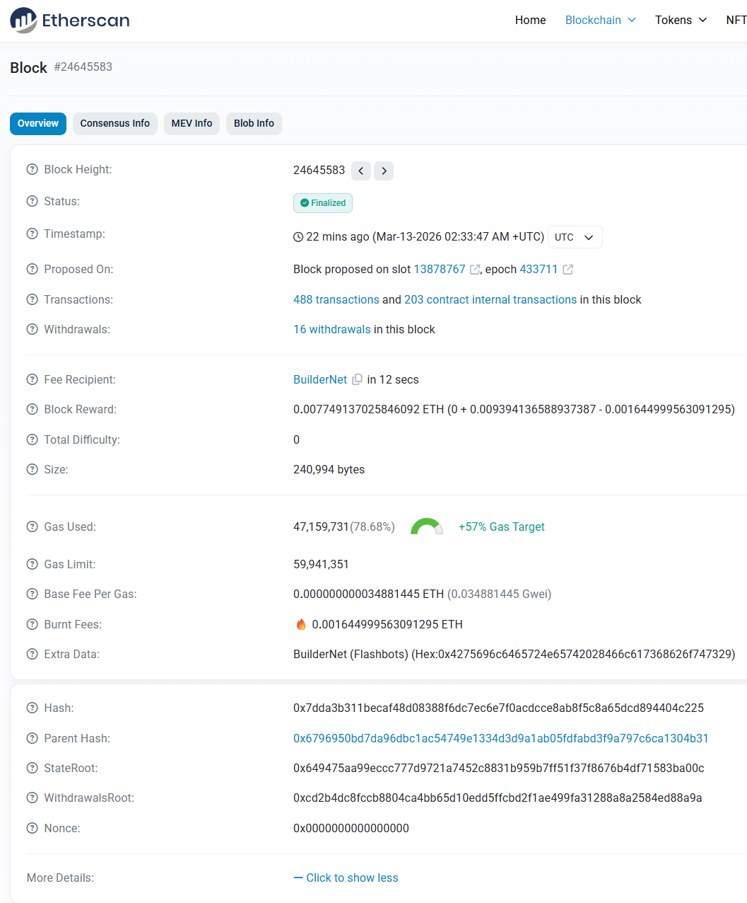

{.post-thumbnail}

## 1. 블록 체인의 본질

**중앙집중식 시스템**은 효율적이지만 **통제**와 **보안** 측면에서 심각한 문제를 야기한다.
예를 들어, 기존 은행 시스템의 경우, 고객 정보와 거래 내역이 **중앙 서버에 저장**되어 은행이 모든 활동을 **모니터링**하고 계좌를 **동결·차단**할 수 있고, 해킹 시 **대규모 개인정보 유출**로 이어질 수 있다.

블록체인은 **신뢰 최소화 시스템**을 통해 참여자들이 서로를 신뢰하지 않아도 안전하고 투명한 거래를 할 수 있는 환경을 제공한다. 하나의 시스템이 아닌, **전 세계 수많은 노드들**이 동일한 원장을 공유하며 데이터를 기록하고 검증하는 구조를 통해 기존 중앙집중식 시스템의 **단일 실패 지점** 문제를 해결하고, **검열 저항성**과 **프라이버시 보호**를 강화한다.

이러한 블록체인의 구조에는 **해시** 함수가 핵심적인 역할을 한다. 해시 함수는 임의의 길이의 데이터를 고정된 길이의 값으로 바꾸어주는 함수로, 다음과 같은 특징이 있다.

1. 결과가 주어졌을 때 원래 입력값을 찾는 것이 불가능하다.
2. 입력값이 조금만 바뀌어도 결과가 완전히 달라진다.
3. 서로 다른 입력값이 같은 결과를 낼 확률이 극히 낮다.

블록체인에서 거래 데이터는 **블록**이라는 단위로 묶여 저장되며, 각 블록은 **이전 블록의 해시**를 포함하여 해시 함수로 암호화 돼, **체인** 형태로 연결된다. 이로 인해, 과거 블록을 **조작**하려면 이후 **모든 블록의 해시를 재계산해야** 하므로 사실상 **조작이 불가능**하다. 즉, 블록체인은 서로가 신뢰하지 않아도 수학적 원리를 통해 거래의 무결성과 투명성을 보장하는 시스템이다.

## 2. 블록과 트랜잭션

사용자는 자신의 거래(트랜잭션)을 **블록체인 p2p 네트워크에 전파**한다. 노드들은 전파 받은 트랜잭션을 **임시 메모리풀(Mempool)에 저장**하고, 이 트랜잭션을 모아 **블록을 생성**한다. 블록이 생성되면 노드들은 이 **블록을 네트워크에 전파**하여 다른 노드들이 **검증**할 수 있도록 한다. 검증이 완료된 **블록은 체인에 추가**되고, 일정 시간이 흐른 뒤, 트랜잭션은 **영구적으로 기록**된다.

블록에는 위와 같이 다양한 정보가 포함된다. 주요 정보는 다음과 같다.

- **Fee Recipient, Block Reward**: 블록을 생성한 노드와 노드가 받는 보상이다. 보상은 블록체인 네트워크가 자발적으로 운영되도록 하는 경제적 인센티브 역할을 한다.
- **Gas Used**: 블록 안에 있는 트랜잭션들을 처리하는 데 실제 사용된 연산량의 총합이다. Gas는 블록체인 네트워크가 혼잡해지는 것을 방지한다.
- **Burnt Fees**: 보상에서 지급되지 않고 영구히 사라지는 부분으로, 알고리즘에 의해 계산되며, 수수료를 예측 가능하고, 안정적으로 유지하는 역할을 한다.
- **Hash**: 앞서 설명한 해시 함수로 생성된 고유한 코드로, 블록의 불변성과 무결성을 보장한다.

## 3. 계정과 상태 변화

또 하나 중앙 집중식 시스템과 블록체인의 가장 큰 차이점은 **계정과 상태 변화**에 있다.
블록체인 네트워크 안에서 사용자는 Metamask와 같은 지갑을 통해 **계정**을 생성하고, 이 계정을 통해 트랜잭션을 발생시킨다.
계정(EOA)은 공개키와 개인키로 구성되며, 공개키는 계정 주소로써, 개인키(seed phrase)는 비밀번호로써 사용된다.
이때 개인키는 중앙 서버에 저장되지 않고, 사용자가 직접 관리한다. 즉 **개인키를 잃어버리면 계정에 접근할 수 없게 된다.**

이러한 특징 때문에 일반인 입장에서 블록체인 네트워크에 참여하는 것은 높은 진입 장벽으로 작용한다. 이에 대한 해결책으로 smart contract를 통해 계정과 상태 변화를 관리하는 방법(CA)이 있다. 해당 방식으로 사용자는 직접적으로 계정을 관리하거나 transaction을 발생시키지 않고, 스마트 컨트랙트의 코드와 변수를 통해 마치 계정과 상태 변화를 관리하는 것처럼 사용할 수 있다. 이를 통해 account recovery나 authentication과 같은 기능을 구현할 수 있다.

이러한 계정은 다음 네 가지 필드로 구성된다. 트랜잭션이 처리되면 이 필드의 값들이 구체적으로 다음과 같이 변한다.

1. **Nonce**: 계정이 보낸 트랜잭션의 누적 횟수로, 동일한 트랜잭션이 네트워크에 두 번 제출되는 **재전송 공격** 을 방지하고 트랜잭션의 실행 순서를 보장한다.
2. **Balance**: 블록체인 네트워크 내에서 누구나 계정의 잔액을 조회할 수 있다. 트랜잭션 처리 시 수수료와 전송액이 반영되어 잔액이 변한다.
3. **Storage Hash**: CA의 스마트 컨트랙트 로직 실행을 위한 변수들이 모여있는 머클 트리의 root node의 해시 값.
4. **CodeHase**: CA를 생성한 스마트 컨트랙트 코드 해시값

## 4. 스마트 컨트랙트와 EVM

일반 프로그램은 특정 회사의 서버에서 실행되므로, 그 회사가 마음대로 코드를 수정하거나 서비스를 중단할 수 있다.
즉 코드를 실행하는 주체는 중앙화된 서버를 소유한 회사이고, 서버가 강제로 로직을 중단하거나 코드를 수정해 로직의 결과를 뒤집을 수 있는 가능성이 있지만,  사용자는 그 회사가 코드를 올바르게 실행할 것이라는 신뢰만으로 서비스를 이용한다.

반면 스마트 컨트랙트는 특정 조건이 충족되는 순간 네트워크 전체가 동일한 환경(EVM)에서 해당 코드를 실행하고 결과를 검증한다. 이때 실행의 결과는 동일한 입력값에 대해 언제나 동일한 출력값을 산출하는 결정론적 특징이 있다. 이러한 특성은 코드 실행의 과정에서 어떤 제 3자도 실행을 막거나 결과를 바꿀 수 없으며, 코드 자체가 곧 계약으로 작용해 **신뢰할 수 없는 당사자끼리도 계약을 이행**할 수 있다.

비트코인은 "A가 B에게 얼마를 보낸다" 는 단순 송금 스크립트만 지원한다. 이때 사용되는 언어인 script는 turing incompleteness를 지향하며, 복잡한 연산을 배제한다. 반면 이더리움은 EVM 위에서 임의의 로직을 가진 스마트 컨트랙트를 실행할 수 있으며, 이는 이더리움이 **탈중앙 금융(DeFi), NFT, DAO** 등 다양한 애플리케이션을 구축할 수 있는 범용 플랫폼 역할을 수행할 수 있도록 해준다.

## 5. 이더리움과 Solidity

블록체인에 참가하는 노드들은 EVM이라는 가상환경에서 스마트 컨트랙트 로직을 실행한다. EVM은 블록체인의 특수한 환경을 고려한 OS로, host os나 하드웨어에 독립적인 가상의 층을 제공하여 어떤 환경에서라도 동일한 코드에 대해 동일한 결과가 나올 수 있도록 보장한다.
개발자는 스마트 컨트랙트 로직을 **Solidity**로 작성하여 EVM에서 실행 가능한 바이트코드로 변환된 뒤 블록체인에 배포한다.

Solidity는 EVM과 블록체인의 특성에 맞게 설계된 언어로, 다음과 같은 특징을 가지고 있다.

1. **내장 변수**: 일반 프로그래밍 언어에는 없는 블록체인 고유의 전역 변수들이 내장되어 있다. 예를 들어 **msg.sender**는 현재 함수를 호출한 계정 주소, **msg.value**는 함께 전송된 ETH의 양, **block.timestamp**는 현재 블록이 생성된 시각을 나타낸다. 이를 통해 개발자는 별도의 인증 시스템 없이 호출자의 신원과 전송 정보를 코드 내에서 바로 활용할 수 있다.
1. **Gas 비용**: solidity는 전 세계 컴퓨터를 빌려 쓰는 비용을 코드로 계산하는 언어다. 해당 비용은 연산량에 의거하여 계산되며, 네트워크의 처리량을 경제적 원리로 제한하고, 무한 루프와 같은 악의적인 로직의 실행을 방지할 수 있다.
1. **데이터 저장 공간**: 데이터를 저장하고 읽어오는 공간으로 **storage**, **memory**, **stack**, **calldata**, **logs** 등이 있다. **storage**는 블록체인의 모든 네트워크 장부에 영구적으로 기록되는 공간으로 Gas 비용이 가장 높고, **memory, calldata, stack**은 함수 실행 중에만 유지되는 임시 공간으로 비교적 저렴하다. logs는 transcript에 저장되며, 주로 indexing 용도로 사용된다.

즉 이더리움은 블록체인 환경의 특수성을 고려한 os와 언어를 사용하여 **효율성**과 **네트워크의 보안성을 보장**한다고 할 수 있다.
