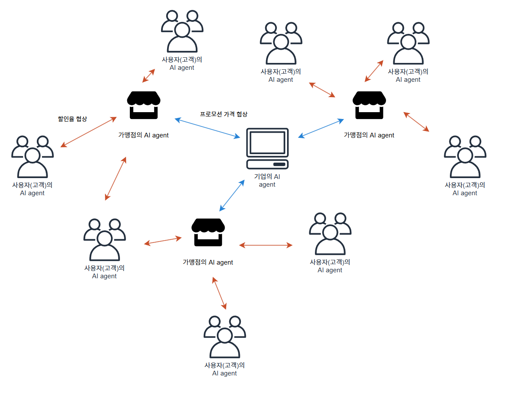
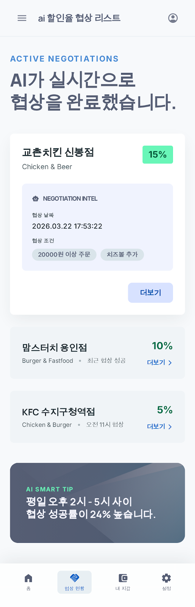

## 프로젝트 개요

- 기존의 할인과 프로모션 시스템은 문제가 많다.
    1. 할인 혜택이 고정적이고, 고객의 개별 상황을 반영하지 못한다.
    2. 그로 인해 실제 고객이 사용하는 할인 혜택은 제한적이고, 버려지는 할인 혜택이 많다.
    3. 또한 고객 입장에서 매번 할인 프로모션 알림이 오는 것도 불편하다.
    4. 가맹점의 할인 이벤트로 들어오는 기업 보조금은 정산이 늦어진다.
- 이에 ai agent 교환 프로토콜을 이용한 동적인 할인 시스템을 제안한다.
- 회사의 ai agent와 가맹점의 ai agent가 협상을 통해 할인 보조금을 얻고, 그 가맹점의 ai agent와 사용자의 ai agent가 실시간으로 협상하여 최적의 할인 혜택을 제공 받는 시스템이다.

## 구조

- 회사는 기업의 ai agent에 총 프로모션 보조금을 예치한다.
- 가맹점의 ai agent는 가게의 판매 데이터를 바탕으로 기업의 ai agent와 실시간 협상을 이용해 할인 보조금을 얻는다.
- 사용자의 ai agent는 실시간으로 가맹점의 ai agent와의 협상을 통해 최적의 할인 혜택을 제공 받는다.

- 사용자는 할인 프로모션을 일일이 확인할 필요 없이, 실시간 ai agent 협상 현황을 보며 구매를 결정한다.
- 협상 현황은 실시간으로 업데이트 된다.
