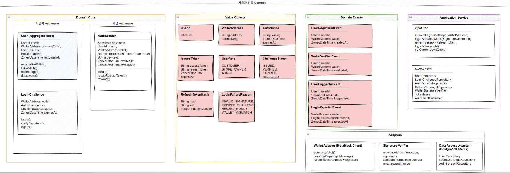
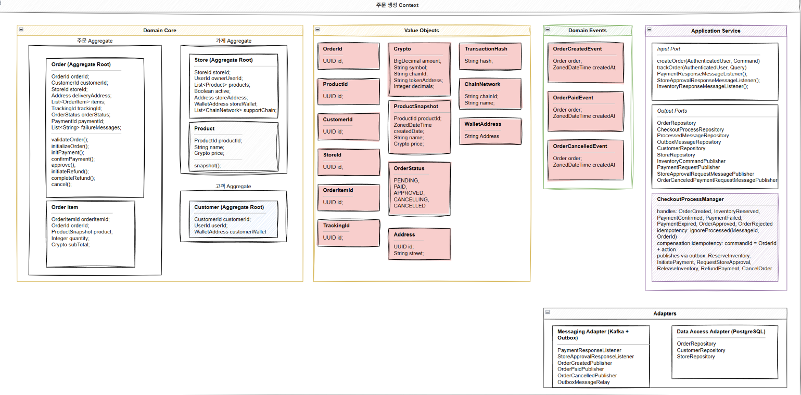
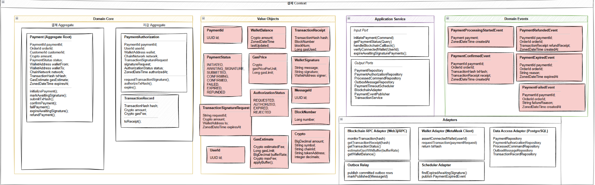
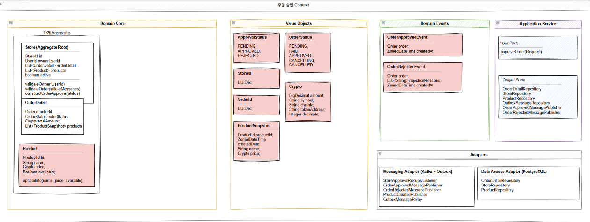
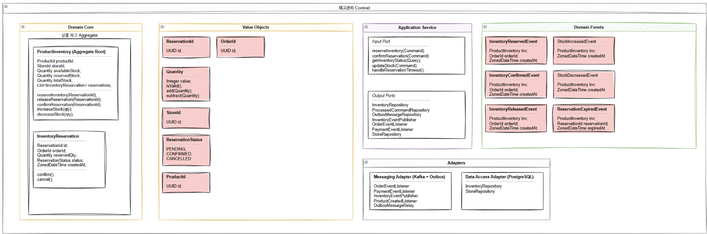
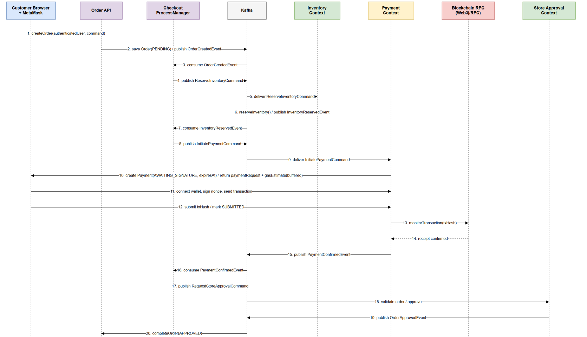
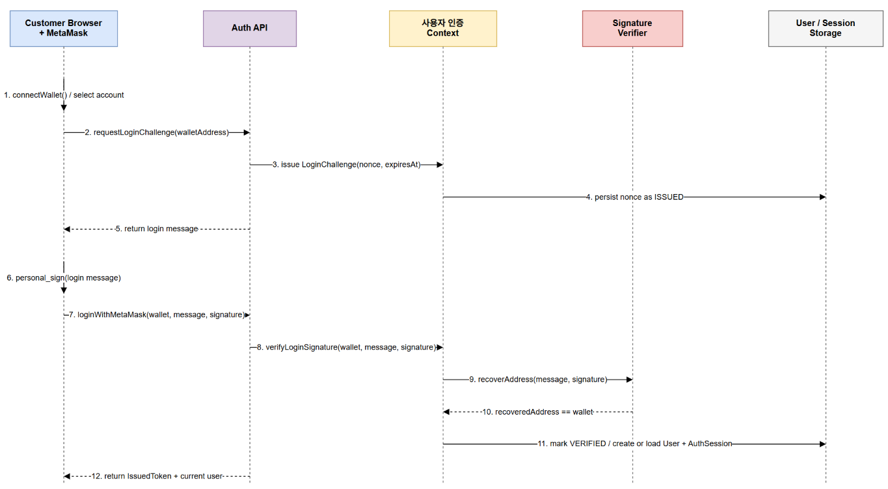

## 프로젝트 개요

고객이 가게 상품을 암호화폐로 결제하는 시스템.

## 사용자

- 고객: MetaMask 지갑으로 로그인하고 상품을 주문/결제
- 가게 주인: 상품(제고, 가격 등), 주문 승인 상태를 관리

## 핵심 기능

1. MetaMask 기반 인증
2. 주문 생성과 추적
3. 암호화폐 결제
4. 가게 주문 승인 및 관리
5. 재고 관리

## 프로젝트 구조

[자세한 DDD와 sequence diagram은 여기서 확인해주세요](https://viewer.diagrams.net/?tags=%7B%7D&lightbox=1&highlight=0000ff&edit=_blank&layers=1&nav=1&dark=0#R%3Cmxfile%3E%3Cdiagram%20name%3D%22Order%20Service%20Domain%20Logic%22%20id%3D%22oJ43v_1pWR14gi-5ENEi%22%3E7V3bd5pK2%2F9rXCu9cC8OinppjEl9d5KmJtl9v%2FemC2WMNAgWMGn2X%2F%2FNCYRhwBFnrFXbiyAMA8z8nsM88xwa5mDx6ya0l%2FO7wAFew9CcXw3zqmEYRksz4B905oOc0U29Rc68hK5Dz61PPLr%2FAnpSo2dXrgOiXMM4CLzYXeZPTgPfB9OYnKP32mEYvOebzQIv%2F9Sl%2FQIKJx6ntlc8%2B8114jk52zU66%2FOfgfsyp0%2FWdatHrizspDF9m2huO8F75pQ5bJiDMAhicrT4NQAeGr1kXMh91yVX0xcLgR%2BL3PDTDH9O3u9en%2F774%2BfXjtV5mH91m7ppFPuhXUfxRzIK0bu78Gwf%2Frp8n7sxeFzaU3TpHc46PDePFx78pcPDKLbDmE6jqcETM9fzBoEXhLgnc9ZG%2F9H5wI8z58k%2F3EEYvILMFQv%2FQ1deQTyd0%2BdMV%2BEbuHbj2PVf6Kkf7ssLfmE4tJfkE95sb0U%2FoTEcNPpm43LQGF42%2BoPGZRdeRye7ZqN3hQ9ajUv46doAvhn4FdMeQAh%2FZMaFDu4NCBYgDj9gk3lm%2Fnsane33NVj0bgIB2o%2FZpb8pURhmAlgK1pe08%2FV8wgM6pdtMr9EuTm81EGrNOjvJs5kxnRYm00Pj1HTs8PUCNrqyLq221TAGePZ7vevrT%2BwkFybxKljYro%2FnKAS1JqjdLU6Q1bJy89POT48lYXbi7vPrdXg3W%2FzwnIHR7fYt7f%2Ba4pOTtMxMziY6zI5jjjI4lGPDmfHh8RS%2BBoAzdYkG1YVMsE8vTII4DhaUaq%2FtheuhsfkMvDeA2tELlOx19BTPngDvIYjc2A24Xd8yDeJgKUy2%2FZeXELzYcU0IGEUImFqeRA0rB4FWWxEEEjGnAgLJrHpgFnPmlAx4BG%2BHQLjFba50lmP7ASb%2FHVmvYXnoDSbw4AUdfAkdiAVDu8hMpDaGkvBT0hQOZto6vT1kz8zDXI8jB3YT0CPefYNVBGFMG07XP3htH2PIYnDDiB7xWvUdJwRRhDQc4LlwiD%2BSM7zWt24ExYplL9DIe%2Bv3jsEiPU0%2FUINTu%2BD38hTa01c49vjl4vUPXlvc%2F2Nsx6soGRv6i9f6wf5YQBjijpfpsdiXPMYhwgP7GTPb9VYhuINDAlWl7GMd9618PiF6XAfiAr%2F%2FxSfuO7g%2B5B2w3b8bW9HvKmkBVceZGy6qG9nLZRi8gcpXicEYzFa%2BU%2FqcxdIDmxrZ%2FhR4uYuQFnJjVYPlmXq7wPIMRiux8iyvo4zlcTTX02F5lNZLmRzL0mDzDFsjv0oJfSMDfAgDZzWNH317Gc3hwgPOAjnDbT2CIvsFv%2FXPle3HbvzBJ99B%2BLGMAzRRq8lTENueXPDq7aK8NrRK8Jq9zl%2Bq8JuoBmetrUpr6zcutQbUtdGB0egOdtbaTIPDwlrMwqqT19zVqW3mYfMwB8zsFaY%2FyWwMa0VSNTcxPes5Srjbuw9C%2BktMMaE8r6CZUM7H14Qug8ADNlpp2tMY6nV8xrfW%2FvC7F1U%2FlvsVevhme1AlYPohJ7fppvjVgzlcKN%2BD%2BD0IXwufHq2WyyCMcRvJvLrFoVKNNX%2F08utrZVTKsW0dEpVmzWGS6XQNegFNgzYman96XEW%2BGZgker%2Fm2wvAvSlVD5ahOy2hpOJLCWM%2FospMpc5c%2BsDit%2FFvlUEbOk%2BP0VnaSBQXmcZBviLTUUceR6XImI2%2BRjWa3tXOiozOW4uxioyVZ5EtZSBItmMOmEc6NujOpvJ5ZGINkqrObGNiSpWaFavPVGgISZ9USZDHnrrGX9vL7lbbkLHQ4iNO74liU%2BbmxXUb%2FW8I70Rld7yMNg95fcdeQu4T1WMXnA2Ldjs%2FK3rKPxLjjaZuR0nYYp1M394ZxjX%2Bx5tBDf9jZ3AzqyDmS6Ln0NlEXONve%2FZqN9CIIK36yyqeBL8qOUdG5yLWxjGIloEfAaTAAx%2F1ylGw0NICmx9tr6w9YwgahADyMudhNfHcaM7tFrd7sN1iI7YvbJH0OL1lGuJPp0beMfDsD%2FXaVIujTTEmTYMxB6gjCmGb5hERxZUdI%2FD3p1MimTKEARWrGArUx6%2B3guSAkTYGS6SQBeFHEWGJXC22YUml2EIG2jh7hqzSZvTkw42rs3GMT7u4bIht3iNFzJqgHXuqbdNHFUSgubOm9g8%2BhAx18gMgA02tTV6O2Gz1GLGpa%2FkZS2dQ%2FlqLo8pUze1%2B2UPeMeO6OxgO4GcO4tD2I%2FLGBdcMSTsiSP2tp2hzyP%2F5eXRFJ0KmpLGKSNLNXh5J%2B6J8jvJ14jDKLriOD0mGDEWejxDOwv%2FEoZTbcT0%2BLJnKHNlMjkZy4lhKDTbb4EjIIL4ltATt4akZH2p9oHLzqQZWOwJYLWzdKgPrWRVjwcrYGFVCNsVZ8Wlq7AQCfNI0GaGrK8Ne94w9ntBNPBSlI28j33sY3l%2BN7m%2BwG3rBW6qP2CvnQv%2FhYfzlnyH%2F4qB%2FPxje3pZ1Si%2Bjm5VaJzYxWFMdyDn7iicO8oLfXTnQ5cA6OQU%2Fyc8NsfVzFeBXs6evL2Gw8p3mlIxMv4G9iZNRwJ1omWuZgQtfJhcaRreW%2FPlE%2FqIrRrtNfmQPPtHdefp4ZmBKXQ%2Fgh5JPqPn91af%2BF%2FjAubJj8OQukMFpSszm6Ewt3YlxgaipipX6S6izpdfgH%2Bm%2BlHT%2BwYmKkWjedNqg67QaHPNm15iY1h7Mm2kQ0%2FANfmA986bJUanZvVrdMvZl3myJ6jW%2FxYdgnyyf52J0yAw43QbEYKwSTMI8t4a4Srzjse86V%2BsrYdX9Ug%2BIHTy%2BatBjj8NAOww5MvxT3QKXsxlZZKBHRncpXKmHcsVK4pDJsdryuD%2F7kCKDpM4QQbujjAiM0ySCw4V2RtU%2FIYS31C2zhfTkI0M4X73Kr5t%2Bjwpz6b5cgam7sNHE2QtIblvdvra%2FfywmQVUEXfmtUxTPwS6fBe%2BN4VrIrxHAso4RdMjXV92tamlqsLYtZe7SJif47%2BiJLqWjJPL8rF79GcKno4wOEg%2BXk6KDKuHzhB6IYgUD%2F7MdzX%2BXFNqe8c%2FR29Z4gpJltAjIW%2Ba%2BmH3rFBfSlRpWPqj0D0H4LmqRkEV%2FX9Qh4kbBUoe69UeLs8130tSRjbxQYU3dxUh6KBAWsZNae2Pw7bMWw4NwEvCzEcQinpBn2z8P020Z1n9uhFFHcnTIH5jQs9%2B47KGD3hU5uUtCT4sTR6J39fz0mt18zL6uy3C15QeQtUSDYjtF95pzTFBhLlt6JzeVnSS1j8Tkn5izNW0awtnEX9UMJj%2BawlGDyaQfr1RKZUsS6VrHJbDSWlPl6Vfp0Dce%2Fmc4eJLqsMcTGepDiv7%2BerOMbs2rjwfv%2B0PPere%2Fz5tNzj7ZyWPwvId8wEZOBW4UXMIQTvF2QoRxxDGbUvIscYEknOX71IB09vrfCeNCW6NWZz9qBGdf9FRBfvZROPsobCREXYYvNpcShbP6HT8lpsR1jr85x98Id3eg8TcKwvf4fKEtykFkWhiPNyzHTLIjpF46jLeaAhMjQJ8gbl5MZvwEJAFeeBAb444bXAr2rWogjhcHxuQlU2BJ5MJN2JJ4anAbA7RnoRxuwjV5Qvw%2BbuCPgR0FPj8D%2Fj7AyzGDbwCvrq5UXvt3bKwN9av2sMMTez2rY%2FbrJJtdLj1IGzittaE9gvANKTGyhJlhMcKsbcgXZvz56Yrzl60XNkIZpxkmVEr87nrduVyhGjsPQRhnzVwuS%2BUlaw7OsqGowfP7IATvTyL0h9auIlWyxuDnCkS5BNdqlFoRyaQzye6VeUXoXeE859ujR2me880w%2B7KKBXHGSJMrENuuV5V1tSShataSShaNVZ0wyYErGmZ1M9p%2BYwrjRLiWtVe3aDNrAFyXEfDIx60lyh9lyq8%2FIFm6ZbDrL4tRiBXKLGFjXDJ76rnO787yrJTryKBrTglnk3X40vLWXIVyS3hj5WARJD95PpMSHys0GzLibxIrTPNNUqWIxbKU%2B3WS5EsyIRpMvut9YdYS3fHeg4viwdYcN61ENUizEDK6gjqx1BFWhq3Trvwkt4Rli4MDCAQGB7q1t0VRooyqwMHBlq2oV8KSV7ASDm6ByXMLVQqY6jKqUcFeF%2BSusfKnRsXLwvtM2HKXha9OC3Kjz7og3%2FWp2FG%2BbjdT%2FJvTfhr4cGLhS2WEtO1dRNgzqNRGUUc%2B8swRTLmYlsZQnrrFWkd4b%2BaIKO9LEccC64VcUWu%2BtsYtcF%2F0wUr2dWNUo7rPur8I1JDN%2BA%2BUUVYdaHLqQuq9AjRbPasDJUjL6nbaWiuHU6Pd%2BqvXsyyj3etA%2FcZombvjlutbIl73%2BPfAtmSPBx7rBvq%2FWdsrgLZ2JdWcS2t2cVu7Xiq3PPEbpCZ74gHu%2B6yWiBmP%2FFlwgR%2BHvUFIt%2FgwvftTbb7Ks4KZzGrZ%2FAsi1OxAgHYsrdXS81zW7Gp%2FaRparWhmT7OSOpMK6gmqzSx6yHs5Fs%2BowYg%2FvdvOG8ak5AstmQphs4b%2Bx8s%2F7n5QlZm%2BahuYbMMS9aq%2Fiudw9BBCgINUMkLUg2CxsH2edhaj%2FD2V935dgfAjvTNr5cjXK6QqXWJ02a72Mrei4U49jny0tR6EH3V6k8X1usw6Ls%2Fl1BUf1DnJd4%2BelmpvelUWGZyD6WuwiqEYR9buqqa0SWohlLIBVl7kcKNxfN0gpQXKByoskilRYwtqlZGTZ3HdbseN3bcjWQaAk38H0T7r0CzP26SaZqXkOJ9SUDWXBDJNOCk2dkc%2FcKIFutMGpfqMXdBnNuvSDH3dJQMholrPIZQ9EBFf6GyqFSK4shIA6knJaYquQeDP3HDBnL2Gyi9zavhr6YbJudzGQeZUsjlQJCjXAYtlAEXO9IO8KBxxSDgps7ig%2BB5lu%2BMaUqbBYgn8KNH9Ch1PCXHjlQYebW29WCY7KiQZWbHnJaUttF5%2Bc9EOTID5E%2BmXDl86nMnourELB5uOEjlJSTbHGpIrcHUSsZ2MwWzlO7kuCBOgrm01aNrgqLUbaNqUQdMlARVCySGPIvUGNolf4nQbfa3RI2qn3CwbRrpPn9TXNbrM%2BkSZM2CKK4EoGkveCvJP28NiytAzy0dl%2B1eGJmo9TefxRPevWBrdbf%2BqzdljNpmiI4aVX%2FWoMuYYmqEOAzIUKD%2FADEB2IFsiPbfcvqoyKdA%2BSQxYesy7t2iP59ovMxV5ten6R6WtsxCNWlilpEZ%2BsjnEbcoUMtTe8e%2FrEJOgaPOngP%2BqueSXmk%2BPeE0LyWC1%2BNfnfJ7VdeMbOxpGsbsgM%2FmS%2BVU1fRVRdADrsFFfdP5drNx5kAfRkc5ZS9Z3LqAA6r%2FbLkLvI6QEOAshKGkbrSYLN37CX13SZEp08upnoh3E6hbka0XfK8zqoLKtQmZiuq7wCG0xPh7q%2BKPoVs1Jy0goGjuJjweUkfrOMjLd3MitSJj9kEKtW2UgEHX0%2BU1C0gEze4XJT42cRFbuIHT%2FtbNLYXXyMXX%2BWEWlEo8vcyRKnJQF0vU5mlT2FFeO5AarXNpuNO%2Bx8sim%2FdZNRDvPcG%2F8%2BryPLeH36bMrRRGRIbLFgcFjBYw4MLu9fckDUafM38QKsvYM%2BWUrEryMwRSqrmIWx6IWNy%2FT4TjoFdFs0zZQ67sGgN9R8cWEKSgO4PcCd1mt6ZQ%2BcXO2XLXuy4Usq3laUbc9bWji6YzUm3%2BOIcsq64lu7s1UJBqBk875QXgsKU6Hs9Zo6qlEHKZxMIn8lG20G5roRvsJYkl6ut7R%2Fehp1H8qSbfX%2F9aHl%2B9vvj%2BObu77T8%2FjIbfZ4%2FPl3eiprJPBl%2Fvr0fiuNGcfuVxy83V%2FdFtyafjfh9G4NJnw9fP9ldw8gO2inrkpa2pyWQGRiKZROCUiIYs%2B%2BP5ov1MikYgomexyzLOj%2BBn7hUpm1bxM%2BRuKyKvj1broBt4pwTC%2FEEILA4lY3GK5dOkF09f71WKCI0En9Be36W2AnaXhAuk5kg1YgSzsJltOSR1gxfc0TwewN3b0QLzV5bPMF9r3AwiffZff4xp9t%2B4i10aG3ObFfRQYZpvNIKFOdOvGGYIFCOZ4lTQUUmD5pN99r5hYrmbKYGupkRnOUGyvq5ycMVWiDqa2a4m4SqOLFsTRkNvTOo9z%2BgYiOxWotWyw8pJtbEKrlJIPfgA18TNIxZTF4paSfMDSvZ0d%2FERYvMZ8P45ydwmZop2zJGdsoE3GL1VG3BtUVJqAuo%2BcwV2tWK6dbuTrlskcOPldHRHFMrNKymbrn6xmMxCOy9yC0icv7F9lz7SXS%2B%2FjEvcjPR5KJIE1473bkqF00P345hR%2F%2Fxny52oUW916qtUoCmYNQyItIueXpuucibFC%2FuQTw2wrevJ7bWrWiAabDKUlI3AmwYid9TVqEh%2BjM2CqymLynLPqoWc8%2FPo8fCzdWXt%2B%2BvxlPPpfrb2tpFCmopUgq0JISdCTQJKumM%2BcSySbIzhs5sXKN4UOJuIpcWS6Ch1vuZQ2m5XE2leGeUMX9pbWi4krj5XeqX8HDWFGIRYIRzsWs1iHMVHuy71vL%2FVTNvvo7s2%2FiJef6Iw%2FJoJfBu6khbptFejF233XQnr0u%2FDPs1RurMGizEldOC3UCVIAyVZxUPBPbSE00SepJ%2FT7sMzLBsFg2WA8kKRk102WECS6EDikINYZymVQHtNxOigwl7Bn9Kbj38ykBepkGWxRC6k7%2BmSP7IzrDbim2YMOCtaZDVZh5kyne%2F%2FMmQGxLnOLyF4um1E2heZ%2BV%2ByHnB2UW7aUXYezkyNjHZ6dGxdlx2wucW5MdnpK5%2FAIMhnKyArq5vNzXZSnAH0BcS5i46I04ydJuIbd3%2FA22cD2PFS1ertYQjjO7uwDrt58nDKN%2BGik%2BeO36KgkzwP9mEj6jjbHOXMPGT6zQA9wissTpIg6uT1TzbIiZScnJ4BQik9KTVJSfNKXQIIWzu%2FjdA6clcfLzbkmvLRmUklfWN2oSt6Z9eRKoCKPUHiFFVhC6bBOzFKFR65i3H6l%2BoHVv0tXs5nJ6OqsIE8Kkid8S0YavWQyJilsk3mp4F25T%2F1zGdekSLOw4fgBZ1xbFzz7BibmDziO8IJgqZlF4CM2kqHfCxRTw5PWUK4XF7D51pXpCvL3U92Ac2vi2XZjR9%2FceE7dydbeaXyVIxf%2FdqG%2B9iw3nQC72JC%2FYE6ATXK6nCABkHnOw%2F4OxPadHaEMNgPPxetvIfDbUPSGMas5rsoqDxVzw1wsc6mlufdAFdJfW%2B2VQa2nDms42OL0kCazLKk03TFfFVK%2B8lhIZKOmAGpr85ZQu60O0THRjU8Q1JnlgMZo%2FdUInrm%2BQ42PvEyIBSDRHOANNu%2F5cG3flV%2FtneWCuoxkVwkWSA7zE8QMYR4NnHQ9V1G2Ai7r6Udp5N0Y57JP0sAbWhi8c8qnofSfySozk8j%2BkzK4KEBLyYKQkyPoSPO2Dxq9YaM%2FwPkuTZQWGh20cAbMy0bfQpcUZHLXOszUspnce8qS8hu6cAn2BAYnmMndZFLt7y2Tu3DtonQeTzNLbddsdPXG8KrRMxpdOGYah5SPKr27LpxGaHtgHHB6d1o%2Fcl04RWae90xxymV6zN8zTkocR%2FSI1%2BrryvZjN0YvmdaRhHdO%2BRlqM61DWqJHqDEu1sq2rCx%2FzJQCSnL%2F5iu2hutrW0VvFYc1ZCrmXGQem9%2FjyhoecIGcTMuLpBHEnZ9Ds%2FVzFeC77enrSxisfKc5JSBE9Xoyfg3kwzLXMtImfJlcaKTmTvLnE%2FmLrhgogxj6kT34RF%2BdPj559dzXZYaNvHd%2BkA79W5g9Q94nbAQETWN%2Fnso%2FfypdHzlvRYSJXfyMP7baoHbAFnfX2dvheeoyFXhaeb1NWf3ydH10qOJZWWL5EuFSSyAz9FdWMVrMz4sjX7%2FCX7ymmeeWp3mvSOi%2BdnHcSXBSzllWHgSXhpPu1mFxiChJvcYnIlNGbHQJFYnHjqlfmx5Bmuk2Y2doKXBZK5lJ4dAx43S8Ysv0i62YJIeVnECqaUM4FOyE8LQWcdKgtE7GQR%2FM6ciNIL9ynbIKI45zkbxYaS0sVHg95jbbUw41NoTLUJZEMrEQnZHL54TSE6U%2FDO%2Bv6qUwH%2FTvB8PbW6nJyAVy6jJYNNVVcTWEiz%2BcEBYzZsAjlMgKRbLwVsUJgSm1FB8flKREhv799WYZ3ZpXHw%2Fe94ee9W5%2FnzebwraTEwJSauQ4BiDtrcqBIbpLJtWAcLzJZywzb0DQW%2Fq%2BLAjJkwW4Qu9kuAJjbd01tLa4u%2Br6b9ybxWyu%2B4j95lVVYerJ7s0qYYpLrhPEqKQUNacBUimh3SUoNc4oreKk2PXgDFIBkEphpcHtfy7bn7%2Fd30a98H%2Fdu7f%2F%2B%2BwutlgCHC1E8T75iG655%2BEoCXoVoFIDHxWSmAufM4cj8LkCxwwfKTIy4%2BhWL43P8UKoykwvJZWPONZYV5Aw91sEnZmcPftBpxTu5iZjs30Uv0SDxoFF8es814Y2q6mwCb9kmCbW00GyYUNKKg%2BpKpu7Iwiquku%2BvpGLLP3bnr2iqNOGAfvQSOSVYIwpVoMxN0EOy8DnJurIJvRgm60pP%2BUn%2FMQfGz2xKFsaEHFW%2FhwmLDUfXaYkv476CP01Zqvjpo8Y2zIjpzOryvKoZbxHlG2gCi4KouwzOKiRPk6iiPrj08ex8kquuNqUQK5iHv9ckpaaQq4QxlKeQ44T8sA2zmeWSTvN55zbwnt4hQuWE9f69Flb3E%2BS2WXemCbgOpK0cXl4VyaOO25KqJM6TkiIKcnnsUGTY4yoG9TCKuUxV7%2BMkcbysN%2FaGvuGJgH8qJZUc5qNWT%2BJQP6ugaN%2FB41ev9Hv0XhgpAKR2OCrxmUXHUDVAB6rCOpnJHyrzejrhgzHPjy5Dt7uh3MccnSv4vSfYAC%2FxUyGggB%2BPM64tp%2BdDzMvTEZhuk40Zr%2BUQHeM0%2Bdl0mYzbDA6hoQ4%2FfX8h0HAYbS7Tr0kncKxQXc23Z3DsstmlLK4ITMcPykBqZGUdty72JLWy9Bd2OEHTbPHuwP1Og489HYh%2BsNrcxnAKzicF%2BUSe%2BM3Yu3Lnh3Ft8GL6%2FdFPxAOE1JDwkv6viUBFJ7rv1Y2CHGqM%2FzskhYOwB8CX5Y2qGV05UQGmqyIy1GVjPBaTDUe%2Bjaoi0cRXowfKGWl2o5kysIzO5gjCPgvtctxs6TyXk4jKIvffeCjZY%2Fm47%2B8VukblcfIihSVF3t7N4pWoATdJIV6Np8brxV54g7456Xkqsa%2FKU17p9A%2FaxaCmkWLKveQZ%2FW6OysUaQRORWaBQsVoWRpFMvWHq1QoyyWA%2BNBjwvTrcT16O8nVkx6XKQbbqhsVPHQMZrDR%2FAkVQael70L2FO%2B%2BtByNA5DhaavN7TJ2yrYOwRt8B0eY%2BRLHjjLtI4BcH2Q%2Ft1RNQU%2Btz4ANHhUyyzpTlQaSVjxex%2BP%2FtjX2ESQiaDHLsY6CMAIybwFZksGT%2FEnjTOwJOPIkzK7mymwPFaoVeAomgEizz1M2fsbFpETA1ZS5iQhLRph3mx%2BECzhM%2F%2B4gEHg%2BWXuINEtgRFZGZ%2FTk9TW6btwROeXJJqo1HzUoKuj2ElEUI43pjKJsJAZa6jtPZFx25UDYiYf0ValtZ3Xz%2FeCuTlYSmWoRtn6ecZfXiYhluB7oBs%2BPT1%2FuhmNuKhF4aTz8%2FuXbfcn1%2FtXd6L4WjkQSinQU4miamAGb1Px3xtQaUwUbaT1ojR4fn0ty1PwzHI%2BuRyUXh%2F99GI1Lro2H%2FxkOnoZXqkDHCk25zIuwayI9m%2FO0NtEZdiXGpx3l6HyjuSqyPX6v6wxi2FLkBv4%2FIMQmvf0JTnmGeIg9shk1s11vVepucZqwwxtV12RgxqSadl2Gd%2F9P%2F3Z09f1xdHPff3oeD6vY2%2FfB5%2F7t7fD%2Bht9qPHx%2BhI3uv9wP%2BA2%2Bobufvt%2BNHu%2F6T4PP9UDJqQ2wSQzLQyXIZPlQb5Y8jvQmLU4pULbMh86GWEiTYXjGqLcIdQMAZSbK7OyeABfBeng6JjsFGEre06nO8yxHjWL3FVXZQQkAqSkU76C7ZwBmEfEPHZNDBmAyb%2FtEoC4j7RvLA6FO9QKcpltmCTsxBCLY3OIhGfnK8Se%2BRV5weaOvuE%2F4yRbBRJsPwQ9cRPcMv1SPH9Mh2Ql%2FW%2FA23uJBC8mBmFMDed99gtGUxgsroyfVqPF%2FXMQkq5xbqpTzqkBJ%2FmwdQWSYnBhJXEk877B6kWMCnHBJzIK%2FufE8qYR%2BkfpylsdYUgsgFV4XWYsX%2FxEomDEVdZwmLyAerEI00UhoJiGYtWwBHEcl01Ae44iRWRnaeLTYrRPVSJaZ5bGHeRBXtcy4KUqJeiT0ktIAXYiExYYY7Xi7lHMRvRUbNlkHzJygxQ1glhe0WJ7zRo1IPLQ8Nxw%2FqY62wUTVllGOCQ9v6idVkgOEM0V%2FLi9hVv%2BNXN6PRDDB44HnYqW7QiHOVfDyoVKaRu8UiHQJRy7wbQ8R%2BwWWg5Q%2FcCUe5AZ%2BqkSvlWqSbSdK%2BEU9qPHi8hnlV0G6GULG4ccyDk4NZ4%2Fr%2BdJYFl%2BNKhTvBb%2BDAuCCZKICpABkigJuWooFGtYGCuqhzndozW%2Fnvf2ygEMrKry0WkW4acblTQa%2B2NrJCvLTkPiIylRGxwkvoSxGcPTGwHEjQXamXGWSBCw2M197dyM6%2FIkDcNbXbiAW5neBA1CL%2Fwc%3D%3C%2Fdiagram%3E%3Cdiagram%20name%3D%22Checkout%20Payment%20Sequence%22%20id%3D%22vt_-q9VF36q3qQDLOA_Z%22%3E7Zxbc6O4EoB%2FDVWZh5niYmx4tLF3NrWbmVSSOfN4SgbZ1gaQF%2BRc9teflhA3yZOLV4Y6VZl5CBbQavpTS%2BpGwvKi7Olrgfa7K5rg1HLt5MnylpbruhPbhT%2B85LkqcTxnUpVsC5LIsrbglvyDZaEtSw8kwWXvQkZpysi%2BXxjTPMcx65WhoqCP%2Fcs2NO3XukdbrBXcxijVS3%2BShO1kaWDb7YnfMdnu6qq9%2BkyG6qtlQblDCX3sFHkry4sKSll1lD1FOOXmqw1T4r8%2FV%2Ff%2B9sIVjYYFztl7bmSEwVMevVnKLNlzbQeGn%2BD8YseyFAocOCxZQe9xRFNaQElOc7hysSFpqhShlGxz%2BJniDZfwgAtGwL5zWZyRJOGVLB53hOHbPYp5jY%2FQnLg4mjPZJri9qt9SKanjA0oPUsdoh%2BN7emBQGhXPe0bh4Bo9Z%2FzRXPsW%2F33AeSyfmKuBnzqMpZ2%2BYpphVjzDJbsO1olk%2BNi2Ab%2Fm%2BtS%2FRLb0%2BiySDXDbCG6xwIEk82tKOWVvhlTQQ57gRAI6ZtAOvy4qy%2FU2m40bxxpXOJNM11N%2FqpMsQTTJt3%2BKX0twWG%2BhIVlCkW2tIivwrMCxVkt%2BEEaicGEtoBAO5tbCtRZLceBZC372%2B4Gt6dMVLkvun5WIuS2ujqxwZc19cQDiJuIs3GlbYVgX2qIQDqA84DXBLVCrvHcpFPKtMBAlEa8Srpk7tWZQAj8nQkWodMFFhX6rd%2Bjys26rKBzc4BQ9S0VE%2FX%2BgzT3qyxXiuB4gbmoFYSsXTgW8yi%2B87cpmfF3QGAxwhXKwQSEumVshf15pl8sEGtD3IsEFP6qsEPAqZEWBrHQeWgtH6O2Jg4hbrTpoLbjk5gtrs3KrHX1mu1G1vr02WTjjNuXVgfm6VwYSbCAMCuQWUa2tK7QVaHnVR6xxgq9OdV8N7Rd9dWbIV%2BNDyeDO4v3%2Bar%2FbXxOEg81Rf53GAV5vXu8tG2XtBR8n%2BdE05Y695kdbJvx5IZobQ1eovD%2BJhq%2FTcCZ9GtM%2BDcc3hINy1xiCBXYSH8%2BOsQinMw9NX2XxvdLUnl9fGjOyMjw1jdy0leN99n9h43Z2oLZypaM1BcBX%2BpxzNfN7MdAMgGDj8%2F9Huxzx71UEf7SaGrCvo%2FQi4ZnsS%2FIHMCqVN567W%2FdxkEyO2Thw194bbHzZaqu28whu5NN4UwC8PoAgOBOAfT2HH6CJvz4Lftn8TbwxsPEd%2B1zNP94hkg9i%2ByDGx22%2FDvyJb79q%2B0VK43uprn1zHekQLn7itfcXPDWc%2FXSujr5NAZhGARO24oRgcIRe6LbS1J7v9wWF8vP7gwrB984EISU5Vmb6ONGSSK%2FRwXky5%2Bkpq8mTdGj00SWo3DVB%2Fa%2BHXo3B2%2B1YQOzKyEP%2FGbqpjhdMJ2u4pkRkWVof6FnftRURJT0UMZZ3dRNVrwhyHDWxwlCxxUyTJFA2z%2F0%2Bup3A4QOtSsQzhVYVNAjaJlr5AKvy8D3fDFhV0CBgO1HQB1qVyGxiCK0qaBC0SgD2gVelEprCqwoaBG8vvPuAq82AHN8QXU3SMCNuGz9%2BwNWntzNTcFVJg8DtRKQfcDUkU9sUXFXSueFmjgmoa56QeYmqhsvhL0DjAiOGxTuRC3RgO6iQxFCS%2FBAvqfjbw5hmGcqTT8fxHkX5L4LXiaEIRxNkGJo7DjSXQyvRA0%2F4VNSuV9%2BWl9%2B%2BAh6bPxRocFinpNzVF0SCcLJ6kOO%2BcYSa5QP%2FNITazFkVZBihNw5CT%2FgdzctDhgeDpNq2gfZvA05NkGFIk3EgidUhrSfdYOgOH3Dzwieq%2BsSzoNIsPDPkT5ogw6j8cVD5HFWCU7B4MTAq1cITdaZwajCoCTKMajoOqukXYfM%2BoItjQ1dzVuI8Y9eo2X5qyN80QYYhzsaBOOuPXwOSUg3sO4YGMU2QYVLBOKSCL4pPEUZgmiHfmw85hvm%2BIZ%2FSBBkmFY5DKuyPYQOSUg08NZbx0iSZDpvtcVg5dhs4W82q94v5z%2FnlHQRi%2F729%2FPptfvfjZlWFz%2FhpT2DIm7N2mCswOxS50FTce8OXy5dMnOeLQLeoXJWMZFDBxfqw2eACnyv81qBNTnRUNZDXBJmmP1bWxJHDn9gC49qPKE0xq1CXfM2%2Ba%2BdUbH0QJZi7rc0KlJcoZoTm58GoGj805sSqJNMYR8qjOFUi5bDOCH989vQ7EmNk5aAZKu7hz%2B2PxdXl3d1qOQi0mXeq66nQNEmmoY2UOXFE6iSjMDrS4q71qYsK30Bd5Cww9dpAk2Sa0zDJk977Ah3apAr6Ykz2rOo6N6TI8HmmM5qNA9eUV2mSTNMaKX%2Fi%2BP0woZl0Sk7ni%2Bd0E6u7g04NEzRBplmNlEBxpv3gezhWqoVD50S%2FUkNDTZBpVCOlSZyZmkIWk3yxWrdeqjtkCB5ODfmWJsg0sJGyJY5Il0ABSarITi5NlXNCJJjhQZzLse1TRy3t7bUmyjSukVImTtj3L%2FEerXKss45ZuoHV1QonL%2FDTJJl%2BZz1SxsStMiY020OoLBcbzK%2Bvb77%2FZ7U8z6RdN214okNpK6c1SWYhoZS9lUn5SLIUibU8r2w5KUHH5uMO%2FknbgXqT%2FJc3pGwQSQ8FbnpODh5DrFalP%2BDB2E7e876tKM06nO5elGk9Gh3fbu446qz91L0oAOZzu4tGpdNgG%2BI7Hozuf8G88xGPOvjTN8z9BnyaLhJGuXYeuRK5yurU0YSmzUiG6UHkMj%2B3O9d%2F9R2F%2FkU3OMWoPPJmVqY9I5THOK3WQ9Sn1K1M4uwN%2FgvH7XKJUzTZQIelZtelGibUjPpNXi6hKuHwUHLHSKAfLDKSkxLAthdcJhedb0yI2qoMxyeZTqRH9ONb7LrPA787KnIRwhdLtBGTmlz0rqwguNT1Xh72qVj%2FZfW%2BfFE1EpQWGCXcK%2FeVcXkMb7cKdy0MDbXalfZI2K76Towcqkm%2B5QboVNRa54ROoV4j1NufFvT7BLffJ6grVt7QI8DP9uNBVc%2FefoTJW%2F0P%3C%2Fdiagram%3E%3Cdiagram%20name%3D%22MetaMask%20Login%20Sequence%22%20id%3D%22FstEjt75eRlKLUX25Od4%22%3E7ZtLc6M4EIB%2FDVWZQ6Z4GAxHwM5sqmaqptY7k%2BOWArKtCgYPyHGyv37VQuIlx44JxpfMHAxN05L6o%2FXsaFa4efmWo%2B36RxbjRDP1%2BEWzZpppGlPDYT8geS0lnuWVglVOYqFUCxbkPyyEupDuSIyLliLNsoSSbVsYZWmKI9qSoTzP9m21ZZa0S92iFVYEiwglqvSBxHQtpLau1w%2F%2BwmS1FkV7tniwQVJZCIo1irN9Q2TNNSvMs4yWV5uXECfgPOmXJFuR9LbAf25LC3cn9arK5jilfY1QQlnjjxgSpRT0VTqJ4hemFazpJmECg10WNM%2BecJglWc4kaZYyzWBJkqQjQglZpew2wUuw8IxzSpjzfSHekDiGQoL9mlC82KIIStyzTw3MZSkVHwx4s7wXlRJ1fEbJTtTxB6boByqemPQ7NIX9LvCfHU4j0VgoG780qAtHfcPZBtP8lamsG6AnAuu%2B%2FipsifqlrSI%2BffkUiU9yVRmuubALgeYUpjSjZ1LKs10a41gQOuTRBsAmK820lsulGUUKWPYkdh4d21FRFsw0SVff%2Bd2MhbMVKEy0eai5E80LtXmgBSZcz30t0DWXuUpnnwiw0bnMBTFo6ZrncmGg%2BQZ%2FlT2dggIz5s3gQjz1NG%2FCSwi4Wqj5UzAMj2wtCIUaGAxFEa6nzWeaZ0MRILE0n1Wk1GR2TM3ndjwfjMPFXPO4EdeHsky98ZFtcV5kKUr%2BLcAtoBxCoVW1S5uiSrzRniELcjQ3FK%2F45dNKMgMniXcduAWDvubasua8CNZkf%2FJVttDjjg2EY4WrXf6Cyx1XN4DbLdV483y74RFZ3VKNCdlb1buNUntEk20r0TR1j0bTdNBoeoSRAud9A0o%2FO6BihN3lwYByIhc%2FLk%2F2Z%2BGuoKzFrMp6ICvvJBB5j3C1ojzggtZH2QeM2s0ZdhuM0wZjOIOSQTu6vkVbMh4abMQ2nh5C4zlTCzkn0fisykzi%2F7wfzOVW2%2BWWdXmfx9kGwTA5ltvfMcQcd%2FuxPlp0WTMxTpRdpxIvIbMPU5kLBYrtXZQaG2hGpOVG%2BDCtR9ee2PpJWgs2LCK6y7GK4TfOyZLI3ngADpM2B%2FeyPRbrl%2FPeU7MeJGz4f3Ak4f9OkvjFxw4dWgpz4qIgWapCWbBWwVppKCZOm4lhmBeDkpAUt0d4HCurvveBwmnsw6qyXsE0wLQpxqhYV7Ptt9mo3di73ZnjBFHy3G5Jcz1yxIOihJ8ZYc2uKVh2C0K1DJcmimyXR1i81VxOnjDkdhc%2FFOUrTBVDHGjV7HMZt%2BcKn5APs7G8gSB3DY0IuTk5%2BeR8GI%2FjDMS5a2gcztV05pPvYSxeZxHQm2%2FX0Eh862nSJ%2BE3RlFTHwixYunijDfGcGwfkyx6OgZXoWbA5pc4E3hASYLpzZdqjlvgBI4KWNujiJmhhxEfxPmBqZTc4vroVMrSL03OvCY58yv3%2FZ8dLijfqA%2FXwC9d4Zs9B%2BnHcc4WKV9GoVZttHx0bqQYGpyadU1qFlAjRbGDDfsONrGPD1ve%2BGVLGDyfXoae4vRpz5jrzngUQ4PTm1yTHj8qgAMLUoAT5MELa6yp3y8Wv%2Bazi%2BDqennSHZN6j26KpcF52SPyak1dFHh22WHSXQ5nmok429ywLlJs11w8zCbOQEObYmhwbM41w8yRYVadC950cI0zqNlD7erY3TnN4Lym1%2BQ1%2FSoD6oHQtTxGE9OQckCrwgxuCrmlPRJGt2fYdeNXMTQ4RveaGF3A%2BAxnCq98ZlKdPFyNZBeA03eW2R1BFUODk%2FSuSdIrh7ooYzTFMuBmTG6Ku%2FvOL7s7Loqh4Vfj%2Bojgjk9YDL2BEccCJBPBY9DQZVxeAGHX89O%2Bc87ut6AYGh7hdXdU%2BJbKBuWQ3PR7%2Fvf93T0sC8SWSpRjBPloepbzMRPF7Kc6WIQsFEiKqA4XR4jNae9JaXcxoVganuyYOy4ngtNsLSfuYUkf%2F5M94bQiGe1yXitT34kD1YsPkO5g55BdQ0OzRAk9D12xJ5sE8b3rE%2Bf%2BBatrlfBq90rJaLE%2FnhVQYMaZUIC52qE8zhFJCqF13um%2FzHppnv6bneP%2FTnKfO7Hf%2FmTOO%2FxnQG7rpB6VSgVsjHxmmm1PJzMbEwUGz1myeP6oTA%2BtcjVZqJQpsJD6OdM8T2ZysutAZotWWaBM0%2BYJUWBBbvQYXNmvzXbSqLhyJDf0hEHIBS3zWa36xcDkmaIBZFgxC3XurMzyLXNVT2TosnKnZdaWPOe9Y6WT9J6NKnd8lzH2qWije8erypNUfVeWOAMv%2BeWFwVOHy9xZXQxLzBJIvFLy0NxYbiYIRwkimzeSd2Wisqj2RzNgD%2BSTG0YnBbaTIjPRzw4Sdlv%2FxUHZydV%2Ft2HN%2Fwc%3D%3C%2Fdiagram%3E%3C%2Fmxfile%3E)

## 시퀀스 다이어그램

- Mermaid로 작성 후 github에도 추가해 보겠습니다.

- 1~7: 사용자가 주문을 생성하면, 제고에서 해당 주문의 상품 수량만큼 예약 된다.
- 7~16: 사용자가 MetaMask로 결제 시도. nonce도 같이 서버로 전송. gas fee는 서버가 내주는건 아니고, 편의상 알려만 준다.
- 17~20: 결제가 성공적으로 완료되면, 가게 주인이 주문 확인 후 승인 처리된다.

- 서버에서 ID, 비밀번호 저장 없이 MetaMask만 사용하여 로그인
- ERC-4361 표준에 따라 진행한다. (알려주셔서 감사합니다.)

## 현재 프로젝트 진행 상황

[프로젝트 github 링크](https://github.com/cryscham123/token_payments)

- DDD에 맞게 로직 구현은 완료된 상황.
    - 사실 로직 구현은 harness engineering으로 구현 중. 김형훈은 구조 설계만 해놓은 상태.
- API는 아직 구현이 안됨.
- 다음 주까지 FAST API로 API 구현 후, postgresql, kafka, redis와 연동하여 테스트 진행 예정
    - Django는 고유의 프로젝트 구조 때문에 DDD 구조에 맞게 API 구현이 어렵다고 판단.
- 테스트는 ganache test network로 진행 예정
