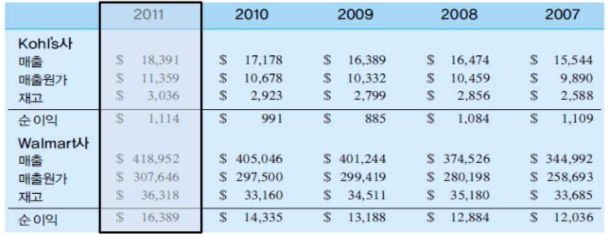

{.post-thumbnail}

- 왜 공급을 할 수 있는 비즈니스 프로세스는 즉각적이지 않은가
- 어떤 제약들이 비즈니스 프로세스의 능력을 제한하는지 살펴본다.

## 프로세스 흐름 분석

### 간트 차트

- 작업시간을 표현
- 프로세스 상의 작업 순서와 소요시간, 상호관계를 볼 수 있음
- 대기: 수요와 공급의 불일치, 작업들에 존재하는 불확실성으로 생기는 것

### 프로세스 평가를 위한 3가지 요소

1. `흐름률`(flow rate / throughput): 실제 흐름 단위가 프로세스에 진입, 떠나는 비율
    - $\frac{흐름단위 수}{단위 시간}$
    - 흐름률이 오르면 생산 능력이 오른다.
    - 유량: 특정한 시간동안 관찰하는 양
    - 매출 원가(들어온 가격 기준)를 흐름률로 바라볼 수 있다.
1. `흐름시간`(flow time): 하나의 흐름단위가 프로세스상에 머무는 시간
    - 흐름시간이 줄어들면 수요-공급 사이의 시간도 줄어든다.
1. `재고`(inventory): 프로세스 상에 존재하는 흐름단위 수
    - 매출 원가 기준
    - 가공중인 제품 WIP(work-in-process)도 재고에 포함
    - 저량(stock): 특정 시점에서 관찰하는 양

::: {.callout-note appearance="simple" icon=false}

- 흐름(flow): 작업이 진행되는 것을 tracking
    - 단위: 일반적으로 `산출물`의 단위로 정의
        - 위의 그림에서 흐름 단위는 상품 1개, 서비스 받은 고객 1명
:::

## 리틀의 법칙

위의 세개와 수요 공급간의 관계가 있다.

- **I = R * T** (항상 성립)[^1]
    - I: 평균 재고 (flow time 동안 들어온 input)
    - R: 평균 흐름률
    - T: 평균 흐름시간

[^1]: 시험문제에 더 복잡하게 낸다고 하시긴 함

## 재고 관리 메커니즘

### 재고를 카운트 하는 방법

- input이 여러개일 경우 단순히 흐름단위만으로 재고를 표현하기 어려울 수 있다.

1. In terms of $s: I. 원가 기준
1. In terms of days-of-supply(DOS, 공급일수): $\frac{I}{R} = T$
1. In terms of inventory turns(재고 회전율): $\frac{R}{I} = \frac{1}{T}$

### Turns and DOS at Kohl's and Walmart

- 위의 사례에서 두 기업의 전략을 볼 수 있음.
- Kohl's: 회전률이 낮은 대신 마진을 높임
- Walmart: 마진이 낮은 대신 회전률을 높임
- 공급 일수와 회전율은 반비례 관계에 있다.

### 재고가 부담이 되는 이유

- 이자비용
- **유지비용**
    - 재고가 구식으로 변함
    - 물리적으로 부식됨
    - 사라질 수 있음
    - 저장공간과 추가적인 간접비 유발
    - 품질의 저하에 따르는 추가적인 비용 존재

- **제품 당 재고 비용**: $\frac{단위 시간 당 재고 유지 비용}{단위 시간 당 재고 회전율}$

### 재고 유지의 다섯 가지 이유[^4]

- 재고 유지는 기업 입장에서 부담이 되지만 그럼에도 불구하고 유지하는 이유가 있다.

1. **수송중재고**(pipeline): 프로세스에 존재하는 재고
1. **계절재고**(seasonal): **공급** 능력은 고정되어 있는데 **수요**는 변동하는 경우(**예측 가능한 수요**), 미리 만들어둠
    - 계절 재고 vs 주기 재고
    - 계절 재고 vs 안전 재고
        - 계절 재고: 수요가 예측 가능할 때
        - 안전 재고: 수요가 예측 불가능할 때
1. **주기재고**(cycle): 한 번에 많이 사는게 싸다. **규모의 경제 이용한 비용 절감**
1. **완충재고**(buffer, decoupling): 프로세스상의 작업 사이의 지속적 공급을 가능하게 해줌. 단 제고가 계속 쌓이지 않게 line balancing(각 프로세스에서 진행하는 일의 양의 밸런스)을 해줘야 함
1. **안전재고**(safety): **불확실성**에 대비해 예측된 수요보다 더 많이 재고를 유지함

[^4]: 이것들의 차이와 의미하는 바, 사례를 보고 어떤걸 의미하는지 알아야 한다. 
