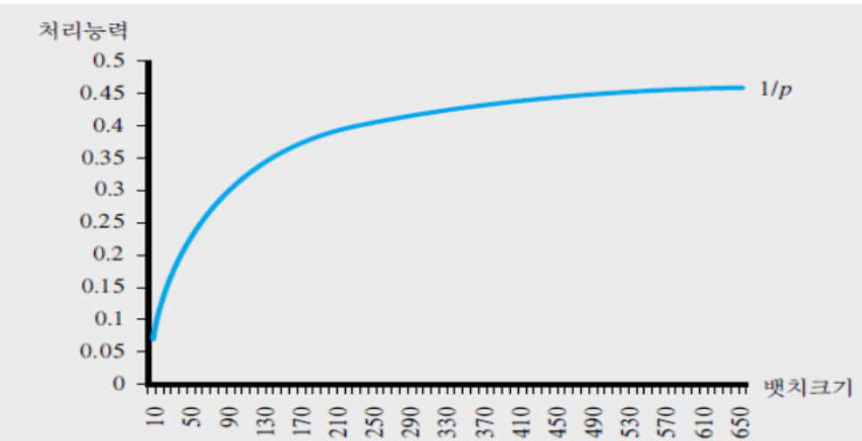

{.post-thumbnail}

## setup과 생산주기

- setup: 기계를 준비하는데 필요한 것
    - 정확히 하나의 제품을 만드는 경우에도 setup이 필요함
    - 생산하는 양에 관계없이 setup 시간이 일정함
    - sequence dependent setup: 순서에 따라 setup 시간이 달라짐
- 생산주기(production cycle): setup + 생산의 과정을 반복
    - setup은 아무것도 못하고 시간을 버림

## 배치 생산과정

- batch[^1]: 부품 집합을 흐름 단위로 사용
- 생산 주기: batch size만큼 생산하는 주기
- 처리능력: $\frac{batch size}{setup time + (batch size * processing time per unit)}$
    - batch size가 무한히 커질수록 $\frac{1}{p}$로 수렴
    - setuptime이 0이여도 $\frac{1}{p}$

- batch는 클 수록 좋은가?
    - batch size가 커질수록 처리능력이 증가하지만 재고가 많아짐
    - → 처리능력 제약적 상황에서 bottleneck의 batch size를 늘리고, 수요 제약적 상황에서 non-bottleneck의 batch size를 줄이는게 좋음
    - → $\frac{B}{S + Bp} = R → B = \frac{SR}{1 - Rp}$
    - R보다 크면 쓸데없이 제고가 쌓이고, 작으면 capacity가 낮아짐
- S가 늘어나면 Batch size를 키우고, 낮아지면 Batch size를 줄여도 됨
- p가 늘어나면 Batch size를 키우고, 낮아지면 Batch size를 줄여도 됨

[^1]: batch 1개는 부품 집합 1 단위 의미

## 경제적 주문량 모형

- 외부 공급자에게 부품을 주문하여 생산 및 배송이 이루어지는 경우
- 단위시간당 발생하는 비용이 적을수록 좋다

- Q: 한 번에 주문하는 양
- R: 수요(기울기)
- 주문 주기: $\frac{Q}{R}$
- 평균 재고량: $\frac{Q}{2}$

1. 구매비용(purchase cost / variable cost): 단위 시간 당 구매비용은 Q에 영향을 받지 않음
1. 단위 재고 비용(h)
    - 단위 시간 당 발생하는 재고 비용: $h\frac{Q}{2}$
1. 셋업(주문) 비용 (Fixed cost) (k): 주문량과 무관
    - 단위 시간 당 발생하는 셋업 비용: $\frac{k}{\frac{Q}{R}}$

- 목적 함수: $C(Q) = \frac{KR}{Q} + \frac{hQ}{2}$
- 경제적 주문량(EOQ): $Q^* = \sqrt{\frac{2KR}{h}}$
    - K: 주문비용
    - R: 수요량
    - h: 단위 재고비용
- EOQ만큼 주문할 때 단위 시간당 비용
    - $C(Q^*) = \sqrt{2KhR}$
- 단위당 비용 = $\frac{C(Q^*)}{R} = \sqrt{\frac{2Kh}{R}}$
- 수요가 증가함에 따라 EOQ는 늘어나는데 단위 당 비용은 감소
- $\frac{C(Q)}{C(Q^*)} = \frac{1}{2}(\frac{Q^*}{Q} + \frac{Q}{Q^*})$

- $\frac{1}{주문 주기} ≠ 재고 회전율$
    - 주문 주기는 Q개가 다 없어지는 시간
    - 회전율은 Q/2개의 재고가 다 없어지는 시간

## buffer or suffer

- buffer 제고가 없으면 처리능력이 떨어질 수 있다.
