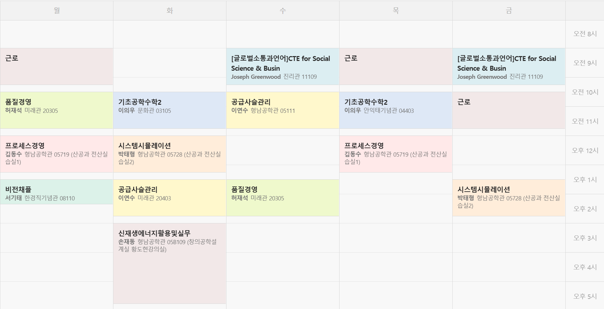

{.post-thumbnail}

## 서론

이번 학기는 온라인 강의 없이 21학점을 다 채워서 들었다.
일부러 그런건 아니고, 그냥 수강신청을 실패해서 어쩔 수 없이 그렇게 됐다.
가끔씩 점심 먹는 시간이 애매했다는 점만 제외하면 그래도 꽤 할만 했었다.
물론 두번 다시 이런 학기를 맞이하고 싶지는 않다.

## 점수

이번 학기를 통해서 비로소 알게된 점은 확실히 통계, 프로그래밍 관련된 과목들은 점수가 잘 나오는 편인 것 같다.
발표나 과제 중심 과목들은 상대적으로 물을 먹는 편인거 같은데, 노력을 안한건 절대 아니니..\. 이런쪽엔 소질이 없다고 봐야하는 걸까?
그래도 뭐..\. A0가 나와버린건 운이 없어서라고 친다고 하더라도, A-가 나온 과목들은 확실히 내가 부족한 부분이 있었던 것 같다.

글로벌소통과언어 과목에서 제일 컸던 문제는 주제 선정을 너무 어려운걸로 했던게 아닐까 싶다.
양자컴퓨팅의 미래에 관해서 발표를 했었는데, 당시에는 충분히 잘 해낼 수 있을거라는 믿음이 있었던 것 같다.
하지만 근거 자료 찾기도, 영어로 발표를 준비하는 것도 쉽지 않았었다.
이런 일이 발생한건 아마 나의 능력에 대해서 너무 과신 하는것이 문제가 된 걸 수도 있다.
상대적으로 배경지식이 있는 다른 과목들에서라면 몰라도, 그렇지 못한 과목에서도 똑같은 행동을 해버리니 점수가 낮게 나오는 걸수도.

아 참고로 기초공학수학 과목에서 A-가 나온건..\. 민망하지만 기말고사 시험 시간을 착각해서 30분을 지각했던 것이 원인이다. 50분 짜리 시험에서 말이다.
하하.. 시간 관리 잘 해야지.

## 그래도 잘 했던 점

너무 부족했던 점만 생각하면서 우울해 할 필요는 없을 것 같다.
사실 학기 초만 하더라도 압도적인 스케쥴을 보며 절망적인 stance였는데, 이걸 문제없이 해냈다고 생각하니 감격이 물밀듯 밀려온다.
사실 스케쥴 뿐만 아니라 압도적인 팀과제의 양도 나의 숨을 조여왔는데, 모든걸 마무리했을 때의 그 감격은 이루 말할 수 없다.
시스템시뮬레이션, 프로세스 경영 과목 모두 보통의 사람이였다면 절대 이 정도로 잘 해내지 못했을 것이다.

자존감을 계속 붙잡자. 결국 모든 일의 시작은 나에 대한 믿음에서 시작되니까.

## 결론

복학을 처음 할 때 생각했던 것들이 기억난다.
나는 내 트라우마를 극복하고 싶었다.
나는 신입생 때 지금과 같은 퍼포먼스를 보이지 못했다.
지금 내가 재수강의 늪에 빠져서 고통받고 있는 원인이기도 하다.
그때 점수가 낮았던 자세한 이유를 말하기에는 이제는 너무 오래된 일이라 잘 기억이 나지 않는다.
다만 '김형훈은 대학 생활이랑 맞지 않아.'라는 생각에서 벗어나고 싶었다.

이정도면 그래도 이제는 충분히 잘 생활하고 있다고 볼 수 있지 않을까?
아직 1년의 시간이 남았지만 내가 할 수 있는 최선을 다해서 잘 마무리해보려 한다.
다음학기부터는 드디어 전액 장학금도 받게 되니, 부담없이 열심히 해보자.
