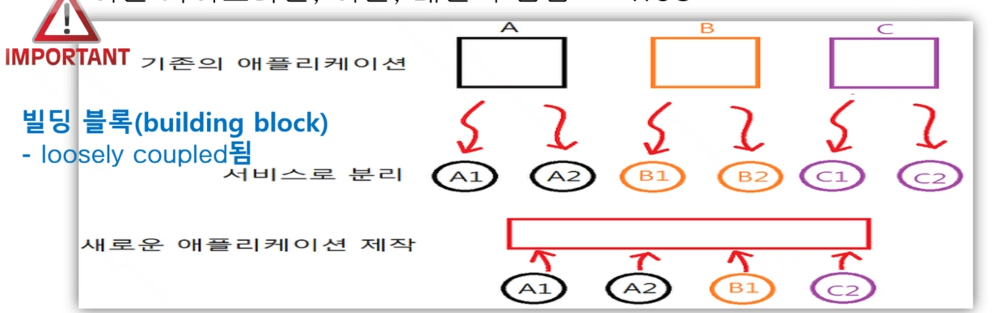
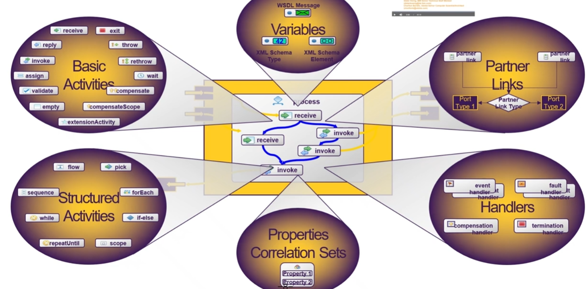

{.post-thumbnail}

## SOA(Service-Oriented Architecture)

- 분산컴퓨팅 환경에서 느슨하게 결합된 `서비스`들의 집합으로 구성된 아키텍처
- `building block`으로 `loosely coupled` 된다.

- 서비스: `독립적`으로 반복사용 가능하고, 네트워크를 통해 접근 가능한 `비즈니스 기능` 단위

- `개방형 표준`을 통해 정의된 인터페이스로 접근

### SOA 실현 인터페이스

- `SOAP`: Request / Response 메시지 포맷
- `BPEL`: 서비스들을 `순서를 정해서 연결`할 때 사용
- `UDDI`: 표준 서비스 레지스트리
- `WSDL`: 서비스의 `인터페이스`를 정의할 때 사용. 사용자에게 사용법을 XML로 알려줌
    - `procedure 이름`: \<operation\>
    - `입력 인자 타입`, `반환 인자 타입` : \<message\>
    - `전송 프로토콜`: \<binding\>
    - `Endopoint URL`: \<port\>

## WS-BPEL(Web Services Business Process Execution Language)

- WSDL로 표현된 서비스들 사이의 상호작용을 모델링하는 프로세스
- BPEL 프로세스와 외부 파트너 제공 서비스를 결합하여 WSDL을 가지는 서비스로 모델링

### 종류

- `Abstract Processes View(Public Process)`: 서비스 간의 상호작용만 정의. 내부 프로세스 로직은 정의하지 않음
- `Executable Processes View(Private Process)`: 서비스 간의 상호작용과 내부 프로세스 로직 모두 정의

### 구성 요소

- Basic Activities
    - `invoke`: 외부 서비스 호출만 하는 1-way 또는 request-response 메시지 전송
    - `receive`: 외부 서비스로부터 메시지 수신
    - `reply`: 외부 서비스에 메시지 응답
- Structured Activities(`Nesting Structured Activities`)
    - `flow`: 병렬적 활동
    - `sequence`: 순차적 활동
    - `if-elseif-else`: 조건 분기
    - `while`: 선행 조건이 만족되는 한 반복 활동
