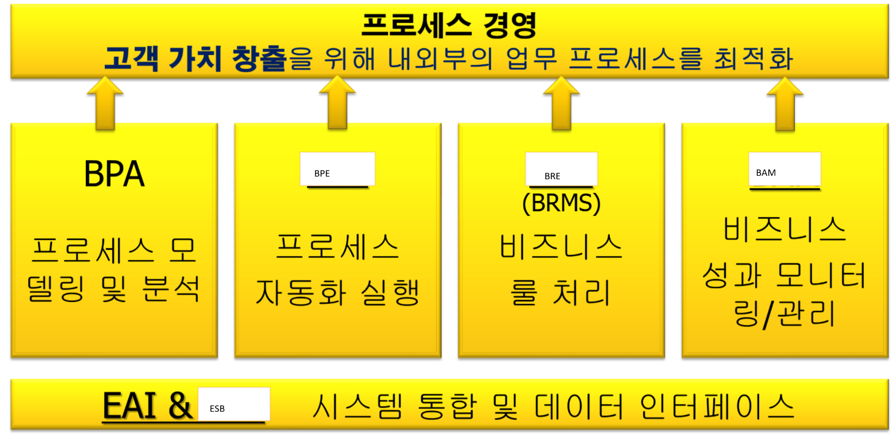
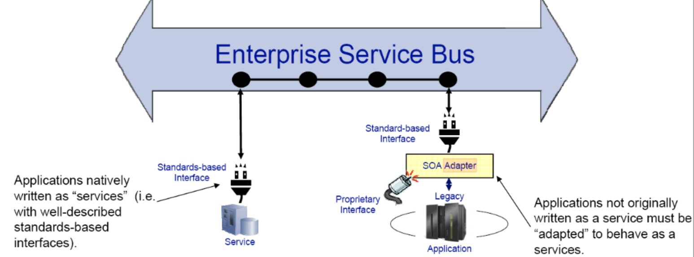
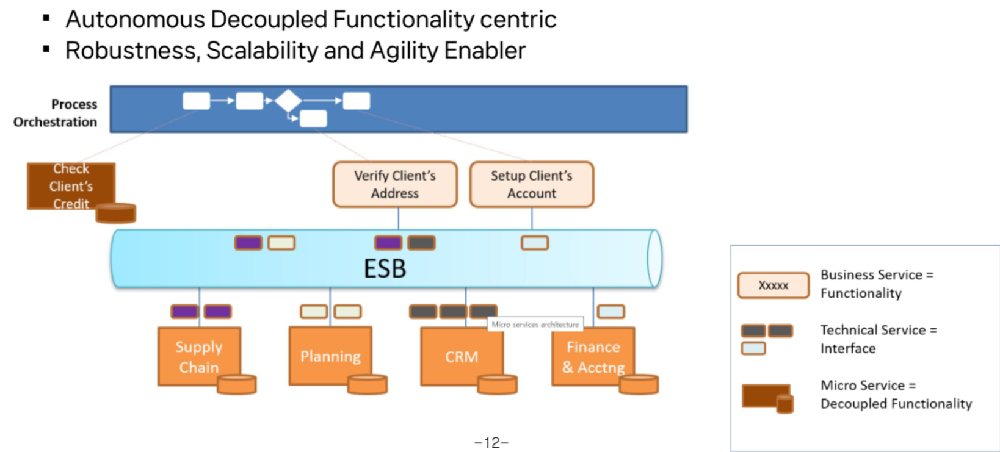
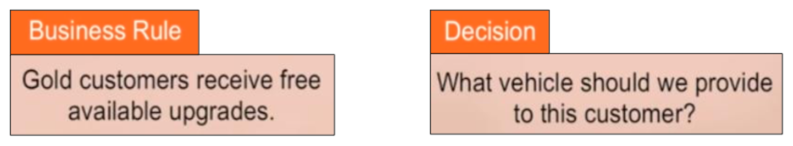
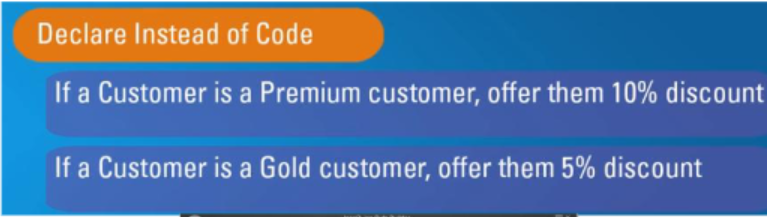

{.post-thumbnail}

## BPM Suite란

- `BPM Lifecycle` 전체 단계를 지원하는 IT 도구 집합
- 기존에는 프로세스 경영을 지원하는 IT 도구에서 비저닝, 프로세스 아키텍처, 모델링/분석, 자동화, 성과관리 등을 포괄하는 개념으로 확장됨

## BPM Suite 구성 요소

1. `BPA`(Business Process Analysis)
    - 비즈니스 프로세스를 발견/식별하여 `모델링`하고, 요구사항을 충족하는지 `분석`하는 솔루션
    - 비즈니스 프로세스를 어떻게 모델링할 것인가? 가 핵심
2. `BPE`(Business Process Execution)
    - 설계된 모델을 `자동화`하여 `실행`하는 솔루션
        - 자동화: `실행 프로세스 정의`, `자동화 실행`, `모니터링`, `실행 결과 분석`
        - 자동화 실행 도구: 프로세스 자동화 `실행` 서비스를 제공하는 `프로세스 엔진`을 중심으로 `정의, 모니터링, 분석 도구`가 포함됨
    - `Camunda Web Modeler`: 프로세스 실행에 필요한 각종 요소의 `디자인`을 위한 도구
    - `Camunda Zeebe Orchestration Engine`: `자동화 실행` 서비스를 제공하는 엔진
    - `Camunda Tasklist`: Human process에서 해야하는 일 리스트
    - `Camunda Operate`: 실행중인, 완료된, 일시중지된 프로세스(`instance / case`)를 `모니터링` 하는 도구
        - 일시 중지, 취소, 기록 삭제 가능
    - `Camunda Optimize`: 프로세스 진행 이력 기반 `분석 도구`
3. `EAI & ESB`(Enterprise Application Integration, Enterprise Service Bus)
    - 이질적 어플리케이션들을 프로세스 기반으로 `연계/통합`하는 솔루션

4. `BRE`(Business Rule Engine)
    - `어플리케이션 로직`과 `비즈니스 룰`을 `분리`하여 별도로 관리
5. `BAM`(Business Activity Monitoring)
    - `이벤트`를 수집하여 `실시간 경영 의사결정`을 지원하는 솔루션 - `RTE` 실현을 위한 도구

## 프로세스 자동화 구축 및 운영 과정

1. `Design & Deploy`
    - BPE에서 정의하는 `실행 가능`한 형태(`process definition`)
    - Design 요소
        1. `실행가능`한 자동화 프로세스 모델 <-> BPA `개념 모델`
        2. `IT Application`(ERP 모듈, `Form`)
        3. `프로세스 데이터 모델`(프로세스 변수)
        4. `업무 규칙(Business Rule)`
            - gateway condition 등
        5. `업무 담당자` / 역할 지정
        6. `통합 인터페이스(service task)`
2. `Automation & Integration`
    - `BPM 엔진`이 담당, 사람 / 사람, 사람 / 시스템, 시스템 / 시스템 통합 지휘`(Orchestration)`
    - 자동화 대상 프로세스 유형:
        - 전통적인 `워크플로우 형태 프로세스`
        - `시스템 통합` 중심 프로세스: 사람의 개입이 최소화 되는 것
        - `RPA-Centric` Process
        - `AI-Centric` Process
        - `Event-driven` / Data-driven Process
        - End-to-End Orchestrated Process: 모든 유형을 BPM 엔진이 통합 관리할 수 있다.
3. `Monitor & Control`
    - 프로세스가 정의된 대로 수행되도록 `관리`할 수 있으며, 프로세스의 성과를 일정 수준에 맞추기 위해 필요한 `조치 / 통제`를 할 수 있음
        - `독촉`, `일시 중지`, `재개`, `성과지표` 측정 값이 일정 수준에 도달하도록 `통제`
    - 진행되는 상황을 `실시간`으로 `모니터링`해볼 수 있으며, 수행된 기록을 통해 이력을 추적할 수 있음
    - 단순 모니터링을 넘어서 성과관리, 위험관리, 전략 활도오가의 연계로 범위 확장 -> `BAM` 솔루션 등장(Comunda 내장 기본적인게 있긴 함)
4. `Analysis & Report`
    - `OLAP` 도구 이용
        - `KPI` 형태로 사전 정의된 성과지표를 측정할 수 있음
    - Camunda Optimize 사용 가능
5. `Simulation & Optimize`
    - `시뮬레이션`: 매우 효과적인 `최적화` 방법
        - 가상으로 프로세스를 실행시켜 문제점 도출 및 분석 도구
        - `Event logs`를 이용하여 현실을 모델링한 시뮬레이션 가능
    - `최적화`: 분석을 통해 발견된 `문제점`을 `해결`
        - 개선기회 모색을 통해 수립된 `개선 방안`을 `적용`하여 해당 프로세스가 최적화 상태로 실행될 수 있도록 함

## AI - RPA - BPM 통합

- `Hyperautomation`: 모든 자동화 기술을 하나의 오케스트레이션 플랫폼에서 통합 관리하는 차세대 자동화 패러다임
- 구성 요소:
    - `BPM 엔진`
    - `RPA 봇`
    - `AI Agent`
    - `API / Connector / Event`
    - `Process Minig / Optimize`
- 목표: 
    - 단순 자동화를 넘어 `지능형 / 자가개선형` 프로세스 발전
    - 조직의 `End-to-End 디지털 전환` 가속화

## 시스템 통합 문제

1. 메인 프레임 시대 -> 유닉스 시스템
    - `p2p`로는 한계가 있다.
2. `EAI` 등장: `이질적` 기업 환경을 `엔터프라이즈 미들웨어`로 `통합`
    - EAI가 중앙에 `허브`역할을 하면서 모든 통신을 EAI를 거치도록 함
    - 이기종 간에 통신 프로토콜이나 통합 방식을 변경할 수 있는 `Adaptor`를 제공함

3. `ESB`로 진화
    - EAI에 `SOA` 사상이 추가
    - 애플리케이션을 느슨한 구조의 비즈니스 `서비스` 단위로 연결하고 중개하는 표준 매커니즘
        - `표준 인터페이스`가 없다면 `SOA adpator` or `service-enabled` 필요
        - 기능: `Routing of information`, data transformation, security, ...

4. `Micro Service`
    - SOA/BPM을 거쳐 발전
5. Micro service, legacy system 등을 ESB에 전부 통합

## Business Rules

- govern business `decision-making`
- 업무 수행 시 적용되는 `규정, 정책, 법규, 업무처리 규칙` 등을 의미
- 각종 `조건`들과 이에 따른 `행동`에 대한 것을 총체적으로 의미
    - 비즈니스 룰의 정의를 위해서는 `조건(If)과 행동(then)`의 `rule(row)`, 이를 표현하기 위한 `비즈니스 구조(input, output column)` 요소가 필요
    - `DMN`으로 표현

- `일상적인 업무 규칙`에서 사내 `정책 및 내규`, 기업 외적인 `법적 규제` 등 다양한 유형 존재
- 만약 BRE나 `BRMS(logic 또는 business rule을 정의, 설치, 수행, 감시, 유지보수 하는 시스템)`가 없다면 Business rule이 `프로그램 내`에서 업무 로직 형태로 구현됨
    - 문제점: business rules are `hidden` in applications
    - 프로그래밍 `난이도`가 매우 높아짐
    - `Business Agility` 문제 발생: 수정이 매우 오래걸림
    - 사람들이 수동으로 rules를 `inconsistently` 해석함
- BRE/BRMS 도입 시 장점
    - business rule을 어플리케이션으로부터 `separate` 할 수 있음
    - 비즈니스 룰의 가시성(`visibility`) 확보 - `transparency`
    - 비즈니스 사용자가 변화관리를 직접 수행 가능 - `agility`
    - 모든 rule을 `consistency` 적용 가능
- 주요 기능
    - 비즈니스 룰 모델링(코드 대신 `Declare` 형식)
    - 룰 일관성 검증
    - `추론` 기능(A -> B, B -> C 이면 A -> C)
    - IT 어플리케이션과의 연계 기능

## BAM

- 비즈니스 성과지표에 대한 `실시간` 정보를 제공하는 것
- `CEP(Complex Event Processing)`, `Fraud Detection` 기술 등이 성과 관리 전문 솔루션 형태로 발전
- `실시간 기업(RTE)`이 되기 위해서는 이벤트들을 필터링하고 분석하여 유용한 정보를 도출해 내야함. BAM 솔루션이 이를 지원

1. 프로세스 모델링 및 모니터링 모델링
2. 프로세스의 실행
3. 웹 기반 dashboard에서의 실시간 모니터링 및 경보
4. 이벤트 발생에 따른 대응 프로세스의 자동 실행 및 실행 프로세스 추적
    - reactive -> `proactive(선제적)` 관리로 발전
- 한계: 
    1. 정형화된 KPI 모니터링에 초점 -> 근본 원인 분석 한계
    2. 실행 로그 기반의 세밀한 경로 분석 부족
- 진화: `Process Intelligence / Process Mining`
    - `이벤트 로그` 기반으로 실제 수행된 프로세스 흐름 재구성
    - 병목, 재작업, 비표준 경로 자동 탐지
    - `AI 기반 분석` 및 `시뮬레이션`으로 개선안 제시

