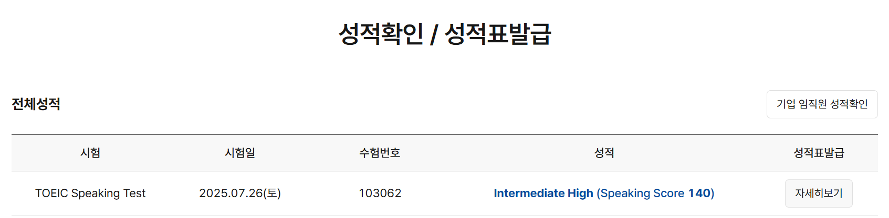
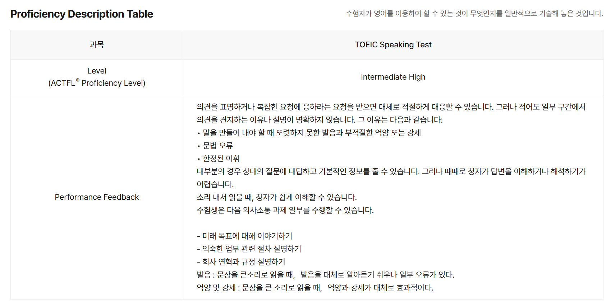

{.post-thumbnail}

## 서론

당연히 IM 등급이 나올 줄 알았는데 의외로 점수가 후하게 나온 것 같다.

말을 7번 정도 절었고, 다른 사람들이 yes라고 대답할 때, 나는 no라고 대답했고, 마지막 문제는 30초 정도 아무 말도 안해서 점수에 대한 큰 기대는 안하고 있었다.

이렇게 쉽게 점수가 나오는 줄 알았으면 조금 더 열심히 공부해볼걸 하는 생각이 든다.

물론 내가 대학원을 가지 않는다면, 적어도 근 시일 내에 스피킹 시험을 다시 보는 일은 없겠지만.

## 공부

유튜브에 있는 제이크 토익 스피킹 채널의 모의고사 9개 정도 풀어봤다.

해설은 4편 정도 보다가 거기서 설명하는대로 안 할것 같아서 그냥 내 방식대로 템플릿 만드는데 더 시간을 썼다.

원래 모의고사 20개 정도는 풀어보려고 했는데, 시험 날짜를 너무 일찍 잡아버려서 그냥 이대로 봐버렸다.

## 피드백

이런 기능까지 제공해줄 줄이야..

opic 시험은 추가 결제를 해야 피드백을 줬던걸로 기억하는데.. 정성이 기가막히다.

- `말을 만들어 내야 할 때 또렷하지 못한 발음과 부적절한 억양 또는 강세`: 템플릿이 아닌 문장은 말을 뭉뚱그려서 한다는 점을 지적한것 같다. 내가 그랬나?
- `문법 오류`: 수능 영어 이후로 영어 문법을 공부해 본 적이 없다. 애초에 100% 완벽한 문법을 구사할 수 있으리라곤 생각조차 안했다.
- `한정된 어휘`: 이 부분은 템플릿 티가 많이 났다는 지적이 아닐까 생각한다.
- `발음, 억양 및 강세`: 전체적인 톤과 발음은 괜찮다고 평가해주는 것 같다. 진짜로 내 발음이 괜찮다기 보단 그냥 평가를 좀 후하게 해준거 같다.

피드백을 전반적으로 보면 템플릿 티가 날 때 감점이 조금 있는 듯 하다.

유튜브에 있는 유명한 템플릿에 지나치게 의존하는 것 보다는 본인만의 템플릿을 만든다던가, 아니면 애드리브로 본인만의 문장을 구사한다면 좋은 점수를 받을 수 있지 않을까?

## 결론

이번 시험 결과에서 IH가 안나오면 대학원을 바로 준비해야지 생각했는데.. 이것 참 `럴수 럴수 이럴수가`한 상황이 돼버렸다.

진로에 대한 고민이 참 많아지는 시기인것 같다.
