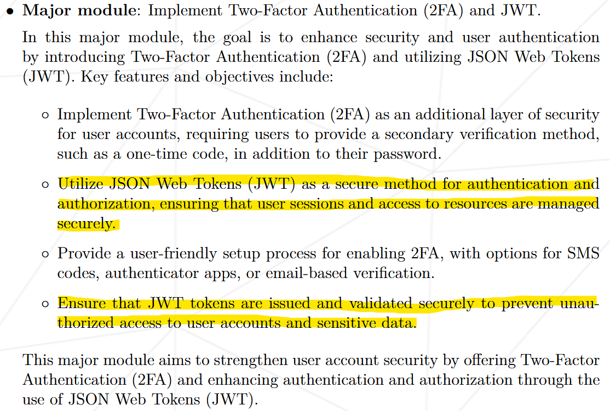

{.post-thumbnail}

::: {.callout-note appearance="simple"}
아직 작성중인 노트입니다.
:::

## intro


42 Seoul 공통과정의 마지막 과제입니다.
이 프로젝트는 개발자가 선호하는 라이브러리와 프레임워크를 자유롭게 선택하여 구현할 수 있다는 점이 특징입니다.

대형 협업 과제인 만큼, 과제에 명시되어있지 않지만 협업을 위한 툴도 공부해서 다양하게 적용해볼 수 있는 좋은 과제인것 같습니다.
저같은 경우에는 coursera, udemy 강의를 통해 **agile** 협업 방식과 **github에서의 적용 방법**에 대해 공부를 했고, 프로젝트 진행에 있어서 꽤 도움이 됐던걸로 기억합니다.
사실 프로젝트를 진행하다보니, agile 방식을 온전히 다 적용하기엔 적합하지 않다고 판단했지만, **Kanban Board**로 프로젝트를 관리하는 것 같은 부분은 꽤 유용하게 활용할 수 있었습니다.

## 프로젝트 및 구현 설명

### 개요

[과제 명세서](https://cdn.intra.42.fr/pdf/pdf/140713/en.subject.pdf)

해당 과제는 실시간 [Pong 게임](https://www.ponggame.org/) 매칭 웹사이트를 만드는게 목표입니다. 저는 이번 프로젝트에서 **github action 설정, User Management Backend 설계와 42 API를 이용한 OAuth 인증, JWT 구현, Game History를 Block Chain으로 저장**하는 파트를 담당했습니다.

참고한 자료는 다음과 같습니다:

- [Google Agile Project 관리](https://www.coursera.org/learn/agile-project-management)
- [Github Action Docs](https://docs.github.com/ko/actions)
- [Github CLI Docs](https://cli.github.com/manual/)
- [Django udemy 강좌](https://www.udemy.com/course/python-django-the-practical-guide/?couponCode=KRLETSLEARNNOW)
- [Django Rest Framework Docs](https://www.django-rest-framework.org/)
- [Django Simple JWT](https://django-rest-framework-simplejwt.readthedocs.io/en/latest/index.html)
- [JWT Token 탈취 대응 시나리오](https://mgyo.tistory.com/832)
- [micro service에서 JWT 활용 방법](https://medium.com/@jose-luis-navarro/securing-our-microservices-through-authentication-and-authorization-with-jwt-refresh-tokens-and-f4439810fce7)
- [Refresh Token을 사용해야 하는 이유](https://puleugo.tistory.com/154)
- [Cookie에서의 same site 옵션](https://www.hahwul.com/2020/01/18/samesite-lax/)
- [Bitcoin 백서](https://bitcoin.org/files/bitcoin-paper/bitcoin_ko.pdf)
- [Solidity Udemy 강의](https://www.udemy.com/course/ethereum-and-solidity-the-complete-developers-guide/?couponCode=KRLETSLEARNNOW)
- [Solidity Docs](https://docs.soliditylang.org/en/latest/)
- [nomad coder 블록체인 시리즈](https://youtube.com/playlist?list=PL7jH19IHhOLOJfXeVqjtiawzNQLxOgTdq&si=k5TMs5VUF0Z1xIA2)

그 외 참고하면 좋을것 같은 자료:

- [EBS 블록체인 강좌](https://youtube.com/pqYfnK9aTF0?si=QVFRaodHyijfEeYD)

::: {.callout-note appearance="simple"}
이 포스팅에서는 **github action setting, jwt, block chain** 부분만 다루겠습니다.  
전체 코드는 비공개 되어있는 상태입니다.
:::

### Github Action Setting

github를 이용해서 agile 방법론을 적용할 수 있도록 의도했고, **자동화**와 **template**을 이용해 통일성 있는 구조를 유지하려고 했습니다.

**1. 회의를 통해 진행해야 하는 작업을 Kanban board에 정리한다.**


각각의 column에는 다음과 같은 내용이 들어갑니다.

1. **Discussion**: 논의가 필요한 작업. 개개인이 자유롭게 올릴 수 있습니다
1. **Backlog**: Discussion에 있는 내용 중 구현하기로 회의에서 정한 작업
1. **Ready**: Back log에 있는 작업 중 이번 Sprint에서 구현할 작업들
1. **In Progress**: Ready에 있는 작업 중 누군가가 작업중인 것
1. **Done**: master branch에 merge가 완료된 작업

자세한 내용은 [meeting](#meeting) 부분을 참고해 주세요.

참고로 **Disccusion**에 작업을 올리는 방법은 **template에 맞게 issue를 올리**면 됩니다.


아래와 같이 설정 파일을 만들어서 '.github/ISSUE_TEMPLATE/' 폴더 안에 저장하면 issue create 시 자동으로 template이 뜨게 할 수 있습니다.

```bash
name: New discussion
description: new discussion
title: "[DISCUSSION]"
labels: ["enhancement"]
projects: ["org_name/5"]
body:
  - type: markdown
    attributes:
      value: |
        해당 기능과 관련된 request가 이미 존재하는지 확인해주세요.
  - type: textarea
    id: story
    attributes:
      label: Story
      description: 해당 기능에 대한 설명이나 필요한 배경을 작성해주세요.
      placeholder: 자유로운 양식으로 작성해주세요.
    validations:
      required: true
```

**2. Kanban board를 보고 개인이 능동적으로 고유 브랜치에 작업을 진행한다.**


Kanban board의 Ready section에 있는 작업을 클릭해서 들어간 후, **assignees를 본인으로 선택해서 작업**하면 됩니다.
**task completion criteria**라는 내용이 보이는데, 이는 **회의를 통해 결정**하는 것으로, 나중에 작업이 완료되고 **pull request 시, 평가자가 작업에 완성도에 대해 판단할 수 있는 기준**으로 제공됩니다.

자동화 코드는 아래와 같이 구현했습니다.

```bash
name: Create branch
on:
  issues:
    types: [ assigned ]
  pull_request:
    types: [ opened, closed ]
jobs:
  create_issue_branch_job:
    runs-on: ubuntu-latest
    steps:
      - name: Generate token
        id: generate_token
        uses: tibdex/github-app-token@v2
        with:
          app_id: ${{ secrets.APP_ID }}
          private_key: ${{ secrets.PRIVATE_KEY }}

      # gh 명령어를 이용해 project의 상태를 In progress로 수정해줍니다.
      - name: Project in-progress
        if: github.event.action == 'assigned'
        run: |
          PROJECT_ID=$(gh project view 5 --owner organization-for-practice --format=json --jq '.id')
          ITEM_ID=$(gh project item-list 5 --owner organization-for-practice --format=json --jq ".items[] | select(.content.number == ${NUMBER}) | .id")
          FIELD_ID=$(gh project field-list 5 --owner organization-for-practice --format=json --jq '.fields[2].id')
          SINGLE_ID=$(gh project field-list 5 --owner organization-for-practice --format=json --jq '.fields[2].options[] | select(.name == "In progress") | .id')
          gh project item-edit --id ${ITEM_ID} --field-id ${FIELD_ID} --single-select-option-id ${SINGLE_ID} --project-id ${PROJECT_ID}
        env:
          GH_TOKEN: ${{ steps.generate_token.outputs.token }}
          NUMBER: ${{ github.event.issue.number }}

      # assign한 작업에 대한 branch를 새로 만들어줍니다.
      - name: Create Issue Branch
        uses: robvanderleek/create-issue-branch@main
        env:
          GITHUB_TOKEN: ${{ steps.generate_token.outputs.token }}
```

위의 코드는 assign한 작업을 Ready column에서 In progress column으로 옮겨주고, 자동으로 작업할 branch를 만들어줍니다.

branch 자동 생성은 [이 workflow](https://github.com/robvanderleek/create-issue-branch)를 사용하였고, 적용 시 아래와 같이 브랜치가 생성됩니다.

```yaml
autoLinkIssue: true
autoCloseIssue: true
branchName: tiny
commentMessage: |
  \"${branchName}\" branch 생성 완료.
  해당 branch를 통해서 main에 pull request 올려주세요.
branches:
  - label: 'task list'
    prefix: feature/${issue.title[12,27],}/
    copyIssueAssigneeToPR: true
  - label: 'bug'
    prefix: hot_fix/${issue.title[6,21],}/
    copyIssueAssigneeToPR: true
  - label: '*'
    skip: true
```

위의 config 파일을 작성해주면 아래와 같이 브랜치가 생성됩니다.


이름도 자동으로 생성되게 해서 **convention을 지켜야 한다는 부담을 줄여**줬습니다.

**3. 작업이 완료되면, 모든 조건을 충족하는지 확인한 후, master에 merge 한다.**


작업이 완료됬다고 판단되면 위 화면과 같이 **pull request를 생성**하고, **Reviewer를 설정**해주면 됩니다.


그러면 이전에 설정했던 기준들이 자동으로 불러와지고, **모든 항목에 체크가 완료**되어야 **merge를 할 수 있게 설정**했습니다.
구현 코드는 아래와 같습니다.

```bash
name: Master merge rutine
on:
  pull_request_target:
    types: [ opened, synchronize ]
    branches:
      - master
env:
  PR_NUM: ${{ github.event.pull_request.number }}
  GH_REPO: ${{ github.repository }}
jobs:
  get_checklist:
    runs-on: ubuntu-latest
    if: github.event.action == 'opened'
    steps:
      - name: Generate token
        id: generate_token
        uses: tibdex/github-app-token@v2
        with:
          app_id: ${{ secrets.APP_ID }}
          private_key: ${{ secrets.PRIVATE_KEY }}
      - name: Get issue
        id: issue_num
        env:
          BRANCH: ${{ github.event.pull_request.head.ref }}
        run: |
          echo $BRANCH | grep -o 'feature\/.*\/i[0-9]\+' || echo $BRANCH | grep -o 'hot_fix\/.*\/i[0-9]\+'
          TMP=$(echo $BRANCH | grep -o 'i[0-9]\+')
          echo "NUMBER=${TMP#i}" >> $GITHUB_OUTPUT
      - name: Get issue body
        id: issue_body
        env:
          GH_TOKEN: ${{ steps.generate_token.outputs.token }}
          NUM: ${{ steps.issue_num.outputs.number }}
        run: |
          echo "CONTENTS<<EOF" >> $GITHUB_OUTPUT
          gh issue view ${NUM} --json body --jq '.body' >> $GITHUB_OUTPUT
          echo "EOF" >> $GITHUB_OUTPUT
      - name: Update checklist
        run: |
          gh pr comment $PR_NUM --body "${BODY}"
        env:
          GH_TOKEN: ${{ steps.generate_token.outputs.token }}
          BODY: "${{ steps.issue_body.outputs.contents }}"
```

**merge가 완료된 branch**는 **자동으로 삭제**가 되도록 설정을 해주었습니다.

이제 아래는 실제 **프로젝트를 진행할 때 만들었던 rule**들입니다.

#### **1. work flow**

**github flow**로 진행됩니다.


1. 매 작업은 master branch의 HEAD를 기반으로 이루어집니다.  
   pr을 올리지 않는 개인 작업용 **local branch는 자유롭게 생성**해주세요.
1. master에 직접적인 push는 관리자를 제외하고는 불가능합니다.
1. master에 대한 merge는 squash merge로 진행됩니다.
1. 그 외의 merge는 rebase로 진행해주세요.

#### **2. work**

1. kanban board의 \'Ready\' 섹션에서 하나를 정해서 새로운 기능에 대한 작업을 진행해주세요.  
   선택한 작업은 assignees에 자신의 팀원을 등록 후, Start Date를 해당 날짜로 설정해주세요.  
   assignees 등록이 완료되면 자동으로 target branch가 생성됩니다.  
   해당 branch에 팀원들이 필요한 기능들을 자유로운 방식으로 구현한 후, master branch에 merge 해주세요.  
   단, 해당 branch에 대한 merge는 rebase로 진행해주세요.
1. hot_fix issue나, new feature request issue는 discussion의 필요성이 있을 경우에 등록해주세요.
1. 작업 중, 현재 작업하는 범위 외에서 추가적인 기능이 필요할 경우 관련 issue에 comment를 남기거나, reopen 해주세요.

#### **3. commit message convention**

아래의 명령어를 입력해주세요

```bash
git config commit.template .github/COMMIT_MESSAGE_TEMPLATE
```
이후, -m 옵션 없이 'git commit'으로 message를 입력해주세요.  

```{.python filename="COMMIT_MESSAGE_TEMPLATE"}
# commit message template
# ▼ <Title> 작성

# ▼ <빈 줄>

# ▼ <body> 작성

# ▼ <빈 줄>

# ▼ <footer> 작성


# About Convention
#	<Title>
#		- 필수로 입력해주세요
#		- 형식: <type>: <short summary>
#
#		<type>
#			- config: 설정 관련 파일 작성 또는 변경
#			- docs: 문서 변경사항
#			- feat: 새로운 기능
#			- fix: 버그 수정
#			- refactor: 기능 추가나 버그 수정이 아닌 변경 사항
#			- remove: 코드나 파일 제거
#			- style: 스타일 작성 또는 수정
#			- test: 누락된 테스트 추가 또는 기존 테스트 수정
#			- core: 기능 구현 외 시스템 관련 작업
#
#		<short summary>
#			- 변경 사항에 대한 간단한 설명
#			- 첫글자 소문자, 현재 시제, 명령문으로 마지막에 .(마침표) 없이 작성
#
#	<body>
#		- 선택적으로 입력 해주세요
#		- 현재 시제, 명령문으로 작성
#		- 변경 사항의 동기(왜)를 설명
#		- 변경 효과를 설명하기 위해 이전 동작과 현재 동작의 비교를 포함할 수 있음
#
#	<footer>
#		- 선택적으로 입력 해주세요
#		- 해당 commit과 관련된 task의 issue 번호들을 적어주세요
#		- 'bug'나 'task list' label이 붙은 issue는 제외해주세요
#		- ex) closes #<issue 번호> closes #<issue 번호> ...
```

::: {.callout-note appearance="simple"}
commit message template은 [이 사이트](https://www.conventionalcommits.org/en/v1.0.0/)를 참고해서 만들었습니다.
:::

#### **4. pull request**

1. pull request는 **500줄의 코드**를 넘어가지 않게 작성 바랍니다.
1. 모든 check list를 통과한 request만 master에 merge 가능합니다.
1. reviewers에는 해당 작업과 관련된 domain의 팀원을 선택해주세요.
   최소 1명 이상의 동료에게 평가를 받은 request만 merge 가능합니다.

#### **5. meeting**

- daily meeting
   
   - 매일 정해진 시간에 팀원들은 각각 다음과 같은 사안에 대해 논의합니다.

       1. 개인이 어제 작업한 내용
       2. 개인이 오늘 작업할 내용
       3. 개인이 현재 도움이 필요한 내용

   - 이후, 새로운 내용이 추가된 (\'Disccusion\' 섹션에 있는) issue 중 다음과 같은 내용에 대해 논의합니다.

       1. 해당 issue가 유효한가
       2. 추가적으로 필요하거나 필요 없는 내용
       3. 해당 issue의 priority (매우 급함 / 급함 / 안 급함)
       4. 해당 issue의 estimate (작업하는데 필요한 노력의 정량적인 수치)  
   
   - 추가적으로, project의 \'Back log\' 항목에서 \'Ready\' 항목으로 추가해야 할 작업에 대해 논의하거나 \'Ready\' 항목에서 \'Back log\' 항목으로 제외할 작업에 대해 논의할 수 있습니다.

- sprint planning / retrospective
   
   - 2주에 한번 진행.
   - 이전 sprint에 대한 평가와 이후 sprint를 위한 계획을 세웁니다.  
   - planning  
      - Project의 \'Back log\' 항목 중 본격적으로 작업을 진행할 항목을 정합니다.
      - daily meeting 시간을 조정할 수 있습니다.
   - retrospective  
      - 이전 sprint의 문제점에 대해 서로 의논해봅니다.

::: {.callout-note appearance="simple"}
프로젝트를 하다보니, 생각보다 진행 속도가 빨라서 2주에 한번 진행하는 sprint는 유명무실해져버렸습니다.
실제로는 daily meeting만 진행을 했습니다.
:::

### JWT




비밀번호를 저장할 때는 암호화를 해야 한다는 요구사항이 있습니다. 이번 포스팅에서는 다루지 않지만, 우리의 구현에서는 비밀번호 없이 OAuth만으로 로그인이 가능하도록 설계했습니다. 따라서 사용자가 직접 비밀번호를 설정하지는 않습니다.

다만, JWT 구현 과정에서 비밀번호로 간주될 수 있는 부분이 있다고 판단하여 해시 처리를 추가했습니다. 이는 명세서의 해당 요구사항을 반영한 것입니다.

구현에 대해 설명하기 전에, 먼저 **JWT(JSON Web Token)가 무엇인지 이해**해야 합니다. JWT는 **토큰 기반 암호화 방식의 표준화된 형식**으로, 다음과 같은 형태를 가지고 있습니다.

1. **Header**: 토큰의 유형(예: JWT)과 사용된 암호화 알고리즘(예: HMAC SHA256)을 지정합니다.
1. **Payload**: 토큰에 담을 정보를 포함합니다. 여기에는 클레임(Claim)이라고 불리는 키-값 쌍이 포함됩니다.
1. **Signature**: 헤더와 페이로드를 합친 후, 지정된 알고리즘과 비밀 키를 사용해 서명한 값입니다. 이 서명은 토큰의 무결성을 보장합니다.

각 부분은 점(.)으로 구분되며, Base64Url로 인코딩되어 있습니다.

토큰 암호화 방식은 왜 등장했을까요? 우리가 일반적으로 알고 있는 **세션-쿠키 방식과는 어떤 차이**가 있을까요?

- **세션-쿠키 방식**: 사용자가 로그인하면 서버는 세션 ID를 생성하고 이를 사용자의 정보와 함께 **데이터베이스나 메모리에 저장**합니다. **이후 클라이언트는 쿠키에 세션 ID를 저장**하고, 요청마다 이를 서버로 전송합니다. 서버는 세션 ID를 검증하여 사용자를 인증합니다. 이 방식은 **사용자가 증가할수록 서버의 메모리나 데이터베이스에 부담이 커집니다.**

- **토큰 암호화 방식**: 인증에 필요한 정보와 사용자의 정보(클레임)가 **토큰 자체에 포함**되어 있습니다. 서버는 토큰의 서명만 검증하면 되기 때문에 별도의 **저장 공간이 필요하지 않습니다.** 따라서 서버의 부하를 줄일 수 있습니다.

즉, 기존의 세션-쿠키에서는 서버에 저장하던 정보를 토큰에 담아서 사용자한테 전달하는게 토큰 인증방식입니다.
언뜻 보기에는 토큰 암호화 방식이 세션-쿠키 방식의 상위호환처럼 보이지만, 토큰 방식에는 몇 가지 **보안상의 위협**이 존재합니다. 주요 위협과 그에 대한 대응 방법은 다음과 같습니다.

- **토큰 탈취**: 토큰이 노출되면 공격자가 이를 악용할 수 있습니다.

   대응 방법: **HTTPS**를 사용하여 통신을 암호화하고, 토큰의 **유효 기간을 짧게** 설정합니다. 또한, **Refresh Token을 사용**하여 Access Token의 유효 기간을 더욱 단축할 수 있습니다.

- **XSS(Cross-Site Scripting) 공격**: 악성 스크립트를 통해 토큰을 탈취할 수 있습니다.

   대응 방법: **HttpOnly와 Secure 플래그를 사용해 쿠키에 토큰을 저장**합니다.

- **CSRF(Cross-Site Request Forgery) 공격**: 사용자의 권한을 도용해 악의적인 요청을 보낼 수 있습니다.

   대응 방법: **CSRF 토큰을 사용**하거나, **SameSite 속성을 설정**해 쿠키를 보호합니다.

- 토큰 재생 공격: 탈취한 토큰을 재사용하는 공격입니다.

   대응 방법: **토큰에 일회용 nonce 값을 포함**시키거나, **토큰 블랙리스트를 관리**합니다.

::: {.callout-note appearance="simple"}
토큰 탈취의 대응방법이 조금 허술하다고 느껴질 수 있습니다.  
더 많은 정보는 [이 포스팅](https://mgyo.tistory.com/832)이 도움이 될것 같습니다.
:::

인증 방식은 상황에 맞게 알맞은 선택을 하는게 중요합니다.
서버 확장성이나 경량화 측면에서는 토큰 인증 방식이 매력적인 이점을 가져다 줍니다.
하지만, **보안이 중요한 서비스의 경우 session-cookie 방식이 더 유리**할 수 있습니다.

그럼 이제 구현 내용을 보도록 하겠습니다.


```{.python filename=middleware.py}
class JWTMiddleware:
	def __init__(self, get_response):
		self.get_response = get_response

	def __call__(self, request):
		access = request.COOKIES.get('access')
		if access and request.path != '/auth/ft' and request.path != '/auth/refresh':
			request.META['HTTP_AUTHORIZATION'] = f'Bearer {access}'
		response = self.get_response(request)
		return responseclass JWTMiddleware:
	def __init__(self, get_response):
		self.get_response = get_response

	def __call__(self, request):
		access = request.COOKIES.get('access')
		if access and request.path != '/auth/ft' and request.path != '/auth/refresh':
			request.META['HTTP_AUTHORIZATION'] = f'Bearer {access}'
		response = self.get_response(request)
		return response
```

```{.python filename=settings.py}
SIMPLE_JWT = {
    "AUTH_HEADER_TYPES": ("Bearer",),
    
    ...
}
```

```{.python filename=아_정리하기_귀찮아}
def get_info_from_token(token, key):
	try:
		payload = jwt.decode(
			token,
			settings.SECRET_KEY,
			algorithms=[settings.SIMPLE_JWT['ALGORITHM']],
			options={"verify_signature": False, "verify_exp": False}
		)
	except jwt.InvalidTokenError:
		pass
	ret = payload.get(key)
	return ret

class CustomTokenRefresh(APIView):
	permission_classes = []

	def post(self, request):
		try:
			refresh_token = request.COOKIES.get('refresh')
			access_token = request.COOKIES.get('access')
			if refresh_token is None:
				raise TokenError
			user_id = get_info_from_token(refresh_token, 'user_id')
			if user_id is None:
				raise TokenError
			user = User.objects.get(id=user_id)
			if access_token is not None:
				ret = get_info_from_token(access_token, '2FA')
				is_weak = ret is not None and ret == 'F'
			else:
				is_weak = user.two_factor == True
			if user.refresh_token is None or not check_password(refresh_token, user.refresh_token):
				raise TokenError
			validate_token = RefreshToken(refresh_token)
			validate_token.check_exp()
		except (TokenError, User.DoesNotExist) as e:
			if isinstance(e, TokenError):
				user.refresh_token = None
				user.save()
			res = Response({'detail': 'Given token not valid for any token type'}, status=401)
			res.delete_cookie('access')
			res.delete_cookie('refresh')
			return res
		refresh = RefreshToken.for_user(user)
		user.last_login = timezone.now()
		user.refresh_token = make_password(str(refresh), None, 'md5')
		user.save()
		access = refresh.access_token
		if is_weak:
			access['2FA'] = 'F'
		response = Response(status=204)
		response.set_cookie(
			'access', 
			str(access), 
			httponly=True, 
			secure=True,
			samesite='Lax')
		response.set_cookie(
			'refresh', 
			str(refresh), 
			httponly=True, 
			path=f"/auth/refresh;",
			secure=True,
			samesite='Strict')
		return response

class AuthProvider(APIView):
	permission_classes = []

	def get(self, request, auth_name):
		if auth_name == 'ft':
			ret = get_ft_user(request)
		else:
			raise Http404
		if isinstance(ret, HttpResponse) or isinstance(ret, Response):
			return ret
		try:
			user = User.objects.get(oauth__id=ret["id"], oauth__provider=ret["provider"])
		except User.DoesNotExist:
			user_list = User.objects.all()
			for num in range(1, 100):
				if num == 1:
					username = ret['default_username']
				else:
					username = ret["default_username"] + '-' + f"{num:03d}"
				if not user_list.filter(username=username).exists():
					break
			random_str = ''.join(random.choices(string.ascii_letters, k=10)) 
			user = User(
				username = username, 
				email = ret["email"],
				oauth = {
					"id": ret["id"],
					"provider": ret["provider"],
				},
				password = make_password(random_str, None, 'md5'),
			)
			user.save()
			user = User.objects.get(username=username)
			sync_user_to_game_db(user.id, user.username)
		user.last_login = timezone.now()
		refresh = RefreshToken.for_user(user)
		user.refresh_token = make_password(str(refresh), None, 'md5')
		user.save()
		if user.two_factor:
			res = HttpResponseRedirect(f'{settings.BASE_URL}/two-factor')
			access = refresh.access_token
			access['2FA'] = 'F'
		else:
			res = HttpResponseRedirect(f'{settings.BASE_URL}/home')
			access = refresh.access_token
		res.status_code = 303
		res.set_cookie(
			'access', 
			str(access), 
			httponly=True, 
			secure=True,
			samesite='Lax')
		res.set_cookie(
			'refresh', 
			str(refresh), 
			httponly=True, 
			path=f"/auth/refresh;",
			secure=True,
			samesite='Strict')
		return res

def get_ft_user(request):
	code = request.GET.get('code', '')
	if code == '':
		response = HttpResponseRedirect(getattr(settings, 'AUTH_42_CLIENT_URL', ''))
		response.status_code = 303
		return response
	try:
		response = requests.post(f'https://api.intra.42.fr/oauth/token?{urlencode({
			'grant_type': 'authorization_code',
			'client_id': getattr(settings, 'AUTH_42_CLIENT_ID', ''),
			'client_secret': getattr(settings, 'AUTH_42_CLIENT_SECRET', ''),
			'code': code,
			'redirect_uri': f'{settings.BASE_URL}/auth/ft',
			'scope': 'public',
		})}')
		response.raise_for_status()
		response = requests.get('https://api.intra.42.fr/v2/me', headers={
			'Authorization': f'Bearer {response.json()['access_token']}'
		})
		response.raise_for_status()
		user = response.json()
		return {
			"default_username": user["login"],
			"provider": "42",
			"id": user["id"],
			"email": user["email"],
		}
	except (requests.exceptions.RequestException, JSONDecodeError, KeyError) as e:
		if response.status_code == 401:
			return Response({"detail": "잘못된 권한입니다"}, status=401)
		logger.error(f'{e}: response code: {response.status_code} and response body: {response.text}')
		return Response({"detail": "Internal Server Error"}, status=500)

@api_view(['POST'])
@permission_classes([IsAuthenticated])
def logOut(request):
	user = request.user
	user.last_logout=timezone.now()
	user.refresh_token = None
	user.save()
	res = Response(status=204)
	res.delete_cookie('access')
	res.delete_cookie('refresh')
	return res
```
### Block Chain

::: {.callout-note appearance="simple"}
블록 체인의 개념적인 자세한 설명은 생략하겠습니다.  
:::


**이더리움**은 비트코인과 함께 가장 잘 알려진 블록체인 플랫폼 중 하나입니다. 하지만 비트코인이 단순히 디지털 화폐에 중점을 둔 반면, 이더리움은 **스마트 컨트랙트 기능**을 통해 **더 다양한 응용 프로그램**(Decentralized Applications, DApps)을 지원합니다.

**스마트 컨트랙트**는 블록체인 상에서 동작하는 자동화된 계약입니다. 이는 코드로 작성된 계약 조건을 블록체인에 저장하고, **특정 조건이 충족되면 자동으로 실행되는 프로그램**입니다. 스마트 컨트랙트의 주요 특징은 다음과 같습니다:

- **자동 실행**: 계약 조건이 충족되면 코드가 자동으로 실행됩니다. 중간에 인간의 개입이 필요하지 않습니다.

- **투명성**: 블록체인에 저장되기 때문에 모든 거래 내역이 공개되고 검증 가능합니다.

- **불변성**: 한 번 배포된 스마트 컨트랙트는 수정이 불가능합니다. 이는 신뢰성을 보장합니다.

- **분산화**: 중앙 집중형 서버가 필요 없이 블록체인 네트워크 상에서 실행됩니다.

명세서에 따르면, 스마트 컨트랙트를 테스트하기 위한 로컬 개발 환경이 필요합니다.
이를 위해 **가나슈(Ganache)**를 사용했습니다. 가나슈는 이더리움 블록체인의 로컬 테스트넷을 제공하는 도구로, 개발자가 스마트 컨트랙트를 배포하고 테스트할 수 있는 가상 환경을 만들어 줍니다.
스마트 컨트랙트 작성 후, solidity로 컴파일해서 가나슈 블록체인 환경에 저장을 해주겠습니다.

먼저 가나슈 테스팅 환경 세팅입니다.

```dockerfile
FROM node:alpine

WORKDIR /app

RUN npm install -g ganache

CMD ganache \
	-h 0.0.0.0 \
	--wallet.accounts ${BLOCK_CHAIN_PRIVATE_KEY},0x1000000000000000000 \
	--miner.coinbase ${BLOCK_CHAIN_ACCOUNT} \
	--database.dbPath ${BLOCK_CHAIN_DB_PATH} \
	--chain.networkId ${BLOCK_CHAIN_NETWORK_ID} \
	--chain.asyncRequestProcessing
```

docker container로 실행되도록 설정했습니다.

```solidity
// SPDX-License-Identifier: GPL-3.0
pragma solidity >=0.4.22 <0.9.0;
contract TournamentHistory {
	struct Tournament {
		uint	tournament_id;
		uint	datetime;
		string	winner;
		Game[3]	games;
	}
	struct Game {
		uint	datetime;
		uint[2]	players;
		string	winner;
		string 	rally;
	}
    address public	chairperson;
	uint private tournament_total;
	mapping(uint => uint) private user_log_total;

	event TournamentDetail(
		uint indexed	tournament_id,
		uint			datetime,
		string			winner,
		Game[3]			games
	);

	event TournamentDetailForUser(
		uint 			tournament_id,
		uint indexed	user_id,
		uint indexed	user_log_key,
		uint			datetime,
		string			winner,
		Game[3]			games
	);

    constructor() {
		chairperson = msg.sender;
    }

	function addTournament(
		uint			datetime,
		string	memory	winner,
		uint[4]	memory	user_id,
		Game[3] memory	games
	) 
		external
	{
		require(msg.sender == chairperson, "You dont have permission to add a tournament.");
		emit TournamentDetail(++tournament_total, datetime, winner, games);
		for (uint i = 0; i < 4; i++) {
			emit TournamentDetailForUser(
				tournament_total,
				user_id[i], 
				user_log_total[user_id[i]]++,
				datetime, 
				winner, 
				games
			);
		}
	}
}
```

Pong Game의 Tournament 경기 정보를 저장하는 smart contract 입니다.

```python
import json, os
from web3 import Web3
from solcx import compile_standard, install_solc, set_solc_version

with open("/etc/block_chain/contracts/TournamentHistory.sol", "r") as file:
	contract_file = file.read()

install_solc("0.8.20")
set_solc_version("0.8.20")
compiled_sol = compile_standard(
	{
    	"language": "Solidity",
    	"sources": {"TournamentHistory.sol": {"content": contract_file}},
        "settings":{
        	"outputSelection": {
            	"*": {
                	"*": ["abi", "metadata", "evm.bytecode", "evm.sourceMap"]}
			}
        }, 
    }
)

with open("/etc/block_chain/contracts/compiled_code.json", "w") as file:
	json.dump(compiled_sol, file)

bytecode = compiled_sol["contracts"]["TournamentHistory.sol"]["TournamentHistory"]["evm"]["bytecode"]["object"]
abi = json.loads(compiled_sol["contracts"]["TournamentHistory.sol"]["TournamentHistory"]["metadata"])["output"]["abi"]
w3 = Web3(Web3.HTTPProvider("http://block_chain:8545"))
chain_id = os.environ.get("BLOCK_CHAIN_NETWORK_ID", "")
account_address = os.environ.get("BLOCK_CHAIN_ACCOUNT", "")
private_key = os.environ.get("BLOCK_CHAIN_PRIVATE_KEY", "")

TournamentHistory = w3.eth.contract(abi=abi, bytecode=bytecode)
nonce = w3.eth.get_transaction_count(account_address)
transaction = TournamentHistory.constructor().build_transaction(
    {
        "chainId": int(chain_id),
        "gasPrice": w3.eth.gas_price,
        "from": account_address,
        "nonce": nonce,
    }
)
signed_txn = w3.eth.account.sign_transaction(transaction, private_key=private_key)
tx_hash = w3.eth.send_raw_transaction(signed_txn.rawTransaction)
tx_receipt = w3.eth.wait_for_transaction_receipt(tx_hash)

compiled_sol['contracts']['TournamentHistory.sol']['TournamentHistory']['contract_address'] = tx_receipt.contractAddress
compiled_sol['contracts']['TournamentHistory.sol']['TournamentHistory']['nonce'] = str(nonce)
with open("/etc/block_chain/contracts/compiled_code.json", "w") as file:
    json.dump(compiled_sol, file)
```

위 로직으로 compile 후, 가나슈에 베포되도록 했습니다.

```python
"""
This module is for storing and retrieving tournament data from the blockchain.
"""
import json, os
from web3 import Web3
from django.conf import settings

class Tournament:
	"""
	Store and retrieve tournament data from the blockchain.
	"""
	chain_id = int(os.environ.get("BLOCK_CHAIN_NETWORK_ID"))
	account_address = os.environ.get("BLOCK_CHAIN_ACCOUNT")
	private_key = os.environ.get("BLOCK_CHAIN_PRIVATE_KEY")
	
	def __init__(self):
		self.w3 = Web3(Web3.HTTPProvider("http://block_chain:8545"))
		with open("/etc/block_chain/contracts/compiled_code.json", "r") as file:
			self.config_file = json.load(file)
		abi = json.loads(self.config_file["contracts"]["TournamentHistory.sol"]["TournamentHistory"]["metadata"])["output"]["abi"]
		contract_address = self.config_file["contracts"]["TournamentHistory.sol"]["TournamentHistory"]["contract_address"]
		self.contract = self.w3.eth.contract(address=contract_address, abi=abi)
		self.tournament_detail_event = self.contract.events.TournamentDetail
		self.tournament_detail_for_user_event = self.contract.events.TournamentDetailForUser

	def store_tournament(self, tournament_date, winner, players, games):
		"""
		Store tournament data in the blockchain.

		argument means:
		1. tournament date 2. winner:string 3. players:uint[4] 4. games:tuple[3]

		The games what is tuple means:
		(game start time, players:uint[2], winner:string, rally:string)
		"""
		nonce = self.w3.eth.get_transaction_count(self.account_address)
		transaction = self.contract.functions.addTournament(
			tournament_date,
			winner,
			players,
			games
		).build_transaction({
				"chainId": self.chain_id,
				"gasPrice": self.w3.eth.gas_price,
				"from": self.account_address,
				"nonce": nonce,
		})
		signed_txn = self.w3.eth.account.sign_transaction(transaction, private_key=self.private_key)
		tx_hash = self.w3.eth.send_raw_transaction(signed_txn.rawTransaction)
		self.w3.eth.wait_for_transaction_receipt(tx_hash)
		
	def get_tournament_for_user(self, user_id, page, total):
		"""
		Retrieve tournament data from the blockchain for a specific user.
		Please give page argument directly from the request.
		You will get max 10 logs per page if exist.
		If no data in given page, empty array will return
		Also, if argeuments are invalid (not unsigned int), empty array will return.
		"""
		if user_id < 0 or page < 1 or total < 0:
			return []
		page -= 1
		target = [max(0, total - 1 - (page * settings.PAGE_SIZE + i)) for i in range(settings.PAGE_SIZE)]
		logs = self.tournament_detail_for_user_event.create_filter(
			fromBlock=0, 
			toBlock='latest', 
			argument_filters={'user_id': user_id, 'user_log_key': target})
		ret = []
		for log in logs.get_all_entries():
			ret.insert(0, log.args)
		return ret

	def get_tournament(self, tournament_id):
		"""
		Retrieve tournament data from the blockchain with id.
		If tournament_id is not exist, None will return.
		"""
		if tournament_id < 0:
			return None
		logs = self.tournament_detail_event.create_filter(
			fromBlock=0, 
			toBlock='latest', 
			argument_filters={'tournament_id': tournament_id})
		target = [log.args for log in logs.get_all_entries()]
		return target[0] if target else None
```

web3.0을 이용해 모듈화 해줬습니다.

## 결과


## outro

ft_transcendence 과제는 통상 5인 팀이 2-3개월에 걸쳐 완성하는 대형 과제입니다.
이런 과제를 고작 3인이 한 달 만에 완료한것은 보통 일이 아니라고 생각합니다.

처음 계획했던 것보다 빠른 진행이 가능했던 건 팀원들의 기술적 역량이 높았던 것도 있지만, 팀원 전원이 지속적인 몰입과 집중력을 유지했던 것과, 매일 아침 미팅을 진행하며 지속적으로 팀원간 의사소통을 했던 것이 크게 작용했던 것 같습니다.
앞으로 이 과제를 수행하실 분들도 협업 능력을 키우는 용도로 해당 과제를 수행해 나가시면 큰 도움이 될거라 생각합니다.
