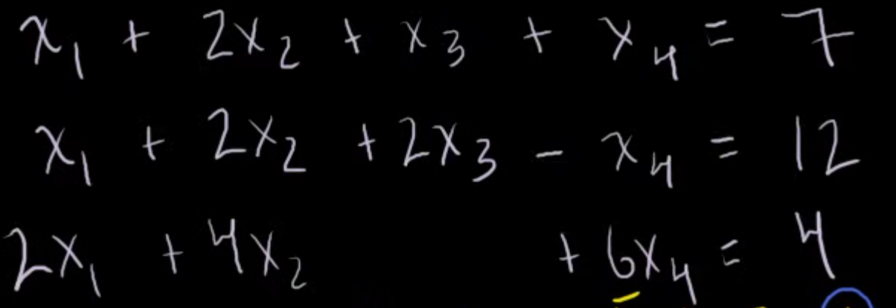
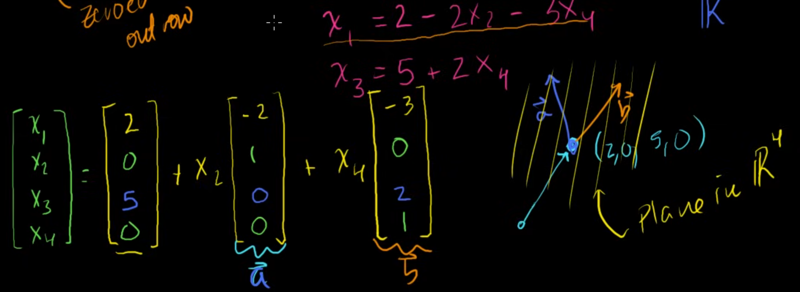

{.post-thumbnail}

## Reduced Row Echelon Form

각 행의 선행항을 1로 만들고, 그 열의 다른 항을 0으로 만드는 방법을 행렬로 표현한 것이다.

이때 선행항의 변수를 pivot variable이라고 하고, 다른 변수들은 free variable이라고 한다.

관행적으로 pivot entry는 우하향으로 이동하고, zeroed out 행은 맨 아래쪽에 위치한다.

기약행렬을 이용해 연립방정식으로 풀 수 없는 식을 행렬의 선형 결합으로 표현할 수 있다.

혹은 식이 유효하지 않다면, 해가 없는 경우이며, 이것은 평행한 조건이 존재할 경우 발생한다.

