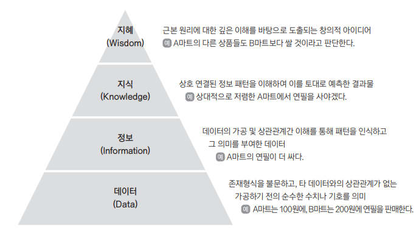

{.post-thumbnail}

## 데이터와 정보

### 1. 데이터

- `객관적 사실`을 나타내는 `존재적 특성`과, `추론 예측 전망 추정을 위한 근거`가 되는 `당위적 특성`을 모두 포함하는 개념
- 단위: `바이트(byte)`, `킬로바이트(KB)`, `메가바이트(MB)`, `기가바이트(GB)`, `테라바이트(TB)`, `페타바이트(PB)`, `엑사바이트(EB)`, `제타바이트(ZB)`, `요타바이트(YB)`
- 유형:
  - `정성적 데이터`: 비정형 데이터, 주관적 내용, 통계분석이 어려움
  - `정량적 데이터`: 정형 데이터, 객관적 내용, 통계분석이 용이함
- 지식 경영의 핵심 이슈인 `암묵지`와 `형식지`를 연결하는 역할을 함

::: {.callout-note appearance="simple" icon=false}
- `정형` 데이터: 표 형태로 정리된 데이터
- `반정형` 데이터: HTML, XML, JSON 등의 형태(스키마, 메타데이터)가 있고, 연산이 불가능한 데이터
- `비정형` 데이터: 형태가 없고, 연산이 불가능한 데이터
:::

::: {.callout-note appearance="simple" icon=false}
- 암묵지: 
   - 학습과 경험을 통해 개인에게 체화되어 잇지만 겉으로 드러나지 않는 지식
   - 개인에게 축적된 `내면화`된 지식 → 조직의 지식으로 `공통화`
- 형식지: 
   - 문서나 메뉴얼처럼 형상화된 지식
   - 언어, 기호, 숫자로 `표출화`된 지식 → 개인의 지식으로 `연결화`

∴ 내면화 → 공통화 → 표출화 → 연결화 → 내면화
:::

### 2. 데이터와 정보의 관계

- `데이터(data)`: 그 자체로는 의미가 중요하지 않은 객관적인 사실
   
   ex) A마트는 100원, B마트는 200원에 휴지를 판다.
- `정보(information)`: 데이터를 가공하여 의미를 부여한 결과물

   ex) A마트가 100원에 판 휴지는 B마트보다 100원 싸다.
- `지식(knowledge)`: 정보를 구조화하여 유의미한 정보를 분류하고 `개인적인 경험을 결합`시켜 고유의 지식으로 `내재화`된 것

   ex) 가격이 더 저렴한 A마트에 가서 휴지를 사야겠다.
- `지혜(wisdom)`: 지식의 축적과 아이디어가 결합된 창의적인 결과물

   ex) A마트의 다른 물건도 B마트보다 저렴할 것이다.

## 데이터베이스 정의와 특징

### 1. 데이터베이스의 정의

기존에는 정형 데이터 관리의 의미로 사용되다가, 빅데이터의 출현으로 비정형 데이터까지 포함하는 개념으로 확장됨

### 2. 데이터베이스의 일반적인 특징

1. `통합된 데이터`: 동일한 내용의 데이터가 중복되어 있지 않다.
1. `저장된 데이터`
1. `공용 데이터`
1. `변화되는 데이터`: 데이터베이스에는 항상 현재의 정확한 데이터를 유지한다.

## 데이터베이스의 활용

### 1. 1980년대 기업 내부 데이터베이스

- `OLTP(On-Line Transaction Processing)`
   - 데이터베이스의 데이터를 실시간으로 `갱신`하는 프로세싱. 
   - `구조가 복잡`하고, `현재의 단기간` 데이터.
   - `갱신이 동적`이고, `엑세스 빈도가 높다`.
   - `질의가 단순하고, 주기적`이다.
- `OLAP(On-Line Analytical Processing)`
   - 데이터 `조회, 분석` 위주. 
   - `구조가 단순`하고, `과거의 장기간 요약` 데이터.
   - `갱신이 정적`이고, `엑세스 빈도가 보통이다`.
   - `질의가 복잡하다`.

### 2. 2000년대 기업 내부 데이터베이스

- `CRM(Customer Relationship Management)`: 고객 관리 시스템
- `SCM(Supply Chain Management)`: 공급망 관리 시스템

### 3. 각 분야별 내부 데이터베이스

- 제조부문
   - `ERP(Enterprise Resource Planning)`: 기업 내부 자료를 하나의 통합 시스템으로 재구축
   - `BI(Business Intelligence)`: 기업의 수많은 데이터를 정리, 분석해 의사결정에 활용하는 프로세스
   - CRM
   - `RTE(Real-Time Enterprise)`: ERP, SCM, CRM 등의 부문별 전산화 시스템을 하나로 통합
- 금융부문
   - `EAI(Enterprise Application Integration)`
   - `EDW(Enterprise Data Warehouse)`: BPR, CRM, BSC 등의다양한 분석 시스템을 위한 원천
- 유통부문
   - `KMS(Knowledge Management System)`
   - `RFID(Radio Frequency Identification)`: 주파수를 이용해 ID를 식별

### 4. 사회기반구조로서의 데이터베이스

- `EDI(Electronic Data Interchange)`: 전자상거래를 위한 표준화된 데이터 포맷
- `VAN(Value Added Network)`: EDI를 위한 통신망 (카드 결제 시, 가맹점과 카드사 사이에서 승인 요청 및 결과 전달을 중계함.)
- `CALS(Commerce At Light Speed)`: 제품의 설계, 생산, 유통, 판매 등의 모든 과정을 통합한 경영정보시스템
