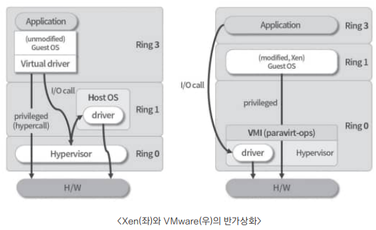

{.post-thumbnail}

## 분산 데이터 저장 기술

### 1. 분산 파일 시스템

- `GFS(Google File System)`: 구글의 분산 파일 시스템
    - chunk: 64MB
    - 트리 구조가 아닌, 해시 테이블 구조로 관리
    - POSIX 인터페이스 지원하지 않음
    - 단일 마스터 노드가 메모리상에서 메타데이터 관리
    - 마스터 노드에 대한 로그를 기록하고, 마스터의 상태를 섀도우 마스터 노드에 복제
    - 하나의 파일에 대한 primary node를 정하고, 다른 노드에 복제본 분산 저장
    - 낮은 응답 지연시간보다 높은 처리율 중시
    - Master Node, Chunk Node, Client 구성
- `HDFS(Hadoop Distributed File System)`: 아파치 하둡의 분산 파일 시스템
    - GFS의 clone project
    - POSIX 인터페이스 지원하지 않음
    - block: 128MB
    - NameNode가 메타데이터 관리
    - 낮은 응답 지연시간보다 높은 처리율 중시
    - NameNode, DataNode, 보조 네임 노드, job tracker, task tracker 구성
- `Lustre`: 고성능 컴퓨팅을 위한 분산 파일 시스템
    - POSIX 인터페이스 지원
    - chunk가 아닌 striping 방식 데이터 저장
    - Client Filesystem, Metadata Server, 객체 저장 서버로 구성

### 2. 데이터베이스 클러스터

::: {.callout-note appearance="simple" icon=false}
- 무공유 디스크
   - 각 노드가 완전히 분리된 데이터를 가짐
   - Oracle RAC를 제외한 대부분의 클러스터가 채택
   - 노드 확장에 제한이 없음
- 공유 디스크
   - SAN과 같은 네트워크로 모든 노드가 디스크 공유
   - 노드 확장시 디스크 병목현상 고려 필요
:::

1. Orace RAC 데이터베이스 서버: 확장성보다는 고가용성이 중요한 서비스에 적합
1. IBM DB2 ICE(integrated cluster environment)
1. 마이크로소프트 SQL Server: 전역 스키마가 없어서 모든 노드에 질의를 해야함. active-stanby 구성
1. MySQL: 
    - 클러스터에 참여하는 노드는 최대 255, 그 중 데이터 노드는 최대 48개까지 가능
    - 운영중에 노드를 추가 삭제 불가

### 3. NoSQL

1. Google BigTable: 
    - 공유 디스크 방식
    - Row Key 순으로 정렬 되어 있고, Row 내부적으로는 Column Key 순으로 정렬
    - Column Key, Value, Timestamp로 구성
    - Chubby를 이용해 마스터 노드 관리
1. HBase
1. Amazon SimpleDB
    - schema가 없고, Domain(table), Item(record), Attribute(column), Value으로 구성
1. 마이크로소프트 SSDS: Container(table), Entity(record), Property(column)로 구성

## 분산 컴퓨팅 기술

### 1. MapReduce

- 대용량 데이터를 분산 처리할 수 있는 모델
- 보통 64MB를 기준으로 데이터 분할
- 하나의 블록당 하나의 Map Task, 사용자가 지정한 갯수만큼의 Reduce Task 생성
- Count 작업에 적합하고, Sort 작업에는 적합하지 않음

1. Google MapReduce
1. Hadoop MapReduce

절차:
1. Split
1. Map
1. Combine
1. Partition
1. Shuffle
1. Sort
1. Reduce

### 2. 병렬 쿼리 시스템

1. Google Sawzall: MapReduce에 대한 이해가 없어도 쉽게 사용 가능
1. Apache Pig
1. Apache Hive

### 3. SQL on Hadoop

## 클라우드 인프라 기술

### 2. CPU 가상화

- `하이퍼바이저`: 하드웨어 리소스를 가상화하여 여러 개의 가상 머신을 생성하는 소프트웨어
    - bare-metal hypervisor: 하드웨어와 host 운영체제 사이에 hypervisor가 존재
        
        
    - hosted hypervisor: host 운영체제와 guest 운영체제 사이에 hypervisor가 존재
- Container

### 3. 메모리 가상화

- VMKernnel: hypervisor 내에 Show Page Table을 두고, 각 VM의 Guest OS의 Page Table을 관리

- Memory Ballooning: Guest OS의 메모리를 빼앗아서 다른 VM에 할당
- Transparent Page Sharing: 같은 내용의 메모리 페이지는 VM들이 공유
- Memory Overcommitment: VM에 할당된 메모리보다 더 많은 메모리를 할당할 수 있음

### 4. I/O 가상화

- 가상 이더넷: 가상 머신 간의 네트워크 통신을 위한 가상 네트워크. LAN 세그먼트를 가상화
- 공유 이더넷 어댑터: 하나의 물리적 네트워크 어댑터를 여러 VM이 공유. 병목현상 발생 가능
- 가상 디스크 어댑터
