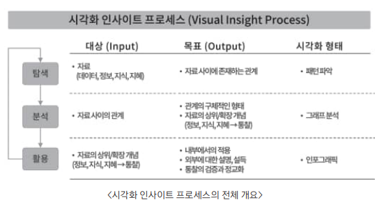
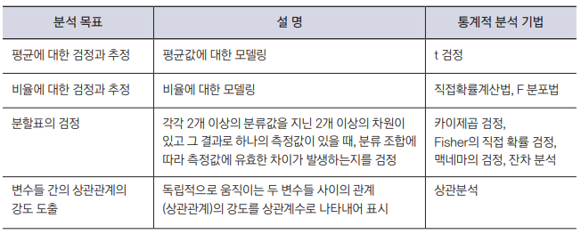

{.post-thumbnail}

## 시각화 인사이트 프로세스의 의미

### 1. 인사이트란 무엇인가

상위 개념을 발견하기 위해, 각 단계의 관계를 이해해야 한다.

이를 위해 시각화 인사이트 방법이 필요하다.

### 2. 시각화와 인사이트

## 탐색

- 상위 개념을 발견하기 위해, 각 단계의 관계를 이해하는 과정
- 객관적인 패턴을 찾는 용도

### 1. 사용 가능한 데이터 확인

1. 데이터 접근
    - `이벤트 기록`으로서 접근: 데이터로부터 통찰을 이끌어 내기 위해서 `데이터 생성 원리를 파악`해야 한다고 간주
    - `객체지향 관점`에서의 접근: 데이터로부터 통찰을 이끌어 내기 위해서 `전체 구조를 파악`해야 한다고 간주
1. 데이터 명세화
    - 모든 데이터는 하나 이상의 `차원`과 `측정값`을 가지고 있다.
    - 이는 분석 형태에 따라, 차원이 될 수도 있고, 측정값이 될 수도 있다.

### 2. 연결 고리의 확인

`데이터 명세서`를 이용해 2개 이상의 데이터간 연결 고리를 확인해 봄

1. `공통 요소 찾기`
1. `공통 요소로 변환하기`: 데이터 타입이 달라도 공통 요소로 묶을 수 있다 (더 자세한 데이터를 덜 자세한 데이터로 변환. `반대는 불가`)
    - 시간 데이터의 변환
    - 공간 데이터의 변환(지오코딩, 코로플레스 지도, X-Ray Map 사용 가능)
    - 계층 관계 변환: 상위 수준(덜 자세한)이라는 공통 요소로 변환. replace, lookup, vlookup 함수 사용 가능
1. `탐색 범위 설정`: 차원과 측정값의 전체 조합 종류가 탐색 범위가 됨. 데이터를 구성하는 항목이 늘어날 수록 탐색 범위가 늘어남
    1. 여러 데이터를 보유한 경우, 개별 데이터 안에서 먼저 탐색
    1. 측정값 하나의 차원만 연결해 탐색
    1. 같은 데이터 안에서 차원과 측정값을 맞바꾸면 다른 통찰을 얻을 수 있음
    1. 어떤 통찰을 얻기 위해 비주얼 인사이트 프로세스를 사용하는 것인지 살펴본 후, 목표와 관련 있을 법한 조합을 만듦
    1. 상식적으로 의미나 연계성이 없는 조합은 배제

### 3. 관계의 탐색

상관관계와 인과관계를 탐색

1. `이상값 처리`: 시각화 도구를 통해 전체 구조를 파악한 후 처리
1. `차원과 측정값 유형에 따른 관계 파악 시각화`
    1. 시각화 도구 선정
    1. 시간 데이터에서의 관계 파악: `구글 모션차트` 사용 가능
    1. 공간 데이터에서의 관계 파악: `Arc GIS`, `X-Ray Map`, `파워 맵` 사용 가능
    1. 비정형 데이터에서의 관계 파악
        - `워들`: 주어진 텍스트에서 형태소 단위를 추출(NLP)해 빈도에 따라 시각화
1. `잘라보고 달리보기`: 둘 이상의 차원과 측정값으로 이루어진 데이터를 여러 관점으로 살펴본다.
    - `잘라보기(slice)`: ex) 연령별, 성별 평균 체중 데이터 → 20세 이상, 40세 미만 남성들의 체중 패턴
    - `달리보기(dice)`: ex) 연령별, 성별 평균 체중 데이터 → 남성의 연령별 체중 패턴, 여성의 연령별 체중 패턴
    - MS excel의 `pivot`, `powerview`, spreadsheet의 `pivot table report` 사용 가능
1. `내려다보고 올려보기`
    - `내려다보기(Drill Down)`: 데이터를 하위 계층으로 세분화한다.
    - `올려보기(Reverse Driil Down)`: 데이터를 상위 계층으로 통합한다.
    - Tree map, Hyperbolic Tree
1. `척도의 조정`: `스파크라인 차트` 사용 가능

## 분석

- 탐색을 통해 발견된 패턴을 분석하는 과정

### 1. 분석 대상의 구체화

1. 2차 탐색: 관계들의 분석 우선순위 결정. 궁극적인 목표는 그냥 다시 한 번 더 검토하는 것
1. 분석 목표에 따른 분석 기법

### 2. 분석 시각화 도구

통계적 도구와 시각적 도구는 상호보완 관계

### 3. 지표 설정과 분석

- 지표: 어떤 현상의 강도를 평가하는 기준이 되는 수치
    - ex) `KPI(Key Performance Indicator)`: 핵심 성과 지표. 목표 달성을 위한 세부적인 활동 결과물의 추진 정도나 수준을 측정하고 평가
    - 주로 함수식 구조를 가짐 (ex. `매출액 = 판매단가 * 판매량`)
    - 요인 분석(factor analysis)를 통해 지표가 다른 요인과 설명력이 겹치는지 여부 확인할 수 있다.
    - 어떤 변화요인에 의해 지표의 흐름에 영향을 미쳤는지 파악하기 어렵다는 단점이 있다.

## 활용

- 도출한 인사이트를 활용하는 과정

### 1. 내부에서 적용

1. 기존 문제 해결 방식이나 설명 모델의 수정
1. 새로운 문제 해결 방식의 도입
1. 새롭게 발견한 가능성에 대한 구체적인 탐색과 발전

### 2. 외부에 대한 설명, 설득과 시각화 도구

설득이 필요하기 때문에 스토리텔링이 감미된 시각화 자료나, 인터렉티브 인포그래픽 활용

### 3. 인사이트의 발전과 확장

계속 잘 검토해 나가야함
