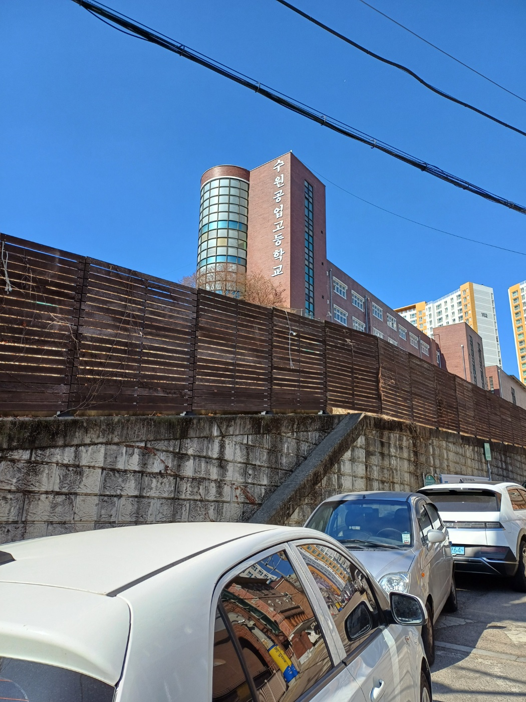

## Intro

수원 공고에서 진행된 adp 시험을 보고 왔습니다. 

고등학교 치고는 거의 왠만한 대규모 교회급으로 상당히 넓다는 느낌이 들었습니다.
그냥 제가 나온 인문계 고등학교가 좁아서 그렇게 느껴진 것일 수도 있고요.

## 시험

[저번 시험](https://cryscham123.framer.website/blog/adp-%ED%95%84%EA%B8%B0-%EC%8B%9C%ED%97%98%EC%9D%84-%EB%B4%A4%EC%8A%B5%EB%8B%88%EB%8B%A4)에서는 서술형에서 20점 만점에 4점을 받아서 굉장히 아쉬운 성적이 나와버렸죠.
사실 그렇다고 이번 시험에서 서술형을 엄청 잘 준비하거나 하진 않았습니다.
제가 게을러서 그렇다는걸 딱히 부정하는건 아니지만, 가장 큰 이유는 뭐가 나올지 예상을 할 수 없기 때문입니다.

서술형에 나올 수 있는 주제 자체는 참고서에 나와있는 내용 안에서 등장하지만, 시험에서는 더 구체적인 수식과 구현 과정을 요구하는 경우가 많습니다.
아마도 adp 시험에서 서술형을 더 잘 대비하려면, 더 많은 외부 자료를 참고하거나, 배경지식을 더 쌓은 상태에서 도전해봐야 할 것 같습니다.

하지만, 만약 서술형이 0점이 나온다고 해도 객관식을 80 문제중 70개 이상만 맞춘다면 통과할 수 있다는 사실.
뭐.. 그렇게까지 불가능한 것도 아니긴 합니다. 객관식은 참고서 내용으로 잘 커버할 수 있으니까요.

## Outro

실제로 꽤 느낌이 좋긴 합니다. 이번에도 서술형은 모르는 내용이 나오긴 했지만 말입니다.

결과가 3월 중순에 나올 예정인데, 그 전까지는 smart contract 쪽으로 공부를 해볼 예정입니다.

더 자세한 감상은 결과가 나온 후에 작성해보겠습니다.
