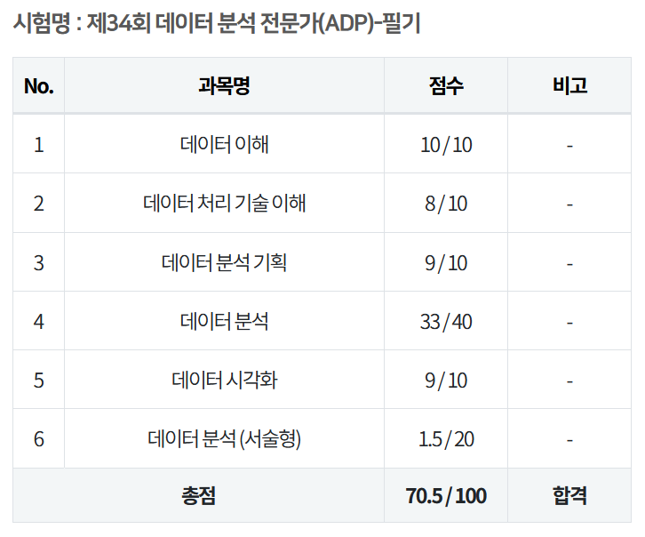

{width="70%" fig-align="center"}

## Intro

adp 필기시험 34회차 결과가 나왔습니다.
당연히 합격했고요. 제가 말했죠? 서술형을 몰라도 객관식을 70개 이상 맞추면 합격이라고요.
저는 69개를 맞췄지만 말입니다. 하하.

..사실 뭐 딱히 자랑스러운 결과는 아니긴 합니다.
서술형 1.5점 받은 주제에 데이터 분석 전문가라고 말 할 수 있을까요?
하지만 제가 합격한건 오직 필기. 전 아직 데이터 분석 전문가가 아닙니다. (제목을 봐주세요. 데이터 분석 전문가(진)입니다.)

처음 adp 시험을 준비하려고 생각한 것은 데이터 분석 분야에 입문을 하기 위해서였기 때문에, 그런 측면에서 저의 목적은 달성했다고 생각합니다.
실기 시험은 더 구체적인 통계론이나 머신러닝 로직 등을 꽤 오랜시간 자세히 공부해서 치루려고 합니다.

## 리뷰

생각보다 시험에서 다루는 내용의 범위가 넓었습니다.
암기식 공부가 주가되는 자격증 시험의 특성상, 이는 굉장히 힘든 일이 아닐 수 없었습니다.
그래도 데이터 분석 분야의 내용들을 포괄적으로 다루다 보니, 확실히 입문을 하기에는 괜찮은 resource라고 생각합니다.

그래도 몇 가지 아쉬운 점을 꼽자면, 2 단원 데이터 처리 기술들이 조금 old한 내용들을 다루는게 아닌가 하는 생각이 듭니다.
또, 5 단원 마지막 부분의 데이터 시각화 tool을 구체적으로 다루는 부분은 이걸 꼭 다 외워야하나 싶은 느낌이 들었고요. (근데 이번 시험에서 이 부분은 안 나왔습니다.)
사실 이 정도만 아는 것으로도 앞으로 학습을 이어나갈 수 있는 좋은 발판이 되어준다고 생각합니다.

## Outro

이제 실기 시험을 준비해야죠.
올해 볼까.. 내년에 볼까.. 고민입니다.
처음 목표는 졸업 전 까지 adp 자격증을 따는 거였고, 졸업까지 아직 2년이 남았으니까.. 여유롭게 준비해보려 합니다.

그럼 저는 adp 실기 준비로 다시 돌아오겠습니다.
