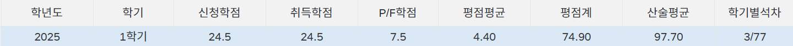
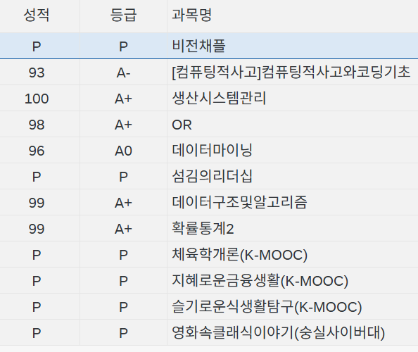
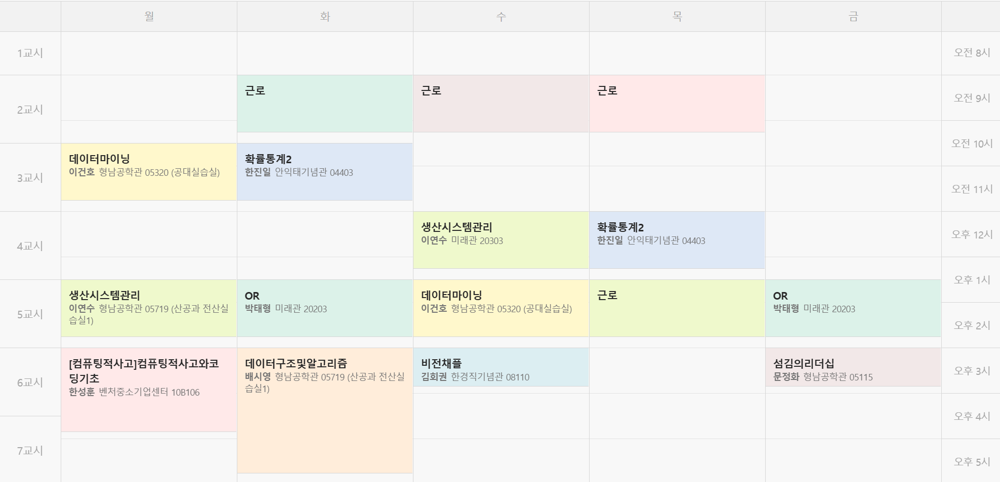

{.post-thumbnail}

## 서론

수강 학점이 24.5 학점이긴 한데, 사이버 강의로 가득 채워서 높게 나왔다.

실제로는 전공 과목 5개, 교양 과목 2개를 들었다.

이 중에서도 배경지식이 전혀 없는 과목은 생산 시스템 관리 1과목 뿐이라 은근히 수월하게 이번학기를 마무리 한 것 같다.

나의 상대적으로 높은 배경지식은, 그나마 뽑을 수 있는 `휴학을 오래한 경험의 장점` 중 하나가 아닌가 생각한다.

물론 다시 과거로 돌아가서 어린 김형훈에게 '이 장점 하나만 보고 휴학을 4년동안 하겠습니까?' 라고 한다면 내 대답은 `no.`다.

## 점수

컴퓨팅적사고 과목은 코딩 기초 과목인데, 재수강 과목이라 A- 점수가 최대 점수였다.

그래서 데이터 마이닝 과목만 A+이 나왔다면 이번 학기 받을 수 있는 최대 점수를 얻을 수 있었다.

점수가 잘 안나온 이유를 몇 가지 생각해 보자면,

- 이 과목이 발표 중심이라, 상대적으로 발표 능력이 약했던 점에서 마이너스가 됐다.
- 기말 분석 과제의 성과가 좋지 않았다.
- 마지막 필기 시험에서 검토도 한 번 하지 않고 1등으로 시험지를 제출하고 나왔다.

..정도가 있지 않을까.

특히 3번은, 나는 시험을 볼 때, 검토를 하면 보통 실수한 문제 1, 2개가 반드시 나오는데, 감히 검토를 하지 않은것은 상당히 큰 문제였다고 할 수 있다.

사실 이건 이 과목 시험이 마지막 시험이라 빨리 모든걸 끝내고 싶다는 나의 안일하고 연약한 마음가짐이 가장 큰 결점사항이였다고 생각한다.

## 다른 부족했던 점

다른 과목은 A+이 나오긴 했지만, 그렇다고 완벽하게 모든걸 잘 처리하지는 않았다.

OR 과목은 과제를 2번 정도 제출을 못했고, 생산시스템관리는 중간 퀴즈에서 평균보다 못한 점수를 받았다.

시간이 없어서.. 보다는 시간을 효율적으로 사용하지 못한 원인이 컸다.

복습도 그날그날 해야 하는데, 이 부분이 잘 이뤄지지 않았다.

복습을 집에서 하려고 하면 시간이 너무 늦어져서 잘 안하게 되는거 같고, 다음 학기는 학교 안에서 복습까지 하고 집에 가는 방법을 생각해 봐야겠다.

## 결론

그래도 저번 학기에 비하면 시간적으로도 여유가 있었고, 요령도 어느정도 터특을 한것 같다.

요령은 1학년때 터득을 했어야 하는데, 뭐.. 지난일에 미련을 갖지 말자.

이정도 추세라면 내가 목표하는 `학점 4점은 넘기고 졸업` 과업은 무난하게 수행해낼 수 있어 보인다.

다음학기에는 재수강 과목이 전혀 없기 때문에 드디어 4.5점을 받고, 학기 1등을 해볼 수 있는 기회가 찾아왔다.

열심히 한 번 해 보자.
