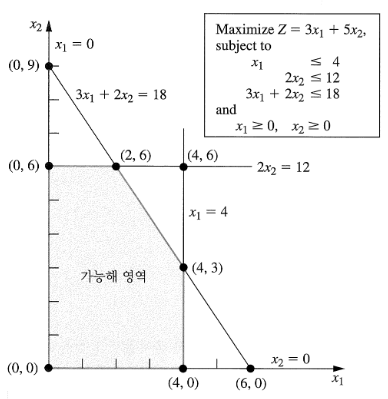

{.post-thumbnail}

## 선형 계획을 푸는 알고리즘

### 그래프를 사용하는 방법

변수가 3개 이하인 경우, 그래프를 그려서 해를 찾을 수 있다.

## Simplex Method

### 기하학적 이해

1. Initialization: Collect 1 CFP. 일반적으로 원점을 선택
1. Optimality test: find better adj
    - Obj ⋅ (adj - cur) > 0: better
    - Obj ⋅ (adj - cur) = 0: not changed
    - Obj ⋅ (adj - cur) < 0: worse

### 대수적 풀이

- basic solution: 제약식의 변수 중 일부를 기저 변수로 선택하고, 나머지를 0으로 설정하여 얻는 해.
    - 만약 기저변수가 0인 경우, 이를 퇴화라고 부른다.
- basic feasible solution: 모든 변수가 0 이상인 basic solution. 즉, 제약식을 모두 만족하는 해.
- 비 기저변수(non basic variable): free variable. 변수의 수 - 방정식의 수 만큼 존재.
- 기저 변수(bais variable): pivot variable.

- 풀이는 생략

### Simplex Tableau

- 풀이는 생략

### 비 표준형 모델에서의 적용

- 제약식이 = 인 경우: 인공 변수 추가. 목적 함수에 Big-M 방법을 사용하여 표현.
    - Tableau에서 인공변수의 계수를 0으로 만들어서 진행.
- 제약식이 ≥ 인 경우: slack 변수랑 surplus variable 추가. surplus variable에 대하여 목적 함수에 Big-M 방법을 사용하여 표현.
