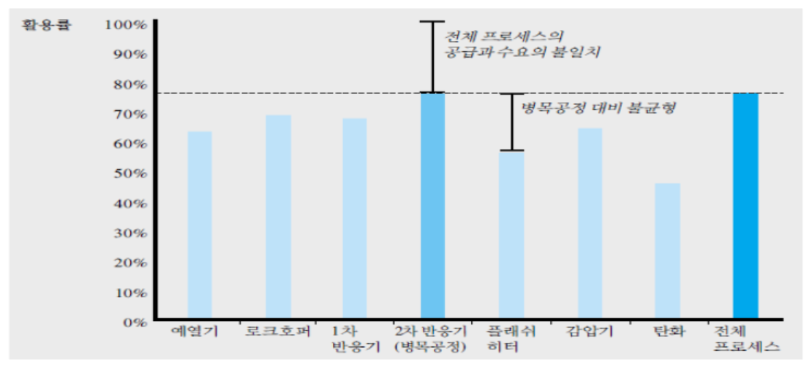

{.post-thumbnail}

## 프로세스 처리 능력 및 활용률

- **process capacity**: 흐름률의 upper bound(유량).
- 병목(bottleneck): 제일 낮은 처리능력의 자원
- 전체 프로세스의 처리 능력 = 병목의 처리능력 (단 작업이 일렬로 수행될 때)
- product mix: 
    - 다양한 제품이 input으로 들어와 처리능력이 달라짐
    - bottleneck을 계산하기는 어려움
        - 비율이 매번 달라질 수도 있어서
        - 작업이 일렬로만 수행되지 않아서

- 실제 생산한 양(흐름률)은 capacity에서만 결정되지 않는다.
    - 수요(market + 계절 / 안전 재고 같은 내부적 수요)
    - 원자재 투입량
- **흐름률 = min(시간 당 수요, 프로세스 처리 능력)**
- 공급능력: 투입량, 처리 능력

### 수요 / 공급 제약적 상황

- 수요(가) 제약적: 수요 < 공급
    - bottleneck 활용률 < 100%
    - flow rate == Demand rate
- 공급(이) 제약적: 수요 > 공급
    - 투입 제약적
    - 처리능력 제약적
        - bottleneck 활용률 == 100%
        - flow rate = capacity

### 활용률

- 실제 생산하는 양을 capacity로 나눈 것
    - $\frac{흐름률}{처리능력}$
    - 활용률을 100% 달성하려면 쉬지 않고 프로세스가 돌아가야하지만 현실적으로 쉽지 않다.
        - 수요가 공급보다 적을 수 있다.
        - 투입물이 충분하지 않다.
        - 몇몇 공정의 사용이 공장이나 수리로 제한될 수 있다.
        - 불확실성
- 병목을 제외한 다른 하위 작업은 활용률이 떨어질 수 있다.
    - 모든 프로세스가 병목인 것이 가장 이상적인 상황 (과도하게 높은 공급능력)
- 공급 제약적 상황에서 수요가 얼마나 많은지 알 수 없음.  
    → implied utilization

### implied utilization

- $U = \frac{R}{Capacity}$
- $IU = \frac{Demand or workload}{Capacity} (≤100% or > 100%)$
- if min(demmand, capacity, input) = demand then U = IU
- 이 외에도 잠재적 수요 못따라가는 작업도 알 수 있음
    - IU 100 넘는거 개선 필요
- 또, 작업이 sequential하게 진행되지 않을 때 병목현상을 확인할 수 있음

## 여러 종류의 흐름 단위

input 당 뭐가 다르면 다른 단위로 치환
