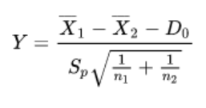
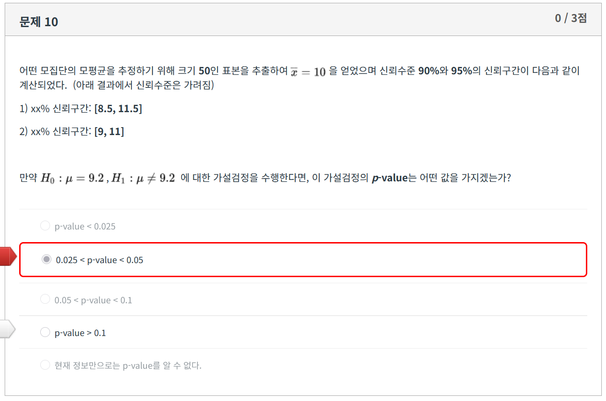
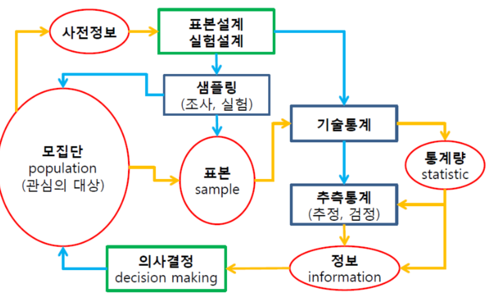

{.post-thumbnail}

## 질문

1. 모분산을 모르고 표본분산을 쓰면 무조건 t분포?
1. 쌍체표본은 무조건 t분포?
1. 적당한 β값은 존재하지 않은건가? 아니면 10%가 너무 큰건가?
1. 분모에서 분산 어떻게 추정함?
1. 모집단의 분포와 관계없이 표본분산 $S^2$은 $σ^2$의 불편추정량이다

## 통계학

- `불확실한 상황` 하에서 데이터에 근거하여 `과학적인 의사결정`을 도출하기 위한 이론과 방법의 체계
- `모집단`으로 부터 수집된 `데이터`(sample)를 기반으로 모집단의 `특성을 추론`하는 것을 목표로 한다.

## 확률

- 고전적 의미: 표본공간에서 특정 사건이 차지하는 비율
- 통계적 의미: 특정 사건이 발생하는 `상대도수의 극한`
    - 각 원소의 발생 가능성이 동일하지 않아도 무한한 반복을 통해 수렴하는 값을 구할 수 있다.
 
## 확률 분포 정의 단계

- `Experiment(확률실험)`: 동일한 조건에서 독립적으로 반복할 수 있는 실험이나 관측
- `Sample space(표본공간)`: 모든 simple event의 집합
- `Event(사건)`: 실험에서 발생하는 결과 (부분 집합)
- `Simple event(단순사건)`: 원소가 하나인 사건
- `확률 변수`: 확률실험의 결과를 수치로 나타낸 변수

## 확률 분포

- 이산 확률 분포: 이산 표본 공간, 연속 표본공간에서 정의 가능포
    - 베르누이 분포: 각 시행은 서로 독립적이고, 실패와 성공 두 가지 결과만 존재.
        - 단 모집단의 크기가 충분히 크고, 표본의 크기가 충분히 작다면 비복원 추출에서도 유효
    - 이항 분포: n번의 독립적인 베르누이 시행을 수행하여 성공 횟수를 측정
    - 기하 분포: 성공 확률이 p인 베르누이 시행에서 첫 성공까지의 시행 횟수
    - 초기하 분포: 베르누이 시행이 아닌 시행에서 성공하는 횟수
    - 포아송 분포: 임의의 기간동안 어떤 사건이 간헐적으로 발생할 때, 사건이 발생하는 횟수
        - n이 매우 크고, p가 매우 작을 때, 이항 분포를 포아송 분포로 근사할 수 있다.
- 연속 확률 분포: 연속 표본 공간에서 정의 가능
    - 균일 분포
    - 정규 분포
        - $X + Y \sim N(μ_1 + μ_2, σ_1^2 + σ_2^2)$
    - t 분포
        - 자유도가 커질수록 표준 정규분포에 근사함.
        - \frac{Z}{\sqrt{V/n}} \sim t(n)
    - f 분포
        - $F = \frac{X_1/ν_1}{X_2/ν_2}$, $X_1 \sim χ^2(ν_1)$, $X_2 \sim χ^2(ν_2)$
    - 감마 분포
        - 카이제곱 분포: α = v/2, θ = 2 인 감마분포
            - $Z_i \sim N(0,1)$일 때, $Z_1^2 + Z_2^2 + ...  + Z_n^2 \sim χ^2(n)$
            - $X_i$가 서로 독립이고, 자유도가 $ν_i$인 카이제곱분포를 따른다면, $X_1 + X_2 + ... + X_n \sim x^2(ν_1 + ν_2 + ... + ν_n)$
        - 지수 분포: 포아송 분포에서 사건 발생 간격의 분포
            - $\sum_{i=1}^{n} X_i \sim Γ(n, θ)$, $θ = 1/λ$

## 표본의 분포

- 샘플링에 따라 통계량이 다른 값을 가질 수 있다. 따라서 통계량의 분포를 이용한 통계적 추론이 가능하다.

- 통계량: 표본의 특성을 나타내는 값
- 추정량: 아래의 조건을 만족하는 통계량
    - 불편성: 추정량의 기대값이 추정하려는 모수와 같아야 한다.
    - 효율성: 분산이 작아야 한다. 표본의 갯수가 많아질수록 분산이 작아져야 한다.

### 표본 평균의 분포

- 모집단의 분포와 관계없이, 모집단의 평균이 μ이고, 분산이 $σ^2$이면, $\bar{X}$의 평균은 μ이고, 분산은 $σ^2/n$인 정규분포를 따른다.
    - 단 모집단의 분포에 따라 표본의 크기가 충분히 커야함. (중심극한정리)
- 만약 모집단의 분산을 모를 경우, σ를 s로 대체하여, t분포를 따르는 표본 평균의 분포를 구할 수 있다.

### 표본 분산의 분포

- 정규 모집단으로 부터 나온 표본의 분산 S에 대하여, $\frac{(n-1)S^2}{σ^2}$은 자유도가 n-1인 카이제곱 분포를 따른다.
    - 모집단이 정규분포를 따르지 않을 경우, 비모수적인 방법을 사용해야 한다.
- 두 정규 모집단으로부터 계산되는 표본분산의 비율은 f-분포를 따른다.

