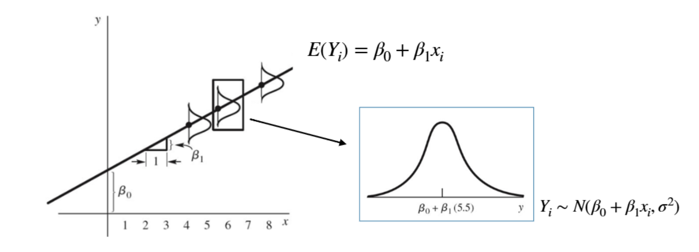
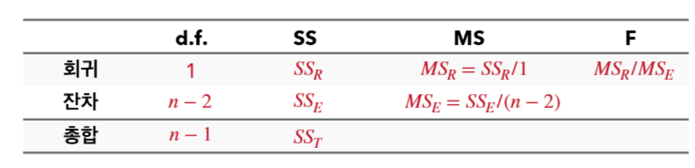
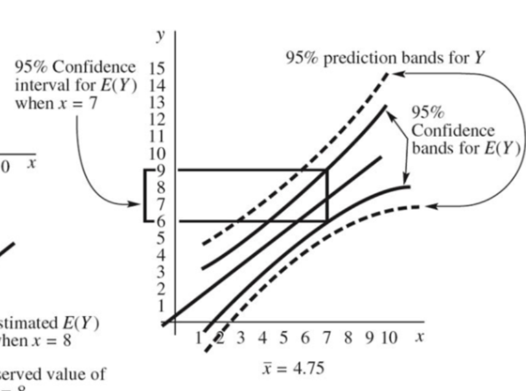

{.post-thumbnail}

## 통계학습 및 회귀분석

- 통계 학습: 관측된 X, Y 데이터로부터 X와 Y의 관계를 추정하는 것
- $Y = f(X) + ϵ$
- 선형 회귀 모형: 독립변수와 종속변수 사이의 **관계**를 선형으로 가정하는 모형

## 단순 선형회귀모형

- $Y_i = β_0 + β_1x_i + ϵ_i$
- $β_0 + β_1x_i$: 회귀 계수, 선형 모형으로 설명 가능한 부분
- $ϵ_i$: 오차항, 선형 모형으로 설명할 수 없는 부분
    - $ϵ_i ~^{iid} N(0, σ^2) → Y_i ~ N(β_0 + β_1x_i, σ^2)$

## 회귀계수의 추정

- 최소 제곱법: 잔차 제곱합을 최소화하는 방법
    - → $SS_E$를 $\hat{β}_0, \hat{β}_1$에 대해 미분하여 0으로 만드는 $\hat{β}_0, \hat{β}_1$.
    - $β_0 = \bar{Y} - β_1\bar{X}$, $β_1 = \frac{S_{XY}}{S_{XX}}$
    - $Σ_{i=1}^n e_i = 0$, $Σ_{i=1}^n x_ie_i = 0$
- 회귀계수 추정 시에는 오차항의 분포에 대한 가정이 사용되지 않는다.
- 독립변수의 단위가 달라지면, 회귀계수의 단위도 달라진다. (설명력은 동일하다)
- 표본의 수가 늘어나면, $β_1$은 수렴한다.

## 회귀모형의 적합성

- $SS_T = S_{YY}$
- $SS_R = \frac{S_{XY}^2}{S_{XX}}$
- $SS_E = SS_T - SS_R$

- 결정계수: $R^2 = \frac{SS_R}{SS_T} = 1 - \frac{SS_E}{SS_T}$
    - $R^2$는 모형이 종속변수의 변동을 얼마나 설명하는지 나타내는 지표
    - 오차를 최소화하면 $R^2$ 값 증가
    - $\frac{S_{XY}^2}{S_{XX}S_{YY}} = r(X, Y)^2$

## 회귀계수에 대한 추론

- $H_0: β_1 = 0$ (독립변수와 종속변수 사이에 관계가 없다)
- $β_1$은 불편추정량, 정규분포를 따른다.
- $Var(β_1) = \frac{MS_E}{S_{XX}}$

## 종속변수의 신뢰구간과 예측구간

- $\hat{Y_0} = \hat{β}_0 + \hat{β}_1x_0$
- $Var(\hat{Y_0}) = MS_E(\frac{1}{n} + \frac{(x_0 - \bar{x})^2}{S_{XX}})$
- 예측 구간에서의 오차의 분산은 $MS_E(1 + \frac{1}{n} + \frac{(x_0 - \bar{x})^2}{S_{XX}})$

## 잔차 분석

1. 불편성
1. 정규성
1. 독립성
1. 등분산성

오차의 추정치인 잔차를 통해 위의 가정을 검증할 수 있다.

- 선형성: 잔차그림이 특정 패턴을 보이지 않는다.
    - 만족하지 않을 경우: 독립변수 변환
- 등분산성: 잔차그림의 분산이 일정하다.
    - 만족하지 않는 경우: 반응치를 log 변환할 수 있다.
- 독립성: 시계열 데이터의 경우, 자기상관을 고려해야 한다.
- 정규성: normal Q-Q plot / shapiro-wilk test
    - 만족하지 않는 경우: 반응치를 log 변환할 수 있다.
