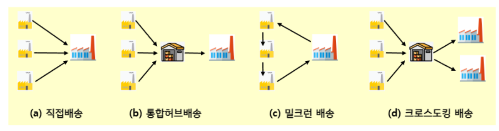
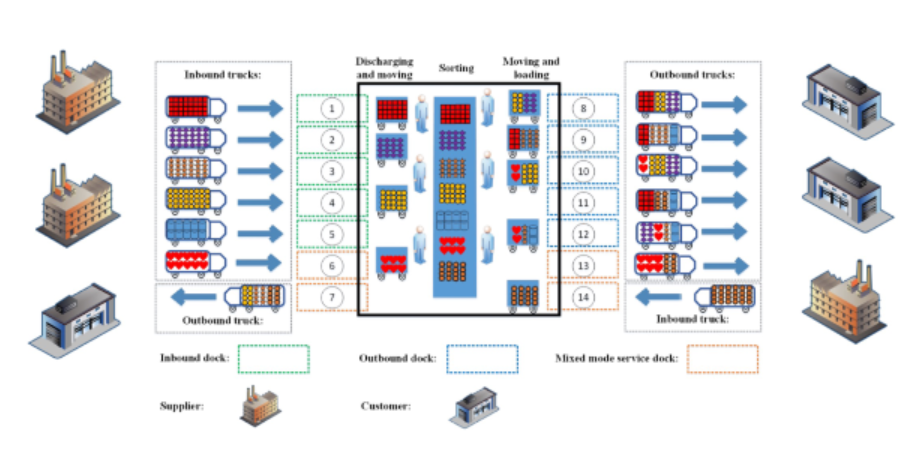

{.post-thumbnail}

## 운송

- 물건의 장소 이동을 통해 얻어지는 만족도가 크면 운송
- 지역이나 거리를 극복함으로써 유통의 간소화 및 가격하락 기여
- 생산지와 소비지를 확대시킴으로써 시장 활성화 기여
- 운송 관리의 기본 방향
    - 규모의 경제, 거리의 경제: 한번에 많이, 멀리 옮길수록 운송단가는 낮아짐
    - 라드너의 규칙
        1. 수송거리의 2배 확장으로 인한 시장의 확장은 4배
        2. 수송비용의 절감은 공급사슬의 효율을 제곱 수준으로 확장

- 간선 수송은 규모의 경제 적용 및 수송모드 선정 중요.

## 운송 활동 관련 주체

- 수송의 효율화를 위해 운송 주선인과 수송전문회사가 담당
- 하나 또는 복수의 운송주선인이 통합 분배 과정을 거침
- 대형주문에서 개별 포장 또는 택배형식으로 물량 변환 수송

## 운송 서비스의 성능평가 척도

- 운송비용
    - 고정비: 터미널 설비비, 보험료 등 운송활동 강도에 비례하지 않는 것
    - 변동비: 유류비, 운반 처리비 등 운송활동 강도에 비례
- 운송시간
    - 시간도 중요하지만 변동성 관리도 중요
    - 운송시간의 변동성: 높아질수록 안전재고 수준 향상, 대규모 창고 필요, 재고비용 증가
- 운송 서비스 수준
    - 긴급도에 대한 대응도, 연계 수송의 편리함과 융통성
    - 납기에 대한 신뢰성, 지연의 가능성, 파손 및 분실의 위험성
    - 예) 고부가 가치 제품이나 응급 제품의 경우 항공수송은 서비스 수준 측면에서 유리

## 기업의 의사결정에 미치는 운송의 영향

1. 가격 결정: 운송비용이 제품 원가의 상당 부분 차지
2. 입지 결정: 철강 / 정유 산업은 원자재가 해상 운송되므로 대부분의 공장이 해안에 위치
3. 시장 지역 결정: 부패가 쉬운 제품은 산간 및 오지에 배송 안함
4. 구매 지역 결정: 원자재 부품 구매 시 운송의 이용 가능성, 적합성, 비용 등을 고려

## 운송수단 및 특성

- 항공운송
    - 기본시설의 높은 고정비 + 상대적으로 낮은 변동비(물량 대비)
    - 신속한 운송이 가능한 고가의 운송수단
        - 긴급 화물(공장 부품, 혈액 등)
        - 소규모 고부가가치 제품(반도체, 시계 등)
    - 고려 사항
        - 항공기 할당 및 유지보수 계획
        - 운임 관리 및 가격산정
- 소화물 운송
    - 소형화물 및 소포 취급
    - 높은 운송비(물량 대비)
    - 신속하며 신뢰성 높은 운송서비스 제공
    - 빠른 재고흐름 및 주문상태 추적 등의 서비스
    - 고려사항
        - 운송수요의 집화지점의 위치 및 처리능력 결정
        - 소화물 추적, 조회를 위한 정보시스템 구축
        - 배달차량의 운송 스케쥴 및 순회 경로
- 화물트럭 운송
    - 내륙 운송에서 많이 사용
    - 철도와 비교하여 운송비가 비싸지만, 출발지부터 도착지까지 배달
    - 상대적으로 짧은 운송시간
    - 만차수송(FTL)
    - 부분적재 수송(LTL)
- 철도화물 운송
    - 저가의 운임: 저가치, 대 중량 화물의 장거리, 대규모 운송에 적합
    - 낮은 접근성
    - 서비스 빈도의 한계 및 긴급 운송 탄력성 부족
    - 고려사항
        - 차량과 직원 스케쥴
        - 터미널에서의 지연
        - 화물 추적: 중간에 잃어버림
- 해상화물 운송
    - 벌크 화물의 원거리 운송
    - 수량 및 이동거리 고려 시 가장 저렴한 운송수단
    - 컨테이너 활용
    - 속도가 느리고, 터미널에서 지연이 많이 발생
    - 항만시설, 하역기기가 필요하며, 하역비가 비쌈
- 파이프라인
    - 원유, 정제된 석유, 천연가스 등의 운송
    - 초기 방대한 자본 투자가 필요 (높은 고정비, 낮은 변동비)
    - 운송수단 중 최저가이자, 높은 신뢰성을 가진 운송수단
        - 기상조건, 도로 사정 등에 무관
- 복합 운송
    - 두 개 이상의 상이한 운송수단을 공동화
    - 내륙운송의 경우, 철도 + 트럭의 복합운송을 사용
    - 상이한 운송수단 간의 환적이 용이하게 이루어질 수 있도록 하는 정보 교환이 필수적

## 운송 네트워크

### 인바운드 네트워크

- 하나 또는 소수의 노드를 향하여 다수의 공급점이 서비스를 제공하는 형태(수렴형)

- 직접 배송: 지리적으로 가깝거나 공급 물량이 커서 직접 공급
- 통합허브 배송: 배송 비용이나 수요처의 방문회수의 제한으로 중간 허브 통합
- 밀크런 배송: 하나의 차량이 공급처를 순차적으로 방문 배송
- 크로스도킹 배송: 중간 허브에서 공급 물량과 시간에 적절히 배송될 수 있도록 재분류하여 배송

### 아웃바운드 네트워크

- 하나 또는 소수의 공급처에서 많은 수의 고객에게 제품을 공급하는 형태(확산형)

- 공급바 분배센터 배송: 제조에서 담당하여 제품의 품질 유지가 핵심
- 수요자 분배센터 배송: 다양한 제품의 효율적인 분배가 핵심
- 유통 배송: 제 3의 유통전문회사가 담당하여 판매촉진 또는 분배 효율화
- 제3자 물류배송: 분배과정을 전담하는 제3자 물류서비스 이용

### Hub & Spoke 시스템

- 허브끼리는 대량 운송, 최종 고객에게는 소량 운송
- 점끼리 연결되지 않아 복잡성이 줄어듦

## 창고

- 주요 기능
    - 보관
    - 저장
    - 생산 과정의 일부 (와인)
    - 집화: 다른 곳에서 주문한 것들 묶어서 배송
    - 소분: 제조사에서 벌크 형식으로 받은 화물을 적은 화물들로 나누어 배송
    - 지연: 완제품 직전 단계로 가지고 있다가 주문이 들어오면 최종 조립 및 포장
    - 크로스도킹
- 창고 내 자재 흐름 단계
    1. 입하
    2. 검수
    3. 보관장소로의 이동 준비(라벨링 등)
    4. 보관
    5. 오더 피킹
    6. 출하장으로 이동
    7. 출하

- picker의 이동 경로, 최적 order 묶음, storage assignment, picker-order assignment 고려 필요
- conveyor로 물건을 받아서(혹은 AMR로) put walls에 넣는 방식도 있음(pick and sort)

- 여러 zone에서의 picking이 synchronized 되어야 함

- 창고 보관 방식
    - 무작위 보관 방식: 제품의 저장장소에 대한 제약 x, 공간 활용을 최대화 할 수 있으나 picker의 이동 시간이 증가
    - 전용 보관 방식: 제품이 창고 내 지정장소에 저장되어 picker가 제품 위치를 숙지해 효율적인 피킹 가능
    - 그룹기반 보관 방식: 제품들을 몇 개의 그룹을 나누고, 각 그룹 별 지정된 구역에 보관
    - 수요 기반
    - 제품 상관관계 기반

### Smart Warehouse

- RMF system 도입 -> 설계 및 운영의 측면에서 다양한 의사결정 문제 등장
    - 보관 위치 결정
    - 작업 - 로봇 할당
    - 작업의 순서를 결정하는 문제
    - 로봇의 최단 경로 문제(충돌 회피, 실시간 경로 수정 등을 고려)
